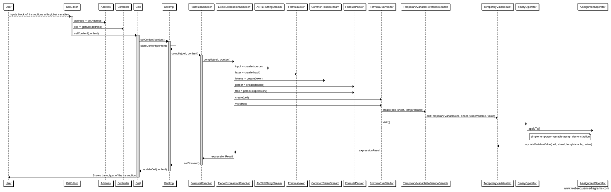
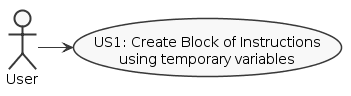
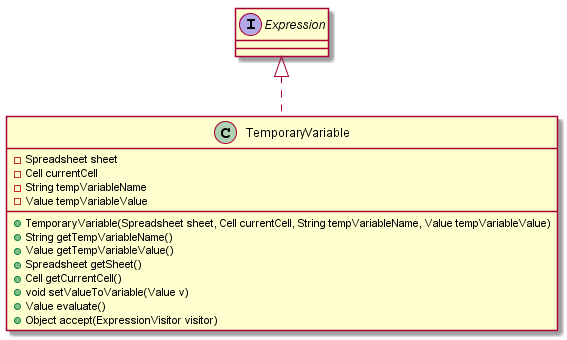
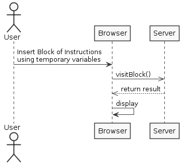
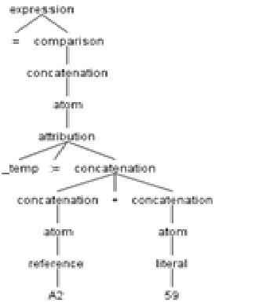

<<<<<<< HEAD
**André Oliveira** (1040862) - Sprint 1 - Lang02.1 - Temporary Variables
===============================

# 1. General Notes

For this sprint i had a lot of difficulties in order to understand the structure of the project, as well as understanding GWT and working on the platform. Thus, this use case will be submitted in an incomplete form.

# 2. Requirements

Lang02.1 - Add support for temporary variables. The name of temporary variables must start with the "_" sign. When a variable is referred in a formula for the first time, it is created. To set the value of a variable it must be used on the left of the assign operator (":="). Temporary variables are variables that only exist in the context of the execution of a formula. Therefore, it is possible for several formulas to use temporary variables with the same name and they will be different instances.

# 3. Analysis

For this feature increment, since it is the first one to be developed in a new project I need to:  

- Understand how the application works and also understand the key aspects of GWT, since it is the main technology behind the application  
- Review Language Parsing and Grammar studied in LPROG
- Reference aditional content for the Visitor Pattern from the book "The Definitive ANTLR 4 Reference"

## 3.1 GWT and Project Structure

**Modules**. From the pom.xml file we can see that the application is composed of 5 modules:  
- **server**. It is the "server part" of the web application.  
- **shared**. It contains code that is shared between the client (i.e., web application) and the server.   
- **nsheets**. It is the web application (i.e., Client).  
- **util**. This is the same module as the one of EAPLI.  
- **framework**. This is the same module as the one of EAPLI.   
   
## 3.2 Diagrams

# 4. Work Log

Commits:

- [Grammar compiler](https://bitbucket.org/lei-isep/lapr4-18-2dc/commits/968640b9ad118fd0a4067c499ac59b131a4b8dd2)
- [Temporary Variable Class](https://bitbucket.org/lei-isep/lapr4-18-2dc/commits/1db831e4a20037f489cd8a7a9e7fcfaa268eb156)
- [Visitor Impl](https://bitbucket.org/lei-isep/lapr4-18-2dc/commits/6df050be0060d4df27f08ae9b78941d9a235b4c9)

=======
**André Oliveira** (1040862) - Sprint 1 - Lang02.1 - Temporary Variables
===============================

# 1. General Notes

The project was difficult to begin with. New tools were required and so were the hours required trying to understand how to work with both GWT and the project itself.
The layout of the applications themselves were a bit confusing since during the semester in EAPLI we were used to specific layering in projects.

For this particular section of the project which was Lang it's almost mandatory for developers to have a fairly good mid to high end computer to work with since compiling the whole project takes over 5 minutes in regular laptops, making it a bit frustrating at times when minor adjustments are in order.

Also the lack of tact/forgetfulness of some colleagues in commiting untested work made the project uncompilable at some points, unabling others to work properly for undetermined amount of time. Time is not unlimited and some have even less time to work in the project due to various reasons.

# 2. Requirements

Lang02.1 - Add support for temporary variables. The name of temporary variables must start with the "_" sign. When a variable is referred in a formula for the first time, it is created. To set the value of a variable it must be used on the left of the assign operator (":="). Temporary variables are variables that only exist in the context of the execution of a formula. Therefore, it is possible for several formulas to use temporary variables with the same name and they will be different instances.

Proposal :

US1 - As a User of the Application, I want to create a temporary variable within a function to serve as a container of information.

# 3. Analysis

For this feature increment, since it is the first one to be developed in a new project I need to:  

- Understand how the application works and also understand the key aspects of GWT, since it is the main technology behind the application.
- Review Language Parsing and Grammar studied in LPROG.
- Reference aditional content for the Visitor Pattern from the book "The Definitive ANTLR 4 Reference".
- Undestand how the language parser iterates in order to accquire the desired syntax.
- Understand the usage of blocks within a function.

## 3.1 GWT and Project Structure

**Modules**. From the pom.xml file we can see that the application is composed of 5 modules:  
- **server**. It is the "server part" of the web application.  
- **shared**. It contains code that is shared between the client (i.e., web application) and the server.   
- **nsheets**. It is the web application (i.e., Client).  
- **util**. This is the same module as the one of EAPLI.  
- **framework**. This is the same module as the one of EAPLI.   
   
## 3.2 Analysis Diagrams

**Use Case**

**Domain Model (for this feature increment)**

**System Sequence Diagrams**

# 4. Design

Aside from the domain classes and a few required methods all the other implementation was already present in the base project.
Minor adjustments were made in the formula grammar to identify the syntax of a temporary variable and some adjustments in the formula visitor.

# 4.1 Tests

Unit tests cannot be performed since there are dependencies related to GWT in this matter.
Therefore the only tests performed were Antlr4 grammar tests.

- Test input : _temp

# 4.2 Requirements Realization

- Needs a grammar for iterpretation.
- Needs an expression or block of expressions.
- Needs a visitor to assign to the current cell.

# 4.3 Classes

- TemporaryVariable : Domain class defining a temporary variable.
- Attribution : Implements a binary operation that is visited while parsing the VAR token. It will then create the temporary variable.

## 4.4 Design Patterns and Best Practices

- Visitor
- Single Responsability Principle
- Dependency Inversion Principle
- High Cohesion
- Low Coupling

## 5. Implementation

#US1

The implementation of a visitor in the FormulaEvalVisitor class in order for the parser to evaluate the existence of an attribution and add the temporary variable to a list.

	@Override
    public Expression visitAttribution(FormulaParser.AttributionContext ctx) {
        if (ctx.ATTRIB() != null) {
            if (ctx.VAR() == null) {
                try {
                    if (ctx.getChild(2).getChildCount() > 2) {
                        BinaryOperator operator2 = this.language.getBinaryOperator(ctx.getChild(2).getChild(1).getText());
                        BinaryOperation operation = new BinaryOperation(visit(ctx.getChild(2).getChild(0)), operator2, visit(ctx.getChild(2).getChild(2)));

                        BinaryOperator operator = this.language.getBinaryOperator(ctx.getChild(1).getText());
                        return new BinaryOperation(visit(ctx.getChild(0)), operator, new Literal(operation.evaluate()));
                    } else {
                        BinaryOperator operator = this.language.getBinaryOperator(ctx.getChild(1).getText());
                        return new BinaryOperation(visit(ctx.getChild(0)), operator, visit(ctx.getChild(2)));
                    }
                } catch (FormulaCompilationException ex) {
                    Logger.getLogger(FormulaEvalVisitor.class.getName()).log(Level.SEVERE, null, ex);
                } catch (IllegalValueTypeException ex) {
                    Logger.getLogger(FormulaEvalVisitor.class.getName()).log(Level.SEVERE, null, ex);
                }
            } else {
                Value val;
                try {
                    val = visit(ctx.concatenation()).evaluate();
                    TemporaryVariable var = new TemporaryVariable(ctx.getChild(0).getText(), val);
                    if (!list.contains(var)) {
                        list.add(var);
                    } else {
                        visit(ctx.getChild(2));
                    }

                } catch (IllegalValueTypeException ex) {
                    Logger.getLogger(FormulaEvalVisitor.class.getName()).log(Level.SEVERE, null, ex);
                }
            }
        }
        return visitChildren(ctx);
    }

# 7. Final Remarks

For this sprint i had a lot of difficulties in order to understand the structure of the project, as well as understanding GWT and working on the platform.
Thus, this use case will be submitted in an incomplete form.

There is still work to be done in regards to visiting a concatenation scenario and reevaluating or updating the current variable or list of variables, Other questions arose regarding who should be responsible for the list of variables since they can only exist within the concept of a function.

With the help of my colleagues i was able to get a general grasp of how things work, so it's thanks to them i was able to retain any information in this incrementation.

# 8. Work Log

- [Grammar compiler](https://bitbucket.org/lei-isep/lapr4-18-2dc/commits/968640b9ad118fd0a4067c499ac59b131a4b8dd2)
- [Temporary Variable Class](https://bitbucket.org/lei-isep/lapr4-18-2dc/commits/1db831e4a20037f489cd8a7a9e7fcfaa268eb156)
- [Visitor Impl](https://bitbucket.org/lei-isep/lapr4-18-2dc/commits/6df050be0060d4df27f08ae9b78941d9a235b4c9)
>>>>>>> 44216800afbed844958a630f522a506cfa75ddaf
