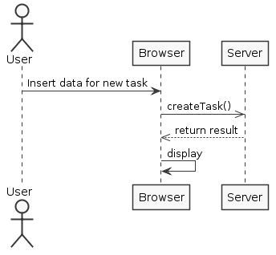

**André Oliveira** (1040862) - Sprint 1 - Lang02.1 - Temporary Variables
===============================

# 1. General Notes

Due to various problems most of the implementation failed, either because of reverts in the repository which caused people to lose their progress and lack of documentation to work with GWT's MaterialDataTable.
At present the Ui loads part of the information onto the table, and the save option attemps to save in the database but also fails due to an error in the code.
Debugging the ui was not possible because my system fails to load the client page on debug mode.
Filtering and sorting were features allegedly embedded within the MaterialDataTable, but since i was unable to create the table correctly these feature were partially implemented in the code.
No tests were done, the only evidence of a sucessful pull of information from the repository are the names of the tasks present in the Ui itself.

# 2. Requirements

Core05.2 - It should be possible to create, edit and remove tasks. A task has a name, a description, and a list of contacts. A task also has a priority level (1 to 5) and a percentage of completion. The application should have a window to display and edit tasks. It should be possible to sort and filter the tasks using expressions based on its fields. For instance, it should be possible to only display tasks which are not completed. Tasks should be visible to all the contacts related to the task

Proposal :

-US1 As a User of the Application, I want to be able to create a task.
-US2 As a User of the Application, I want to be able to edit a task.
-US3 As a User of the Application, I want to be able to remove a task.
-US4 As a User of the Application, I want to be able to sort the available tasks using expressions based on their fields.
-US5 As a User of the Application, I want to be able to filter the available tasks using expressions based on their fields.

# 3. Analysis

For this feature increment, since it is the first one to be developed in a new project I need to:  

- Understand how the application works and also understand the key aspects of GWT, since it is the main technology behind the application.
- Reference aditional content for the DTO pattern and Repository
- Search the available documentation on how to manipulate GWT Material Design
- Understanding the concept of asynchronous callbacks and server responses.

## 3.1 GWT and Project Structure

**Modules**. From the pom.xml file we can see that the application is composed of 5 modules:  
- **server**. It is the "server part" of the web application.  
- **shared**. It contains code that is shared between the client (i.e., web application) and the server.   
- **nsheets**. It is the web application (i.e., Client).  
- **util**. This is the same module as the one of EAPLI.  
- **framework**. This is the same module as the one of EAPLI.   
   
## 3.2 Analysis Diagrams

**Use Case**

**Domain Model (for this feature increment)**

**System Diagrams**

*US1*

*US2*

*US3*

*US4*

*US5*

# 4. Design

## 4.1 Requirements Realization

*US1*

*US2*

*US3*

## 4.2 Classes

*Present and describe the major classes of you solution.*

	 -Task.java
	 -TaskName.java
     -TaskView.java
     -TaskView.ui.xml
     -TaskPresenter.java

In the classes above were implemented the user interface implementation of this US.

     -TaskService.java
     -TaskServiceAsync.java
     -TaskServiceImpl.java
     -web.xml

In the classes above were implemented the needed services to provide access to the Controller.

     -TaskController.java

## 4.3 Design Patterns and Best Practices

- Repository/Factory
- DTO
- Single Responsability Principle
- Dependency Inversion Principle
- Interface segregation
- High Cohesion
- Low Coupling

# 5. Implementation

##For US1 : Button to save new tasks

The Widget class MaterialButton "createTask" will create a new TaskDTO and asychronously wait for the server response:
	 
     @UiHandler("createTask")
    void onCreateTask(ClickEvent e) {
        TaskServiceAsync Svc = GWT.create(TaskService.class);
        AsyncCallback<TaskDTO> callback = new AsyncCallback<TaskDTO>() {
            @Override
            public void onFailure(Throwable caught) {
                MaterialToast.fireToast("Error: " + caught.getMessage());
            }

            @Override
            public void onSuccess(TaskDTO result) {
                MaterialToast.fireToast("Task created successfuly!");
            }
        };
        TaskDTO dto = new TaskDTO(name.getValue(),description.getValue(),Integer.parseInt(priority.getValue()));
        
        Svc.addNewTask(dto, callback);
    }
	
	
Since Presenters should only depend on a View interface it added a new method to the TaskPresenter.MyView:

	interface MyView extends View {

        void setContents(List<TaskDTO> contents);
    }
	

The Service Implementation handles the transformation of the domain class into DTO in order to traverse the project layers from the repository to the client as well as return database exceptions from the server:
	
	public class TaskServiceImpl extends RemoteServiceServlet implements TaskService {

    private PersistenceSettings getPersistenceSettings() {

        Properties props = new Properties();
        props.put("persistence.repositoryFactory",
                "pt.isep.nsheets.server.lapr4.white.s1.core.n4567890.workbooks.persistence.jpa.JpaRepositoryFactory");
        props.put("persistence.persistenceUnit", "lapr4.NSheetsPU");

        return new PersistenceSettings(props);
    }

    @Override
    public List<TaskDTO> getAllTasks() {
        PersistenceContext.setSettings(this.getPersistenceSettings());

        TaskController controller = new TaskController();
        List<Task> taskList = controller.getAllTasks();
        List<TaskDTO> dtoList = new ArrayList<>();
        for (Task task : taskList) {
            dtoList.add(task.toDTO());
        }
        return dtoList;
    }

    @Override
    public void addNewTask(TaskDTO dto) {
        PersistenceContext.setSettings(this.getPersistenceSettings());
        
        TaskController controller = new TaskController();
        Task newTask = null;
        newTask.fromDTO(dto);
        
        try {
            controller.addNewTask(newTask);
        } catch (DataConcurrencyException ex) {
            Logger.getLogger(TaskServiceImpl.class.getName()).log(Level.SEVERE, null, ex);
        } catch (DataIntegrityViolationException ex) {
            Logger.getLogger(TaskServiceImpl.class.getName()).log(Level.SEVERE, null, ex);
        }
    }

##Code Organization##

Server:

Shared:

Client:

# 6. Work Log

- [ViewXML](https://bitbucket.org/lei-isep/lapr4-18-2dc/commits/57044733e01352d35dce1ce862a392f20103666c)
- [TaskView & TaskPresenter](https://bitbucket.org/lei-isep/lapr4-18-2dc/commits/19b7b1902f2d80141ee2947dc2826f6aeb9a358e)
- [TaskDTO Impl](https://bitbucket.org/lei-isep/lapr4-18-2dc/commits/463df64e4884337b29e57872fdd8b8e7689df50e)
- [Task & TaskDTO Upd](https://bitbucket.org/lei-isep/lapr4-18-2dc/commits/d155ba0a370da92eec3f0339ee259e2b9091941f)
- [Controller & Services Impl](https://bitbucket.org/lei-isep/lapr4-18-2dc/commits/a1e206695cb4fea466dac2d8a17bb02130e5a54a)
- [Reimplementation after revert](https://bitbucket.org/lei-isep/lapr4-18-2dc/commits/d6ef628a387962fb432a1b9cfe80e49e003ff8ed)
- [TaskView & fixes](https://bitbucket.org/lei-isep/lapr4-18-2dc/commits/df48fa584aa61ad4536fc3666d7aa886a067a5db)
- [Ui update](https://bitbucket.org/lei-isep/lapr4-18-2dc/commits/053f848871d26d09069658b789d7be90d9b41498)