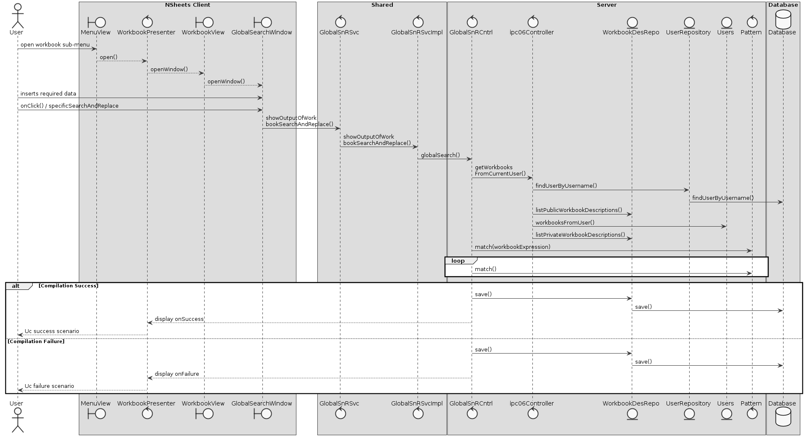

**André Oliveira** (1040862) - Sprint 3 - IPC02.3 - Global Search/Replace
===============================

# 1. General Notes

Implementation of this US was successfull, although some problems arose either because of reverts in the repository which caused people to lose their progress and lack of documentation to work with GWT's MaterialDataTable.
At present the Ui performs all of the requirements, except for proper persistence of the WorkbookDescriptions in the database due to past unresolved implementations which i wasn't able to attend to in time, and the possibility of unknown bugs due to lack of test implementation and further functional tests using REGEX inputs.
Other than the above mentioned i believe the workflow as a class project went smoother than in the previous sprint.

# 2. Requirements

IPC02.3 - Global Search/Replace
The application should now support "Search" and "Search and Replace" to be applied for all the workbooks of the user (may they be active/open or not). It should be possible to apply the search to workbooks which name matches a specific regular expression.

Proposal :

- US1 As a User of the Application, I want to be able to search all available workbooks for content using REGEX inputs.
- US2 As a User of the Application, I want to be able to search and replace contents in all available workbooks using REGEX inputs.
- US3 As a User of the Application, I want to be able to search in specific workbooks for content using REGEX inputs.
- US4 As a User of the Application, I want to be able to search and replace contents in specific workbooks using REGEX inputs

# 3. Analysis

For this feature increment, since it is the first one to be developed in a new project I need to:  

- Understand how the application works and also understand the key aspects of GWT, since it is the main technology behind the application.
- Reference aditional content for the DTO pattern and Repository
- Search the available documentation on how to manipulate GWT Material Design
- Understanding the concept of asynchronous callbacks and server responses.

## 3.1 GWT and Project Structure

**Modules**. From the pom.xml file we can see that the application is composed of 5 modules:  
- **server**. It is the "server part" of the web application.  
- **shared**. It contains code that is shared between the client (i.e., web application) and the server.   
- **nsheets**. It is the web application (i.e., Client).  
- **util**. This is the same module as the one of EAPLI.  
- **framework**. This is the same module as the one of EAPLI.   
   
## 3.2 Analysis Diagrams

Since no real domain classes were used in this iteration no domain model will be provided

**Use Case**

**System Diagrams**

*US1*

*US2*

*US3*

*US4*

# 4. Design

## 4.1 Requirements Realization

*US1*

*US2*

*US3*

*US4*

## 4.2 Classes

*Present and describe the major classes of you solution.*

     -WorkbookView.java
     -WorkbookView.ui.xml
     -WorkbookPresenter.java

In the classes above were implemented the user interface implementation of this US.

     -GlobalSearchAndReplaceService.java
     -GlobalSearchAndReplaceServiceAsync.java
     -GlobalSearchAndReplaceServiceImpl.java
     -web.xml

In the classes above were implemented the needed services to provide access to the Controller.

     -GlobalSearchAndReplaceController.java

## 4.3 Design Patterns and Best Practices

- Repository/Factory
- Single Responsability Principle
- Dependency Inversion Principle
- Interface segregation
- High Cohesion
- Low Coupling

# 5. Implementation

Basically only one method in the controller was implemented to handle all possible outcomes in order to maximize performance

public class GlobalSearchAndReplaceController implements Controller {
    public List<String> searchGlobal(String username, String regularExpression, String replace, String workbookExpression) {

        ipc06Controller controller = new ipc06Controller();
        List<WorkbookDescription> wbList = controller.getWorkbooksFromCurrentUser(username);
        List<WorkbookDescription> finaList = new ArrayList<>();

        List<String> output = new ArrayList<>();

        boolean canReplace = false;
        if (replace != null && !replace.isEmpty()) {
            canReplace = true;
        }

        if (workbookExpression != null && !workbookExpression.isEmpty()) {
            for (WorkbookDescription workbookDescription : wbList) {
                if (Pattern.matches(workbookExpression, workbookDescription.getName())) {
                    finaList.add(workbookDescription);
                }
            }
            wbList = finaList;
        }

        for (WorkbookDescription workbookdesc : wbList) {
            List<Spreadsheet> spreadList = new ArrayList<>();
            spreadList = workbookdesc.getWorkbook().getSpreadSheets();

            for (Spreadsheet spreadsheet : spreadList) {
                int rows = spreadsheet.getRowCount(), cols = spreadsheet.getRowCount();
                for (int row = 0; row < rows; row++) {
                    for (int col = 0; col < cols; col++) {
                        Cell cellToWhat = spreadsheet.getCell(col, row);
                        if (Pattern.matches(regularExpression, cellToWhat.getContent())) {
                            boolean replaced = false;
                            String strout = "workbook: " + workbookdesc.getName() + " spreadsheet: " + spreadsheet.getTitle() + " cell: " + cellToWhat.toString() + " Replaced: %flag";
                            if (canReplace) {
                                try {
                                    cellToWhat.setContent(replace);
                                    replaced = true;
                                } catch (FormulaCompilationException ex) {
                                    Logger.getLogger(GlobalSearchAndReplaceController.class.getName()).log(Level.SEVERE, null, ex);
                                }
                            }
                            strout = strout.replace("%flag", String.valueOf(replaced));
                            output.add("Match found!");
                            output.add(strout);
                        }
                    }
                }
            }
        }

        if (canReplace) {
            for (WorkbookDescription workbookDescription : wbList) {
                try {
                    WorkbookDescriptionRepository wbRepo = PersistenceContext.repositories().workbookDescriptions();
                    wbRepo.save(workbookDescription);
                } catch (DataConcurrencyException ex) {
                    Logger.getLogger(GlobalSearchAndReplaceController.class.getName()).log(Level.SEVERE, null, ex);
                } catch (DataIntegrityViolationException ex) {
                    Logger.getLogger(GlobalSearchAndReplaceController.class.getName()).log(Level.SEVERE, null, ex);
                }
            }
        }
        return output;
    }
}

While the Ui itself also acts as a validator of some data such as null objects and designed in a way to guide the user where we developers want him to go

        globalSearchAndReplace.addMouseOverHandler(event -> {
            globalSearchAndReplace.setTitle("Global search and replace");
        });

        globalSearchAndReplace.addClickHandler(event -> {
            globalStartSearchAndReplace.setEnabled(false);
            globalRegExpressionTextBox2.setEnabled(false);
            globalRegExpressionTextBox3.setEnabled(false);
            globalRegExpressionTextBox1.clear();
            globalRegExpressionTextBox2.clear();
            globalRegExpressionTextBox3.clear();
            globalSearchAndReplaceWindow.open();
            MaterialToast.fireToast("All queries in REGEX format");
        });

        globalRegExpressionTextBox1.addKeyPressHandler(event -> {
            globalStartSearchAndReplace.setEnabled(true);
            globalRegExpressionTextBox2.setEnabled(true);
            globalRegExpressionTextBox3.setEnabled(true);
            globalStartSearchAndReplace.setBackgroundColor(Color.BLUE);
        });

        globalRegExpressionTextBox2.addKeyPressHandler(event -> {
            globalStartSearchAndReplace.setText("SEARCH AND REPLACE");
            globalStartSearchAndReplace.setBackgroundColor(Color.GREEN);
        });

        globalRegExpressionTextBox3.addKeyPressHandler(event -> {
            globalStartSearchAndReplace.setBackgroundColor(Color.RED);
        });

        globalStartSearchAndReplace.addClickHandler(clickEvent -> {
            if (globalRegExpressionTextBox1.getText().equals("")) {
                MaterialToast.fireToast("Search query empty");
            } else {
                if (globalRegExpressionTextBox2.getText().equals("") && globalRegExpressionTextBox3.getText().equals("")) {
                    MaterialToast.fireToast("Searching...");
                    GlobalSearchAndReplaceServiceAsync Svc = GWT.create(GlobalSearchAndReplaceService.class);

                    AsyncCallback<List<String>> callback = new AsyncCallback<List<String>>() {
                        @Override
                        public void onFailure(Throwable caught) {
                            MaterialToast.fireToast("Error! " + caught.getMessage());
                        }

                        @Override
                        public void onSuccess(List<String> result) {
                            globalRegExpressionTextBox1.clear();
                            globalRegExpressionTextBox2.clear();
                            globalRegExpressionTextBox3.clear();
                            for (String string : result) {
                                MaterialToast.fireToast(string);
                            }
                        }
                    };
                    Svc.showOutputOfGlobalSearch(username, globalRegExpressionTextBox1.getValue(), callback);
                }
                if (!globalRegExpressionTextBox2.getText().equals("") && globalRegExpressionTextBox3.getText().equals("")) {
                    MaterialToast.fireToast("Searching and replacing...");
                    GlobalSearchAndReplaceServiceAsync Svc = GWT.create(GlobalSearchAndReplaceService.class);

                    AsyncCallback<List<String>> callback = new AsyncCallback<List<String>>() {
                        @Override
                        public void onFailure(Throwable caught) {
                            MaterialToast.fireToast("Error! " + caught.getMessage());
                        }

                        @Override
                        public void onSuccess(List<String> result) {
                            globalRegExpressionTextBox1.clear();
                            globalRegExpressionTextBox2.clear();
                            globalRegExpressionTextBox3.clear();
                            for (String string : result) {
                                MaterialToast.fireToast(string);
                            }
                        }

                    };
                    Svc.showOutputOfGlobalSearchAndReplace(username, globalRegExpressionTextBox1.getValue(), globalRegExpressionTextBox2.getValue(), callback);
                }
                if (globalRegExpressionTextBox2.getText().equals("") && !globalRegExpressionTextBox3.getText().equals("")) {
                    MaterialToast.fireToast("Searching in woorkbook " + globalRegExpressionTextBox3.getText());
                    GlobalSearchAndReplaceServiceAsync Svc = GWT.create(GlobalSearchAndReplaceService.class);

                    AsyncCallback<List<String>> callback = new AsyncCallback<List<String>>() {
                        @Override
                        public void onFailure(Throwable caught) {
                            MaterialToast.fireToast("Error! " + caught.getMessage());
                        }

                        @Override
                        public void onSuccess(List<String> result) {
                            globalRegExpressionTextBox1.clear();
                            globalRegExpressionTextBox2.clear();
                            globalRegExpressionTextBox3.clear();
                            for (String string : result) {
                                MaterialToast.fireToast(string);
                            }
                        }
                    };
                    Svc.showOutputOfWorkbookSearch(username, globalRegExpressionTextBox1.getValue(), globalRegExpressionTextBox3.getValue(), callback);
                }
                if (!globalRegExpressionTextBox2.getText().equals("") && !globalRegExpressionTextBox3.getText().equals("")) {
                    MaterialToast.fireToast("Searching replacing in woorkbook " + globalRegExpressionTextBox3.getText());
                    GlobalSearchAndReplaceServiceAsync Svc = GWT.create(GlobalSearchAndReplaceService.class);

                    AsyncCallback<List<String>> callback = new AsyncCallback<List<String>>() {
                        @Override
                        public void onFailure(Throwable caught) {
                            MaterialToast.fireToast("Error! " + caught.getMessage());
                        }

                        @Override
                        public void onSuccess(List<String> result) {
                            globalRegExpressionTextBox1.clear();
                            globalRegExpressionTextBox2.clear();
                            globalRegExpressionTextBox3.clear();
                            for (String string : result) {
                                MaterialToast.fireToast(string);
                            }
                        }
                    };
                    Svc.showOutputOfWorkbookSearchAndReplace(username, globalRegExpressionTextBox1.getValue(), globalRegExpressionTextBox3.getValue(), globalRegExpressionTextBox2.getValue(), callback);
                }
            }
        });

##Code Organization##

Server:

- GlobalSearchAndReplaceServiceImpl
- pt.isep.nsheets.server.lapr4.blue.s3.ipc.n1040862.GlobalSearch.application.GlobalSearchAndReplaceController
- pt.isep.nsheets.server.lapr4.red.s2.ipc.n1161027.ipc06.application ipc06Controller

Shared:

- GlobalSearchAndReplaceService
- GlobalSearchAndReplaceServiceAsync

Client:

- WorkbookView.java
- WorkbookView.ui.xml

# 6. Work Log

- [User Interface](https://bitbucket.org/lei-isep/lapr4-18-2dc/commits/d791cdba71e78abafb34fd2aa62716df43378b75)
- [Ui Update](https://bitbucket.org/lei-isep/lapr4-18-2dc/commits/5aefb3cd74692465c881e48014248c586308bf19)
- [Service Implementation](https://bitbucket.org/lei-isep/lapr4-18-2dc/commits/b84c2d2c436a0e6cd3cc279bc9d1aea235ff5ddb)
- [Service Update](https://bitbucket.org/lei-isep/lapr4-18-2dc/commits/01c163aa6025b7d19b24442a4a39e1972e9ece9b)
- [Controller & Services Impl](https://bitbucket.org/lei-isep/lapr4-18-2dc/commits/b48ea9382a2e2e0da212009c396f3844f4033280)
- [Persistence fixes](https://bitbucket.org/lei-isep/lapr4-18-2dc/commits/9f4b7028f080da1644e5f1986391c38a3ea97f27)
- [Controller Update](https://bitbucket.org/lei-isep/lapr4-18-2dc/commits/7c8c4c2286a7677199c214084e0de33b642aed90)