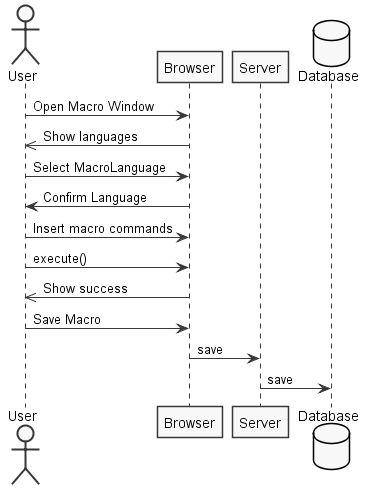
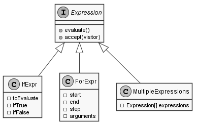
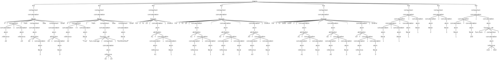
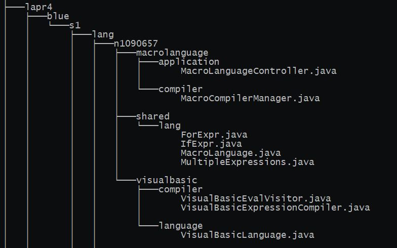
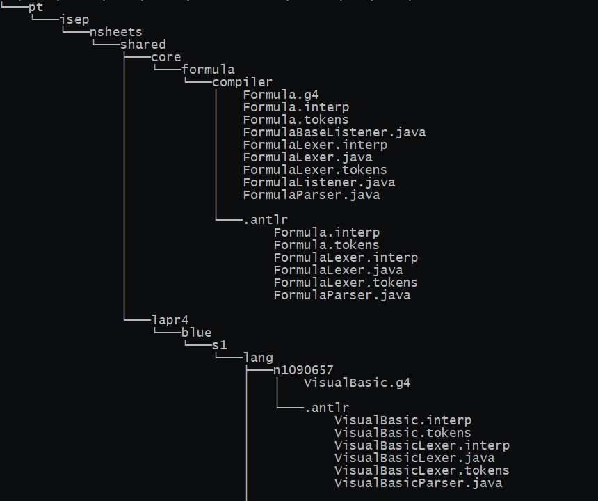
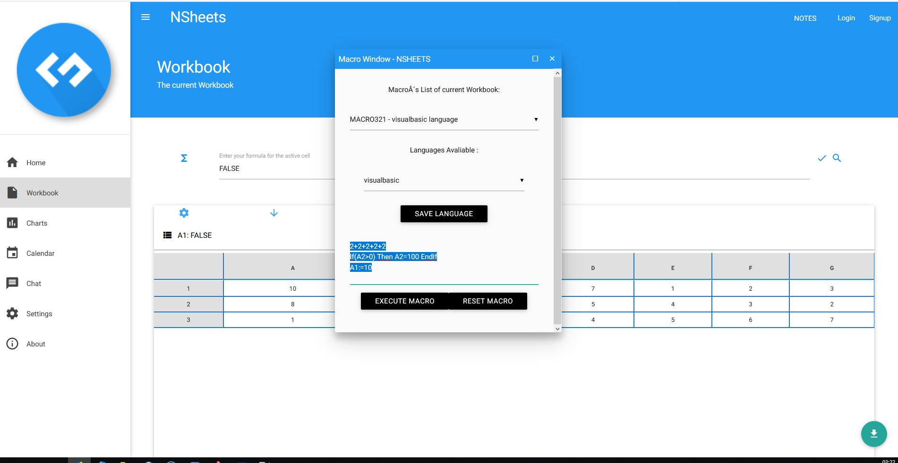

**Raul Correia** (1090657) - Sprint 1 - Lang07.1
===============================
# 1. General Notes

The Language should be close to Visual Basic

My UC is dependent on:
*   Lang01.1
*   Lang02.1
*   Lang06.1
*   Lang08.1

# 2. Requirements

Lang07.1 - Base Visual Basic Language
The application should support a language inspired in the syntax of Visual Basic. This language is to be an alterntive language to writing "Macros". This feature increment should have the same functionality as Lang06.1 but with the adaptations required by the syntax of the language.

This language can do everything that the formulas language does but in multiple lines.
The cell result is the last executed line.

## Proposal
UC 1 - As an end user i want to select what language to write my macro in.

UC 2 - As an end user i want to write a macro for a given spreadsheet.

UC 3 - As an end user i want to save my macro on the spreadsheet.

# 3. Analysis

For this feature, since it is the first one to developed I need to:

- Understand how the application works and also understand the key aspects of GWT, since it is the main technology behind the application  

- Learn the syntax for the formulas language

- Review Language Parsing and Grammar usage in ANTLRv4

- Skim through the book Pragmatic The Definitive ANTLR 4 Reference Jan 2013 so i understand better ANTLRv4

- Study Visual Basic syntax so i can implement and adapt to the macros use case

- Implement a grammar capable of multi line

- Follow updates on Formulas language and try to implement it

Other non direct UC related things

- Need to implement a Class that extends Lanaguge called **_MacroLanguage_**

# 3.1 Project Structure
**Modules**. From the pom.xml file we can see that the application is composed of 5 modules:  
- **server**. It is the "server part" of the web application.  
- **shared**. It contains code that is shared between the client (i.e., web application) and the server.   
- **nsheets**. It is the web application (i.e., Client).  
- **util**. This is the same module as the one of EAPLI.  
- **framework**. This is the same module as the one of EAPLI.

My code will reside in the shared folder since is shared between server and client.
## 3.2. Analysis Diagrams
**Use Cases**

This use case description is very simple, there is no need to explain more than the image.




For this feature increment we found ourselves needing the language manager to differenciate MacroLanguages
We needed also a manager for its associated compilers
And we needed way to interpret for and if expressions, and another way to evaluate multiple expressions not at visitor evaluation, but post macro code evalution.

Macro Language Model


Needed Expressions


# 4. Design

For the Visual Basic macro language i started with analyzing the formulas syntax and adapting it so it could do the following
* Interpret multiple lines
* Interpret multiple expressions blocks without evaluting them on grammar visit
* Implement If Expression
* Implement For Expression
* Implement attribution to a Cell or a temporary variable

I need to create an ANTLR4 grammar called VisualBasic.g4
I need to create a VisualBasicEvalVisitor to visit the expressions.
I need a VisualBasicExpressionCompiler that it's able to receive an input as a string and return an expression with all the logic.

The language does not use language starting character.
The syntax for the new expressions is the following:
### For 
    For 1 To 10 [STEP 1] Then Expression EndFor

### If
    If expression Then Expression [ELSE Expression] EndIf


## 4.1. Tests

There are three types of tests.
Unit Tests, Antlr4 grammar tests and functional tests
Unit Tests could not be implement to ensure language is working since workbook has dependencies on Cell, which is using CellImpl and CellImpl has dependecies on Value.parseValue(), and this last one depends on GWT library.
So it's not possible to test languages directly with domain objects.

The Antlr4 grammar tests are the following


The functional tests are only available during implementation through trial and error.

## 4.2. Requirements Realization

The requirements for this realization are the following:

* Need a class that saves Macro code and it's name
* Need a grammar for interpretation
* Need an MacroLanguageManager that knows all the languages
* Need an MacroCompilerManager that knows all the the compilers 
* Need a language specific Visitor
* Need an If Expression
* Need an For Expression
* Need a temporary variable expression
* Need an expression of expressions {block}
* Need an UI capable of choosing language and executing a given code
* Need an UI capable of showing errors, cause there are not unit tests available

## 4.3. Classes

- Macro
    - This class knows the macro name and stores macro code as a string.
- VisualBasicLanguage
    - This class extends MacroLanguage, that makes this class a language capable of compile any macro command supported by the this grammar;

-  LanguageManager
    - This class is a singleton class (only instantiated once) and has all the available languages for this application.
    And knows the difference between normal Languages and MacroLanguages.

- VisualBasicExpressionCompiler
    - Is responsible for the creation of the parser and lexer for creating a tree for a given grammar and returning and expression with all the logic translated from the macro code. 

- VisualBasicEvalVisitor
    - This class is responsible for visiting the tree generated by the parser of the grammar and create needed expressions on it's navigation.
- IfExpr
    - Expression that has the logic to evaluate a given expression that executes the then condition or the else, if has it.
- ForExpr
    - Expression that has the logic to evalute a block of clock for N given times.
- MultipleExpressions
    - Expressions that holds multiple expressions, so it can be evaluated after gathering all code logic from a block.


## 4.4. Design Patterns and Best Practices

The design patterns used are the following:
* Visitor
* Singleton
* Factory
* Strategy
* Command

Best practices used:
* Single Responsability Principle
* Dependency Inversion Principle
* Open/Closed Principle

These practices ensure high cohesion and low coupling.

# 5. Implementation

The following code are extracts examples.

## Grammar

Instead of ignoring white space, we given an option to the lexer so simply hides it from parsing, making life easier.
```
grammar VisualBasic;

macro: line+;
line: comparison;
```

```
concatenation:
        |...
        |...
        |ifexpr
        |forexpr;
```
```
atom:
    |...
    |...
    |attribution;
```

```
attribution: CELL_REF ATTRIB concatenation;
```

```
ifexpr:
	IF LPAR (comparison) RPAR THEN comparison (ELSE comparison)? ENDIF;
```


```
forexpr:
	FOR NUMBER TO NUMBER (STEP NUMBER)? (concatenation SEMI)* concatenation ENDFOR;
```

```
    Function: 'func.' (LETTER)+;
```

## MacroLanguage
```
public class MacroLanguage extends Language {

    public MacroLanguage(String name, String starter) {
        super(name, starter);
    }

}
```

## For Expression
```
public class ForExpr implements Expression{

	Expression start;
	Expression end;
	Expression step;
	Expression arguments;
	
	public ForExpr(Expression start, Expression end, Expression step,Expression arguments) {
		this.start=start;
		this.end=end;
		this.step=step;
		this.arguments=arguments;
	}
	@Override
	public Value evaluate() throws IllegalValueTypeException {
		int sIndx = (int)start.evaluate().toDouble();
		int eIndx = (int)start.evaluate().toDouble();
		int forStep = 1;
		if(step != null) {
			forStep =(int)step.evaluate().toDouble();
		}
		Value val = null;
		for(int i = sIndx;i<eIndx;i+=forStep) {
			val=arguments.evaluate();
		}
		return val;
	}

	@Override
	public Object accept(ExpressionVisitor visitor) {
		// TODO Auto-generated method stub
		return null;
	}

}
```
## If Expression
```
public class IfExpr implements Expression{

	Expression toEvaluate;
	Expression ifTrue;
	Expression ifFalse;
	
	public IfExpr(Expression toEvaluate, Expression ifTrue, Expression ifFalse) {
		this.toEvaluate=toEvaluate;
		this.ifTrue=ifTrue;
		this.ifFalse=ifFalse;
	}
	@Override
	public Value evaluate() throws IllegalValueTypeException {
		if(toEvaluate.evaluate().toBoolean()) {
			return ifTrue.evaluate();
		}else {
			if(ifFalse!= null)
				return ifFalse.evaluate();
			}
		
		return new Value();
	}

	@Override
	public Object accept(ExpressionVisitor visitor) {
		// TODO Auto-generated method stub
		return null;
	}

}
```

## Multiple Expressions {block}
```
public class MultipleExpressions implements Expression {

	private Expression[] args;

	public MultipleExpressions(List<Expression> args) {
		this.args = new Expression[args.size()];
		for(int i = 0; i < args.size();i++) {
			this.args[i]=args.get(i);
		}
	}

	@Override
	public Value evaluate() throws IllegalValueTypeException {
		
		Expression expr = null;
		Value val= null;
		if(args.length==1) {
			return args[0].evaluate();
		}
		for(int i =0; i < args.length - 1;i++) {
			expr=args[i];
			val=expr.evaluate();
		}
		return val;
	}

	@Override
	public Object accept(ExpressionVisitor visitor) {
		// TODO Auto-generated method stub
		return null;
	}

}
```
## MacroCompilerManager
```
public class MacroCompilerManager {

    private static final MacroCompilerManager instance = new MacroCompilerManager();

    private List<ExpressionCompiler> compilers = new ArrayList<>();

    private MacroCompilerManager() {
        initCompilers();
    }

    private void initCompilers() {
        compilers.add(new VisualBasicExpressionCompiler());
        compilers.add(new JavascriptExpressionCompiler());
        compilers.add(new MacroExcelExpressionCompiler());
    }

    public static MacroCompilerManager getInstance() {
        return instance;
    }

    public ExpressionCompiler getCompiler(final String language) {
        for (ExpressionCompiler c : compilers) {
            if (c.compilerName().equalsIgnoreCase(language)) {
                return c;
            }
        }
        throw new NoSuchElementException(language + " doesn't exist.");
    }

    public ExpressionCompiler getCompiler(final MacroLanguage lang) {
        return getCompiler(lang.getName());
    }

}
```

```
public class VisualBasicLanguage extends MacroLanguage {

    // ToDo Add If and For
    public VisualBasicLanguage(String name, String starter) {
        super(name, starter);
    }

    @Override
    protected void initFunctions() {
        functions.add(new Average());
        functions.add(new And());
        functions.add(new Count());
        functions.add(new Do());
        functions.add(new Factorial());
        functions.add(new False());
        functions.add(new If());
        functions.add(new Not());
        //functions.add(new NumericFunction());
        functions.add(new Or());
        functions.add(new Sum());
        functions.add(new True());
    }

    @Override
    protected void initBinaryOperators() {
        binaryOperators.add(new Adder());
        binaryOperators.add(new Concatenator());
        binaryOperators.add(new Divider());
        binaryOperators.add(new Equal());
        binaryOperators.add(new Exponentiator());
        binaryOperators.add(new GreaterThan());
        binaryOperators.add(new GreaterThanOrEqual());
        binaryOperators.add(new LessThan());
        binaryOperators.add(new LessThanOrEqual());
        binaryOperators.add(new Multiplier());
        binaryOperators.add(new NotEqual());
        binaryOperators.add(new RangeReference());
        binaryOperators.add(new Subtracter());
        binaryOperators.add(new Attribution());
    }

    @Override
    protected void initUnaryOperators() {
        // functions.add(new Average());
        unaryOperators.add(new Negator());
        unaryOperators.add(new Percent());
    }
    
    @Override
    public String toString() {
    	return "VisualBasic";
    }

}
```

**Code Organization**
My code resides in shared project



# 6. Integration/Demonstration


# 7. Final Remarks

Conclusion is: We could not attain objectives,Implementation is 3/4 done.

Visual basic language parses and executes simple functions and multiple lines, but has some problems when dealing with some strings.

I could not implement : blocks and temporary variables.
For loop is half implemented, the expression works but the visitor does not work properly.
Testing method was not optimal, since we cannot use unit tests to test domain objects and language visiting.
Only grammar tests and functional tests are available, and since it's a big project, doing minor tweaking and compiling the project again takes a huge time.

The biggest problems were:
* I needed to read the ANTLR4 developer's book to have an better understand of what the tool is capable of.
* Dealing with visitors, since it's not a easy pattern at first.
* Keeping up with other Lang Use cases while implementing a new language with multiple line execution paradigm.
* Debugging cross client language with eclipse, with multiple breakpoints. It's not as direct debugging as native Java language.
* Compile times
* Big project problems with multiple commits failing.
* Merging problems.
# 8. Work Log

Commits:

- [Started documentation](https://bitbucket.org/lei-isep/lapr4-18-2dc/commits/0b130ead131bfef91653a796de731c2ae0d2b816)

- [If and Else Expr](https://bitbucket.org/lei-isep/lapr4-18-2dc/commits/3aaaa838febcd5f417f1208581f5183106432581)

- [Initial language grammar](https://bitbucket.org/lei-isep/lapr4-18-2dc/commits/792fb59a7e58336c0a21d8cc2a8ba9e656a6c118)


- [Grammar development](https://bitbucket.org/lei-isep/lapr4-18-2dc/commits/7206d454a7370a7ffe989d8954c3e28ca95f93cc)

- [LanguageManager](https://bitbucket.org/lei-isep/lapr4-18-2dc/commits/d208f863ab945d9cb0915e5161918602af1fb84a)

- [Multiple Compiler Support](https://bitbucket.org/lei-isep/lapr4-18-2dc/commits/365cc0fd425b40a7d765c9925d694fbcd1590072)
- [Initial visitor development](https://bitbucket.org/lei-isep/lapr4-18-2dc/commits/3f88ac2c8a704c234b52f459dac014ef6852bd1b)

- [Language multiline Expression execution and MultipleExpression implementation](https://bitbucket.org/lei-isep/lapr4-18-2dc/commits/938c1e3b58cb2e61b582887d1648778dd6cfca7e)