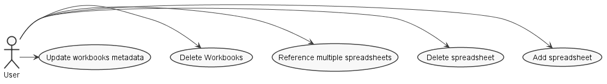
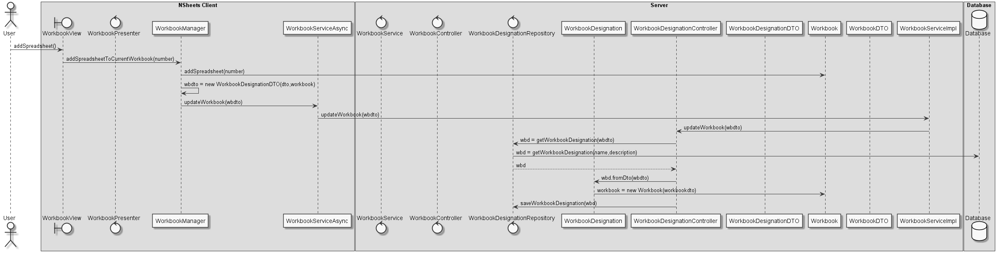
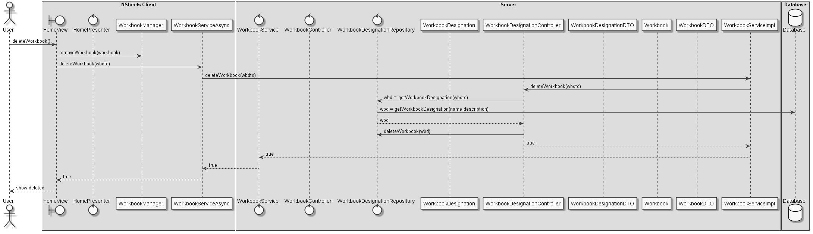
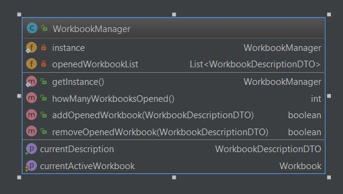

**Raul Correia** (1090657) - Sprint 1 - Lang07.1
===============================
# 1. General Notes

My UC is dependent on:
*   Core01.1 - Partial Workbook View

This Use Case is not implemented.
I will try my best to implement the previous iteration and try to further implement the needed UC for the current iteration.
Upon further talking with the teacher leading the class, i was told to try to implement as much as i can and do this iteration analysis, design and implementation if possible.

# 2. Requirements

Core01.2 - Complete Workbook View
The application should now support complete workbooks, i.e., workbooks with several spreadsheets. It should be possible to make references between sheets in the formulas. It should also be possible to delete workbooks and update their metadata (name and description).

## Proposal
UC 1 - As an end user i want to have multiple spreadsheets on a workbook

UC 2 - As an end user i want to be possible to reference multiple spreadsheets from my formulas

UC 3 - As an end user i want to be possible to edit a spreadsheet

UC 4 - As an end user i want to be possible to delete workbooks

# 3. Analysis

For this feature, developed I need to:

- Understand how the application works and also understand the key aspects of GWT, since it is the main technology behind the application  

- Understand the different layers server/client/shared

- Analyze what's left behind from the previous Sprint

- Have to implement a way so that workbooks have multiple spreadsheets

- Have a way to manage spreadsheets

- Have a way to manage workbooks

Other non direct UC related things

- This UC should not be limited to only one open Workbook, maybe code that can be extended to multiple Workbooks should be added

- After a simple analysis i have to re-implement the first UC - Core01.1 since it does not persist workbooks, only a fake designation

- I will implement simple mechanisms of persistence so i can progress further with the UC.

# 3.1 Project Structure
**Modules**. From the pom.xml file we can see that the application is composed of 5 modules:  
- **server**. It is the "server part" of the web application.  
- **shared**. It contains code that is shared between the client (i.e., web application) and the server.   
- **nsheets**. It is the web application (i.e., Client).  
- **util**. This is the same module as the one of EAPLI.  
- **framework**. This is the same module as the one of EAPLI.
- **bootstrap**. Bootstrap for the database

## 3.2. Analysis Diagrams
**Use Cases**

This use case is hard.
It has multiple US associated and the added difficulty that the first iteration does not work properly.

For this feature increment we found ourselves needing an List of Spreadsheets on Workbook
We need to add an expression to formulas that is able to reference other spreadsheet information
We need to add an way to delete workbooks
We need to add a way to edit workbooks information

Domain Model

Needed Expressions

# 4. Design

For a workbook to have multiple spreadsheets i plan to change the implementation so it has an arraylist of spreadsheets, and it can be iterated on. 
 
I need to add methods for the following 
- Add spreadsheets to a workbook 
- Delete a spreadsheet from a workbook 
- Delete workbooks and its description 
- Update a workbook name and description 

The last part, Referencing multiple spreadsheets, 
I need to add a new rule to the Formula Grammar so it can identify that its a spreadsheet reference
Something like the user input =Sheet1.A1 should be possible 

I'm adding a WorkbookManager so it can manage multiple workbooks and grants the possibility to scale for further iterations. 

## SSD

## 4.1. Tests

There are multiple tests to be implement: 
- testAddOneSpreadsheet 
- testAddMultipleSpreadsheets 
- testDeleteOneSpreadsheet 
- testDeleteAllSpreadsheets 
- testChangeWorkbookName 
- testChangeWorkbookDescription 
- testChangeWorkbookNameAndDescription 
- testDeleteWorkbook 
- testReferenceSpreadsheet 

## 4.2. Requirements Realization

The requirements for this realization are the following:

* Need a container for having multiple spreadsheets on Workbook
* Need a grammar rule for spreadsheet references
* Need an expression action toget spreadsheet reference values
* Need a WorkbookManager to facilitate setting the active workbook
* Need a way to persist Workbooks and WorkbookDescriptions
* Need UI list to select the spreadsheets from the workbooks
* Need UI events so it updates the changes made to Workbooks

OTHER REQUIREMENTS
The previous use case is not implemented.
I cannot progress with this UC since there is no way to persist Workbooks properly.
Implementation of these mechanisms is fundamental for the application to work.

## 4.3. Classes

- SpreadsheetExpression
    - This class is an implementation of Reference, that its purpose is to reference an spreadsheet
- WorkbookManager
    - This class is a singleton that its purpose is to manage multiple workbooks and know the current active workbook on client side.

## 4.4. Design Patterns and Best Practices

The design patterns used are the following:
* Singleton

Best practices used:
* Single Responsability Principle
* Open/Closed Principle

These practices ensure high cohesion and low coupling.

# 5. Implementation

The only thing i could implement from feature was the WorkbookManager.
For this iteration, i had to implement from scratch everything from the previous iteration, leaving me no remaining time to work on the current feature.

What i implemented for this iteration was :
- DTOs for: WorkbookDescription, Workbook, Spreadsheet
- Services for : WorkbookDescription
- WorkbookManager to know all the open workbooks and current one to work on.
- UI : for workbook selection and workbook spreadsheet reload
- Value fix so the domain is not bound to gwt.

## Grammar

Nothing was implement because there was no time after first iteration feature reimplementation.

## WorkbookManager
I implement a class that manages Workbooks.

**Code Organization**
My code resides in all modules

# 6. Integration/Demonstration

# 7. Final Remarks

Conclusion is: We could not attain objectives.

For this iteration i could not even work on the requested feature, since the previous USE CASE was not even implemented. The use case is mandatory and it couldn't persist any workbook at all.

The biggest problems were:
* Analyzing what i inherited from my previous classmate.
* The "code islands" that were formed since persisting workbooks was non existent.
* Connecting multiple use cases to persisting workbooks.
* Defining a default method to get current workbook
* Compile times
* Big project problems with multiple commits failing.
* Merging problems.
# 8. Work Log

Commits:

- [Started documentation](https://bitbucket.org/lei-isep/lapr4-18-2dc/commits/eba989bea09e9b0a5722f8fb02616126abf38e38)
- [Documentation](https://bitbucket.org/lei-isep/lapr4-18-2dc/commits/e03700bebfb5ec8f9b70123dc2910b1064f9fded)
- [Documentation](https://bitbucket.org/lei-isep/lapr4-18-2dc/commits/87d04647135a89b8e3a2f618d0672367ef2bb7f4)
- [Documentation](https://bitbucket.org/lei-isep/lapr4-18-2dc/commits/22274eb344f8ef07ab26049665670987ab14a9f1)
- [Initial multiple spreadsheets](https://bitbucket.org/lei-isep/lapr4-18-2dc/commits/2bcbc01c7fbfb5c162116e5f8d84dd872f86a159)
- [Documentation](https://bitbucket.org/lei-isep/lapr4-18-2dc/commits/994c97c5df6966a49806280575c244e2d5a080c3)
- [Documentation](https://bitbucket.org/lei-isep/lapr4-18-2dc/commits/e03700bebfb5ec8f9b70123dc2910b1064f9fded)
- [Documentation](https://bitbucket.org/lei-isep/lapr4-18-2dc/commits/87d04647135a89b8e3a2f618d0672367ef2bb7f4)
- [Documentation](https://bitbucket.org/lei-isep/lapr4-18-2dc/commits/47a482e8b1939cf769b8dfb484995e258147adb3)
- [WorkbookManager](https://bitbucket.org/lei-isep/lapr4-18-2dc/commits/058f3e401e3948631062f16700c2aec329637107)
- [Values parseData](https://bitbucket.org/lei-isep/lapr4-18-2dc/commits/4a0ee07ce6a5e728eb93ddd236caedf9b228bec2)
- [Fix Simao Problems](https://bitbucket.org/lei-isep/lapr4-18-2dc/commits/84dc9714357da23b0d7df2a01c46133e5eb758fb)
- [Workbook Bootstrapper](https://bitbucket.org/lei-isep/lapr4-18-2dc/commits/109f3cf164b3c5448c971b40bd99ddbc5b2650aa)

- [Workbooks now persist](https://bitbucket.org/lei-isep/lapr4-18-2dc/commits/44dc76ecc7e74bcd4e703d6d13ae608e8fdee292)
- [Workbooks persist](https://bitbucket.org/lei-isep/lapr4-18-2dc/commits/0b865d887fa29f7643dc6afebbb5fddfb9cf2498)
- [Changing WorkbookManager](https://bitbucket.org/lei-isep/lapr4-18-2dc/commits/8616787dcd4e53c0835fac232d112262739ffea5)
- [DTO](https://bitbucket.org/lei-isep/lapr4-18-2dc/commits/88abc6587600f2ac8e1fdb4004a5e7b63068b1f2)
- [toDTO](https://bitbucket.org/lei-isep/lapr4-18-2dc/commits/3179300f72ca5bcc0b27f19bdd6c90c503a21215)
- [More dtos](https://bitbucket.org/lei-isep/lapr4-18-2dc/commits/628e049e275832034c5e4e7ddb282da33a781785)
- [More dtos](https://bitbucket.org/lei-isep/lapr4-18-2dc/commits/55551b45366e3c6f851a97a29bcc027f7f2d2399)
- [More dtos](https://bitbucket.org/lei-isep/lapr4-18-2dc/commits/7a210825c3a3f70e5e8860d595ff3a01bc48f1ce)
- [Reversion](https://bitbucket.org/lei-isep/lapr4-18-2dc/commits/83ca57c0769bf90eb8043779ae949d8931575ee6)
- [More dto](https://bitbucket.org/lei-isep/lapr4-18-2dc/commits/61d880a3099cc597020efad372619d66672bdf47)
- [Load from database and refresh ui](https://bitbucket.org/lei-isep/lapr4-18-2dc/commits/4a785857d2105ba53620c87517b47d0a242527f7)
- [Revert](https://bitbucket.org/lei-isep/lapr4-18-2dc/commits/e7bf084b9e36c7a8b1e8283c9f1635742d5b6e65)
- [Initial save implementation from Client WorkookDTO to Server](https://bitbucket.org/lei-isep/lapr4-18-2dc/commits/3c727a08a7d317ff6aa2ae65d203ce6053c8630d)
- [Finnaly it shows and saves something yay](https://bitbucket.org/lei-isep/lapr4-18-2dc/commits/985fc313a6b770441417810e170e2ff1bb2c59b4)
- [Fixed get Workbooks](https://bitbucket.org/lei-isep/lapr4-18-2dc/commits/55114fea083187eec1d3b0d59152090b56802b4f)
- [Erro](https://bitbucket.org/lei-isep/lapr4-18-2dc/commits/8abcdd2d23f7fae8d6fc1172f6d9ccf1433ede86)