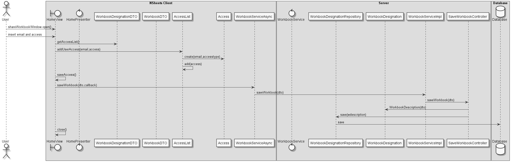

**Raul Correia** (1090657) - Sprint 3 - IPC06.3
===============================
# 1. General Notes

My UC is dependent on:
*   IPC06.1
*   IPC06.2

This use case was poorly implemented.
The persistance layer was persisting workbooks twice,
Each public workbook, was saved on each user as a different workbook...
I have to correct this bad design so i can progress with the UC.
# 2. Requirements

IPC06.3 - Share Workbooks
It should be possible to apply individual sharing options to each workbook. A workbook can now be shared with only specific users. In this context, a public workbook is simply a workbook that is shared with everyone. Also, the share should have a type: view, read-only, write. View only allows the listing of the name and description of the workbook. Read-only allow to open the workbook but not to edit it. Write should allow full edition.

## Proposal
UC 1 - As a user i want to share a workbook with individual persons with different sharing options.

UC 2 - As a user i want to open a workbook with the given permissions.

# 3. Analysis

For this feature, I need to:

- Understand the different layers server/client/shared for this feature

- Analyze what's left behind from the previous Sprint

- Undo what is left behind from the previous developer, Users saving workbooks is a no-no in domain driven design

- Have a way to manage permissions for each user i want to share

- Limit the workbook opening options so it reflects : VIEW ONLY, READ ONLY and READ WRITE ACCESS

Other non direct UC related things

- This UC has implementation sharing of others UCs, since i'm going to define a way to access diferent shared workbooks.

- After a simple analysis i have undo most the second iteratition since it persists twice and the User is aggregating Workbooks, since it has little logic.

- I will implement queries that can filter private workbooks that a user has access.

# 3.1 Project Structure
**Modules**. From the pom.xml file we can see that the application is composed of 5 modules:  
- **server**. It is the "server part" of the web application.  
- **shared**. It contains code that is shared between the client (i.e., web application) and the server.   
- **nsheets**. It is the web application (i.e., Client).  
- **util**. This is the same module as the one of EAPLI.  
- **framework**. This is the same module as the one of EAPLI.
- **bootstrap**. Bootstrap for the database

## 3.2. Analysis Diagrams
**Use Cases**

This use case is hard not on its requirements, but from changing what was leftover by the previous developer.
It has atleast two other UC that are dependent on the way i manage and share Workbooks with different users.

For this feature increment we need: 
* Access levels
* List that manages access levels for each workbook
* Something that knows the owner of the workbook
* Restrict the UI for the different access levels

Domain Model

# 4. Design

For this feature i must create a Class that has the unique purpose of managing and aggregating access levels to a private workbook.

I'll design this class has AccessList
AccessList aggregates Access
Access is a class that has a email and an accesstype.

I'm using an email to identify the user, since it's an attribute from user that is immutable.

I will filter the private workbooks that each user has access by its access level.

I will also add a query to filter only editable private workbooks so it facilitates other use cases like Global Search and Replace.

To ensure user permissions, i will alter the way you open workbooks on the UI, so it verifies what permission the user has and enforces it.

## SSD

## 4.1. Tests

Tests that can be implemented are through functional tests:
- Bootstrapping data and expecting output
- Testing UI so enforces user permissions
- Testing that a user can share private workbooks

## 4.2. Requirements Realization

The requirements for this realization are the following:

* Need a class that aggregates access level
* Need queries that filter workbooks by access level
* Need UI that enforced user acces type permission

OTHER REQUIREMENTS
The previous use case is poorly implemented.
I need to figure a way around User aggregating private workbooks so i can progress.

## 4.3. Classes

- AccessList
    - This is a list promoted to class that handles permissions and checking if a user has what type of permission
- Access
    - This class simply knows the user email and it's permission level

## 4.4. Design Patterns and Best Practices

The design patterns used are the following:
* Information Expert
* Creator
* Single responsibility principle
* Open/closed principle

Best practices used:
* Single Responsability Principle
* Open/Closed Principle

These practices ensure high cohesion and low coupling.

# 5. Implementation

For this iteration, everything i designed was successfuly implemented with some problems from the previous iteration.

**Code Organization**
My code resides in all modules
blue.s3.ipc.n1090657
# 6. Integration/Demonstration

# 7. Final Remarks

Conclusion is: we successfuly attained objectives

For this iteration i had problems in the way the previous iteration was implemented.

The biggest problems were:
* Analyzing what i inherited from my previous classmate.
* Troubleshooting the queries
* Persisting access levels
* Compile times
* Big project problems with multiple commits failing.
* Merging problems.
# 8. Work Log

Commits:

- [Access List initial commit](https://bitbucket.org/lei-isep/lapr4-18-2dc/commits/f82946b439c25c4a5ca67b83fede42c74567ad2e)
- [Access List, Access Types](https://bitbucket.org/lei-isep/lapr4-18-2dc/commits/8fd7d71d4b0242f6f2abe1b3de4d4f9ca573cc9e)
- [First implementation of access layer](https://bitbucket.org/lei-isep/lapr4-18-2dc/commits/843914fb108bb089ed916a587153a797537af6f0)
- [It persists something now... Finally.](https://bitbucket.org/lei-isep/lapr4-18-2dc/commits/b4311090c629bb53de90e8fbcc0e616a5caad450)
- [Ajudar a beatriz](https://bitbucket.org/lei-isep/lapr4-18-2dc/commits/db0da83263a99bbb99987f6ef6e08806ff56e6a2)
- [Ajudar mais a beatriz](https://bitbucket.org/lei-isep/lapr4-18-2dc/commits/400a2de824764be444cdc198b2150448c58eafe3)
- [DevServer](https://bitbucket.org/lei-isep/lapr4-18-2dc/commits/d85fa32ebc7d4741e86c7ac9b64f2be410678abf)
- [Fixed UI Permissions](https://bitbucket.org/lei-isep/lapr4-18-2dc/commits/c7a2a7b643775e3e3217d5611dcc9b8dc74a7fe4)
- [Changed bootstrapper](https://bitbucket.org/lei-isep/lapr4-18-2dc/commits/9948f962c8586c84191e9eea37c3c746326b3b70)
- [FilteredWorkbookController](https://bitbucket.org/lei-isep/lapr4-18-2dc/commits/20588bef03b7557c3624702c7e3028b834b4818a)
- [FilteredWorkbooksController Changed bootstrap](https://bitbucket.org/lei-isep/lapr4-18-2dc/commits/4f91fd60f8fba0e3db410e551fe949e73ecf9a23)
- [Revert](https://bitbucket.org/lei-isep/lapr4-18-2dc/commits/4965ce28c1d301f803c030b5c94f5425d1dd7c1e)