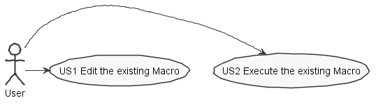
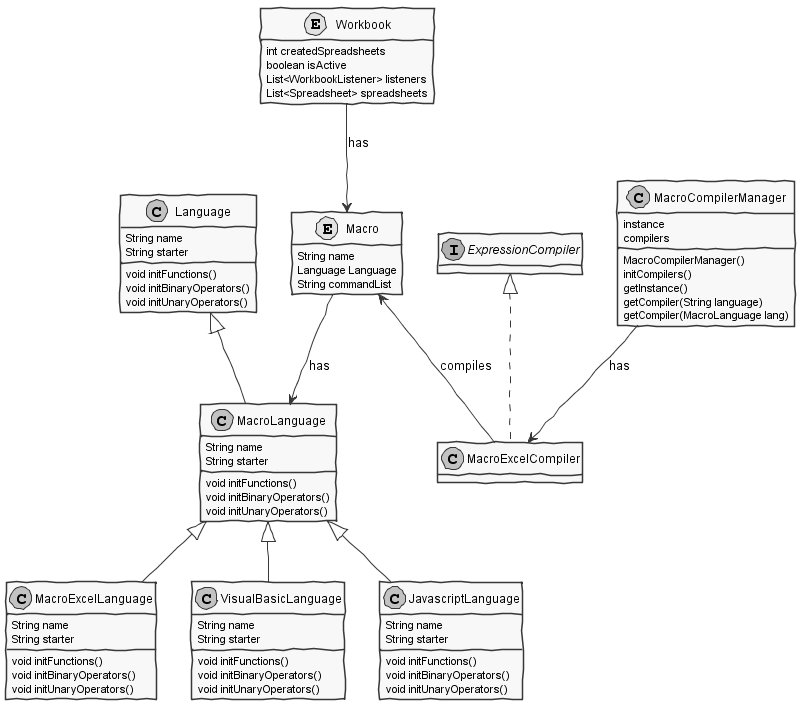
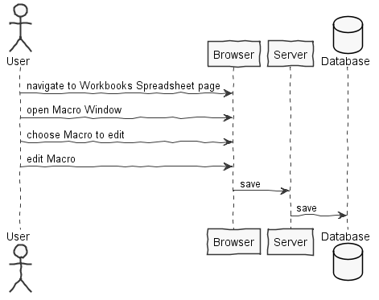
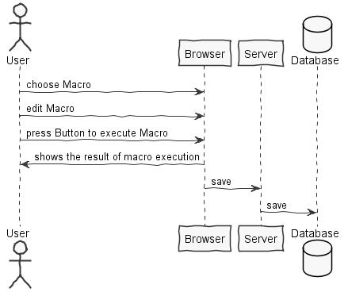
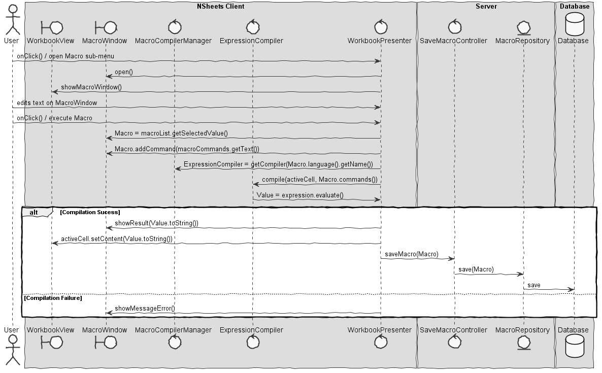
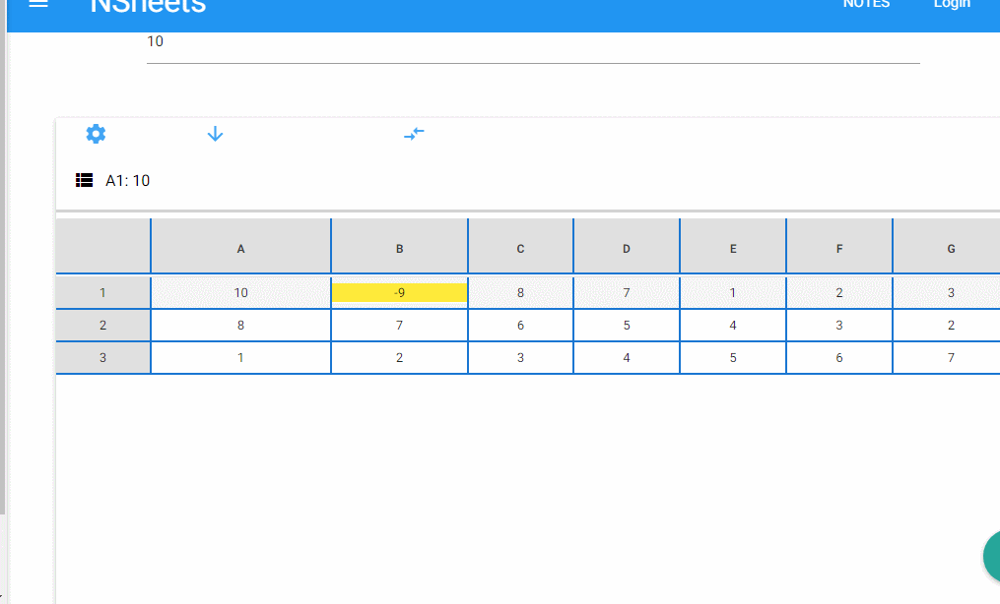

**Pedro Emanuel** (1131485) - Sprint 1 - Lang 06.1
===================================================

# 1. General Notes

This use case has a lot of similarities to the UC Lang 01.1 because of the fact that Lang 01.1 is a grammar for formulas like an excel language. And this UC is the implementation of a Macro that should support this kind of language.

In the construction of User Interface, it was easier and more *user-friendly* to implement a pop window after selecting the cell which to run the Macro and therefore **Lang 07.1 and Lang 08.1** also can use this interface feature, in this case the user can choose what language wants to edit and execute the macro.

Also was added a listbox to print all the Workbook Macro, for the next increment which makes the Workbook support the execution of several Macros.

# 2. Requirements

Lang 06.1 - The application should have a new option to open a window to edit and execute a single macro. Macros should be designed as a complete new language in the application. However, its initial grammar should be very simple and "inspired" in the language of the formulas. In particular, a macro is simply a sequence of formulas that are executed sequentially. The formulas are the same as those used in the cells. Each line of the macro may contain a formula or be a comment. A comment is a line that starts with the character ";". The lines of the macros must support all that is possible to do with the cell formulas that start with "=" (but in the macros the lines can not start with "="). The macro is to be associated with the current workbook. The result of executing a macro is the result of the last executed instruction. The new window should have an area to edit the text of the macro and button to run the macro. The result of the execution of the macro should also appear in the window.

Proposal :

US1 - As a User of the Application, I want to edit an existing one. (For this increment it is impossible to create a new macro, because there can only be one associated to the current workbook)

US2 - As a User of the Application, I want to execute the existing macro and see the result on the window and the chosen cell

# 3. Analysis

For this feature increment, I need to

- Ensure that each line of the macro is a formula or a comment, and only one per line.

- Ensure that a formula on macro start with '=' but a macro should start with '|' (defined by me) and comment ';'

- Make the current workbook know what macro it is going to use

- Validate the syntax of the formulas on the macro
    
    - In case of sucess, run each formula is executed sequentially and the result of the final executed formula

    - In case of failure, warn the user that a error occurred.

## 3.1 Project Structure

**Modules**. From the pom.xml file we can see that the application is composed of 5 modules:  
- **server**. It is the "server part" of the web application.  
- **shared**. It contains code that is shared between the client (i.e., web application) and the server.   
- **nsheets**. It is the web application (i.e., Client).  
- **util**. This is the same module as the one of EAPLI.  
- **framework**. This is the same module as the one of EAPLI. 

For **Lang 06.1** I will be working mostly on the shared module because this feature will be needed for both client and server.
Plus creating User Inferface on nsheets module for the client.

## 3.2 Anaylsis Diagrams

The main idea for the "workflow" of this feature increment.  

**Use Cases**



**Domain Model (for this feature increment)**



- **Domain Model** : To start off a Macro will be associated to a Workbook. This Macro will have a language which will represent a Macro Language. In my use case, in particular, we use a Macro Language implemented based on the Formula like Excel Language use on Lang 01.1. Therefore being named "*MacroExcelLanguage*"

A MacroLanguage can be one of three types *VisualBasic* or *Javascript* or *Excel*, so we have the **MacroCompilerManager** which is a singleton, that from the current language defined will get the correct Compiler that follows the interface *ExpressionCompiler*. 

**System Sequence Diagrams**

**For US1**



**For US2**



# 4. Design


## 4.1 Tests

**Domain Classes**

**Macro :**

**Test:** We should ensure that a Macro can be created when all the attributes are set.

- ensureDefaultName(), ensures that a name is set even if the given name isnt valid

- ensureNameIsSet(), ensures that the name given by the user is valid and the respective attribute set.

**Test:** We should ensure that a Macro has at least "Excel" on language attribute set by default

- ensureDefaultLanguage(), ensures that by default Macro will be set to use MacroExcelLanguage

- ensureChangeLanguage(), confirm that the user can change the Language of the Macro to a valid one by will

**Test :** We should make sure that Macro saves a commands List (that are to be executed in this UC) properly.

- ensureCommandsAreSaved(), makes sure that the commands are saved

**Test :** We should ensure that a Macro can reset its commands.

- ensureThatMacroGetsReset(); makes sure that commands are cleared

## 4.2. Requirements Realization

**For US2**



## 4.3. Classes

First of all, we should talk about **Macro** which is a entity which is a part of a **Workbook**, it has a name defined by the user (unique) and most important it knows what language the user wants to execute, including its syntax to be executed.

By speaking of language, the class **MacroCompilerManager**, which is a singleton, that will help on the moment of execution apply a simple strategy to choose the right compiler depending on the current Macro language.

Finally, in this case particulary, we have **MacroExcelExpressionCompiler** and **MacroExcelEvalVisitor** are important to evalute and compile the syntax which in this UC is only Excel Macro language. (Which was created a new .g4/antlr4 grammar for this purpose)
We cannot speak of the *execution* method without speaking about the *evaluation* process, which is done by **MacroExcelEvalVisitor** that visits each line of the commands to proper analyse if what the User wrote are commands in the correct and expected way depending on the current language (**MacroExcelLanguage**). Therefore, if theres no error found by the *Visitor* we proceed to collect the tokens (keywords to determine which function, formula or comparison is going to be made) which then **MacroExcelExpressionCompiler** will compile and utilizing the functions of the current language. By the end, a result (Value) will returned to be presented to the User and store on the active Cell.

## 4.4. Design Patterns and Best Practices

In this UC theres exist a class named **MacroCompilerManager** which uses the *Singleton* pattern, to always be active and have an extended life time to help choose which Compiler of Macro will be selected to execute on the progress of **US2**, depending on the language selected by the user.

Plus the same class also uses a small feature of the *Strategy* pattern which selects the right compiler to work focusing on the Macro language.

Pattern **Visitor** is the most important to mention because is the second step before creating a grammar and beforing compile. We use in this use case this pattern, to visit expressions from the parse tree(tree created automatically from antlr4 and generated lexer and parser) to properly visit an grammar rule to compile and get the value (result) of such said expression.

# 5. Implementation

As mentioned before, to complete this UC it was required to create a new grammar basic and very similiar to the grammar used on the Formulas feature (**MacroExcel.g4**). Including rules to read sequentiatly more than one line of formulas of Excel but not starting with *=* like the formulas on **Lang 01.1**.

The grammar used is very like the Formulas one but with some changes. Here some of those :

##ANTLR4 Grammar

**Initial rules**

```
macro: line+;

line :  expression;

	         
expression
	: comparison
	;
	
comparison
	: concatenation
		( ( EQ | NEQ | GT | LT | LTEQ | GTEQ ) concatenation )? 
	;
```

**Rule to ignore lines that start with SEMI ";"**


```
SEMI : ';' 
;

/* comment line (ignored) */
LINECOMMENT: SEMI {getCharPositionInLine()==1}? ~[\r\n]* -> channel(HIDDEN);	
//ignores line if it starts with a SEMI ';'

```

##Example of implementation (Trees)

**Macro :**

- Example
- 
FOR{A1:=1;A1<10;A2:=A2+A1;A1:=A1+1}

{A1:=3;2/2;10*9}

sum(A1:A3)

**Gives following tree:**


# 6. Integration/Demonstration



# 7. Final Remarks 

1. When executing a Macro, in most cases there will be more than just one line of formulas to execute. In the end, the result returned only came from last formula to be executed. Maybe a solution is to use Global Variables (that could be possibly hidden) to store the result of previous formulas executed to make the Macro a more viable and effective feature rather than only expecting one formula to work like on **Lang01.1** feature.

# 8. Daily Work Log

Commits :

1. [Started working on some documentation for Pedro Coelho Lang 06.1](https://bitbucket.org/lei-isep/lapr4-18-2dc/commits/db774a6158276335e2e503c972558b1dafa81c99)

2. [Creation of Macro Object](https://bitbucket.org/lei-isep/lapr4-18-2dc/commits/c7d521f89dbb0d1b3ecfb9a751b16dfe0b4c638a)

3. [Creation of User Interface in Workbook page for Macro feature usage](https://bitbucket.org/lei-isep/lapr4-18-2dc/commits/2d9c0a6c847068902e8c4505a99df64e878420a7)

4. [Test for Macro](https://bitbucket.org/lei-isep/lapr4-18-2dc/commits/6757b994768a518a85333ba73af40f40eebe586a)

5. [Development of window for Macros Languages](https://bitbucket.org/lei-isep/lapr4-18-2dc/commits/8c1cc784e7eeb07fce8e1e7fcafc10d15dc2d5a1)

6. [Macro Excel Language and Changes to macro and its test](https://bitbucket.org/lei-isep/lapr4-18-2dc/commits/d88af6cd1117ab5c3434529d018ef9b9be0c3f24)

7. [Created grammar for the Macro that uses Excel like language](https://bitbucket.org/lei-isep/lapr4-18-2dc/commits/2784646107b09f63f95f2aac23689fae1d2dabc4)

8. [Correcting and upgrading grammar for Macro with Excel Language](https://bitbucket.org/lei-isep/lapr4-18-2dc/commits/a46e224733380c44265d0823a23bb2a4d041ad9b)

9. [Created a Vistior for Macro Excel](https://bitbucket.org/lei-isep/lapr4-18-2dc/commits/2f73c9017c3c9294d422ff2748179f2241e6d189)

10. [Created the mockup for the Macro Excel Compiler](https://bitbucket.org/lei-isep/lapr4-18-2dc/commits/e5a6ef12ea0f5302d9bc9b3f0eeee28a94c83272)

11. [Changes on MacroExcelEvalVisitor](https://bitbucket.org/lei-isep/lapr4-18-2dc/commits/fa7b10e472c4921d9b0e5f5fedb028f92accfbde)

**Continue on Sprint 2 **

1. [Implementation of a block of instructions on Macro Excel Language](https://bitbucket.org/lei-isep/lapr4-18-2dc/commits/5a084e595a835978c0f4fe8d60a3e2eb655f3a15)

2. [Final Fixes on the Issue for Lang06.1](https://bitbucket.org/lei-isep/lapr4-18-2dc/commits/6043a08a6fda84aa7a3d2df2dd1d96cebbd427d2)