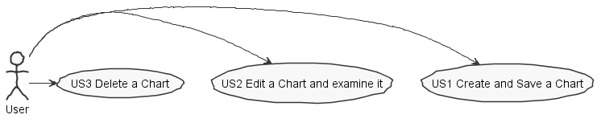
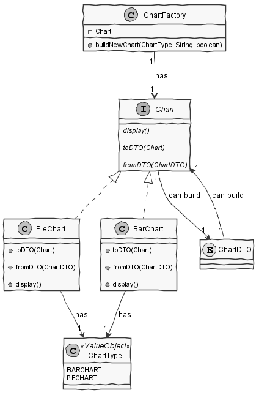
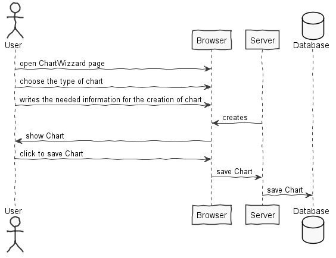
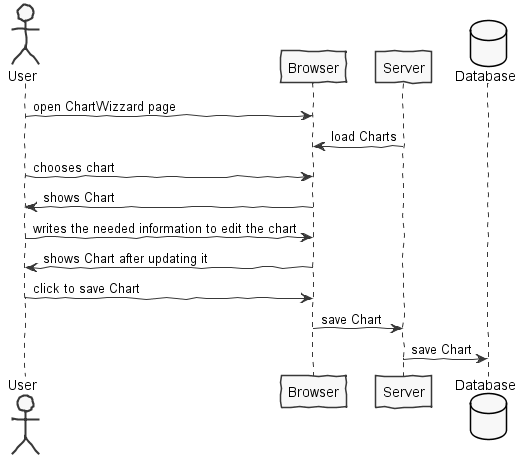
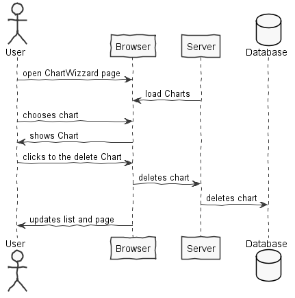
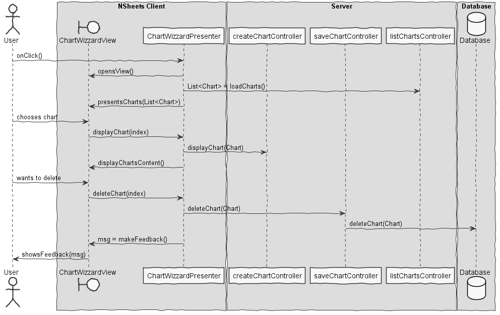
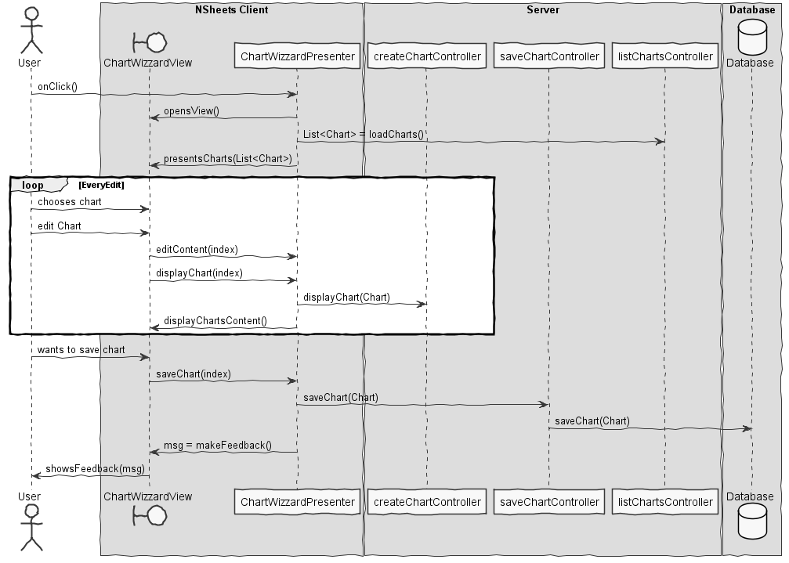

**Pedro Emanuel** (1131485) - Sprint 2 - Core 04.2
===================================================

# 1. General Notes

On this sprint was problematic for a lot of people because of merges and reverts made on the code commited, the final result was a great amount of code being deleted so for the sake of having some **proof of the work made and code examples will use as base the worklog commits which have the some of the code intended to solved this problem**

In terms of personal work, I fixed some issues of the first **increment** work done by my co-worker.In addition I also implemented at least in **the backend** the possibilty to create a *Bar Chart* or a *Pie Chart*, save it on the database while being associated to the cell chosen by the User, in other words some base needs for this use case to be functional.

Bonus note about the teamwork overall (class as a team) :

It is a bit impossible to ensure that work is done properly when you take the risk of losing the work of last day in the blink of an eye.

# 2. Requirements

**[Fixing]** Core 04.1 - The application should have a new menu option to launch a wizard to help the user create a bar chart. The wizard should have 2 steps. In the first step, the user should input the name of the chart and the range of cells that contains the data for the plot of the chart. The user should also select if the data is in the rows or columns of the range and if the first row or the first column are to be considered labels. In the second step the wizard should display a preview of the chart. The wizard should allow the user to move between steps 1 and 2. If the wizard is confirmed the cell in the left upper corner of the range should have a mark (e.g., icon) that indicates that the cell has a chart associated with it. A popup menu option in the cell should provide access to the chart.

Core 04.2 - The previous bar chart can now be configured to display bars side by side or stacked. The application should also support a new type of charts: pie charts. The wizard should now give the user the possibility to select the type of chart. The charts can now be produced using data that is in a different spreadsheet of the workbook. The application should now include a window (or page, or section in a page) that displays the list of existing charts and that can be used to enable/disable the display of each chart as well as give access to the chart wizard so that it is possible to change the existing charts. It should also be possible the delete existing charts using this window.

Proposal :

- **US1**: The user can save a chosen Chart 

- **US2** : The user can edit a chosen Chart and examine it

- **US3** : The user can delete a chosen Chart

# 3. Analysis

For the need to create a Chart which type can be chosen by the User, we need to ensure a common Strategy for the building of such Charts and use it on a context which will make the right type of Chart depending on the user Chart.

In terms of persistence, we need to ensure that a Chart that will be on a chosen Cell for the User to safe keep it


## 3.1 Project Structure

**Modules**. From the pom.xml file we can see that the application is composed of 5 modules:  
- **server**. It is the "server part" of the web application.  
- **shared**. It contains code that is shared between the client (i.e., web application) and the server.   
- **nsheets**. It is the web application (i.e., Client).  
- **util**. This is the same module as the one of EAPLI.  
- **framework**. This is the same module as the one of EAPLI. 
- **bootstrap**. This is the module that fills the database with initial data to help on functional tests.

Most of the time I worked on the module of **server** by following the logic that the server is the only *area* of the application which will have the responsability of saving, deleting or editing charts of the user within the database.

Should have worked on the package of **nsheets** to ensure that the front end uses the data given by the server on the charts and draw so the user can be examine its data.

Finally, prepared some data to fill the specific tables needed to test some of the features of this use case by preparing the bootstrap module for this purpose.

**Note**: All packages created for this purpose have the prefix *pt.isep.nsheets.server.lapr4.blue.s2.core.n1131485* and all classes have the *author* as ***PedroEmanuelCoelho*** 1131485@isep.ipp.pt

## 3.2 Anaylsis Diagrams

The main idea for the "workflow" of this feature increment.  

**Use Cases**



**Domain Model (for this feature increment)**



##Explanation

On a first view of the problem in terms of *design* we can conclude that there will be more than one type of charts built and displayed. So we implement a **Factory** to handle with complexity behind *with Chart building* (context) while using a Strategy to ensure the right choice on this matter.

In other note, we also need to have some way to know what types of Chart therefore we have an interface **Chart** so we can make sure that the most important specifics are built within every chart. Like the range of Rows and Columns with a method to the Chart **display** itself.

By the fact, of having a factory executing a strategy for creating various types of charts, for this case and for the future it was logically to create DTO generalized for Charts saving important data like the type, name and content to be used as a object template to save on the database and be converted back when needed to right object for domain´s logic. 

**ChartDTO**

```
@Embeddable
public class ChartDTO implements Serializable, IsSerializable{

    @Column(name="char_content")
    private String[][] content;
    @Column(name="char_name")
    private String name;
    @Column(name="chart_type")
    private String type;
    private boolean isRowlabel;
    @Column(name="chart_firstCell")
    private String firstCell;
    @Column(name="chart_lastCell")
    private String lastCell;
    @Column(name="chart_label")
    private String labelName;

    //Blank construtor just because
    public ChartDTO() {
        this.content = null;
        this.name = "";
        this.type = "";
        this.firstCell = "";
        this.lastCell = "";
        this.labelName = "";
        this.isRowlabel = false;
    }

    //FULL CONSTRUCT
    public ChartDTO(Address a1, Address a2, String name, String type, String[][] content, boolean boo, String labelName) {
        
        this.type = type;
        this.name = name;
        this.content = content;
        this.isRowlabel = boo;
        this.labelName = labelName;
    }

    public String[][] content() {

        return this.content;
    }

    public String name() {

        return this.name;
    }

    public String type() {

        return this.type;
    }
    
    public String firstCell() {
        
        return this.firstCell;
    }
    
    public String lastCell() {
        
        return this.lastCell;
    }
    
    public boolean label() {
        
        return this.isRowlabel;
    }

    @Override
    public boolean equals(Object other) {

        boolean ret = false;
        if (other instanceof ChartDTO) {
            ChartDTO c = (ChartDTO)other;
            
            if (this.name.compareTo(c.name()) == 0) {
                ret = true;
            }
        }
        
        return ret;
    }

    
    public String labelName() {
        
        return this.labelName;
    }
}
```

**System Sequence Diagrams**

**For US1**



**For US2**



**For US3**



# 4. Design


## 4.1 Tests

For this particular case, I did two types of tests : *Unit tests* and *Functional Tests*

To start off

### Unit Test

**Test** : *ensure that a Bar Chart is displayed*

```
 /**
     * Test of display method, of class createChartController. For a barChart
     */
    @Test
    public void ensureDisplayBarChart() {
        System.out.println("ensureDisplayBarChart");
        String type = "BARCHART";
        String name = "BARCHART";
        boolean wantsRowLabel = true;
        Workbook wb1;
        Address a1 = new Address(1, 1);
        Address a2 = new Address(3, 1);
        //String titleSP = "SpreadSHT";
        //  SpreadsheetImpl(Workbook workbook, String title, String[][] content)
        //SpreadsheetImpl sp = new SpreadsheetImpl();
        try {

            //creating content ...
            String contents[][] = {// first spreadsheet
                {"10", "-9", "8", "7", "1", "2", "3"}, {"8", "7", "6", "5", "4", "3", "2"},
                {"1", "2", "3", "4", "5", "6", "7"}};

            String expResult[][] = {
                {"7", "6", "5"}};
            
            wb1 = new Workbook(contents);
            assertNotNull(wb1);

            Spreadsheet sh = wb1.getSpreadsheet(0);

//            System.out.println("\n\n====================CONTENT================\n");
//            for (int r = 0; r < 3; r++) {
//                for (int c = 0; c < 7; c++) {
//                    System.out.println(contents[r][c]);
//                }
//            }

            assertNotNull(wb1);

            ChartType cT = ChartType.BARCHART;

            createChartController instance = new createChartController();
          
            Chart c = instance.createChart(type, name, wantsRowLabel);
            if (c instanceof BarChart) {
                BarChart bc = (BarChart) c;
//                System.out.println("Is Barchart!");
                cT = bc.Type();
            }
//            assertEquals(wb1.getSpreadsheet(0).getRowCount(), 3);
//            System.out.println("Rows confirmed");
//            assertEquals(wb1.getSpreadsheet(0).getColumnCount(), 7);
//            System.out.println("Columns confirmed");
//            assertEquals(cT, ChartType.BARCHART);
            SpreadsheetImpl sp = (SpreadsheetImpl) sh;
//            assertNotNull(sp);
//            System.out.println("sp not null");
            String[][] result = instance.display((Chart) c, a1, a2, sp);
            assertArrayEquals(expResult, result);
//            System.out.println("Test runned with sucess");
//            System.out.println("\n====================CONTENT================\n");
//            for (int r = 0; r < 1; r++) {
//                for (int l = 0; l < 3; l++) {
//                    System.out.println(expResult[r][l]);
//                }
//            }

        } catch (Exception e) {
            System.out.println("Oops! What happened?  " + e.getClass().toString() +   " Answer : " + e.getMessage() + "\n");
        }
    }

}

```

**Test** : *ensure that a Pie Chart is displayed*

```

/**
     * Test of display method, of class createChartController. For a pieChart
     */
    @Test
    public void ensureDisplayPieChart() {
        System.out.println("ensureDisplayPieChart");
        String type = "PIECHART";
        String name = "PIECHART";
        boolean wantsRowLabel = true;
        Workbook wb1;
        Address a1 = new Address(0, 2);
        Address a2 = new Address(3, 2);
        try {

            //creating content ...
            String contents[][] = {// first spreadsheet
                {"10", "-9", "8", "7", "1", "2", "3"}, {"8", "7", "6", "5", "4", "3", "2"},
                {"1", "2", "3", "4", "5", "6", "7"}};

            String expResult[][] = {
                {"1", "2", "3", "4"}};
            
            wb1 = new Workbook(contents);
            assertNotNull(wb1);

            Spreadsheet sh = wb1.getSpreadsheet(0);

//            System.out.println("\n\n====================CONTENT================\n");
//            for (int r = 0; r < 3; r++) {
//                for (int c = 0; c < 7; c++) {
//                    System.out.println(contents[r][c]);
//                }
//            }

            assertNotNull(wb1);

            ChartType cT = ChartType.PIECHART;

            createChartController instance = new createChartController();
          
            Chart c = instance.createChart(type, name, wantsRowLabel);
            if (c instanceof PieChart) {
                PieChart bc = (PieChart) c;
//                System.out.println("Is Piechart!");
                cT = bc.Type();
            }
            assertEquals(wb1.getSpreadsheet(0).getRowCount(), 3);
//            System.out.println("Rows confirmed");
            assertEquals(wb1.getSpreadsheet(0).getColumnCount(), 7);
//            System.out.println("Columns confirmed");
            assertEquals(cT, ChartType.PIECHART);
            SpreadsheetImpl sp = (SpreadsheetImpl) sh;
//            assertNotNull(sp);
//            System.out.println("sp not null");
            String[][] result = instance.display((Chart) c, a1, a2, sp);
            assertArrayEquals(expResult, result);
            System.out.println("Test runned with sucess");
//            System.out.println("\n====================CONTENT================\n");
//            for (int r = 0; r < 1; r++) {
//                for (int l = 0; l < 4; l++) {
//                    System.out.println(expResult[r][l]);
//                }
//            }

        } catch (IndexOutOfBoundsException e) {
            System.out.println("Oops! What happened?  " + e.getClass().toString() +   " Answer : " + e.getMessage() + "\n");
        }
    }

```

##Functional Test on persistence (Bootstrappers)

Follows the saving chart test on bootstrapper


```
public class ChartDTOBootstrapper implements Action {

    @Override
    public boolean execute() {

        ChartDTO dto1 = createEntity("CHART001", "BARCHART");

        ChartDTO dto2 = createEntity("CHART002", "PIECHART");

        if (registerChart(dto1)) {
            System.out.println("1 saved");
        } else {
            System.out.println("1 failed");
        }

        if (registerChart(dto2)) {
            System.out.println("2 saved");
        } else {
            System.out.println("2 failed");
        }

        return true;
    }

    private ChartDTO createEntity(String name, String type) {

        ChartDTO dto = null;

        Address a1 = new Address(1, 1);
        Address a2 = new Address(3, 1);

        createChartController ctrl = new createChartController();

        String contents[][] = {// first spreadsheet
            {"10", "-9", "8", "7", "1", "2", "3"}, {"8", "7", "6", "5", "4", "3", "2"},
            {"1", "2", "3", "4", "5", "6", "7"}};

        Workbook wb1 = new Workbook(contents);

        Spreadsheet sh = wb1.getSpreadsheet(0);

        SpreadsheetImpl sp = (SpreadsheetImpl) sh;

        Chart c = ctrl.createChart(type, name, true);

        ctrl.display((Chart) c, a1, a2, sp);

        dto = c.toDTO(c);

        return dto;
    }

    private boolean registerChart(ChartDTO dto) {
        boolean flag = false;

        try {
            ChartDTO tempDTO = PersistenceContext.repositories().charts().save(dto);

            if (tempDTO.equals(dto)) {

                flag = true;
            }
        } catch (DataConcurrencyException | DataIntegrityViolationException e) {
            System.out.println("Exception : " + e.getMessage());
        }

        return flag;
    }

}

```

## 4.2. Requirements Realization

**For US1**



**For US2**



**For US3**


## 4.3. Classes

The Domain classes consist on BarChart which is the class which represents a BarChar and PieChart class for PieChart representing.

They both use the generalized strategy *Chart* which they implement from this abstract class.

We have a ChartFactory that will handle the complexity of choosing the right object for the type given by the user to build.
In other words, if the User decides to create a BarChart the Factory and the Factory alone will know what to do and return such item for the User, as well as the PieChart.

This types of charts are defined in a ValueObject named ChartType which is a simple enumeration with all currently avaliable Charts types.

On the application side of the application of this use case, we need to have a Controller with the single responsabilty of listing all the needed charts from the servers database.

A controller that will save a single chart each time  on the database, another which will delete a single chart from the database by the will of the user.

Finally we will have a Controller to use the ChartFactory to build the necessary Chart and prepare it to be display it on the User Interface. In this situation we prevent any acess between the UI and the domain as intended while using the Controller pattern.


## 4.4. Design Patterns and Best Practices

- *Strategy*

- *Controller*

- *Factory*

- *SingleResponsibitly*

- *DTO*


# 5. Implementation

Like mentioned before for the second increment of this use case, we need to have prepare some kind of strategy to generalize the building and behaviour of the Charts. A Factory to handle the complexity of building the Chart type request by the user while following the strategy for the chart itself

# 6. Integration/Demonstration


#7. Final Remarks

In my opinion the work done here isnt enough to say that this feature is completed for deploy. In my opinion this use case should be re-implemented. Plus the base done by me, in addition with the commits done in the worklog, is a good starter to ensure the next person won´t have much trouble finish the job.

# 8. Daily Work Log

Commits :

1. [First ideias on documentation](https://bitbucket.org/lei-isep/lapr4-18-2dc/commits/838d3f1adddf3444f4e8f69b936fdc5140d4e5ae)

2. [Strategy for ChartFactory](https://bitbucket.org/lei-isep/lapr4-18-2dc/commits/a85359b7c2b4e3f24dba0583f2e4a9f2d51f419f)

3. [Preparing for implementation of BarChart](https://bitbucket.org/lei-isep/lapr4-18-2dc/commits/5d1494da50f9caa1e567bbd1496c49ef23fa4aed)

4. [Changes to PieChart. Minor changes to all charts. First implementation of Factory on Controller](https://bitbucket.org/lei-isep/lapr4-18-2dc/commits/7f45b8f1bb0194bf25313f10ac13b14b910e5f7d)

5. [Implementation of createChartController](https://bitbucket.org/lei-isep/lapr4-18-2dc/commits/57802a50c3811721848ecc00dcb61cfc83f43f0b)

6. [Corrections on BarChart class and domain. Done JUnit test for creation of a BarChart](https://bitbucket.org/lei-isep/lapr4-18-2dc/commits/8a4a5356d13d10c9acc4f2d371339065c7472840)

7. [Making ChartDTO Embeddable fixing persistence and some addition to return chart of cell](https://bitbucket.org/lei-isep/lapr4-18-2dc/commits/cb4cf5a1b4c9e6451bc1736300ac6c88608c2ba4)

8. [Changes on ChartDTO](https://bitbucket.org/lei-isep/lapr4-18-2dc/commits/8d7dea04e5e4dc4b50ef5578f9443aeda9a0c005)

9. [Preparing all the things needed to save a Chart inside a Cell](https://bitbucket.org/lei-isep/lapr4-18-2dc/commits/4e74244e64df608544a83e9e97f6449b9a565950)

10. [Charts can be persisted embedded on Cells. Tested via Bootstrap](https://bitbucket.org/lei-isep/lapr4-18-2dc/commits/2f219dd5aa6c6ff1d0378e580aaa1ec5788b4045)

11. [Now multiple charts can be saved within a Cell. Fixes on various foreign classes](https://bitbucket.org/lei-isep/lapr4-18-2dc/commits/c6903c7e67d223f87f1d109307dc9fdd8d14c745)

12. [Fixes on persistence. Charts now have a relation Many-to-One with Cells + Refractoring. Some test via bootstrap. More fixing in progress ...](https://bitbucket.org/lei-isep/lapr4-18-2dc/commits/b73978ea24da1ee7b84e28dae30e06ce3b569aea)

13. [Save Chart Controller. Saving charts in persistence.Bootstrap tested](https://bitbucket.org/lei-isep/lapr4-18-2dc/commits/6f8fbd190a874391bc10ac45bfc0a7a969938343)

1. [Final commit with documentation](https://bitbucket.org/lei-isep/lapr4-18-2dc/commits/959730ff9228d872dccba9ef95f626b93e623d69)