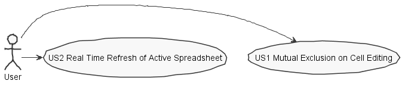
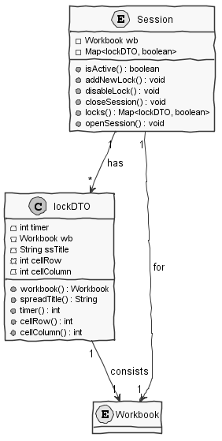
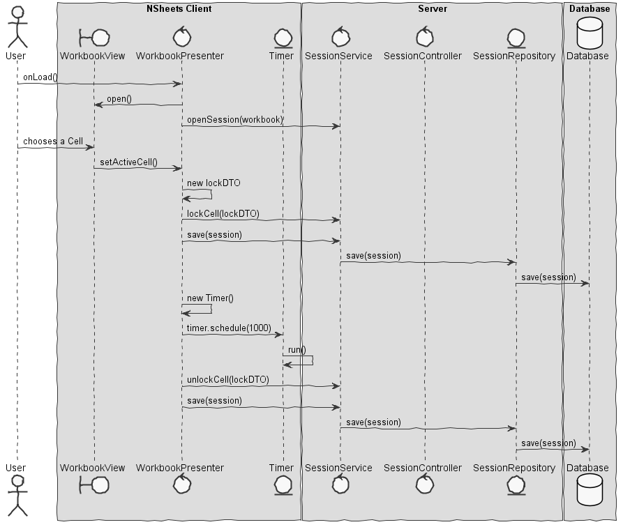
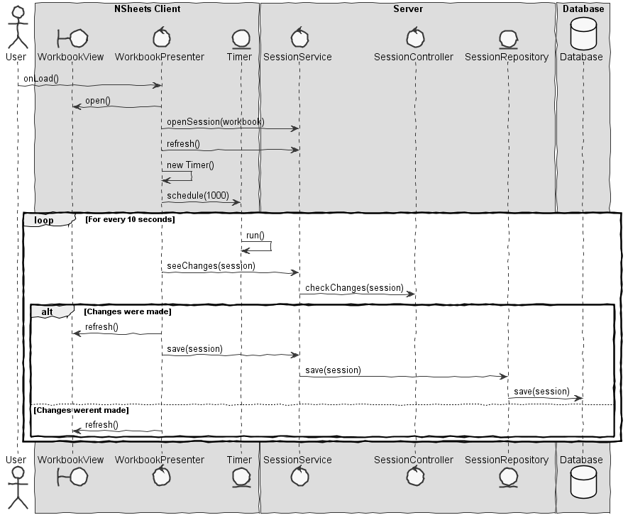

**Pedro Emanuel** (1131485) - Sprint 3 - IPC 07.1
===================================================

# 1. General Notes

First of all I would like to thank my team for the wonderfull work done this week and by their dedication. Also had some help from co-worker *1090657@isep.ipp.pt* understading the logic to follow up in the implementation of this feature.

I chose this use case to challenge myself although it was only the first increment. Since no other team before us (blue) had the work on this Use Case.

Although not complete, it was used mechanisms like asynchronous methods or services to keep the connection between the server and the client constantly.

In the anaylsis of the requirements, it was concluded that the best way to make this feature 100% functional. Important was to lock a editing cell for a certain period time, to prevent a forgetful user ruining the others progress within the spreadsheet.

Although, the application has the concept of shared and private Workbook in this sprint but the first increment was done for the sprint1 it was assumed that it only existed public workbooks. Therefore, we created the concept of WorkbookSession (class **Session**) which represents a session when a workbook has been opened to edit and closed when leaving the workbook page. One opened session per workbook, if two or more users are editing the same workbook the data of the session will re-written the times necessary while not creating new data entries for each user session, to keep the edit concurrent like its requested.

# 2. Requirements

Concurrent editions of the same Workbook should be possible and the website should update the workbook "as much as possible" in realtime. 

Proposal :

- US1 : User can edit Cell only when there´s no other user editing the same cell. In case of another user is being editing the same cell in that moment, the edition of the cell is blocked for the last user to click on the cell but for a short period of time

- US2 : Page should display updates "**as much as possible**" (done for 10 secs intervals)
 
# 3. Analysis


## 3.1 Project Structure

**Modules**. From the pom.xml file we can see that the application is composed of 5 modules:  
- **server**. It is the "server part" of the web application.  
- **shared**. It contains code that is shared between the client (i.e., web application) and the server.   
- **nsheets**. It is the web application (i.e., Client).  
- **util**. This is the same module as the one of EAPLI.  
- **framework**. This is the same module as the one of EAPLI. 
- **bootstrap**. This is the module that fills the database with initial data to help on functional tests.

Much of the work of this uc increment will be focused on the server therefore on the module **server**, special the domain and application layers.
The rest of the work was implement within the package **shared**, specifically the abstract classes for the Service created for the workbook Session 
Although also worked on **nsheets** module which is the side of the client, for the inter-comunication between the front-end and back-end of the application but also to control some aspects of the UI and make some kind of feedback.

**Packages** created will be have the prefix pt.isep.server.lapr4.blue.s3.ipc.n1131485*


## 3.2 Anaylsis Diagrams

The main idea for the "workflow" of this feature increment.  

**Use Cases**



**Domain Model (for this feature increment)**



##Explanation

The domain consist of just two classes, one of the them being **Data Transfer Object** as sugested just to transfer specific and need data from the application to the current persistence, the name of the class is **lockDTO**, having valuable data like the cell blocked of a certain spreadsheet beloging to a certain workbook.

While being a DataTransferObject, it also its a member of the entity **Session** which represents a session related to a public Workbook, having various mapped locks with valuable data from cells and a *boolean* to represent if the lock is currently active or not.

**System Sequence Diagrams**

**For US1**



**For US2**



# 4. Design


## 4.1 Tests

### Unit Tests

**Session**

```
package pt.isep.nsheets.server.lapr4.blue.s3.ipc.n1131485.domain;

import org.junit.*;
import pt.isep.nsheets.shared.core.Workbook;
import pt.isep.nsheets.shared.lapr4.blue.s3.ipc.n1131485.dto.lockDTO;

import static org.junit.Assert.*;

public class SessionTest {

    /**
     * Main instance for the tests
     */
    private Session instance;

    public SessionTest() {
    }

    @BeforeClass
    public static void setUpClass() {
    }

    @AfterClass
    public static void tearDownClass() {
    }

    @Before
    public void setUp() {
    }

    @After
    public void tearDown() {
    }

    /**
     * Method to ensure creation of Session
     */
    @Test
    public void ensureSessionBuilt() {
        System.out.println("ensureSessionBuilt");
        Workbook wb1 = new Workbook();
        this.instance = new Session(wb1);
        assertNotNull(this.instance);
       assertTrue(this.instance.equals(this.instance));
    }

    /**
     * test to ensure the session is active by start
     */
    @Test
    public void isActive() {
        //because session was just created , session by default is active
        System.out.println("isActive");

        Workbook wb1 = new Workbook();
        this.instance = new Session(wb1);
        assertTrue(this.instance.isActive());
    }

    /**
     * test to ensure that locks are being added to session
     */
    @Test
    public void addNewLock() {
        System.out.println("addNewLock");
        int cellRow = 0;
        int cellColumn = 0;

        Workbook wb1 = new Workbook();
        this.instance = new Session(wb1);
        lockDTO dto = new lockDTO(wb1, "title", cellRow, cellColumn);
        this.instance.addNewLock(dto);
        assertEquals(1,this.instance.locks().size());

    }

    /**
     * test to ensure that the session is closed
     */
    @Test
    public void closeSession() {
        System.out.println("closeSession");
        Workbook wb1 = new Workbook();
        this.instance = new Session(wb1);
        this.instance.closeSession();
        assertFalse(this.instance.isActive());

    }

    /**
     * ensure that a lock is disabled
     */
    @Test
    public void disableLock() {
        System.out.println("disableLock");
        int cellRow = 0;
        int cellColumn = 0;
        Workbook wb1 = new Workbook();
        this.instance = new Session(wb1);
        lockDTO dto = new lockDTO(wb1, "title", cellRow, cellColumn);
        this.instance.addNewLock(dto);
        this.instance.disableLock(dto);
        assertFalse(this.instance.locks().get(dto));
    }
}

```

**lockDTO**


```

package pt.isep.nsheets.shared.lapr4.blue.s3.ipc.n1131485.dto;

import org.junit.*;
import pt.isep.nsheets.shared.core.Address;
import pt.isep.nsheets.shared.core.Workbook;

import static org.junit.Assert.*;

public class lockDTOTest {

    /**
     * Main instance for the tests
     */
    private static lockDTO instance;

    public lockDTOTest() {
    }

    @BeforeClass
    public static void setUpClass() {
    }

    @AfterClass
    public static void tearDownClass() {
    }

    @Before
    public void setUp() {
    }

    @After
    public void tearDown() {
    }

    /**
     * Ensure that a well built dto is created
     */
    @Test
    public void ensureDTOIsValid() {

        System.out.println("ensureDTOIsValid");
        Workbook wb1 = new Workbook();
        int cellRow = 0;
        int cellColumn = 0;
        this.instance = new lockDTO(wb1, "title", cellRow, cellColumn);
        assertNotNull(instance);
        assertTrue(instance.equals(instance));
    }


    /**
     * Check if returns the right cell, comparision by address
     */
    @Test
    public void ensureCorrectCell() {

        System.out.println("ensureCorrectCell");
        Address expResult = new Address(0,0);
        Address result = new Address(instance.cellColumn(),instance.cellRow());
        assertEquals(expResult, result);
    }

    /**
     * Check if returns the correct spreadsheet
     */
    @Test
    public void ensureCorrectSpreadsheet()  {
        System.out.println("ensureCorrectSpreadsheet");
        String expResult = "title";
        String result = instance.spreadTitile();
        assertEquals(expResult, result);
    }

    /**
     * Test timer which is a constant
     */
    @Test
    public void ensureTimerSet() {

        System.out.println("ensureTimerSet");
        assertEquals(10, instance.timer());
    }

    /**
     * Ensure that equals fails when comparing different lockDTO´s
     */
    @Test
    public void ensureEqualsFalse() {

        System.out.println("ensureEqualsFalse");
        Workbook wb = new Workbook();
        lockDTO lo1 = new lockDTO(wb,"title",1,0);
        assertFalse(instance.equals(lo1));
    }

    /**
     * Ensure that a lock with the same cell is equal to this one , while using the methd equals
     */
    @Test
    public void ensureEqualsTrue() {

        System.out.println("ensureEqualsTrue");
        Workbook wb = new Workbook();
        lockDTO lo2 = new lockDTO(wb,"title",0,0);
        assertTrue(instance.equals(lo2));
    }
}

```

## 4.2. Requirements Realization

The requirements are not 100% implemented, first of all the Workbooks as they are is already possible mutual exclusion because the public workbooks are connect to the users and each user has one workbook and even if the workbook is public, each user has a clone of that suposed workbook. Because we are so late in the "*game*", I didnt want change this logic because it could ruin a lot features and new work that was being implemented by my teammates and the other teams.

The perfect scenario would be that one public workbook could be acessed by any User (no need to a user know public workbooks), therefore with the **Session** object mentioned before which represents the session of a public workbook and it will have the locks done in cells independent of the current user or users change its content. This is how we have done the mutual exclusion on the edition of a cell in a perfect scenario.

Plus with some dificulties and personal events I couldnt prepare a perfect service to handle all the things with the Workbook Session but it was created a good base for a asynchronous service for the communication of the server and to help on mutual exclusion and real time refresh as required on this use case.

## 4.3. Classes

As shown in the **Domain Diagram** above in section ***3.2***, we use a Data Transfer Object to transfer data about the locks of a certain Workbook into the section, this object named **lockDTO**, the object that represents a public Workbook session named **Session** has all the created locks of cells and unlocks information to sync the locks within certain cells to prevent corrupted data or info, therefore using mutual exclusion.

Proceeding to the server side we have the **SessionService** interface and **SessionServiceAsync** interface which are the same code but one has asynchronous running while the other doesnt.

Since they are *abstract* classes, it was created the **concrete** class **SessionServiceImpl** which is the *implementation* of these interface to handle all the Session commands within the server.

Last but not least, in the application layer of the **server** we created the **SessionController** to do the *complex* part of the Session *business rules* ,while procteting UI and domain dependencies, in the some kind particing the Façade pattern in this case.

## 4.4. Design Patterns and Best Practices

- **DTO**

- **Façade**

# 5. Implementation

On the client side, even if this is a *Java* based application we are using a framework from Google known as *GWT* which the main responsability is to "*transform* the java code (client side) into javascript so this application can be support in web format but this represents a slight problem. Javascript isnt a multi-thread programming language or compiler so we cant use mutexs or monitors on Java. 

So I opted to implement a Timer from the GWT framework to constantly refresh the webpage and change its content if necessary while also making the cell lock not permanent which could cause various major conflicts with the server itself, so it was implemented a timer as well to prevent this case scenario but also keeping mutual exclusion on the acess of the cell.

# 6. Integration/Demonstration


#7. Final Remarks

Since this is the last week of LAPR4, we won´t continue of the work in this project and because this is the first increment of this UC done in the last week, it wont be fully completed.

Next increment requires the Users should be identified when editing some cells to other Users using the same public Workbook.

In my opinion the logic in this case is the same as used by myself in the previous increment, with some additions like now the **lockDTO** also saves the email of the user and somehow with GWT presenter to all the users by who was the last edit on the cell done.

# 8. Commit Work Log

**Most relevant commits done**

1. [Preparing lockDTO to represent a locked Cell on editing of a public Workbook](https://bitbucket.org/lei-isep/lapr4-18-2dc/commits/f5b43f05a1441adb119d06f7fa8a9d03f9f92d38)

2. [Preparing entity Session which represents a open session of certain public Workbook](https://bitbucket.org/lei-isep/lapr4-18-2dc/commits/e28a3829f563d51a1bc10c4ca5287936e60b0bc6)

3. [Additions on domain](https://bitbucket.org/lei-isep/lapr4-18-2dc/commits/c7bd8ad6bca098ad8edf6af5d999d02dd1d52656)

4. [Unit tests for lockDTO](https://bitbucket.org/lei-isep/lapr4-18-2dc/commits/6b93e44f0fc0f77256ff3dd199255785493b8c59)

5. [Public Workbook Sessions are persisted](https://bitbucket.org/lei-isep/lapr4-18-2dc/commits/1242411d82c3f7010b0ff27ca6cb91a8d1fad49e)

6. [First steps on the implementation of Services](https://bitbucket.org/lei-isep/lapr4-18-2dc/commits/27ad536c4c55a1c2a0973c3b731568b9075574cc)

1. [Using timers for the mutual exclusion of cell edition on spreadheet](https://bitbucket.org/lei-isep/lapr4-18-2dc/commits/fa52f071799278933e01c4c4ef57f2b6948f649b)

8. [Documentation](https://bitbucket.org/lei-isep/lapr4-18-2dc/commits/d018cce6fd0a5c6f9532808176b14527b893dff5)