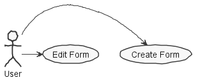

**Rui Ribeiro** (1150344) - Sprint 1 - Lang05.1
===============================

# 1. General Notes

Since this use case requires an UI implementation regarding a new framework that i've never used, persistence implementation and some dynamic programming i wasn't able to fully complete my use case.

# 2. Requirements

*In this section you should describe the requirements for this sprint.*

Lang05.1 - The application should have a new option to launch a window for editing a form. A Form is a window that is designed by the end user and is used for interacting with the user (input and output). The new window should support the creation and testing of a Form. Forms should be very simple. A Form should be composed of rows, each row can be empty or have one or two visual widgets. The supported visual widgets are: button (to invoke actions); edit box (to enter data) and static text box (to display data). It should be possible to set the core properties of these widgets (like the text to display in a static text box, for instance). In the edit form window it should be possible to: add a new row; remove an existing row; edit an existing row; "play" the form and close the edit form window. The "play" button is for testing the appearance of a form during its design (see example in the next Figure). At the moment it is only required to support a single Form for each workbook. Macros and formulas should have a new function that can be used to display the form of the current workbook. Forms should have an icon or button to close the form. When the form is closed the function (in macros or formulas) who call it returns.

# 3. Analysis

*In this section you should describe the study/analysis/research you developed in order to design a solution.*

For this feature increment, since it is the first one to be developed in a new project I need to:  

- Understand how the application works and also understand the key aspects of GWT, since it is the main technology behind the application  

- Understand how the Workbook page works so that there can be created a link between a form and a workbook

- Understand how to integrate a dynamic form into a web UI using GWT and persist it

## 3.1 GWT and Project Structure

**Modules**. From the pom.xml file we can see that the application is composed of 5 modules:  
- **server**. It is the "server part" of the web application.  
- **shared**. It contains code that is shared between the client (i.e., web application) and the server.   
- **nsheets**. It is the web application (i.e., Client).  
- **util**. This is the same module as the one of EAPLI.  
- **framework**. This is the same module as the one of EAPLI.   

In the server module is where the persistence has to be implemented and the controller so that a connection between the user's browser and the actual data (for example, to load or save data).

In the shared module is where the services are implemented and where GWT interact with the backend server. Through GWT RPC framework, it transparently makes calls to Java servlets and lets GWT take care of low-level details like object serialization.

In the nsheets module is where the UI is implemented, the user visualization and actions.

## 3.2 Form Startup and GWTP

As described before the entry point for the application is the class **pt.isep.nsheets.client.gin.ClientModule**.

GWTP follows the MVP (Model-View-Presenter) pattern. It uses [GIN dependency injection](http://dev.arcbees.com/gwtp/core/presenters/gin-bindings.html) to put together the parts of each MVP. How the GWTP structures the application and uses GIN to bind all the required elements is described in [GWTP Beginner's Tutorial](http://dev.arcbees.com/gwtp/tutorials/index.html).
Following the MVP (Model-View-Presenter) pattern, the following was implemented:

The **ApplicationModule** module install all the other modules of the application:
      ...
	    install(new FormModule());
      ...

Since nothing is shared between the Presenter and the View, noting was implemented in the View interface:

  public class FormPresenter extends Presenter<FormPresenter.MyView, FormPresenter.MyProxy> {
	   interface MyView extends View {
     }
  }

In the case of the Form module we can see that there is a FormView.ui.xml. This file declares some widgets. The attribute ui:field was used to specify an id that was then used to bind that element to a class in the code. For instance, in FormView.ui.xml i used the following:

  @UiField
	HTMLPanel window;

  @UiField
  MaterialTextBox labelTextBox, textAreaBox, buttonBox;

  @UiField(provided = true)
	FlexTable formTable;

Then we can use this instances to access the widgets link in (for example):

    @UiHandler("addRowButton")
    void addRowClick(ClickEvent event) {
      addRow(formTable);
    }

    private void addRow(FlexTable form) {
		int numRows = form.getRowCount();
		form.setText(numRows, 0, "");
		form.setText(numRows, 1, "");
		form.insertRow(numRows);
	}

In this case, this method will use the ui:field for the "addRowButton" and the "formTable".

The UiField with the annotation "(provided=true)" makes it possible to initialize the FlexTable before it gets bound by the UiBinder.

## 3.3 Server and RPC

The Form page should display what seems to be a Form that should reside in the server.

In the method **onReveal** the Home presenter invokes a WorkbookService asynchronously. It uses the base communication mechanism of GWT called [GWT RPC](http://www.gwtproject.org/doc/latest/tutorial/RPC.html).

Basically, it requires the definition of an interface for the service. In this case:

	@RemoteServiceRelativePath("formService")
	public interface FormService extends RemoteService {
    FormDTO getForm();
	}

When an RPC is invoked since it is always executed asynchronously we have to prove a callback:

	// Make the call to the stock price service.
	formSvc.getForm(callback);

The callback is simple a class that provides two methods, one for a successful result and the other for a failure:

	// Set up the callback object.
	AsyncCallback<FormDTO> callback = new AsyncCallback<FormDTO>() {
		public void onFailure(Throwable caught) {
			// TODO: Do something with errors.
		}
		public void onSuccess(ArrayList<FormDTO> result) {
			refreshView(result);
		}
	};

Since the interface is code that must be accessed by both server and client code it should reside in the **shared** project.

The interface must be implemented in the **server**. The implementation can be very simple, like the one presented in the project. In this case the server simply returns always the same objects:

	@Override
	public FormDTO getForm() {
	    FormDTO form = new FormDTO("Form1");
	    return form;
	}

Since the service is a servlet it must be declared in the **web.xml** file of the project (see file nsheets/src/main/webapp/WEB-INF/web.xml).

	<!-- Servlets for the form -->
	<servlet>
		<servlet-name>formsServiceServlet</servlet-name>
		<servlet-class>pt.isep.nsheets.server.services.FormsServiceImpl</servlet-class>
	</servlet>
	<servlet-mapping>
		<servlet-name>formsServiceServlet</servlet-name>
		<url-pattern>/nsheets/formsService</url-pattern>
	</servlet-mapping>

## 3.4 Analysis Diagrams

The main idea for the "workflow" of this feature increment.

Create or Edit a form

**Domain Model (for this feature increment)**

- **Domain Model**. Since the only requirement to save is the Form name for future implementations and the widgets that the form contains, it was used a string for the title and an HashMap to place the Widgets at declared Cells of the the table.

**System Sequence Diagrams**

**For Edit Form**

**For Create Form**

# 4. Design

## 4.1. Tests

*In this section you should describe the design of the tests that, as much as possibe, cover the requirements of the sprint.*

Regarding tests we try to follow an approach inspired by test driven development. However it is not realistic to apply it for all the application (for instance for the UI part). Therefore we focus on the domain classes and also on the services provided by the server.

**Domain classes**

For test purposes, it should be tested the following way:

Since the class **FormDTO** should represent the entity **Form**, it will have the following attributes:
	- formTitle (string)
	- formData (HashMap<Cell, Widget>)

**Test:** We should ensure that a Form is created either by passing a title or not:

	@Test
		public void ensureNullIsNotAllowed() {
		System.out.println("ensureNullIsNotAllowed");
		Form instance = new Form();
    assertTrue(instance.isNewForm())
    istance = new Form("FormTitle");
    assertTrue(instance.isNewForm());
	}

**Services/Controllers**

For the services the application already has a service specified in the interface **FormService**:

	@RemoteServiceRelativePath("formService")
	public interface FormService extends RemoteService {
		FormDTO getForm();
	}

This method seems to be sufficient for supporting the edit form part of the use case.

For the creation parte of a form, we need to create a new Form given a FormDTO:

	@RemoteServiceRelativePath("formService")
	public interface FormService extends RemoteService {
		FormDTO getForm();
		FormDTO addForm(FormDTO fDto) throws DataException;
	}

Tests:  
- The tests on the controllers require the presence of a database.  
- We will use the database in memory (H2).  
- We will have a *controller* to add a new Form. This controller will be invoked by the GWT RPC service.
- We will have a *controller* to get the existing Form. This controller will be invoked by the GWT RPC service.

Controller **AddFormController**

**Test:** Verify the normal creation of a Form.  

	@Test
	public void testNormalBehaviour() throws Exception {
		System.out.println("testNormalBehaviour");
		final String formName = "Form1";
		final Form expected = new Form(formName);
		AddFormController ctrl = new AddFormController();
		Form result = ctrl.addForm(expected.toDTO());
		assertTrue("the added form does not have the same data as input", expected.sameAs(result));
	}

Controller **ListWorkbookFormController**

**Test:** At the beginning of the tests the memory database should be empty, so getForm() should return an empty HashMap.

	   @Test
	   public void testAensureGetFormEmpty() {
		   System.out.println("testAensureGetFormEmpty");
		   ListWorkbookFormController ctrl=new ListWorkbookFormController();
		   assertTrue("the workbook doesn't have a form", ctrl.getForm().isNewForm());
	   }

**Test:** If a Form is created it should be present in a following invocation of getForm().

		@Test
		public void testBtestDatabaseInsertion() throws Exception {
			System.out.println("testBtestFormInsertion");
			final String formTitle = "Form1";
			final Form expected = new Form(formTitle);
			AddFormController ctrlAdd = new AddFormController();
			Form result = ctrl.addForm(expected.toDTO());
			ListWorkbookFormController ctrlForm=new ListWorkbookFormController();
			Form f=ctrlForm.getForm();
			assertTrue("the added WorkbookDescription is not in the database", f.isNewForm());
		}

**Test Coverage**  
- The actual coverage for domain classes: 0%
- The actual coverage for application(controller) classes: 0%

- TODO: Add the tests refered above.

PS: This documentation was added based on the John Doe implementation but has a lot of similar implementation with my UC.

## 4.2. Requirements Realization

*In this section you should present the design realization of the requirements.*

Following the guidelines for JPA from EAPLI we envision a scenario like the following for realizing the use case for this feature increment.

**To Edit a Form**

Notes:  
- The diagram only depicts the less technical details of the scenario;  
- For clarity reasons details such as the PersistenceContext or the RepositoryFactory are not depicted in this diagram.   
- **FormService** realizes the GWT RPC mechanism;  
- **ListWorkbookFormController** is the controller to fetch the form related to the workbook;  
- **AddFormController** is the controller to add the form to the database.

**To Create a Form**

## 4.3. Classes and Design Patterns

*Present and describe the major classes of you solution.*

The main classes of my solution are: FormView, FormPresenter, FormModule and the class Form.

The classes FormView, Presenter and Module represente the MVP (Model-View-Pattern) pattern used to bind all required elements with the associated funcions and hide code complexity.

Even though the rest of the refered classes in this documentation are not implemented, it would use the Repository pattern to save the Form information associated with the Workbook, the DTO pattern to pass the form in one shot from client to server, the Adapter Pattern to convert the created form with a FlexTable binding cells with widgets to a Form with the purpose to validate the fields built by the user and the Command Pattern to associate with the created buttons by the user actions.

In summary, patters used/to be used:
  - Repository
  - DTO
  - Adapter
  - Command

# 5. Implementation

**Code Organization**  

We followed the recommended organization for packages:  
- Code should be added (when possible) inside packages that identify the group, sprint, functional area and author;
- For instance, we used **lapr4.white.s1.core.n4567890**

The code for this sprint:  

Project **shared**  
- Added the class: **pt.isep.nsheets.shared.lapr4.blue.s1.lang.n1150344.core.Form**: This class is new is the main Form "container"
- Added the class: **pt.isep.nsheets.shared.lapr4.blue.s1.lang.n1150344.core.formula.lang**: This class is used to popup/redirect to the Form window on the "FORM" function invocation
- Added the classes: **pt.isep.nsheets.shared.services.FormService** and **pt.isep.nsheets.shared.services.FormServiceAsync**: This class is used to make the connection between the client and the server.

Project **NShests**
- Added the classes: **pt.isep.nsheets.client.aaplication.form.FormView**, **pt.isep.nsheets.client.aaplication.form.FormPresenter** and **pt.isep.nsheets.client.aaplication.form.FormModule**
- Added the file: **pt.isep.nsheets.client.aaplication.form.FormView.ui.xml**  

# 6. Integration/Demonstration

*In this section document your contribution and efforts to the integration of your work with the work of the other elements of the team and also your work regarding the demonstration (i.e., tests, updating of scripts, etc.)*

Since this use case has very little implications with the rest of the work of the team, it compensates in difficulty in building the UI and making all the adjacent connections with the Project.

As of demonstration, it can be seen by this documentation that the work could've been done, in an organized way and with the major part of the Use Case working but since it's a new framework with a lot of new information to study and understand, only a few were done.

As of tests, the only possible ones to do are funcional, and are only visible, not savable. (Add buttons/labels/text areas dynamicly to an UI)

# 7. Final Remarks

*In this section present your views regarding alternatives, extra work and future work on the issue.*

Some Questions/Issues identified during the work in this feature increment:

1. Lack of knowledge on the UC given made it impossible to get it done in time.

# 8. Work Log

*Insert here a log of you daily work. This is in essence the log of your daily work. It should reference your commits as much as possible.*

Commits:

[Initial documentation](https://bitbucket.org/lei-isep/lapr4-18-2dc/commits/36bd5471036f0ae7b930e22a51568c1d4adbac1d)

[Form edit/create window](https://bitbucket.org/lei-isep/lapr4-18-2dc/commits/9fa8fd3495d1c01e1ae5439792e22ff9b55e00c0)

[GWT and popup workaround](https://bitbucket.org/lei-isep/lapr4-18-2dc/commits/3e0c8c59270e2eed197b6195dd0722ad37627624)

[Form builder and initial service implementation](https://bitbucket.org/lei-isep/lapr4-18-2dc/commits/32152ee57c1264985504ae6fa097b32f00c3b0ef)
