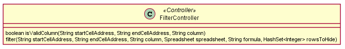
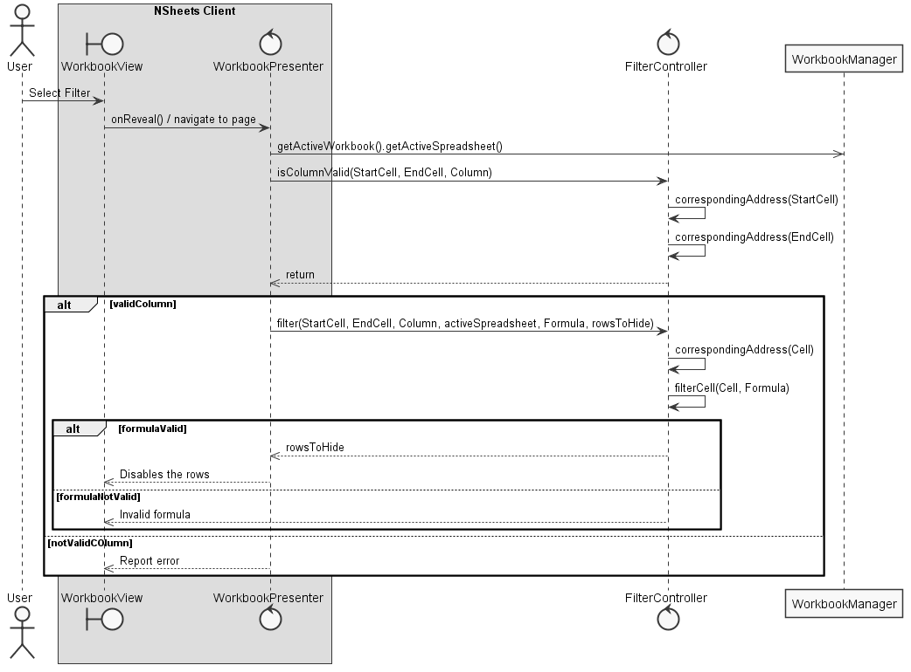

**Rui Ribeiro** (1150344) - Sprint 1 - Lang05.1
===============================

# 1. General Notes

Since no problems were faced in the implementation only in the understanding of the features that were required in the project statement.

# 2. Requirements

It should be possible to filter a range of cells. The filter should be a boolean formula that is applied to each row (and a specific column of the range). If the result is true, the row is visible. If the result is false, the row should become invisible.

- Define a range of cells in the active spreadsheet;
- Define the column to which the filter will be applied;
- Filter the rows of the column that are in the range defined based on the given boolean formula;

# 3. Analysis

In order to design a solution i had to:
- Study how the boolean return type functions already implemented in the application function so that i can reproduce it's workflow to a whole row;
- Have in consideration all of the GWT features so that i can make this use case more user friendly and more intuitive;
- Implement a controller in order to filter the column and return the rows to disable.

## 3.1 Functions and Associated Workflow

Based on the already designed domain model in the project statement:

It's possible to see that in order to filter the rows, has to exist an active workbook and an active spreadsheet.

As that is cleared out of the way, the user will define the range of cells, the column to which the filter will be applied and the formula/filter itself.

From that point, in order for the rows to be filtered, the entered formula must result in a Value of Boolean type or an exception will be thrown.

If the formula follows that rule, the next step is to validate that the result of every cell in the provided column within the specified range is of the boolean type.

If the result from the applied formula to each row cells is 'true', the row stays visible/active, if the result is 'false', the row becomes invisible/disabled.

On an empty formula in the filter UI all filters should be cleared and all rows must become visible/active.

## 3.2 GWT Features and Actions

Using the GWT framework, it was possible to create a Collapsible Menu that would include the required text boxes to input information and the usual buttons with the Apply Filter feature and the clear filter feature.

As of cells/column input, no validator was used, only in the Apply Filter feature where it's verified if the provided column is in the range of cells provided before.

In the formula input, it's asked the user to reference the range of cells desired using the keyword "\_filter" when inputing the filter formula.

In the buttons added, the Apply Filter button validates if the column is within the range provided and, if it is, filters the cells in the column within the range provided and the formula applied returns values of boolean types the rows which the return is true stay active while if the return is false, the rows are disabled.

## 3.3 Analysis Diagrams

The main idea for the "workflow" of this feature increment:

**Domain Model (for this feature increment)**

Since the only requirement is to change the appeareance of the webpage, the only class necessary is a controller, named FilterController.

**System Sequence Diagrams**

# 4. Design

## 4.1. Tests

Regarding tests we try to follow an approach inspired by test driven development. However it is not realistic to apply it for all the application (for instance for the UI part), as those are functional tests. Therefore we focus on the controller class used on this feature: **FilterController**.

**FilterControllerTest** has the following implementation:

**setUp:** We should create a workbook with an associated spreadsheet so it's possible to apply the filter:

    @Before
    public void setUp() throws Exception {
        controller = new FilterController();
        String contents[][] = { // first spreadsheet
            {"10", "-9", "8", "7", "1", "2", "3"},
            {"8", "7", "6", "5", "4", "3", "2"},
            {"1", "2", "3", "4", "5", "6", "7"}};

        wb = new Workbook();
        wb.addSpreadsheet(contents);
        sheet = wb.getSpreadsheet(0);
    }

**Test:** Validate if a column is within a given range of cells

      @Test
      public void testIsValidColumn() {
          assertTrue(controller.isValidColumn("A1", "B3", "A"));
          assertTrue(controller.isValidColumn("A1", "C4", "B"));
          assertFalse(controller.isValidColumn("A1", "C3", "D"));
      }

**Test:** Assert that the correct row is filtered

    @Test
    public void testFilter() throws Exception {
        HashSet<Integer> rowsToHide = new HashSet<>();
        controller.filter("A1", "B3", "A", sheet, "=IF(_filter<10;\"true\";\"false\")", rowsToHide);
        assertTrue(rowsToHide.contains(0));

        rowsToHide.clear();

        controller.filter("A1", "B3", "A", sheet, "=IF(_filter<3;\"true\";\"false\")", rowsToHide);
        assertTrue(rowsToHide.contains(0) && rowsToHide.contains(1));
    }
    
**Test:** Assert that the function fails in an invalid formula

    @Test(expected = IllegalValueTypeException.class)
    public void testFailFormula() throws FormulaCompilationException, IllegalValueTypeException {
        HashSet<Integer> rowsToHide = new HashSet<>();
        controller.filter("A1", "B3", "A", sheet, "IF(_filter<10)", rowsToHide);    // Invalid formula
    }

**Test Coverage**  
- The coverage for application(controller) class: 100%

All the public methods are tested.

## 4.2. Requirements Realization

Notes:

- **WorkbookView** presents the UI for this Use Case.

- **FilterController** is the controller to filter the rows to be disabled.

## 4.3. Classes and Design Patterns

The main classes of my solution are: WorkbookView and FilterController.

The class WorkbookView is one of the classes necessary to follow the MVP (Model-View-Presenter) pattern that is used to bind all required elements, and, more specific the View class is used to handle all the UI events (such as ClickEvent, keyDown, etc.).

The Controller (FilterController) is used to send information to the View and possibly change the appeareance of the Model.

The patterns used were:

- Controller Pattern

- MVP Pattern

# 5. Implementation

**Code Organization**  

I followed the recommended organization for packages:

- Code should be added (when possible) inside packages that identify the group, sprint, functional area and author;

- For instance, i used **lapr4.blue.s2.core.n1150344**

The code for this sprint:  

Project **NShests**:

Added the class:

- **pt.isep.nsheets.client.application.lapr4.blue.s2.core.n1150344.filter.FilterController**

Modified the following classes:

- **pt.isep.nsheets.client.application.workbook.WorkbookView**

- **pt.isep.nsheets.client.application.workbook.WorkbookPresenter**

Modified the following file:

- **pt.isep.nsheets.client.application.workbook.WorkbookView.ui.xml**

# 6. Integration/Demonstration

The main problem of this use case was the planning part, since it would take some user input and some actions it needed to be well planned.

This use case, as demonstration, it's very intuitive in the application, all that is needed is a range of cells, a column to filter and the knowledge of some of the formulas that the application has.

In terms of tests, the main functions used are tested using JUnit.

# 7. Final Remarks

Possible improvements:

This use case could be better explained/thought since GWT provides the feature to select multiple rows and it could be used to make the filter feature more intuitive and with less complications.

# 8. Work Log

Commits:

* [Validate row on controller + Begin documentation](https://bitbucket.org/lei-isep/lapr4-18-2dc/commits/dce065de3dc35472a523257bd0920ef00285e8ec)

* [UI in WorkbookView](https://bitbucket.org/lei-isep/lapr4-18-2dc/commits/267dddecba27ece4f0081bc6f813a9a632b1807a)

* [UI Implementation and some Unit Tests](https://bitbucket.org/lei-isep/lapr4-18-2dc/commits/ab41764c85b028c1c3bc696af38b52ad892f4ea0)

* [Final backend implementation and some more unit tests validations](https://bitbucket.org/lei-isep/lapr4-18-2dc/commits/fdec3a48d6b218156e49195245a73c711e8d0169)

* [Beautify UI](https://bitbucket.org/lei-isep/lapr4-18-2dc/commits/de02564601dff5b32f973e561047ae873522dc8d)

* [Final documentation, UI Tweaks and a new test](https://bitbucket.org/lei-isep/lapr4-18-2dc/commits/a19566c52a59e36dcb5c8f2c56700243c7656f45)
