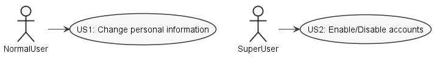
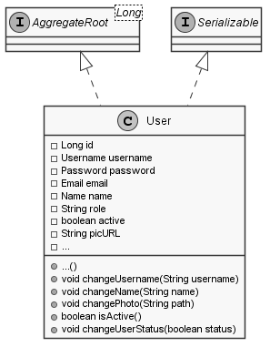
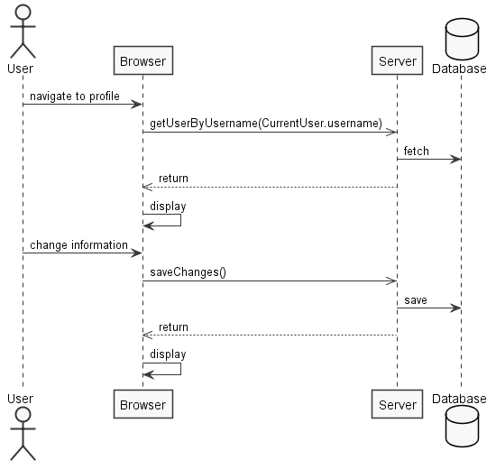
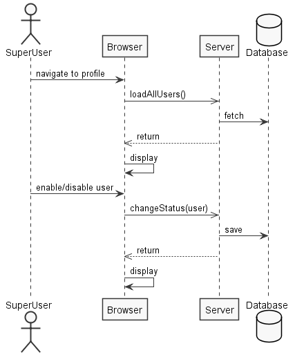
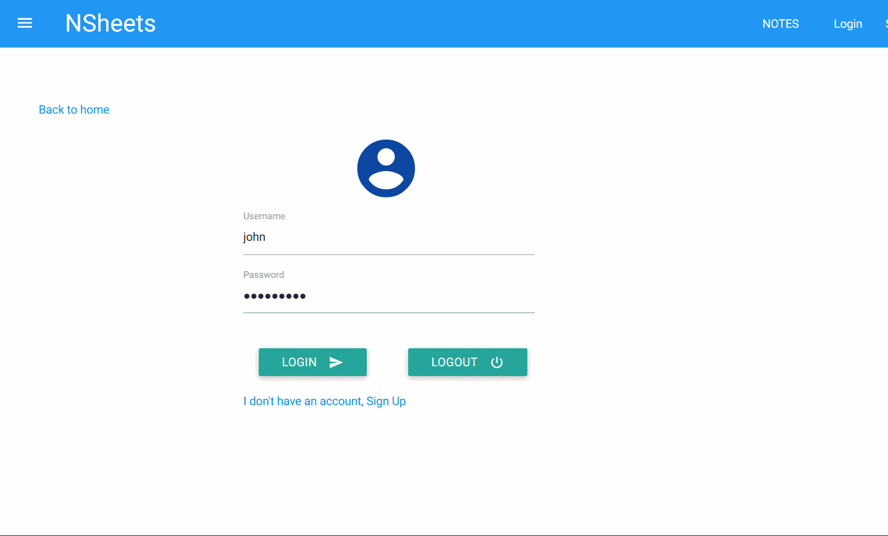
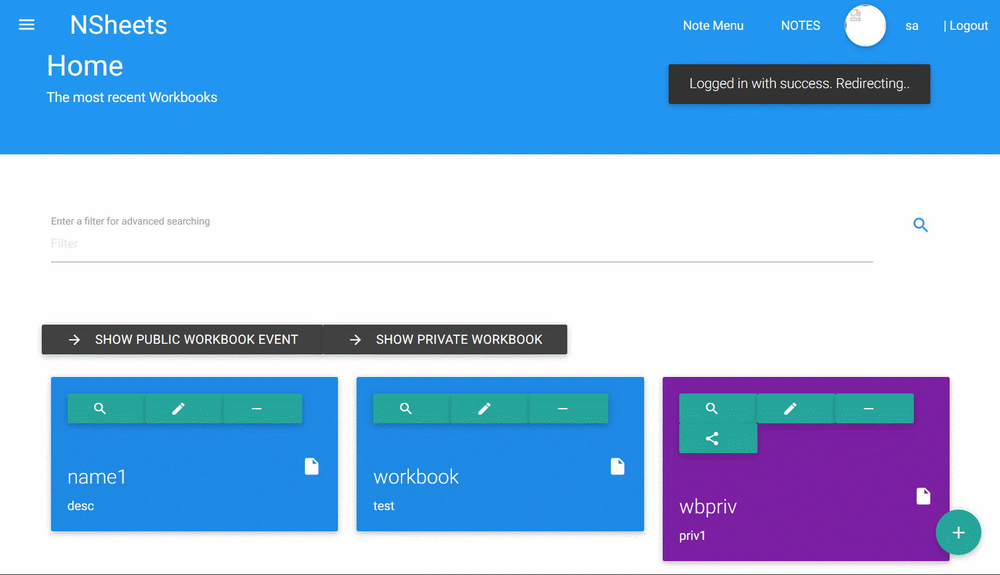
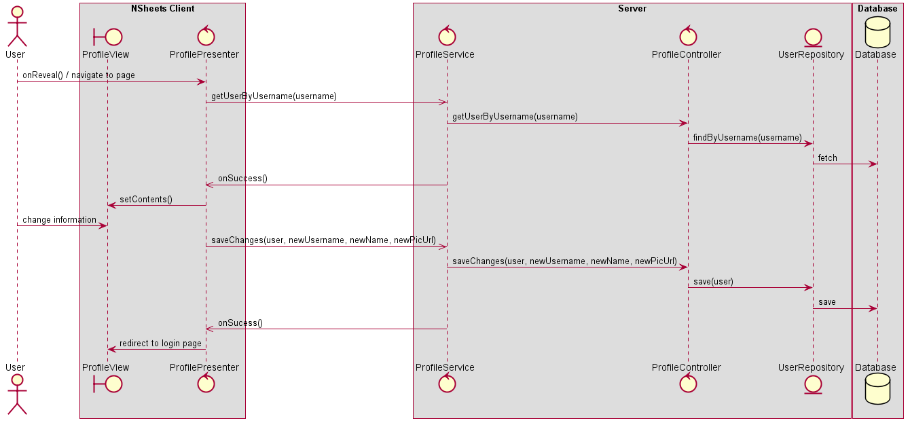
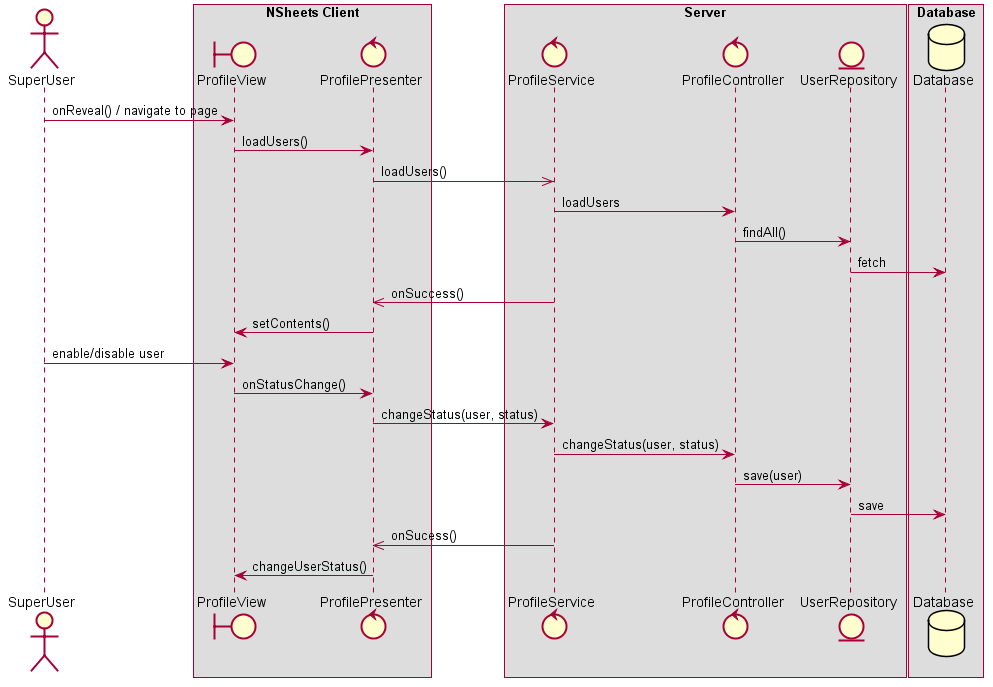
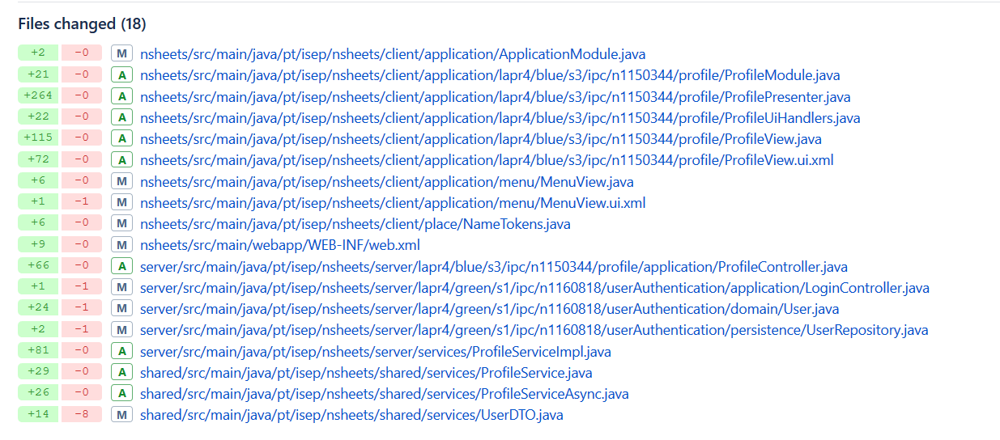

**Rui Ribeiro** (1150344) - Sprint 3 - IPC01.3
===============================

# 1. General Notes

This use case is pretty straightforward so, almost no problems were found with the exception of being able to load the users registered in the application by the time the super user profile page is loaded.

# 2. Requirements

The application should now have a new "Profile" page to allow users to manage their accounts. The user should be able to change his information (name, nickname and photo) and also delete the account. The super-user should be able to access all the accounts and be able to enable/disable accounts. When an account is disable its user is not able to authenticate.

  - Profile page
  - Normal user has the ability to change his name, nickname and photo
  - Super user has the ability to enable/disable accounts
  - Disabled users can't authenticate

# 3. Analysis

In order to design a solution i had to:

- Study how the current user is implemented in the application

- Take in consideration that the previous UC (IPC01.2) had to make the users email the authentication method, but that was not done so the nickname is the method of authentication.

Since it's two different actions because there are two types of users, i decided to devide this in two user stories:

  - US1 - User change personal information
  - US2 - Super user enable/disable accounts

## 3.1 Events and GWT

Since:
- **server**. is the "server part" of the web application.  
- **shared**. contains code that is shared between the client (i.e., web application) and the server.   
- **nsheets**. is the web application (i.e., Client).

I needed to make my User Interface "contact" the server side of the application in order to access the user repository. To do so, a **controller** and an **asynchronous service** were created.

The UI (with the Model View Presenter pattern) was implemented in a way where two different panels were displaye based on the current user role ("user"/"admin"). In the Presenter, the event handlers are made in a way where the user has to click certain buttons in order to make a connection between the client and the server.

## 3.2 Server and RPC

The Profile page is accessed by clicking on the username in the top right corner after logging in.

This page presents different panels taking in consideration the current user role.

Both this panels use the same service, so i created it using an interface:

    @RemoteServiceRelativePath("profileService")
    public interface ProfileService extends RemoteService {
      boolean refreshDatabase();
      boolean saveChanges(UserDTO user, String newUsername, String newName, String newImagePath);
      UserDTO getUserByUsername(String username);
      boolean deleteAccount(String username);
      Iterable<UserDTO> loadUsers();
      void changeStatus(UserDTO user, boolean status);
    }

When an RPC is invoked, since it is always executed asynchronously i always provide a callback when any of the functions above are called, which provides results for both sucess and failure.

This interface resides in the **shared** project since it needs to be accessed by both server and client.

The interface was implemented in the **server** project. This implementation is very simple since it is mostly a connection to the **controller**, for example:

      @Override
      public UserDTO getUserByUsername(String username) {
          ProfileController controller = new ProfileController();
          return controller.getUserByUsername(username);
      }

Since the service is a servlet, it was declared in the **web.xml** file:

    <!-- Servlet for the profile -->
    <servlet>
      <servlet-name>profileService</servlet-name>
        <servlet-class>pt.isep.nsheets.server.services.ProfileServiceImpl</servlet-class>
    </servlet>

    <servlet-mapping>
      <servlet-name>profileService</servlet-name>
        <url-pattern>/nsheets/profileService</url-pattern>
    </servlet-mapping>

## 3.3 Analysis Diagrams

**Domain Model (User/UserDTO)**

**System Sequence Diagrams**

For US1:

For US2:

# 4. Design

## 4.1. Tests/Demonstration

US1:

US2:

## 4.2. Requirements Realization

For US1:

For US2:

## 4.3. Classes and Design Patterns

Since this use case has two distinct user stories, there are no "main" classes, in general i have a controller, a service, the domain entities and the user interface.

The patterns used were:

- Controller Pattern

- RPC Pattern

- MVP Pattern

# 5. Implementation

**Code Organization**  

# 6. Final Remarks

One of the most interesting use cases i've developed since i had to make interactions with new widgets and with services.

# 7. Work Log

Commits:

* [Use Case Implementation](https://bitbucket.org/lei-isep/lapr4-18-2dc/commits/26b81d1469e7336bb8c5257350ffb4c899d9427e)

* [Fix same username on change](https://bitbucket.org/lei-isep/lapr4-18-2dc/commits/56aef8e7ab604691d3f11bf48ed6bf09e3d3f36b)
