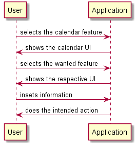
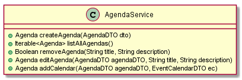
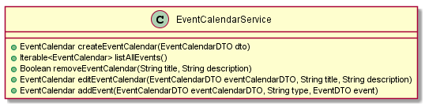
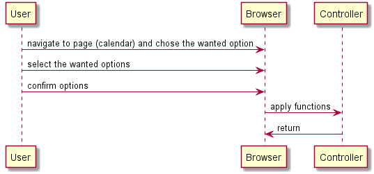

**Carlos Açoreira** (1151186) - Sprint 1 - Lang06.2
===============================

# 1. General Notes

On my opinion the two main problems on this sprint were:
1st. Working based on someone else's code;
2nd. the previous sprint was finished in a very basic way which made me have to finish some of the work that I think should have been done before

# 2. Requirements

The calendar view should now evolve into an agenda view that may display several calendars. It should be possible to create, edit and remove calendars. Each user can have one or more calendars. Each calendar has a name (e.g., work, birthdays, home, etc.) and a textual description. It should be possible to associate a color to a calendar (events of that calendar are displayed with the color of the calendar). It should be possible to filter what calendars are displayed in the agenda view. The agenda view can be implemented as a simple list of events (from the calendars). The view should display only actual and future events.

# 3. Analysis

In order to design a solution i had to:
- Study how the Events and their related UI work so I can addapt it to the Calendars;
- Have in consideration all of the GWT features so that i can make this use case more user friendly and more intuitive;
- Implement a controller in order to filter the events, calendars and agendas.

## 3.1 Functions and Associated Workflow

 It's needed to have created events in order to populate de calendars, and created calendars to popuplate de agendas.

As that is cleared out of the way, the user will have to choose the event he wants to add to each calendars, and which calendars he wants to add to the agendas.

From that point, in order for the calendars/agendas to be filled , the entered object must be of the Event/EventCalendar type or an exception will be thrown.

For that to be more intuitive it was created a selection bar in which only elements from the expected type will appear.

The user just has to select the Agenda/Calendar he wants to insert the element in and confirm his choise.

## 3.2 GWT Features and Actions

Using the GWT framework, it was possible to create a pop up window that has all the steps to the needed actions to create and populate an agenda, and the buttons to confir choises and guide the user through.

In the buttons added, all choosing buttons work the same way, just to guide the user to the wanted path, so do all the selection buttons that only confirm the user options and then call their specific methods that allows the program to make the user action happen.

## 3.3 Analysis Diagrams

The main idea for the "workflow" of this feature increment:

**Domain Models (for this feature increment)**

Ince both actions are almost the same both controllers are similat.

**System Sequence Diagrams**

# 4. Design

I had issues creating the UI becuse I couldn't make th UI and persistence connect the right way.

## 4.1. Tests

Commits:
