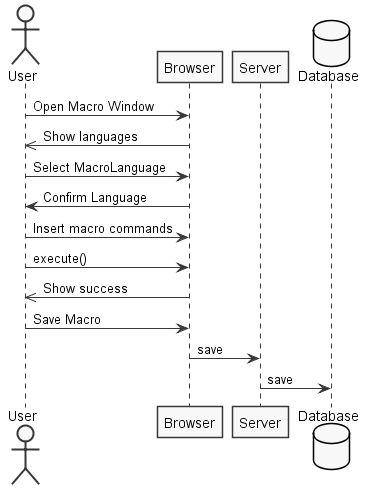
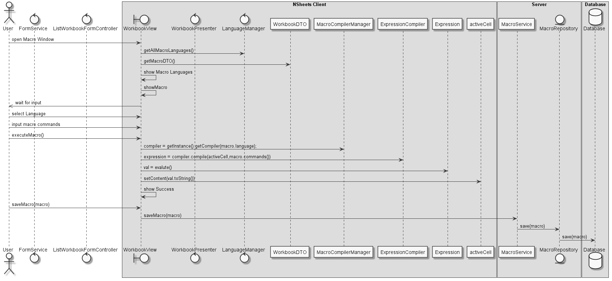
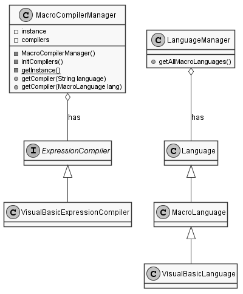
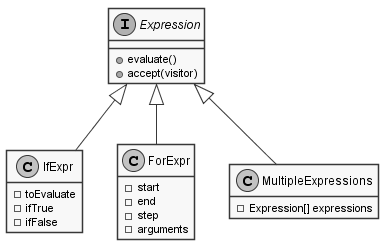
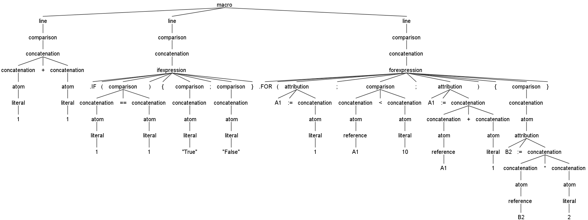
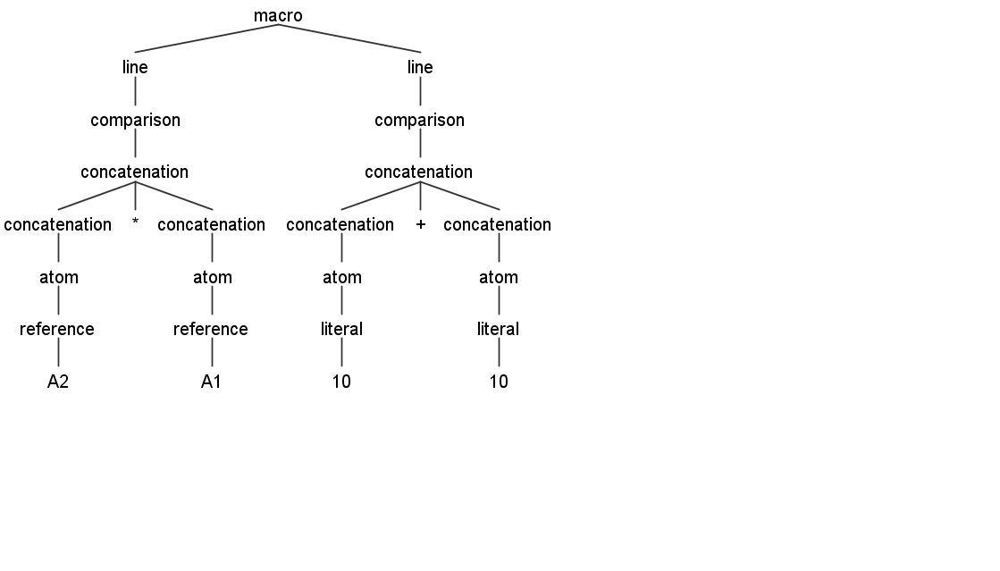
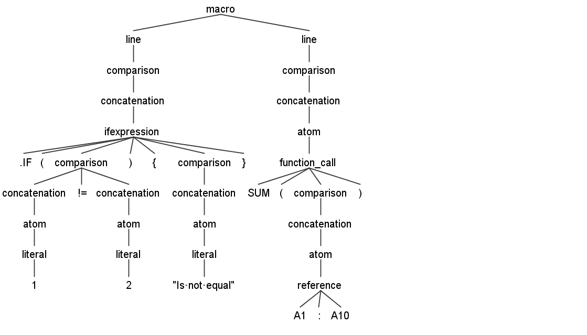

**Mário Dias** (1151708) - Sprint 1 - Lang 08.1
===================================================

# 1. General Notes

The initial approach was to try to obtain the maximum information regarding the operation of the application, emphasizing the degub tool for a better understanding of how the software works in terms of execution. The new GWT tool brought a new learning curve to a project that was already complex. Me personally had a lot of trouble adapting to this new project, and found it very hard to understand due to the lack of documentation  

In this sprint the **UC Lang08.1 - Javascript Language** was a very similar to some other use cases of my team, in particular the UC Lang06.1 and Lang07.1, the objective was to make a *pseudo* language inspired in the excel language already provided.

I had a great deal of difficulty understanding most of the classes that were part of the grammar interpretation, and the lack of practice on this subject became obvious throughout the sprint. 
In terms of the construction of the grammar I did not have great problems, having to develop a new grammar inspired in *Javascript* and maintaining a similarity to the grammar already implemented in the project. Great differences have arisen in constructing the new functions, to make grammar unambiguous as much as possible, the most basic functions like " *if* " statement, not only the function name should be written but also have to be preceded by a period.

Is to be noted that most of the days during this sprint, me and some of my collegues, spend the days trying to analyse the visitor pattern regarding the the *Formula Eval Visitor* and analyse the grammar for the *Formula.g4* file.

I could not totally finish my UC, all the logic behind it is done, by that i mean the grammar and the visitor. After trying to degub for many hours I still could not find the problem. I tried to get help from the partners in my team, unfortunately they could not help me in time. I could find that the error wan in visitor part of the code, after receiving a parsed tree it would throw an exception, not being able to visit the tree.

I tried to help my collegues in all I could, especially in the grammar. My tests were not done due to find an dependency with the GWT, not being able to compile and always throwing an error, unableing me, and some of my team members to do any tests.

# 2. Requirements

Lang08.1 - Javascript Language
The application should support a language inspired in the syntax of Javascript. This language is to be an alterntive language to writing "Macros". This feature increment should have the same functionality as Lang06.1 but with the adaptations required by the syntax of the language.

This language can do everything that the formulas language does but in multiple lines.
The cell result is the last executed line.

## Proposal
- UC 1 - As a user I want to create a new Macro.

- UC 2 - As a user I want to select what language to write my macro in.

- UC 3 - As an end user I want to save my macro on the spreadsheet.

# 3. Analysis

Firstly, for this increment knowledge is a factor, by knowledge I mean the understanding the core and the "flow" of the main application and all its relations needed. 

For that I started by understand the following:
- How the application works and understand the key aspects of GWT, since it is the main technology behind the application and I'm not familiarized with it;  

- How the Home Page is implemented (for instance, how the UI gets the Workbook Descriptions that are displayed);

- How to integrate a relational database into the project;

- How the process of the assignment of a given formula inserted into a cell is resolved internally;

- What commands I need to implement in the new language.

# 3.1 Project Structure

**Modules**. From the pom.xml file we can see that the application is composed of 5 modules:  
- **server**. It is the "server part" of the web application.  
- **shared**. It contains code that is shared between the client (i.e., web application) and the server.   
- **nsheets**. It is the web application (i.e., Client).  
- **util**. This is the same module as the one of EAPLI.  
- **framework**. This is the same module as the one of EAPLI.

My code will reside in the shared folder since is shared between server and client.

## 3.2. Analysis Diagrams

For this use case the sequence is simple, after the user opens the macro window, he has to chose one the the three languages available, after he confirms the language he can now insert new set of commands, then he can press the button to execute a macro. 

Note: This diagram only show us the success operation.

Macro Language Model

Needed Expressions

# 4. Design

For the Javascript macro language, I first analyzed the provided language for the excel expressions. The macro language has to be able to process multiple lines, in the new language I made the necessary changes to support this change.  

Interpret multiple lines:

    grammar javascript;
    macro: line+;
    line: comparison;

Implement If Expression

    ifexpression :  IF LPAR comparison RPAR LCURLYBRACKETS comparison ( SEMI comparison ) ? RCURLYBRACKETS ;

Implement For Expression

    forexpression : FOR LPAR attribution SEMI comparison SEMI attribution RPAR LCURLYBRACKETS comparison ( SEMI comparison)* RCURLYBRACKETS ;

It is needed a compiler to return an expression from a given macro command. The class created is JavascriptExpressionCompiler, its responsability is to create a parser and lexer. 

Code example:
        
        ANTLRInputStream input = new ANTLRInputStream(source);
        javascriptLexer lexer = new javascriptLexer(input);
        CommonTokenStream tokens = new CommonTokenStream(lexer);
        javascriptParser parser = new javascriptParser(tokens);
        JavascriptErrorListener javasError = new JavascriptErrorListener();
        parser.removeErrorListeners();
        parser.addErrorListener(javasError);
        ParseTree tree = parser.macro();
        if (parser.getNumberOfSyntaxErrors() > 0) {
            throw new FormulaCompilationException(javasError.getErrorMessage());
        }
        JavascriptEvalVisitor eval = new JavascriptEvalVisitor(cell, new JavascriptLanguage("javas",""));
        Expression result = eval.visit(tree);
        if (eval.getNumberOfErrors() > 0) {
            throw new FormulaCompilationException(eval.getErrorsMessage());
        }

A visitor is needed so it can disassemble any given grammar. The class created is JavascriptEvalVisitor.

Code example:

        @Override
        public Expression visitConcatenation(javascriptParser.ConcatenationContext ctx) {
            try {
                if (ctx.getChildCount() == 2) { // Convert unary operation
                    int operatorid = 0, operand = 1;  // Assume operator on the left
                    if (ctx.PERCENT() != null) { // Conclude that operator is on the right
                        operatorid = 1;
                        operand = 0;
                    }
                    return new UnaryOperation(
                            // Language.getInstance().getUnaryOperator(ctx.getChild(operatorid).getText()),
                            this.language.getUnaryOperator(ctx.getChild(operatorid).getText()),
                            visit(ctx.getChild(operand))
                    );
                } else if (ctx.getChildCount() == 3) {
                    BinaryOperator operator = this.language.getBinaryOperator(ctx.getChild(1).getText());
                    return new BinaryOperation(
                            visit(ctx.getChild(0)),
                            operator,
                            visit(ctx.getChild(2))
                    );
                }
            } catch (FormulaCompilationException ex) {
                addVisitError(ex.getMessage());
            }
            return visitChildren(ctx);
        }

## 4.1. Tests

There are three types of tests.
Unit Tests, Antlr4 grammar tests and functional tests
Unit Tests could not be implement to ensure language is working since workbook has dependencies on CellImpl, CellImpl has dependecies on Value.parseValue(), and this last one depends on GWT library.
So it's not possible to test languages directly with domain objects.

Test 1 - Parsing tree for the folowing macro:

    1+1
    .IF(1==1){"True";"False"}
    .FOR(A1:=1;A1<10;A1:=A1+1){B2:=B2*2}

Test 2 - Parsing tree for the folowing macro:

    A2*A1
    10 + 10

Test 3 - Parsing tree for the folowing macro:

    .IF(1!=2){"Is not equal"}
    SUM(A1:A10)

## 4.2. Requirements Realization

The requirements for this realization are the following:

* A class that saves Macro code and it's name;
* A grammar for the new language;
* MacroLanguageManager that knows all the languages;
* MacroCompilerManager that knows all the the compilers 
* Language specific Visitor;
* If Expression for the grammar;
* For Expression for the new grammar;
* Temporary variable expression;
* Expression of expressions {block}
* UI capable of choosing language and executing a given code
* UI capable of showing errors, cause there are not unit tests available

## 4.3. Classes

The major classes in this UC were the following:

- JavascriptLanguage
    - This class extends the class *MacroLanguage*, that makes this class a language capable of compile any macro command supported by the this grammar;

-  LanguageManager
    - This class is a singleton class (only instantiated once) and has all the available languages for this application and knows the difference between the normal and macro languages.

- JavascriptExpressionCompiler
    - Is responsible for the creation of the parser and lexer for creating a tree for a given grammar and returns an expression with all the logic translated from the macro code; 

- JavascriptEvalVisitor
    - This class is responsible for visiting the tree generated by the parser of the grammar;

- MultipleExpressions
    - Expressions that holds multiple expressions, so it can be evaluated after gathering all code logic from a block.

## 4.4. Design Patterns and Best Practises

The design patterns used are the following:
* Visitor
* Singleton
* Factory
* Strategy
* Command

Best pratices used:
* Single Responsability Principle
* Dependency Inversion Principle
* Open/Closed Principle
* High Cohesion
* Low Coupling

# 5. Implementation

## Grammar

    grammar javascript;

    macro: line+;
    
    line: comparison;
    
    comparison
        : concatenation
            ( ( DOUBLEEQ | EQ | NEQ | GT | LT | LTEQ | GTEQ ) concatenation )? 	
        ;

    concatenation
            : ( MINUS )? atom                                       
            | concatenation PERCENT
            | <assoc=right> concatenation POWER concatenation
            | concatenation ( MULTI | DIV ) concatenation
            | concatenation ( PLUS | MINUS ) concatenation
            | ifexpression 
            | forexpression
            | concatenation AMP concatenation
            ;

    atom
        :	function_call
        |	reference
        |	literal
        |	LPAR comparison RPAR
        |	attribution
        ;

    attribution
        : CELL_REF ATTRIB concatenation
        ;

    function_call
        :	
        FUNCTION LPAR comparison RPAR  ( LCURLYBRACKETS ( comparison ( SEMI comparison )* )? RCURLYBRACKETS )? 
            
        ;

    ifexpression :  IF LPAR comparison RPAR LCURLYBRACKETS comparison ( SEMI comparison ) ? RCURLYBRACKETS ;

    forexpression : FOR LPAR attribution SEMI comparison SEMI attribution RPAR LCURLYBRACKETS comparison ( SEMI comparison)* RCURLYBRACKETS ;

    reference
        :	CELL_REF
            ( ( COLON ) CELL_REF )?
        ;

    literal
        :	NUMBER
        |	STRING
        ;
        
    fragment LETTER: ('a'..'z'|'A'..'Z') ;
    
    FUNCTION : 
        ( LETTER )+ 
        ;	
        
    CELL_REF
        :
            ( ABS )? LETTER ( LETTER )?
            ( ABS )? ( DIGIT )+
        ;

    /* String literals, i.e. anything inside the delimiters */
    STRING  : QUOT ('\\"' | ~'"')* QUOT
            ;

    QUOT: '"' 
        ;

    /* Numeric literals */
    NUMBER: ( DIGIT )+ ( COMMA ( DIGIT )+ )? ;

    fragment 
    DIGIT : '0'..'9' ;

    /* Comparison operators */
    EQ		: '=' ;
    DOUBLEEQ : '==' ;
    NEQ		: '!=' ;
    LTEQ	: '<=' ;
    GTEQ	: '>=' ;
    GT		: '>' ;
    LT		: '<' ;

    /* Text operators */
    AMP		: '&' ;

    /* Arithmetic operators */
    PLUS	: '+' ;
    MINUS	: '-' ;
    MULTI	: '*' ;
    DIV		: '/' ;
    POWER	: '^' ;
    PERCENT : '%' ;

    /* Reference operators */
    fragment ABS : '$' ;
    fragment EXCL:  '!'  ;
    COLON	: ':' ;
    ATTRIB : ':=' ;
    
    /* Miscellaneous operators */
    COMMA	: ',' ;
    SEMI	: ';' ;
    LPAR	: '(' ;
    RPAR	: ')' ; 
    LCURLYBRACKETS	: '{' ;
    RCURLYBRACKETS	: '}' ;

    /* Function Names */
    IF : '.IF' ;
    FOR : '.FOR' ;

    /* White-space (ignored) */
    WS: ( ' ' | '\r' | '\n' | '\t') -> skip;

    LINECOMMENT: DOUBLESLASH ~[\r\n]* -> skip;

    /* Comment */
    DOUBLESLASH: '//' ;

## JavascriptExpressionCompiler

    public JavascriptExpressionCompiler() {
        language = (MacroLanguage) LanguageManager.getInstance().getLanguage("javas");
    }

    @Override
    public char getStarter() {
        return FORMULA_STARTER;
    }

    @Override
    public Expression compile(Cell cell, String source) throws FormulaCompilationException {

        // Create the lexer and parser
        ANTLRInputStream input = new ANTLRInputStream(source);

        // create the buffer of the tokens between the lexer and parser
        javascriptLexer lexer = new javascriptLexer(input);
        CommonTokenStream tokens = new CommonTokenStream(lexer);

        javascriptParser parser = new javascriptParser(tokens);

        JavascriptErrorListener javasError = new JavascriptErrorListener();
        parser.removeErrorListeners();
        parser.addErrorListener(javasError);

        ParseTree tree = parser.macro();
        if (parser.getNumberOfSyntaxErrors() > 0) {
            throw new FormulaCompilationException(javasError.getErrorMessage());
        }

        // Visit the expression and returns it
        JavascriptEvalVisitor eval = new JavascriptEvalVisitor(cell, new JavascriptLanguage("javas",""));
        Expression result = eval.visit(tree);
        if (eval.getNumberOfErrors() > 0) {
            throw new FormulaCompilationException(eval.getErrorsMessage());
        }
        return result;
    }

    public static class JavascriptErrorListener extends BaseErrorListener {

        private StringBuilder buf;

        public String getErrorMessage() {
            return buf.toString();
        }

        @Override
        public void syntaxError(Recognizer<?, ?> recognizer, Object offendingSymbol, int line, int charPositionInLine,
                String msg, RecognitionException e) {
            List<String> stack = ((Parser) recognizer).getRuleInvocationStack();
            Collections.reverse(stack);

            buf = new StringBuilder();
            buf.append("line ").append(line).append(":").append(charPositionInLine).append(": ").append(msg);
        }
    }

    @Override
    public String compilerName() {
        return compilerName;
    }

## JavascriptLanguage
    
    public JavascriptLanguage(String name, String starter) {
        super(name, starter);
    }

    @Override
    protected void initFunctions() {
        functions.add(new Average());
        functions.add(new And());
        functions.add(new Count());
        functions.add(new Do());
        functions.add(new Factorial());
        functions.add(new False());
        functions.add(new If());
        functions.add(new Not());
        //functions.add(new NumericFunction());
        functions.add(new Or());
        functions.add(new Sum());
        functions.add(new True());
    }
    
    @Override
    protected void initBinaryOperators() {
        binaryOperators.add(new Adder());
        binaryOperators.add(new Concatenator());
        binaryOperators.add(new Divider());
        binaryOperators.add(new Equal());
        binaryOperators.add(new Exponentiator());
        binaryOperators.add(new GreaterThan());
        binaryOperators.add(new GreaterThanOrEqual());
        binaryOperators.add(new LessThan());
        binaryOperators.add(new LessThanOrEqual());
        binaryOperators.add(new Multiplier());
        binaryOperators.add(new NotEqual());
        binaryOperators.add(new RangeReference());
        binaryOperators.add(new Subtracter());
        binaryOperators.add(new Attribution());
    }

    @Override
    protected void initUnaryOperators() {
        // functions.add(new Average());
        unaryOperators.add(new Negator());
        unaryOperators.add(new Percent());
    }

    
     @Override
    public String toString() {
    	return "javas";
    }

## Code Organization

    lapr4___________________________
    │   │   │                   │   ├───blue
    │   │   │                   │   │   └───s1
    │   │   │                   │   │       ├───lang
    │   │   │                   │   │       │   ├───n1151708
    │   │   │                   │   │       │   │   ├───formula
    │   │   │                   │   │       │   │   │   └───lang
    │   │   │                   │   │       │   │   │           JavascriptLanguage.java
    │   │   │                   │   │       │   │   │
    │   │   │                   │   │       │   │   └───javascript
    │   │   │                   │   │       │   │       └───compiler
    │   │   │                   │   │       │   │               JavascriptEvalVisitor.java
    │   │   │                   │   │       │   │               JavascriptExpressionCompiler.java

# 6. Integration/Demonstration
    
    Not completed

# 7. Final Remarks

I could not attain the final object of this increment, not completeting the **UC Lang08.1 - Javascript Language**.  

Some Questions/Issues identified during the work in this feature increment:

1. Perhaps an alternative grammar could help improve the current state of the implementation;
2. I could not undestand why the current parser could not construct a valid tree after redoing the grammar tests in the console by compiling and executhe grun to view the result tree of the grammar.
3. I tried to use the same approach as my team partner that was developing the UC Lang07.1 - Visual Basic Language but could not get the expected results.
4. I needed to read the ANTLR4 developer's book to have an better understand of what the tool is capable of.
5. Dealing with visitors, since it's not a easy pattern at first.
6. Keeping up with other Lang Use cases while implementing a new language with multiple line execution paradigm.
7. Debugging cross client language with eclipse, with multiple breakpoints. It's not as direct debugging as native Java language.
8. Compile time.

# 8. Work Log

[Update README.md file to docs](https://bitbucket.org/lei-isep/lapr4-18-2dc/commits/13e9e045c8454cd060a8046aa8eb743b488b2ecf)

[Update README.md file for team blue, Sprint 1](https://bitbucket.org/lei-isep/lapr4-18-2dc/commits/fbd44f072cf071675b135ed27686845e7292c74e)

[Development of grammar for pseudo javascript language](https://bitbucket.org/lei-isep/lapr4-18-2dc/commits/4366ba34b90f3dccf1aa76004c90d80b22bff25a)

[Language manager, has a new type of language](https://bitbucket.org/lei-isep/lapr4-18-2dc/commits/740260659d4f744ecfc2f9f3ee6088bc48f26cf3)

[Correction to build error, Language could not accept a name such as "javascript"](https://bitbucket.org/lei-isep/lapr4-18-2dc/commits/740260659d4f744ecfc2f9f3ee6088bc48f26cf3)

[Updating Language manager. Now contains a new language called javas, pseudo language for javascript.](https://bitbucket.org/lei-isep/lapr4-18-2dc/commits/546402dedfbf100bb4e3a7b1b74bbcc27f2f20cc)

[Changes to javascript file, new support to if statement and for loop. Implementation of visitor to javascript language.](https://bitbucket.org/lei-isep/lapr4-18-2dc/commits/546402dedfbf100bb4e3a7b1b74bbcc27f2f20cc)

[New expression compiler for javascript language. Adding new macro language to macro language manager](https://bitbucket.org/lei-isep/lapr4-18-2dc/commits/4def5f4b505c0426419304e48c11b6429d5ae0ab)

[Update to javascript compiler language. Changes in visit methods](https://bitbucket.org/lei-isep/lapr4-18-2dc/commits/ecf935514b7dbc937e6909822c238eaecd16abb4)

