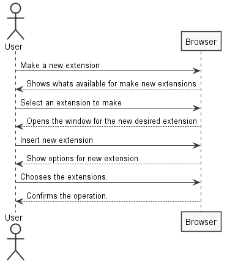
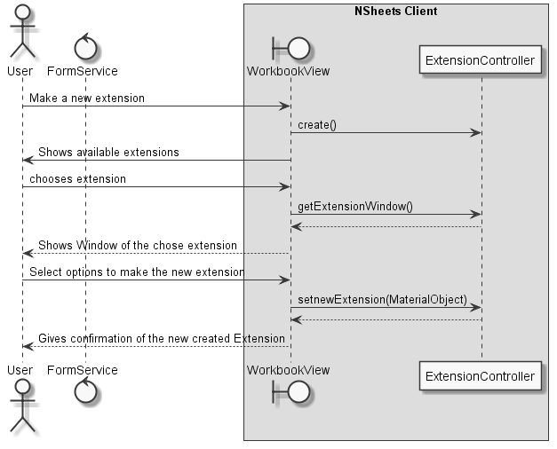
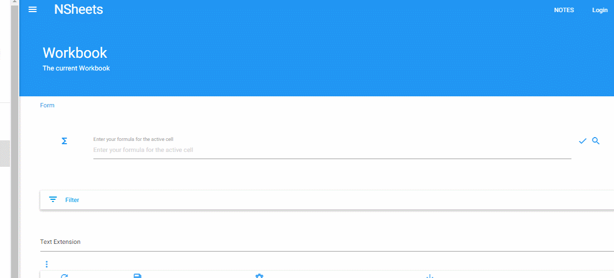
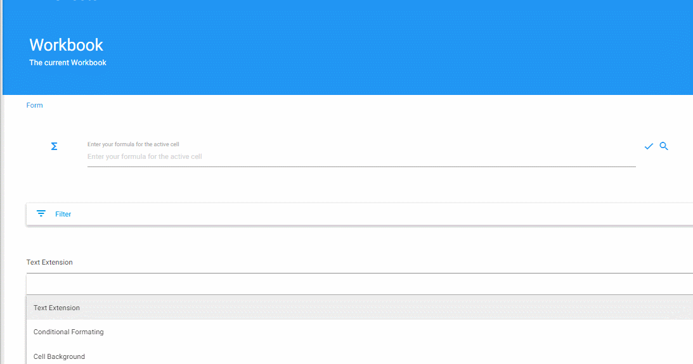

**Mário Dias** (1151708) - Sprint 2 - Core 02.2
===================================================

# 1. General Notes

After analysing the problem the conclusion is that is needed a support to future extensions.

A controller was made to support all the extensions, the *ExtensionController* needs the name of an extension and its window, in this way any future extensions can give the responsability to the controller make that extension and associate the window to any material given by the future developer.

Most of the logic is hidden in the controller avoiding acopolation as much as possible the code from the main UI.

# 2. Requirements

**Core02.2 - Full Extension Mechanism**

The extensions should now contribute also with popup menus in cells, menu options in the navigator and side bars.

## Proposal

- As a user I want to be able to add extensions to sidebar, menu or the popup menu in cells.

# 3. Analysis

The main objective is to be able to create a environment for new extensions to be made as the user wishes. (future extensions for UI are to be implemented)

How the implementation of the new Extension will be made is a important factor. In my view they'll be made based on the choices made by the final user, but must be able to support the most basci, such as change the color of a given element.
 
- There will be secondary UIWindows to make a choice about any type of extension.
- Is needed buttons to be sure what extensions are chosen. 
- A controller to have the logic.

# 3.1 Project Structure

**Modules**. From the pom.xml file we can see that the application is composed of 5 modules:  
- **server**. It is the "server part" of the web application.  
- **shared**. It contains code that is shared between the client (i.e., web application) and the server.   
- **nsheets**. It is the web application (i.e., Client).  
- **util**. This is the same module as the one of EAPLI.  
- **framework**. This is the same module as the one of EAPLI.

## 3.2. Analysis Diagrams

Simple Sequence diagram:

 
Simple Sequence diagram:

# 4. Design

For the UI, some xml code was implemented:
 
        <m:MaterialIcon ui:field="workbook_extensions_button" iconType="MORE_VERT" iconColor="BLUE_LIGHTEN_1" waves="GREEN" circle="false"/>
        <ma:window.MaterialWindow ui:field="extensions_window_workbook" title="Extension window" toolbarColor="BLUE_DARKEN_2">
            <m:MaterialPanel padding="32" textAlign="CENTER">
                <m:MaterialButton ui:field="popup_extension_button" text="Add Popmenu Extensions"/>
                <m:MaterialButton ui:field="sidebar_extension_button" text="Add Sidebar Extensions"/>
            </m:MaterialPanel >
        </ma:window.MaterialWindow>
        <ma:window.MaterialWindow ui:field="extensions_window_popup" title="Popup Extension" toolbarColor="BLUE_DARKEN_2">
            <m:MaterialPanel padding="32" textAlign="CENTER">
                    <m:MaterialLabel text="TODO" float="LEFT" />
            </m:MaterialPanel>
        </ma:window.MaterialWindow>
        <ma:window.MaterialWindow ui:field="extensions_window_sidebar" title="Sidebar Extension" toolbarColor="BLUE_DARKEN_2">
                <m:MaterialPanel padding="32" textAlign="CENTER">
                    <m:MaterialLabel text="TODO" float="LEFT" />
            </m:MaterialPanel>
        </ma:window.MaterialWindow>

## 4.1. Tests

Tests:

    @Test
    EnsureNormalBehaviour()
    @Test
    EnsureReturnsWindow()
    @Test
    EnsureInsertsExtensionWindow()
    @Test
    EnsureNotNull()
    @Test
    EnsureNAmmountOfExtensions()
    

## 4.2. Requirements Realization

For this UC I needed a controller to make sure i can deacopulate all the code from the Main UI used. That way I can leave all the logic to the controller.   

The implementation of all type of cell extensions was needed a the already implemented ExtensionManager and UIController.

## 4.3. Classes

- UIController
- ExtensionController
- ExntesionManager
- WorkbookView
- WorkbookView.xml

## 4.4. Design Patterns and Best Practises

The design patterns used are the following:
* Singleton
* Strategy

Best pratices used:
* Single Responsability Principle
* Dependency Inversion Principle
* High Cohesion
* Low Coupling

# 5. Implementation

## UI xml:

        <m:MaterialIcon ui:field="workbook_extensions_button" iconType="MORE_VERT" iconColor="BLUE_LIGHTEN_1" waves="GREEN" circle="false"/>
        <ma:window.MaterialWindow ui:field="extensions_window_workbook" title="Extension window" toolbarColor="BLUE_DARKEN_2">
            <m:MaterialPanel padding="32" textAlign="CENTER">
                <m:MaterialButton ui:field="popup_extension_button" text="Add Popmenu Extensions"/>
                <m:MaterialButton ui:field="sidebar_extension_button" text="Add Sidebar Extensions"/>
            </m:MaterialPanel >
        </ma:window.MaterialWindow>
        <ma:window.MaterialWindow ui:field="extensions_window_popup" title="Popup Extension" toolbarColor="BLUE_DARKEN_2">
            <m:MaterialPanel padding="32" textAlign="CENTER">
                    <m:MaterialLabel text="TODO" float="LEFT" />
            </m:MaterialPanel>
        </ma:window.MaterialWindow>
        <ma:window.MaterialWindow ui:field="extensions_window_sidebar" title="Sidebar Extension" toolbarColor="BLUE_DARKEN_2">
                <m:MaterialPanel padding="32" textAlign="CENTER">
                    <m:MaterialLabel text="TODO" float="LEFT" />
            </m:MaterialPanel>
        </ma:window.MaterialWindow>

## UI:

        @UiField
        MaterialComboBox<String> material_list_extension;
        
        @UiField
        MaterialWindow extensions_window_popup;
        
        @UiField
        MaterialWindow extensions_window_sidebar;
        
        @UiField
        MaterialWindow extensions_window_workbook;
        
        @UiField
        MaterialIcon workbook_extensions_button;

        @UiField
        MaterialButton popup_extension_button;
        
        @UiField
        MaterialButton sidebar_extension_button;

    
        popup_extension_button.addClickHandler(event -> {
            extensionController.getUIExtensionWindow("Popup Extension").open();
        });
        sidebar_extension_button.addClickHandler(event -> {
            extensionController.getUIExtensionWindow("Sidebar Extension").open();
        });
        populateExtensionController();

        workbook_extensions_button.addClickHandler(event -> {
            extensions_window_workbook.open();
        });

## Controller 
    
        HashMap<String, MaterialWindow> map = new HashMap<>();

        public void addUIExtension(String name, MaterialWindow window) {
            if (!map.containsKey(name)) {
                map.put(name, window);
            }
        }

        public MaterialWindow getUIExtensionWindow(String name) {
            if (map.containsKey(name)) {
                return map.get(name);
            }
            return null;
        }

## Code Organization

### Note: 

- Most of the code was implemented directly at the UI.

# 6. Integration/Demonstration
 

 

# 7. Final Remarks

Some Questions/Issues identified during the work in this feature increment:

1. The compiling time is one the most troubling problem throught this iteration. 

# 8. Work Log

[Update to Extension abstract class](https://bitbucket.org/lei-isep/lapr4-18-2dc/commits/27d61774c7da426efb29cc40768dbe27123afac4)

[Update to various types of extensions implemented at the moment](https://bitbucket.org/lei-isep/lapr4-18-2dc/commits/6d85c77e4c25d08b9603e79fde33a137f8b051b7)

[Update to UI xml file, now supports combobox to all types of extensions](https://bitbucket.org/lei-isep/lapr4-18-2dc/commits/ed2f71e625bb81083f901a87a7280498bf31a881)

[Update to UI workbookview](https://bitbucket.org/lei-isep/lapr4-18-2dc/commits/20851730633ea754d240f99c0603d9c1acbdf954)

[Update to UI workbookview, populate the combobox to support any cell extensions. Update to Controller UI to return all available cell extensions](https://bitbucket.org/lei-isep/lapr4-18-2dc/commits/2d18bbb555c153bccbd5167615d5c8d773c44fa4)

[Implementation of UC Core02.2, full extension mechanism. Base implementation is finished](https://bitbucket.org/lei-isep/lapr4-18-2dc/commits/7cc514c65208d80036dbb359fd5e7285413ee0d3)

[Update to UI workbookview. and implementation of a extension controller to UI](https://bitbucket.org/lei-isep/lapr4-18-2dc/commits/abc1f0a537bbdbd2b4d3979295d495e95ca1a1ab)