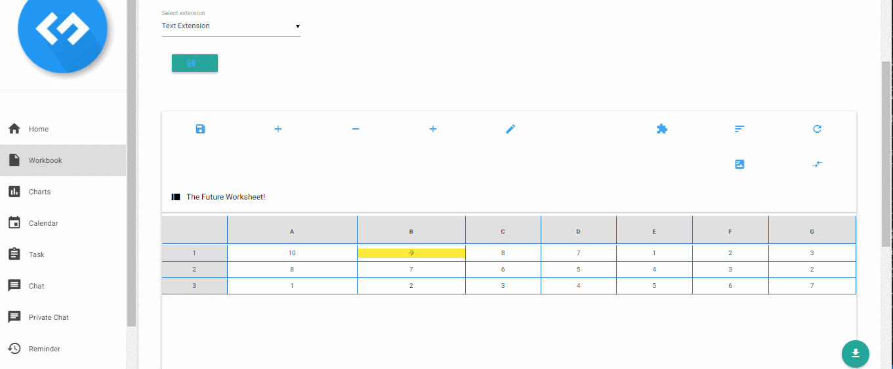
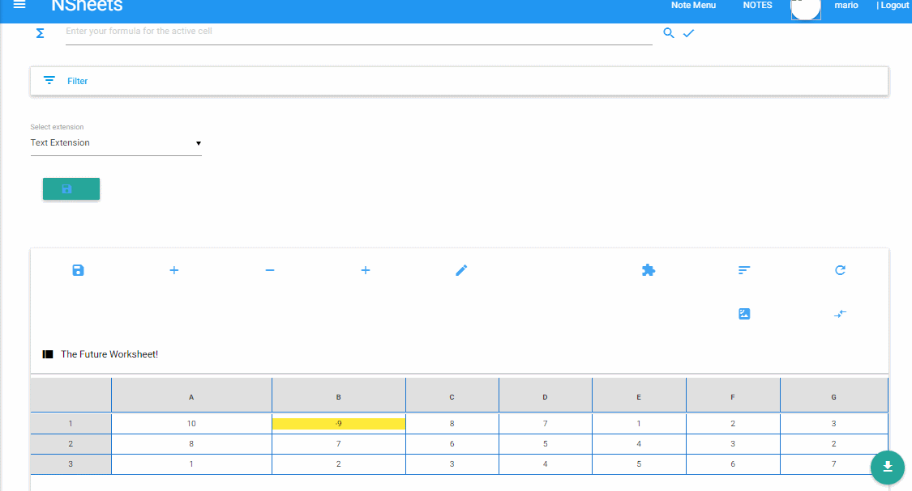

**Mário Dias** (1151708) - Sprint 3 - IPC 053
===================================================

# 1. General Notes

In the general note, this use case was not very tasking, i already had experience creating and opening files to be used in new software.

The import/export of CSV files was indeed very simple to analyse and implement, the CLs was not possible. I tried to talk with the previous developer who tried to implement this before, but we reached the conslusion that this application did not support any type of CLS files due to difference in main domain of "how" a workbook is built.   

# 2. Requirements

**IPC05.3 - Import/Export CSV and CLS**

It should be possible to import and export in both formats: CLS and CSV.

## Proposal

As a user i want to be abl o import or export CSV/CLS files.

# 3. Analysis

The objective is simple, to be able to choose a file to upload into the main application or to download the current book.

To this a stategy of impor/export was implemented, as well a method that is asble to read and write a new file into the server.

A request as well an reponse from the the server was needed, so it was made asyncronous services to be able to have communication between server client.

- UI to support both import and export capabilities.
- A reader and a writer to be able to create or upload new files to the client. 
- A controller to divide the reposnsabilties.
- Services to establish communication between client-server.

# 3.1 Project Structure

**Modules**. From the pom.xml file we can see that the application is composed of 5 modules:  
- **server**. It is the "server part" of the web application.  
- **shared**. It contains code that is shared between the client (i.e., web application) and the server.   
- **nsheets**. It is the web application (i.e., Client).  
- **util**. This is the same module as the one of EAPLI.  
- **framework**. This is the same module as the one of EAPLI.

## 3.2. Analysis Diagrams

### Use case

### Simple Sequence diagram export:

### Simple Sequence diagram import:

 
### Simple Sequence diagram export:

### Simple Sequence diagram import:

# 4. Design

It was needed a service to comunicate with the server, both for importing and exporting. 

Code example:

    @RemoteServiceRelativePath("exportToCSVFormatServices")
    public interface ExportToCSVFormatService extends  RemoteService{
        String exportWorkbook(String[][][] workbook, String filename); 
    }
    public interface ExportToCSVFormatServiceAsync {
        void  exportWorkbook(String[][][] workbook, String filename, AsyncCallback<String> callback); 
    }

    @RemoteServiceRelativePath("UploadCSVServices")
    public interface UploadCSVService extends RemoteService {
        String[][] uploadCSV(String path);
    }
    public interface UploadCSVServiceAsync {
        void uploadCSV(String path, AsyncCallback<String[][]> callback);
    }

A controller to be able to acertain the proper strategy:

    public class ExportController {
        public String exportWorkbook(String [][][] workbook, String filename){
            NewExportStrategy export = ExportFactory.instance().exportNewStrategy(ExportFormats.CSV);
            return export.exportWorkbook(workbook, filename);
        }
    }
    public class ImportController {
        public  String [][] importCSV(String fileName){
            ImportStrategy importType = new ImportFromCSV();
            return importType.importCSV(fileName);
        }
    }

Finally the class that has the logico of either importing or exporting:

    public String exportWorkbook(String[][][] workbook, String filename) {
        PrintWriter pw = null;
        try {
            if (filename.isEmpty()) {
                return "Error";
            }
            int spreadsheetNum = 0;
            pw = new PrintWriter(new File("server/export/" + filename + ".csv"));
            StringBuilder s = new StringBuilder();
            for (int i = 0; i < workbook.length; i++) {
                for (int j = 0; j < workbook[i].length; j++) {
                    for (int k = 0; k < workbook[i][j].length; k++) {
                        s.append(spreadsheetNum);
                        s.append(SEPARATOR);
                        s.append(workbook[i][j][k]);
                        s.append(SEPARATOR);
                    }
                    s.append("\n");
                }
                spreadsheetNum++;
            }
            pw.write(s.toString());
            pw.close();
        } catch (FileNotFoundException ex) {
            Logger.getLogger(ExportToCSV.class.getName()).log(Level.SEVERE, null, ex);
        } finally {
            pw.close();
        }

        return filename + ".csv";
    }

    public String[][] importCSV(String fileName) {
        
        ArrayList<String[]> list = new ArrayList<>();
        Path baseFolder = Paths.get(System.getProperty("user.dir"));
        Path fullPath = Paths.get(baseFolder + "/server/export/");
        String line ="";
        
        BufferedReader br = null;
        int lineCounter = 0;
        try {
        	br = new BufferedReader(new FileReader(fullPath.toUri().getPath()+fileName));
        	
            while ((line = br.readLine()) != null) {
            	list.add(line.split(";"));
                
            }
        } catch (FileNotFoundException e) {
            e.printStackTrace();
        } catch (IOException e) {
            e.printStackTrace();
        } finally {
            if (br != null) {
                try {
                    br.close();
                } catch (IOException e) {
                    e.printStackTrace();
                }
            }
        }
        String [][] sheet = new String [list.size()][list.get(0).length];
        for(int i =0; i<list.size() ; i++) {
        	sheet[i] = list.get(i);
        }
        return sheet;
    }

## 4.1. Tests

Not were not implemented, some of the possible tests are:

    @Test
    EnsureNormalBehaviour()
    @Test
    notEmptyFilename()
    @Test
    NotReturnNull()
    @Test
    FileNotFound()
    @Test
    FileNotExported()
    @Test
    FileNotImported()
    @Test
    ExsureFileIsCSV()

## 4.2. Requirements Realization

## 4.3. Classes

The major classes that played a huge role in this UC are:
    
- Service and ServiceAsync (Import/Export)
    - To ensure comunication with server
- Controller (Import/Export)
    - To share some responsabilities with the ServiceImplementation, reducing acopolation
- ImportCSV
    - Class that is resposible for the import of a given file by the user
- ExportCSV
    - Class that is resposible for export a workbook gy a given name

## 4.4. Design Patterns and Best Practises

The design patterns used are the following:
* Strategy

Best pratices used:
* Single Responsability Principle
* Dependency Inversion Principle
* High Cohesion
* Low Coupling

# 5. Implementation

## Services

    @RemoteServiceRelativePath("exportToCSVFormatServices")
    public interface ExportToCSVFormatService extends  RemoteService{
        String exportWorkbook(String[][][] workbook, String filename); 
    }
    public interface ExportToCSVFormatServiceAsync {
        void  exportWorkbook(String[][][] workbook, String filename, AsyncCallback<String> callback); 
    }

    @RemoteServiceRelativePath("UploadCSVServices")
    public interface UploadCSVService extends RemoteService {
        String[][] uploadCSV(String path);
    }
    public interface UploadCSVServiceAsync {
        void uploadCSV(String path, AsyncCallback<String[][]> callback);
    }

#Controllers

    public class ExportController {
        public String exportWorkbook(String [][][] workbook, String filename){
            NewExportStrategy export = ExportFactory.instance().exportNewStrategy(ExportFormats.CSV);
            return export.exportWorkbook(workbook, filename);
        }
    }
    public class ImportController {
        public  String [][] importCSV(String fileName){
            ImportStrategy importType = new ImportFromCSV();
            return importType.importCSV(fileName);
        }
    }

## Export

    public String exportWorkbook(String[][][] workbook, String filename) {
        PrintWriter pw = null;
        try {
            if (filename.isEmpty()) {
                return "Error";
            }
            int spreadsheetNum = 0;
            pw = new PrintWriter(new File("server/export/" + filename + ".csv"));
            StringBuilder s = new StringBuilder();
            for (int i = 0; i < workbook.length; i++) {
                for (int j = 0; j < workbook[i].length; j++) {
                    for (int k = 0; k < workbook[i][j].length; k++) {
                        s.append(spreadsheetNum);
                        s.append(SEPARATOR);
                        s.append(workbook[i][j][k]);
                        s.append(SEPARATOR);
                    }
                    s.append("\n");
                }
                spreadsheetNum++;
            }
            pw.write(s.toString());
            pw.close();
        } catch (FileNotFoundException ex) {
            Logger.getLogger(ExportToCSV.class.getName()).log(Level.SEVERE, null, ex);
        } finally {
            pw.close();
        }

        return filename + ".csv";
    }

## Import

    public String[][] importCSV(String fileName) {
        
        ArrayList<String[]> list = new ArrayList<>();
        Path baseFolder = Paths.get(System.getProperty("user.dir"));
        Path fullPath = Paths.get(baseFolder + "/server/export/");
        String line ="";
        
        BufferedReader br = null;
        int lineCounter = 0;
        try {
        	br = new BufferedReader(new FileReader(fullPath.toUri().getPath()+fileName));
        	
            while ((line = br.readLine()) != null) {
            	list.add(line.split(";"));
                
            }
        } catch (FileNotFoundException e) {
            e.printStackTrace();
        } catch (IOException e) {
            e.printStackTrace();
        } finally {
            if (br != null) {
                try {
                    br.close();
                } catch (IOException e) {
                    e.printStackTrace();
                }
            }
        }
        String [][] sheet = new String [list.size()][list.get(0).length];
        for(int i =0; i<list.size() ; i++) {
        	sheet[i] = list.get(i);
        }
        return sheet;
    }

## Strategies

    public interface NewExportStrategy {
        public String exportWorkbook(String[][][] workbook, String filename);
    }

    public interface ImportStrategy {
        String[][] importCSV(String fileName);
    }

## Form for upload

    public class CSVFileForm implements EntryPoint, Serializable{
        
        private FileUpload upload;
        private MaterialPanel panel;

        public CSVFileForm(MaterialPanel panel) {
            super();
            this.panel = panel;
        }
        
        @Override
        public void onModuleLoad() {
            // Create a FormPanel and point it at a service.
            final FormPanel form = new FormPanel();
            form.setAction(GWT.getModuleBaseURL() + "uploadService");

            // Because we're going to add a FileUpload widget, we'll need to set the
            // form to use the POST method, and multipart MIME encoding.
            form.setEncoding(FormPanel.ENCODING_MULTIPART);
            form.setMethod(FormPanel.METHOD_POST);

            // Create a panel to hold all of the form widgets.
            HorizontalPanel newpanel = new HorizontalPanel();
            form.setWidget(newpanel);

            // Create a FileUpload widget.
            upload = new FileUpload();
            upload.setName("uploadFormElement");
            MaterialButton button = new MaterialButton();
            button.setBackgroundColor(Color.BLUE);
            button.setIconType(IconType.CLOUD_UPLOAD);
            button.setType(ButtonType.FLOATING);
            newpanel.add(button);
            newpanel.add(upload);

            // Add a 'submit' button.
            button.addClickHandler((ClickHandler) event -> {
                form.submit();
            });

            // Add an event handler to the form.
            form.addSubmitHandler(event -> {
                // This event is fired just before the form is submitted. We can take
                // this opportunity to perform validation.

            });
            form.addSubmitCompleteHandler(event -> {
                // When the form submission is successfully completed, this event is
                // fired. Assuming the service returned a response of type text/html,
                // we can get the result text here (see the FormPanel documentation for
                // further explanation).
                MaterialToast.fireToast("Done!"); // -> Do a toast saying it was successfully uploaded
            });

            panel.setMargin(15);
            panel.add(form);
        }

        public String getPath() {
            return GWT.getHostPageBaseURL() + "user/export" + "?name=" + this.upload.getFilename().substring(this.upload.getFilename().lastIndexOf('\\') + 1);
        }   
    }

## Code Organization

nsheets.src.main.java.pt.isep.nsheets.client.application.lapr4.blue.sp4.ipc.n1151708

server.src.main.java.pt.isep.nsheets.server.application.lapr4.blue.sp4.ipc.n1151708.export.csv

### Note: 

The only thing that was not implemented was the CLS import and export format as well the method to be able to download the file after exporting.

# 6. Integration/Demonstration
 
## Export

## Import

# 7. Final Remarks

It was a godd exprience to work with server communication using GWT, but the lack of experience hindered me for the first few days, relying in documentation to be sure how the GWT server-liente communication really worked.

## Problems:
1. Compilation time is big, losing most of the time recoiling to be certain the software didnt had any errors before commiting.
2. UI for GWT is not very reliable, the error promts when compiling didn't give any clues to the error in question.  

# 8. Work Log

[Iniciate the export to CSV](https://bitbucket.org/lei-isep/lapr4-18-2dc/commits/44b98268b81e3be4d0ace8fd5330fd71028931fb)

[Classes for export CSV](https://bitbucket.org/lei-isep/lapr4-18-2dc/commits/c8fe82580f42475eb6a8e67e348927f23c521086)

[UI corrections](https://bitbucket.org/lei-isep/lapr4-18-2dc/commits/2c890f317e8afdbf56a06813f30601c3131ece0e)

[Update to export CSV file format.](https://bitbucket.org/lei-isep/lapr4-18-2dc/commits/01a4f6f6a6d650693ec793ed273fd235f3445da4)

[Application now supports export/import csv file format](https://bitbucket.org/lei-isep/lapr4-18-2dc/commits/c8fdf5bb31c1b0a01a213dd3ba1f8a8c6d3a4416)

[Application now supp orts export/import csv file format ui implementation](https://bitbucket.org/lei-isep/lapr4-18-2dc/commits/a4f0bea11194206e9f949ec554efb98b625871a0)

[Application now supp orts export/import csv file format ui implementation](https://bitbucket.org/lei-isep/lapr4-18-2dc/commits/a4f0bea11194206e9f949ec554efb98b625871a0)
