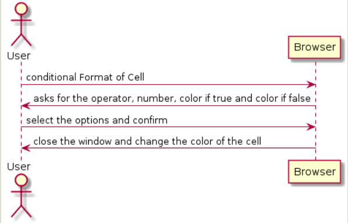
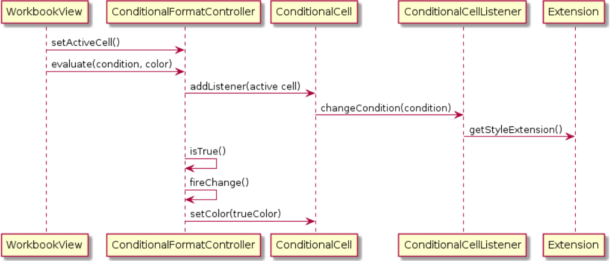

**Beatriz Ferreira** (1160701) - Sprint 1 - Lang03.1
===============================

# 1. General Notes

O primeiro sprint começou segunda, esta segunda foi passada a fazer instalações de extensões necessárias para o programa. Como frequento Lapr2 ao mesmo tempo, necessitei de terça e quarta para me concentrar mais nessa disciplina. Quinta tive problemas a fazer clone ao projeto, passando a tarde a fazer clone ao projeto mas o programa web não se alterava, apesar de já ter sido atualizado pelos meus colegas. Após resolver esse problema , sexta e sábado foram tratados a fazer a janela e a tratar da condição, no entanto, não consegui atualizar a cor da célula, a condição é ativada , assim como a cor que vai servir para a alteração, só que não consegui alterar a cor da Cell pois não consegui aceder à SheetCell da respetiva Cell. Por mais tentativas nestes últimos dias continuo sem descobrir como aceder à Sheetcell quando apenas possuo a Cell ativa.
O meu caso de uso (Conditional Formating of Cells) dependia de dois casos de uso da core( Core02.1 ) - Basic Extension Mechanism que foi implementado apenas em relação à extensão das cores, e pelo Core08.1 - Styles in Cells Extension, que não foi atribuido a ninguém.
Perdi bastante tempo a encontrar uma forma de encontrar a SheetCell para poder alterar a cor e como não consegui não tiver oportunidade para melhorar o código nem adicionar as um Cell Listener que mude a cor escolhida sempre que a condição se verifique.

# 2. Requirements
Lang03.1 - Conditional Formating of Cells - Update the "style" extension so that it can be used for the conditional formatting of cells based on the result of the execution of formulas. For the style of a cell to be conditional it must have an associated formula and two formatting styles. One of the styles is applied when the formula evaluates to true and the other when it evaluates to false. The editing of these settings should be done in a window.

Na melhor das hipóteses, na perspetiva do usuário, o uso da aplicação deve funcionar da seguinte maneira:

O usuário pode selecionar a célula e iniciar a formatação, definindo um operador, um numero, e a cor para no caso da fórmula ser verdadeira e outra cor caso seja falsa. Assim, a aplicação deve fornecer várias opções de formatação de células.

1) O usuário seleciona uma célula .

2) Depois disso, o sistema altera o estilo das células, com base na condição dada pelo usuário.

3) Caso o valor da célula seja alterado a fórmula por ele introduzida anteriormente tem de atuar sempre sobre a célula, alterando o formato conforme a condição.

# 3. Analysis

Para este sprint, já que é o primeiro a ser desenvolvido no novo projeto, necessitei de:

- Analise todo o projeto e compreenda os processos e tarefas necessárias.

- Conheça o ambiente e a estrutura do NetBeans.

- Compreender o mecanismo de trabalho do GWT, para a criação da janela e suas funções.

- Entender todo o conceito das células e da sua implementação, assim como a sua conexão ao resto do projeto.

- Compreender os diferentes projetos e packages e a sua conexão.

- Entender o conceito de extensões da célula assim como os seus Listeners.

# 3.1 GWT and Project Structure
Módulos A partir do arquivo pom.xml, podemos ver que o aplicativo é composto de 5 módulos:
- servidor. É a "parte do servidor" do aplicativo da web.
- compartilhado. Ele contém código que é compartilhado entre o cliente (ou seja, o aplicativo da web) e o servidor.
- nsheets. É o aplicativo da web (ou seja, cliente).
- util. Este é o mesmo módulo que o do EAPLI.
- estrutura. Este é o mesmo módulo que o do EAPLI.

O meu código residirá na pasta do servidor, uma vez que é de uso exclusivo ao servidor. No entanto as extensões e toda a implementação da célula está na pasta do servidor.  

# 3.4 Analysis Diagrams

**Use Cases**
Como o caso de uso têm uma correspondência de um para um com o user, não se adicionou descrições de casos de uso mais detalhadas. Esses casos de uso são muito simples e podem eventualmente adicionar mais especificações num estado posterior, se necessário.

**Domain Model (for this feature increment)**
O modelo de dominio deste caso de uso trabalha com classes como StyleExtension , ConditionalCell, CellListener , woorkbookView, SheetWidgetColumn e ConditionalFormatController.

**System Sequence Diagrams**

# 4. Design

**4.1. Tests**

Para testar a aplicação desta parte, foi feitos testes funcionais como os seguintes:

- Seleciona-se a opção de formatar célula, o que só funciona se tiver uma célula ativa.
- A célula ativa tem o valor 10 , é apresentado a célula ativa assim como o seu valor.
- A pessoa escolhe dentro da lista de operadores o operador = e introduz o número 10, escolhe a cor verde caso seja verdadeiro, e vermelho caso seja falso.
- Mostra um aviso que a condição é verdadeira e a cor que altera a célula : verde.
- A célula muda para a cor verde.

Tests: testes para a condição da fórmula.

**4.2. Requirements Realization**

Seguindo as normas seguidas por JPA da EAPLI, visualizamos um cenário como o seguinte para realizar o casos de uso para este incremento de recurso.

**4.3. Design Patterns and Best Practices**
Por alto, foi aplicado:
- padrão observer para estar sempre atento ao evento em que a célula muda o valor e por sua vez mudar a cor conforme a condição.

# 5. Implementation

Foi necessário implementar uma janela, com todas as funcionalidades pedidas.
A janela possui campos de combobox assim como text fields, nestas primeiras são adicionadas as listas de operadores e das cores , enquanto no text field é introduzido o valor a comparar com o valor da célula. A utilização da styleExtension também foi necessária para a alteração do formato da célula.
Esta janela é definida na workingView.

    @UiField
    MaterialLink conditionalFormat;

    @UiField
    MaterialWindow windowFormat;

    @UiField
    MaterialComboBox<BinaryOperator> conditional;

    @UiField
    MaterialTextBox numberConditional;

    @UiField
    MaterialComboBox<Color> listColors;

    @UiField
    MaterialComboBox<Color> listColors2;

    @UiField
    MaterialButton confirmConditional;

    /* conditional format window  (@author Beatriz Ferreira <1160701@isep.ipp.pt>)*/
    conditionalFormat.addClickHandler(event -> {
        if (activeCell != null) {
            windowFormat.open();
            String cellInfo = "Atual Cell: " + activeCell.toString() + " Content:" + activeCell.getContent();
            MaterialToast.fireToast(cellInfo);
        }

    });
    /* conditional format window  (@author Beatriz Ferreira <1160701@isep.ipp.pt>)*/
    confirmConditional.addClickHandler(event -> {
        if (activeCell != null) {
            BinaryOperator operator = conditional.getSingleValue();
            String n = numberConditional.getValue();
            Color cT = listColors.getSingleValue();
            Color cF = listColors2.getSingleValue();

            cf.evaluate(activeCell, operator, n, cT, cF);
            windowFormat.close();
        }
    });

**Code Organization**

Adição da package pt.isep.nsheets.client.application.s1.n1160701.conditionalFormat na parte do projeto do cliente.

Project NShests - Atualização das classes: WoorkbookView.xml , WoorkbookView.java , sheetWidgetColumn da package pt.isep.nsheets.client.application.woorkbook

# 6. Final Remarks

Como é que é possivel saber qual a SheetCell só tendo uma Cell? na woorkbookView, quando são lançados os eventos e chamados os métodos para avaliar a fórmula só existe a activeCell que é uma Cell.

# 7. Work Log

[MaterialToast info cell when opening the window [fixing issue #55]](https://bitbucket.org/lei-isep/lapr4-18-2dc/commits/2a5af8d1ded96fcecb031aba703d3b097d19c5d3)

[fix add values to list of operator [fixing issue #55]](https://bitbucket.org/lei-isep/lapr4-18-2dc/commits/79c342cd41caddf4023f5bb88b7ba40e4c8ab551)

[conditional format of a cell almost done [fixing issue #55]](https://bitbucket.org/lei-isep/lapr4-18-2dc/commits/f5f473f70e4ac4005cdd296462f64cb020be71ef)

[new extensions, Lang03.1 [fixing issue #55]](https://bitbucket.org/lei-isep/lapr4-18-2dc/commits/1021ad82ed51e0b6304fd587fa7e766a171a48b1)

[import m.html, Lang03.1 [fixing issue #55]](https://bitbucket.org/lei-isep/lapr4-18-2dc/commits/e09c952c441d20f774385410e9d25378db8e76c9)

[window to format condicional cells with tabs, Lang03.1 [fixing issue #55]](https://bitbucket.org/lei-isep/lapr4-18-2dc/commits/8dba52c454c5a9d89171e666f0956f46db419f98)

[window to format condicional cells with tabs, method to change colors Lang03.1 [fixing issue #55]](https://bitbucket.org/lei-isep/lapr4-18-2dc/commits/a89ef764c512f97b07d3f970b663048717a6bfae)

[window to format condicional cells with tabs, method to change colors Lang03.1 [fixing issue #55]](https://bitbucket.org/lei-isep/lapr4-18-2dc/commits/58c615cc8691d964c058d06cd4b4ba5c1ca739a6)

[open window to format condicional cells, method to change colors Lang03.1 [fixing issue #55]](https://bitbucket.org/lei-isep/lapr4-18-2dc/commits/05d019fd45aea9a8079214b20adef0e48dc28bbc)

[style extension [fixing issue #55]](https://bitbucket.org/lei-isep/lapr4-18-2dc/commits/0ac36013184fead1869ac291910e165a44b38abd)
