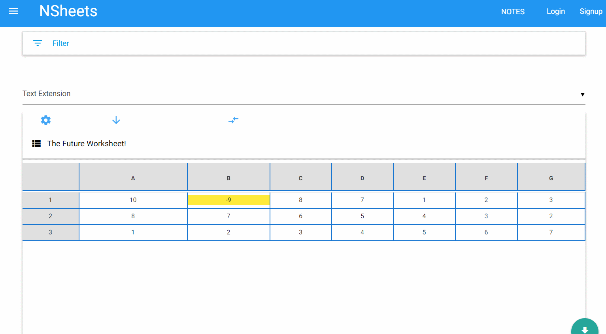
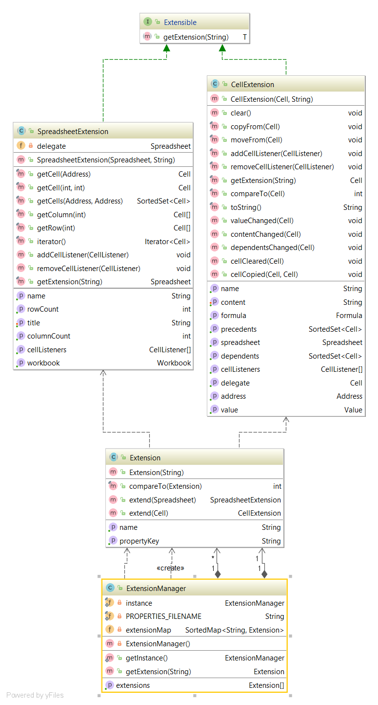
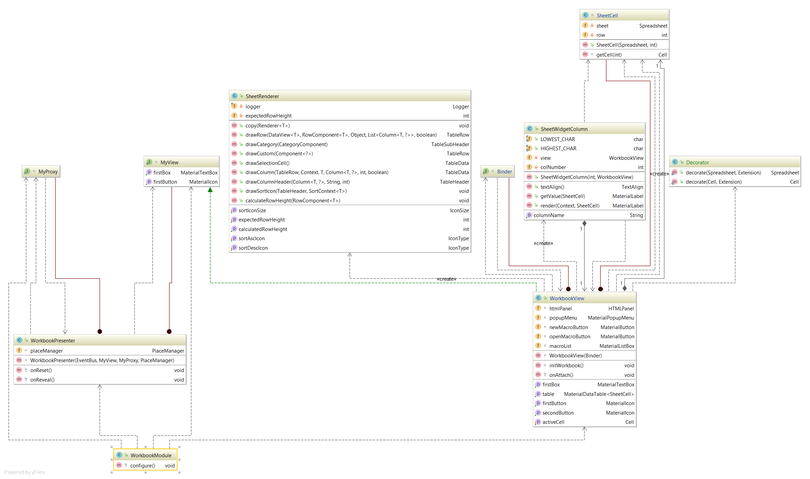
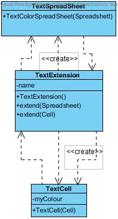
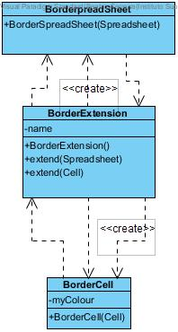
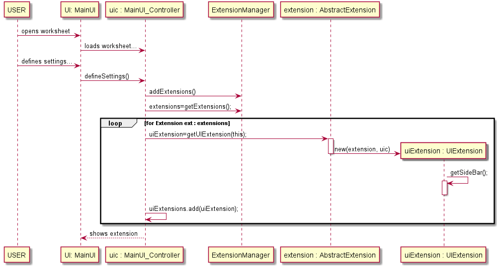

**Beatriz Ferreira** (1160701) - Sprint 2 - Core08.1
===============================

# 1. General Notes

Neste sprint foi solicitado criar uma style extension adicional ao programa, que interliga-se o os styles com as células. No entanto como já tinha interagido com as extensões no primeiro sprint pois tinha me sido atribuído o formato condicional das células criei duas extensões, uma para mudar o formato das bordas e outra para mudar a cor do texto da célula. Como não tinha forma de apresentar resolvi adicionar as duas extensões ao meu caso de uso do sprint 1, sendo possível visualizar já nesta iteração as duas extensões em funcionamento.

**Show Border Extension**

Implementação das extensões no meu caso de uso do sprint 1.

**Show Text Extension**

# 2. Requirements
The application should have a new extension to associate styles with cells. The functionality should be similar to the one present in the desktop version of Cleansheets.

Como este caso de uso era só criar e não tem ligação direta com a Ui, podemos seguir o exemplo do conditional format onde decidi implementa-las para que fosse possível visualizar.
Na melhor das hipóteses, na perspetiva do usuário, o uso da aplicação deve funcionar da seguinte maneira:

O usuário pode selecionar a célula e iniciar a formatação, definindo um operador, um numero, e a respetiva formatação. Assim, a aplicação deve fornecer várias extensões diferentes/formatações da célula.

1) O usuário seleciona uma célula .

2) O usuário escolhe a condição e a formatação desejada.

Extension Mechanism:

US1 - Como usuário quero decorar uma célula com vários formatos diferentes.

# 3. Analysis

Para este sprint necessitei de:

- Analisar o uso das extensões, como elas funcionam e como as tornar o mais simples possível.

- Entender os conceitos de extension , cellExtension e outras classes existentes.

- Entender todo o conceito das células e da sua implementação, assim como a sua conexão às extensões.

- Ter em conta a estrutura do GWT para adicionar as extensões.

-Estudar o mecanismo de implementação de extensões do projeto anterior.

# 3.1 GWT and Project Structure
Módulos A partir do arquivo pom.xml, podemos ver que o aplicativo é composto de 5 módulos:
- servidor. É a "parte do servidor" do aplicativo da web.
- compartilhado. Ele contém código que é compartilhado entre o cliente (ou seja, o aplicativo da web) e o servidor.
- nsheets. É o aplicativo da web (ou seja, cliente).
- util. Este é o mesmo módulo que o do EAPLI.
- estrutura. Este é o mesmo módulo que o do EAPLI.

# 3.4 Analysis Diagrams

**Use Case**

Foram implementadas duas novas style extensions:
- TextColorExtension , que muda a cor do valor da célula.
- BorderStyleExtension, que muda o estilo da borda da célula.

**Domain Model**

*Extension Mechanism*

Como funciona:

Existe uma interface extensível que diz quais elementos podem ter extensões, uma interface de extensão que diz quem são as extensões.
Um ExtensionManager é responsável pelo carregamento e uso da extensão.
Cada extensão deve implementar a interface de extensão e ter uma implementação de célula / SpreadSheet.

*Woorkbook*

 Mais tarde as extensões são carregadas no ExtensionManager.

Extensions criadas:

 
 

# 4. Design

**System Sequence Diagrams**

 

**4.1. Tests**

Para testar a aplicação desta parte, foi feitos testes funcionais pelo contional format of cells como os seguintes:

1.Text Color
- Seleciona-se a opção de formatar célula, o que só funciona se tiver uma célula ativa.
- A célula ativa tem o valor 10 , é apresentado a célula ativa assim como o seu valor.
- A pessoa escolhe qual a formatação a utilizar, neste caso text color e escolhe dentro da lista de operadores o operador = e introduz o número 10, escolhe a cor verde caso seja verdadeiro, e vermelho caso seja falso.
- Mostra um aviso que a condição é verdadeira e a cor que altera a célula : verde.
- A célula muda o 10 para a cor verde.

2.Border Style
- Seleciona-se a opção de formatar célula, o que só funciona se tiver uma célula ativa.
- A célula ativa tem o valor 4 , é apresentado a célula ativa assim como o seu valor.
- A pessoa escolhe qual a formatação a utilizar, neste caso border style e escolhe dentro da lista de operadores o operador > e introduz o número 0, escolhe o estilo SOLID caso seja verdadeiro, e NONE caso seja falso.
- Mostra um aviso que a condição é verdadeira e  a formatação altera : SOLID.
- A célula muda para o style SOLID.

**4.2. Design Patterns and Best Practices**
Por alto, foi aplicado:
- Singleton
- Repository
- MVP
- Visitor - Decorator

# 5. Implementation

*BorderExtension*

    public class BorderExtension extends Extension {

    /** The name of the extension */
    public static final String NAME = "SOLID";
    /** ALL OPTIONS : HIDDEN ; SOLID ; DASHED ; DOTTED ; NONE

    /**
     * Creates a new extension.
     */
    public BorderExtension() {
        super(NAME);
    }

    public BorderSpreadSheet extend(Spreadsheet spreadsheet){

        return new BorderSpreadSheet(spreadsheet);
    }

    /**
     * change the border of text of the cell.
     *
     * @param cell the cell to extend
     * @return a bordercell
     */
    public BorderCell extend(Cell cell){
        try {
            cell.setContent("SOLID");
        } catch (FormulaCompilationException e) {
            e.printStackTrace();
        }
        return new BorderCell(cell);
    }

*BorderCell*

    public class BorderCell extends CellExtension {

        /**
         * Creates a typed cell.
         *
         * @param delegate: Cell to delagate extesion.
         */
        public BorderCell(Cell delegate) {
        super(delegate, BorderExtension.NAME);

        }

**Code Organization**

O meu código residirá na pasta shared, que contêm classes como a abstract CellExtension ea Extension (package: pt.isep.nsheets.shared.ext). Criei a package:  pt.isep.nsheets.shared.lapr4.blue.s1.n1160701.StyleExtension, que contêm as duas novas extensões adicionadas ao projeto, a TextColor e a BorderStyle, foi necessário adicionar código na classe ExtensionManager e na RunTimeExtensionManager, classes estas que já estavam implementadas.

# 6. Work Log

[add the code lost in the last merge [fixing issue #22]
](https://bitbucket.org/lei-isep/lapr4-18-2dc/commits/dc44c13ba7dbabf35bb8afefa07362527c902e0d)

[	add other new extension to the format conditional option and fix the remove condition [fixing issue #22]
](https://bitbucket.org/lei-isep/lapr4-18-2dc/commits/142fbae6b027ca12864409790365671a54c70689)

[add the new extension to the format conditional option [fixing issue #22]
](https://bitbucket.org/lei-isep/lapr4-18-2dc/commits/c47eefd1ebf3748b7f23cc3c8a4e15723d1dfee6)

[UC 08.1 CORE implementation of another style mechanism[fixing issue #22]
](https://bitbucket.org/lei-isep/lapr4-18-2dc/commits/a7d7baca318e0d9879e4240476735f4c2e5f3a90)

[fix packages conditional cell](https://bitbucket.org/lei-isep/lapr4-18-2dc/commits/a1075cc727bcb5ef72e4443cf270e99fb8bcfd26)

[Border extension [CORE08.1]](https://bitbucket.org/lei-isep/lapr4-18-2dc/commits/4b755ac3a19482b411fe6f1ddbba2494ce3b1392)
