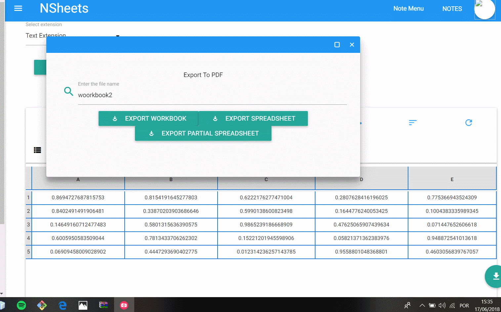
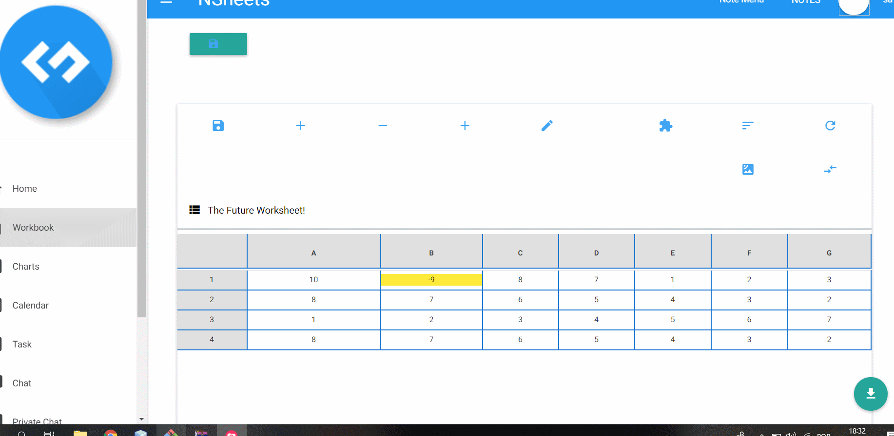
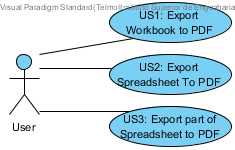
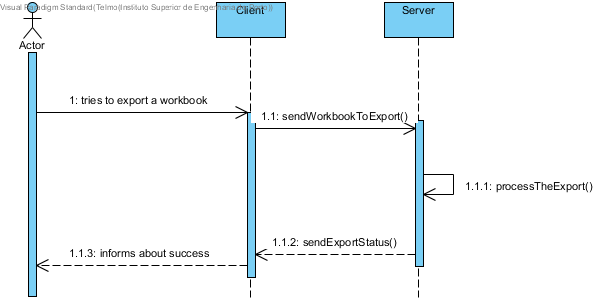
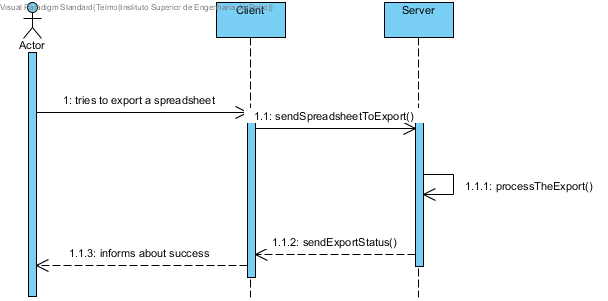
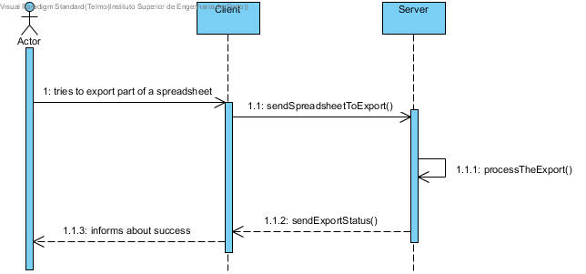
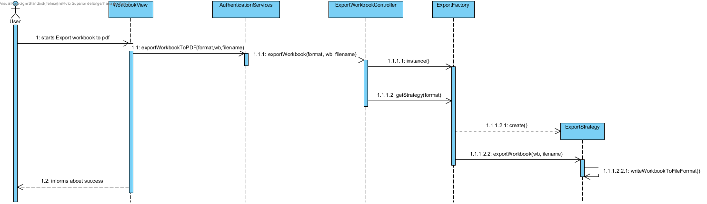
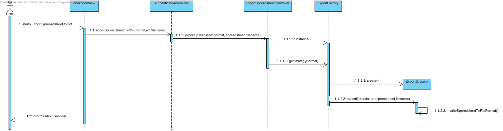
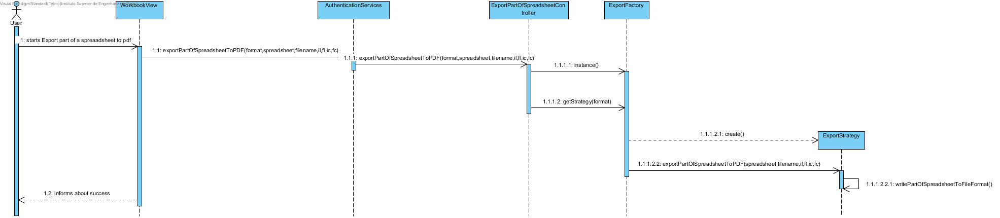

**Beatriz Ferreira** (1160701) - Sprint 3 - IPC03.1
===============================

# 1. General Notes
Foi me atribuido este caso de uso pois não valia a pena pegar no 3.3 quando nenhum dos anteriores estava funcional, desta forma, comecei por tentar exportar uma workbook , no entanto precisei de vários dias para analisar todo o código implementado anteriormente (que não era pouco) para descobrir o porque de não estar funcional. Quando descobri o problema fui capaz de exportar uma workbook e uma spreadhseet escolhida pelo utilizador. Por fim perdi o resto do meu tempo para exportar so uma parte da spreadsheet porque estava mal implementado e tive que estar dois dias a fazer debug ao servidor. Consegui meter todas as funcionalidades base a funcionar porém não tive tempo para fazer com que o PDF gerado deve ser baixado para o sistema de arquivos local do usuário.
Nos últimos dias tive que, constantemente, fazer clone e voltar a colocar o codigo por causa de reverts e fail do projeto.

# Demonstration
**Export Workbook**

**Export Spreadsheet**

**Export part of Spreadsheet**

# 2. Requirements

**Requirements description:**

  IPC 03.1: "It should be possible to export to PDF an entire workbook, a spreadsheet or a range of cells. The contents should include only the values of the cells (and not its formulas, for instance). The user should be able to select the content to be exported and also if the document should have a table of contents with links to the sections or not. If select, sections/chapters should be generated for each spreadsheet of the workbook. The generated PDF should be downloaded to the user local file system."

#### Proposal:

###### USER STORIES:

1. Export To PDF:
    - US1 - As default user i want to export an entire workbook
    - US2 - As default user i want to export only a spreadsheet
    - US3 - As default user i want to export part of a spreadsheet

# 3. Analysis

Para esta iteração precisei de :
- Compreender o código implementado pelos meus colegas anteriormente.

- Tentar detetar quais os erros que os meus colegas estavam a cometer.

- Compreender como funciona a interface do usuário da pasta de trabalho.

- Entenda como posso me comunicar entre a interface do usuário e os controladores.

## 3.4 Analysis Diagrams

**Use Cases**

**System Sequence Diagrams**

**US1**

**US2**

**US3**

# 4. Design

**Sequence Diagrams**

**US1**

**US2**

**US3**

Para que os casos de uso ficassem funcionais precisei de usar DTO'S para transferir os dados entre programas, por exemplo, para exportar o workbook, usei WorkbookDTO, fazendo a transferencia para Workbook apenas na package server, na classe ExportToPdfImpl em que faço a transformaçao: Workbook wb = new Workbook(spreadsheet);
Também foi usado workbookDTO para exportar spreadsheets, inserindo o numero da spreadhsheet e fazendo a transformação no ExportToPDF.
Para exportar só uma parte da spreadsheet necessitei de criar uma nova função na spreasheetImpl em que encontra o adereço da celúla a partir de uma string por exemplo A1.

## 4.1. Tests

**Test Coverage**

Foram feitos vários testes funcionais para diferentes workbooks e diferentes spreadsheets.
## 4.2. Classes

*Classes usadas para a solução:*

- WorbookView.java
- ExportToPDFService.java
- ExportToPDFServiceAsync.java
- ExportToPDFServiceImpl.java
- ExportWorkbookController.java
- ExportSpreadSheetController.java
- ExportPartOfSpreadsheetController.java
- ExpotStrategy.java
- ExportToPDF.java
- SpreadheetImpl
- Spreadheet

## 4.3. Design Patterns and Best Practices

- Strategy
- DTO

# 5. Implementation

Foi usada a libraria iText para exportar para pdf. Os pdf's são criados mostrando logo ao utilizador quando exportados.

O código está espalhado pelas packages: shared,server and nsheets.

O módulo nsheets contém: WorkbookView;

O módulo server contém:: A implementação do ExportToPDFService, controllers (ExportWorkbookController, ExportSpreadSheetController, ExportPartOfSpreadsheetController). E também contém strategy(ExportFactory, ExportFormats, ExportStrategy,ExportToPDF). Também foi necessário implementar uma função na classe spreadsheetImpl.

O módulo shared contém: A implementação dos serviços(ExportToPDFService, ExportToPDFServiceAsync).

**WorkbookView**

    startExportWorkbookPDF.addClickHandler(clickEvent -> {

             WorkbookDescriptionDTO currentDescription = WorkbookManager.getInstance().getCurrentDescription();
             WorkbookDTO wbdto = currentDescription.getWorkbook();

             ExportToPDFServiceAsync exportPDF = GWT.create(ExportToPDFService.class);
             AsyncCallback<Boolean> callback = new AsyncCallback<Boolean>() {
                 @Override
                 public void onFailure(Throwable caught) {
                     MaterialToast.fireToast("An internal error has occurred while exporting to pdf! " + caught.getMessage());
                 }

                 @Override
                 public void onSuccess(Boolean result) {
                     if (result == true) {
                         MaterialToast.fireToast("Export to PDF successful!");
                     } else if (result == false) {
                         MaterialToast.fireToast("Export to PDF failed");
                     }
                 }

             };
             exportPDF.exportWorkbookToPDF(wbdto, fileName.getText(), callback);
         });

**ExportToPdf**

    @Override
    public boolean exportWorkbook(Workbook workbook, String fileName) throws FileNotFoundException {
        boolean flag = false;
        Document documento = new Document();
        Path baseFolder = Paths.get(System.getProperty("user.dir"));
        Path exportPath = Paths.get(baseFolder + "/exports/pdf/");
        File file = new File(exportPath.toUri());
        try {
            file.mkdirs();
            file = new File(file, fileName + ".pdf");
            file.createNewFile();
        } catch (IOException ex) {
            Logger.getLogger(ExportToPDF.class.getName()).log(Level.SEVERE, null, ex);
        }
        FileOutputStream fop = new FileOutputStream(file);
        try {
            PdfWriter.getInstance(documento, fop);
        } catch (DocumentException ex) {
            Logger.getLogger(ExportToPDF.class.getName()).log(Level.SEVERE, null, ex);
        }
        documento.open();
        Font f = new Font(Font.FontFamily.TIMES_ROMAN, 12, Font.BOLD);
        Font font = new Font(Font.FontFamily.TIMES_ROMAN, 20, Font.BOLD);
        font.setColor(BaseColor.BLUE);

        Font font2 = new Font(Font.FontFamily.COURIER, 16, Font.NORMAL);

        int spreds = workbook.getSpreadsheetCount();

        Paragraph p = new Paragraph("Number of spreadsheets:" + spreds + "\n", font);
        try {
            documento.add(p);
        } catch (DocumentException ex) {
            Logger.getLogger(ExportToPDF.class.getName()).log(Level.SEVERE, null, ex);
        }
        for (int i = 0; i < spreds; i++) {
            Paragraph p1 = new Paragraph("Spreadheet:" + i + "\n", font2);
            try {
                documento.add(p1);
            } catch (DocumentException ex) {
                Logger.getLogger(ExportToPDF.class.getName()).log(Level.SEVERE, null, ex);
            }
            Spreadsheet s = workbook.getSpreadsheet(i);
            int rows = s.getRowCount();
            int columns = s.getColumnCount();
            PdfPTable tabela = new PdfPTable(columns);

            for (int c = 0; c < columns; c++) {
                Phrase frase = new Phrase(COLUMN_CHARS.charAt(c) + "", f);
                PdfPCell cell = new PdfPCell(frase);
                cell.setBackgroundColor(new BaseColor(Color.lightGray.getRGB()));
                cell.setHorizontalAlignment(Element.ALIGN_CENTER);
                tabela.addCell(cell);
                tabela.setHeaderRows(1);

            }
            for (int r = 0; r < rows; r++) {

                for (int c = 0; c < columns; c++) {

                    Phrase frase = new Phrase(s.getCell(c, r).getContent(), f);
                    PdfPCell cell = new PdfPCell(frase);
                    tabela.addCell(cell);

                }
            }
            try {
                documento.add(tabela);
            } catch (DocumentException ex) {
                Logger.getLogger(ExportToPDF.class.getName()).log(Level.SEVERE, null, ex);
            }

        }
        documento.close();
        try {
            fop.flush();
        } catch (IOException ex) {
            Logger.getLogger(ExportToPDF.class.getName()).log(Level.SEVERE, null, ex);
        }
        try {
            fop.close();
        } catch (IOException ex) {
            Logger.getLogger(ExportToPDF.class.getName()).log(Level.SEVERE, null, ex);
        }

        if (Desktop.isDesktopSupported()) {
            try {
                Desktop.getDesktop().open(file);
            } catch (IOException ex) {
                // no application registered for PDFs
            }
        }
        flag = true;
        return flag;
    }

**ExportToPDFServiceImpl**

        @Override
        public boolean exportWorkbookToPDF(Workbook workbook, String fileName) {
            ExportWorkbookController controller = new ExportWorkbookController();
            try {
                return controller.exportWorkbook(ExportFormats.PDF, workbook, fileName);
            } catch (FileNotFoundException ex) {
                Logger.getLogger(WorkbooksServiceImpl.class.getName()).log(Level.SEVERE, null, ex);
            }
            return false;
        }

# 6. Work Log

Commits:

[change pdf format [fixing issue #31]](https://bitbucket.org/lei-isep/lapr4-18-2dc/commits/fad93331b406b0136a6213338fbafa6ee7d5e5b5)

[change pdf format export woorkbook [fixing issue #31]](https://bitbucket.org/lei-isep/lapr4-18-2dc/commits/2dfbf2bd1576ab13c3f7ae2d09feb9eae4dff2b2)

[pdf format export woorkbook [fixing issue #31]](https://bitbucket.org/lei-isep/lapr4-18-2dc/commits/7c9327beaad63ff6776f89bda96ac0b9533de2db)

[method to open the pdf when created [fixing issue #31]](https://bitbucket.org/lei-isep/lapr4-18-2dc/commits/44bc57cd2fec3cfe358647c79cec6a284d981b11)

[create table pdf with header [fixing issue #31]](https://bitbucket.org/lei-isep/lapr4-18-2dc/commits/3ddebc2d387a4f93d0ce12e247fc0ca55a5baf79)

[export spreadsheet [fixing issue #31]](https://bitbucket.org/lei-isep/lapr4-18-2dc/commits/02e0c6fead95e1d0af6b135cf7a6681215d0733f)

[export pfd view [fixing issue #31]](https://bitbucket.org/lei-isep/lapr4-18-2dc/commits/ff1bf61c9ca419677e6cdc60e42c4fa5fbc07ad2)

[export pfd partialspreadsheet view [fixing issue #31]](https://bitbucket.org/lei-isep/lapr4-18-2dc/commits/e68b22db761f86a2abad82b4881cbdddc7b6153a)

[doc and export partial spreadsheet [fixing issue #31]](https://bitbucket.org/lei-isep/lapr4-18-2dc/commits/746f89d23df1b485089a66c03d481077fddbd8bb)

[doc and export partial spreadsheet [fixing issue #31]](https://bitbucket.org/lei-isep/lapr4-18-2dc/commits/c4bb6d3b7df49a770a57771a56787f100873f541)

[part of spreadhsheet[fixing issue #31]](https://bitbucket.org/lei-isep/lapr4-18-2dc/commits/a5712424536d51aca104759e9bd354e695b007a9)

[partial spreasheet export to pdf [fixing issue #31]](https://bitbucket.org/lei-isep/lapr4-18-2dc/commits/e282986a9c62f08f98fd2a40b36fb8b24691e5cb)

[trying to fix part of spreasheet [fixing issue #31]](https://bitbucket.org/lei-isep/lapr4-18-2dc/commits/4c038cb43f1c16c73aa20048f12fd81c9514aed5)

[add methods to print in pdf and open trying to fix part of spreasheet [fixing issue #31]](https://bitbucket.org/lei-isep/lapr4-18-2dc/commits/0f2e9e29e279d5127a1effdab121ed823642811d)

[last commit export to pdf functional [fix issue #31]](https://bitbucket.org/lei-isep/lapr4-18-2dc/commits/9e23dccd991d1ceecf178b101a0aeb67e44db060)
