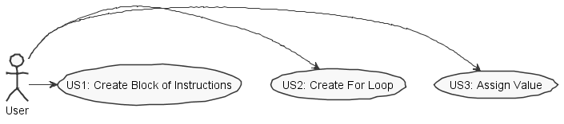
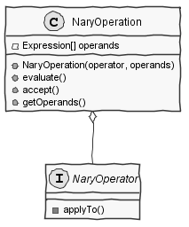
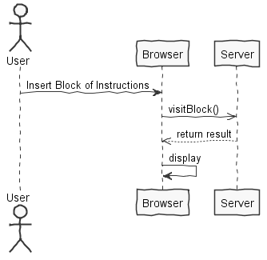
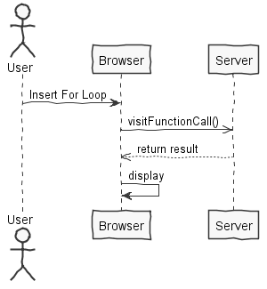
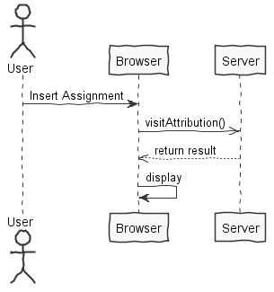
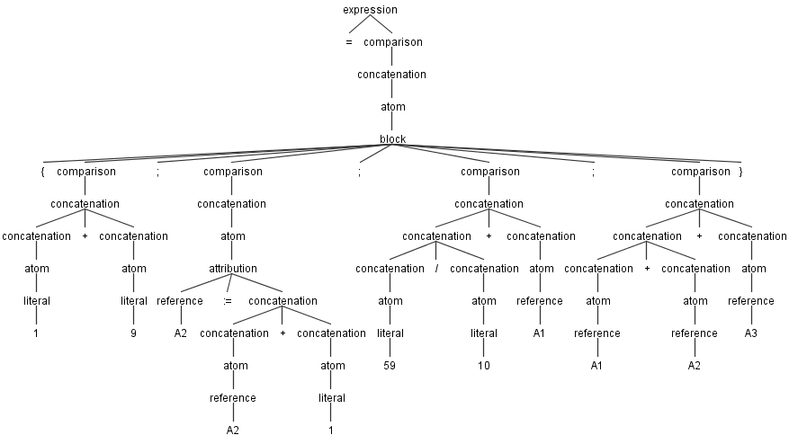
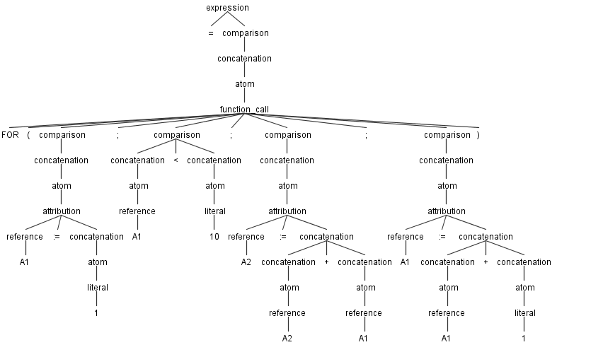
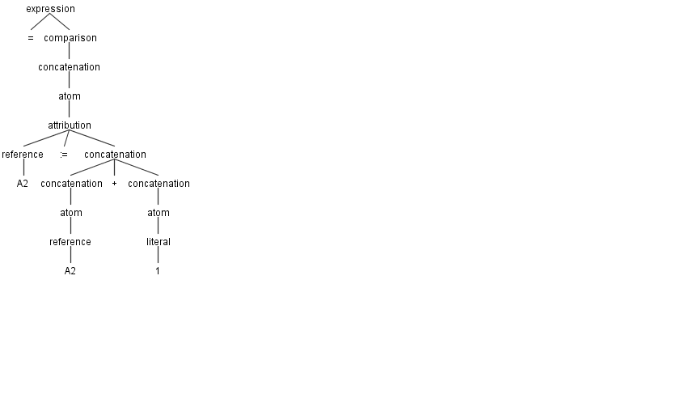
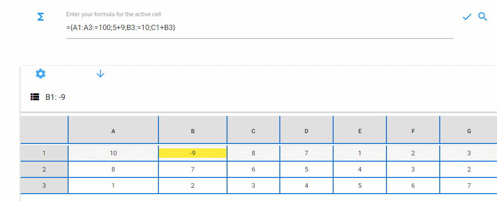

**Miguel Santos** (1161386) - Sprint 1 - Lang 01.1
===================================================

# 1. General Notes

The initial part of the sprint was very regrettable in terms of understanding the project itself, with particular emphasis on the grammar, parser and visitors. It took a long time to finally get the hang of it.

After too many hours of debugging I couldn't find the correct way to implement the for loop, since I wasn't able to make the parser run the applyTo method in the For class. Anyway, I'm almost sure that if it entered this method it would return the correct loop values.

During the sprint I helped colleagues with their features but did not implement any of them single handedly. A lot of "healthy" discussion with team members helped the development of ideas and possibilities to be implemented in the project.

# 2. Requirements

Lang 01.1 - Add the possibility of writing blocks (or sequences) of instructions. A block must be delimited by curly braces and its instructions must be separated by ";". The instructions of a block are executed sequentially and the block "result" is the result of the last statement of the block. For example, the formula "= {1+ 2; sum (A1:A10); B3 + 4 }" must result in the sequential execution of all expressions and the result is the value of the expression "B3 + 4". Add the assign operator (its symbol is ":="). This operator assigns to its left the result of the right expression. At the moment the left of the assign operator can only be a cell reference. The FOR loop should also be implemented based on instruction blocks. For example, the formula"= FOR {A1: = 1 ; A1<10; A2: = A2 + A1; A1: = A1 + 1 }" executes a for loop in which: the first expression is the initialization, the second term is the boundary condition, all other expressions are performed for each iteration of the loop.

Proposal :

US1 - As a User of the Application, I want to create a block of instructions, executed sequentially with a single result.

US2 - As a User of the Application, I want to be able to create for loop instructions.

US3 - As a User of the Application, I want to be able to assign a value to one or more cells.

# 3. Analysis

For this feature increment, I need to:

- Understand how the application works and also understand the key aspects of GWT, since it is the main technology behind the application.

- Understand how the instructions insertion works

- Understand how functions work so that I can implement the for loop.

- Understand how the language parser iterates the given grammar.

- Understand how visitors work.

## 3.1. Project Structure

**Modules**. From the pom.xml file we can see that the application is composed of 5 modules:  
- **server**. It is the "server part" of the web application.  
- **shared**. It contains code that is shared between the client (i.e., web application) and the server.   
- **nsheets**. It is the web application (i.e., Client).  
- **util**. This is the same module as the one of EAPLI.  
- **framework**. This is the same module as the one of EAPLI.

## 3.2. Analysis Diagrams

**Use Cases**

**Domain Model (for this feature increment)**

**System Sequence Diagrams**

**For US1**

**For US2**

**For US3**

# 4. Design

**SSD**

 

Note:
- The diagram only depicts the less technical details of the scenario;

## 4.1. Tests

There are three types of tests.
Unit Tests, Antlr4 grammar tests and functional tests
Unit Tests could not be implemented to ensure language is working since workbook has dependencies on Cell that has dependencies on CellImpl has dependecies on Value.parseValue(), and this last one depends on GWT library.
So it's not possible to test languages directly with domain objects.

**Grammar tests with antlr4:**

**Instructions Block**

- Example: ={1+9;A2:=A2+1;59/10+A1;A1+A2+A3}

**For Loop**

- Example: =FOR{A1:=1;A1<10;A2:=A2+A1;A1:=A1+1}

**Attribution**

- Example: =FOR{A1:=1;A1<10;A2:=A2+A1;A1:=A1+1}

## 4.2. Requirements Realization

- Need a grammar for interpretation.

- Need an expression of expressions {block}.

- Need a visitor to assignments to cells.

- Need a condition in function call visitor in case it is a for loop.

- Need a n-ary operator to facilitate the block instruction implementation. 

## 4.3. Classes

* **Attribution**: This class implements a Binary Operator that is visited by the parser while parsing Attribution token. It has the function of returning the value that is going to be assigned to the cell by the Parser.

* **Block**: This class implements Nary Operator that is visited by the parser while visiting Block token. It has the role of returning the last value of a given block of instructions that is going to be assigned to the selected cell by the Parser.

* **For**: This class implements Function that is visited by the parser while visiting function_call token. It has the role of evaluating all the instructions to the right of the condition and init parameters.

## 4.4. Design Patterns and Best Practices

Design patterns used:

* Visitor

* Singleton

* Factory

* Strategy

* Command

Best pratices used:

* Single Responsability Principle

* Dependency Inversion Principle

* Open/Closed Principle

* High Cohesion

* Low Coupling

# 5. Implementation

**For US1**

Apart from the Block class, it was required the implementation of a visitor in the FormulaEvalVisitor class so that the parser could evaluate all the instructions inserted in the block and return the last command value to be assigned to the cell.

        @Override
        public Expression visitBlock(FormulaParser.BlockContext ctx) {
            if (ctx.LBRACKET() != null) {
                try {
                    Expression expressions[] = new Expression[ctx.getChildCount() / 2];

                    for (int i = 1; i < ctx.getChildCount(); i += 2) {
                        expressions[i / 2] = visit(ctx.getChild(i));
                    }

                    NaryOperator operator = this.language.getNaryOperator(ctx.getChild(0).getText());
                    return new NaryOperation(operator, expressions);
                } catch (UnknownElementException ex) {
                    Logger.getLogger(FormulaEvalVisitor.class.getName()).log(Level.SEVERE, null, ex);
                }
            }
            return visitChildren(ctx);
        }

**For US2**

The for loop uses the visitor already implemented in the FormulaEvalVisitor: visitFunctionCall(), so it wasn't necessary to implement nothing else besides the For class itself.
The following condition was added to visitFunctioncall() in order to process the information in case the function is of type *For loop*:

        if (function != null) {
                if (ctx.LBRACKET() == null) {
                    try {
                        List<Expression> args = new ArrayList<>();
                        if (ctx.getChildCount() > 3) {
                            for (int nChild = 2; nChild < ctx.getChildCount() - 1; nChild += 2) {
                                args.add(visit(ctx.getChild(nChild)));
                            }
                        }
                        Expression[] argArray = args.toArray(new Expression[args.size()]);
                        return new FunctionCall(function, argArray);
                    } catch (IllegalFunctionCallException ex) {
                        addVisitError(ex.getMessage());
                    }
                }else{
                    try {
                    Expression expressions[] = new Expression[(ctx.getChildCount() / 2) - 1];
                    for (int nChild = 2, i = 0; nChild < ctx.getChildCount(); nChild += 2, i++) {
                        expressions[i] = visit(ctx.getChild(nChild));
                    }
                    Function operator = this.language.getFunction(ctx.getChild(0).getText());
                    return new FunctionCall(operator, expressions);
                } catch (UnknownElementException ex) {
                    addVisitError(ex.getMessage());
                } catch (IllegalFunctionCallException ex) {
                    Logger.getLogger(FormulaEvalVisitor.class.getName()).log(Level.SEVERE, null, ex);
                }
                }

**For US3**

In addition to the Attribution class, it was necessary to implement a visitor in the FormulaEvalVisitor class so that the parser could evaluate the expression and return the value to be assigned to the cell.

        @Override
        public Expression visitAttribution(FormulaParser.AttributionContext ctx) {
            if (ctx.ATTRIB() != null) {
                if (ctx.VAR() == null) {
                    try {
                        if (ctx.getChild(2).getChildCount() > 2) {
                            BinaryOperator operator2 = this.language.getBinaryOperator(ctx.getChild(2).getChild(1).getText());
                            BinaryOperation operation = new BinaryOperation(visit(ctx.getChild(2).getChild(0)), operator2, visit(ctx.getChild(2).getChild(2)));

                            BinaryOperator operator = this.language.getBinaryOperator(ctx.getChild(1).getText());
                            return new BinaryOperation(visit(ctx.getChild(0)), operator, new Literal(operation.evaluate()));
                        } else {
                            BinaryOperator operator = this.language.getBinaryOperator(ctx.getChild(1).getText());
                            return new BinaryOperation(visit(ctx.getChild(0)), operator, visit(ctx.getChild(2)));
                        }
                    } catch (FormulaCompilationException ex) {
                        Logger.getLogger(FormulaEvalVisitor.class.getName()).log(Level.SEVERE, null, ex);
                    } catch (IllegalValueTypeException ex) {
                        Logger.getLogger(FormulaEvalVisitor.class.getName()).log(Level.SEVERE, null, ex);
                    }
                } else {
                    Value val;
                    try {
                        val = visit(ctx.concatenation()).evaluate();
                        TemporaryVariable var = new TemporaryVariable(ctx.getChild(0).getText(), val);
                        if (!list.contains(var)) {
                            list.add(var);
                        } else {
                            visit(ctx.getChild(2));
                        }

                    } catch (IllegalValueTypeException ex) {
                        Logger.getLogger(FormulaEvalVisitor.class.getName()).log(Level.SEVERE, null, ex);
                    }
                }
            }
            return visitChildren(ctx);
        }

**Code Organization**

Followed the recommended organization for pakcages whenever possible.

Project **shared**:

- pt.isep.nsheets.shared.lapr4.blue.s1.lang.n1161386.formula.lang

- pt.isep.nsheets.shared.lapr4.blue.s1.lang.n1161386.formula2

- Added methods in class: pt.isep.nsheets.shared.core.formula.compiler.FormulaEvalVisitor

- Some minor methods implemented in classes that implement NaryOperator.

# 6. Integration/Demonstration

Efforts and good ideas were combined with other members of *Lang* team.

**Demonstration**

# 7. Final Remarks

Despite all the work done in this sprint I wasn't able to finish all the features.

- For loop is half implemented, the expression works but the visitor does not work properly.

- In a future work it is necessary to implement the for loop with success.

# 8. Work Log

**Most Relevant Commits**

- [Documentation](https://bitbucket.org/lei-isep/lapr4-18-2dc/commits/3bff179b0ecfc4e46ef08d05917042a18b9ea1d9)

- [Attribution](https://bitbucket.org/lei-isep/lapr4-18-2dc/commits/c73890e2481ad2803812198ee04b2ecaf24f5e67)

- [Attribution Modifications](https://bitbucket.org/lei-isep/lapr4-18-2dc/commits/2d9175d76635386a3691cca27dc593adc90466e2)

- [Attribution Modifications](https://bitbucket.org/lei-isep/lapr4-18-2dc/commits/4e7f0eb77fb3c8fe3319e67f66d350758717c626)

- [Changing needed classes](https://bitbucket.org/lei-isep/lapr4-18-2dc/commits/a9ab0e1a4fe6d6b19d2eed80ecc5de63729212f6)

- [Block of Instructions](https://bitbucket.org/lei-isep/lapr4-18-2dc/commits/69e157819b17ddcd1e02ea65fef819aa36abdf64)

- [N-ary operator/operation](https://bitbucket.org/lei-isep/lapr4-18-2dc/commits/7e9ed81df169e28c921c0b6163bc88e7928a3c9a)

- [For Loop](https://bitbucket.org/lei-isep/lapr4-18-2dc/commits/1a0154d4f8d6a1975ecd99506e229c2a33fe3ee0)

- [Function Call Condition](https://bitbucket.org/lei-isep/lapr4-18-2dc/commits/960050639a974a8d8f39f2c2545b0a5224b3e2e6)

- [Documentation](https://bitbucket.org/lei-isep/lapr4-18-2dc/commits/0d34232fd9df85fc4272b75c53f0866a74ec33cd)