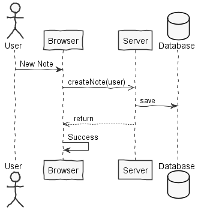
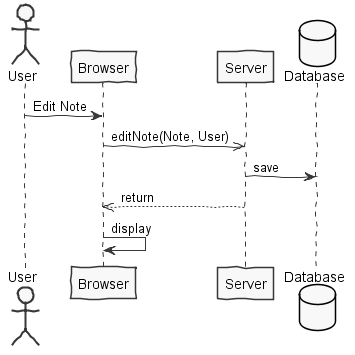
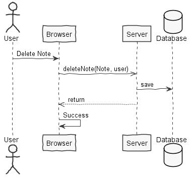
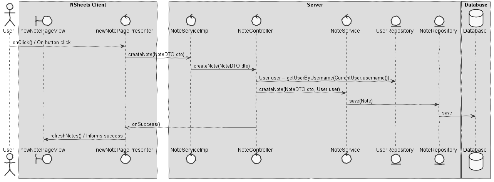
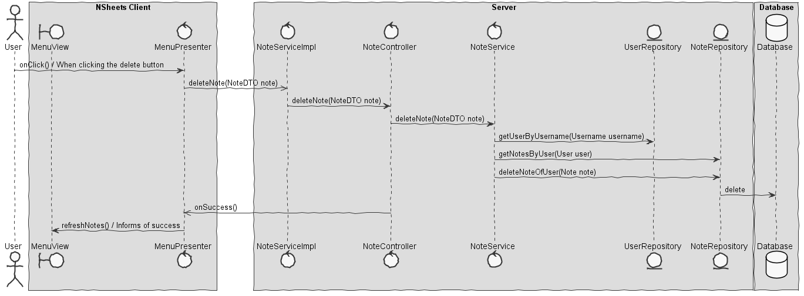
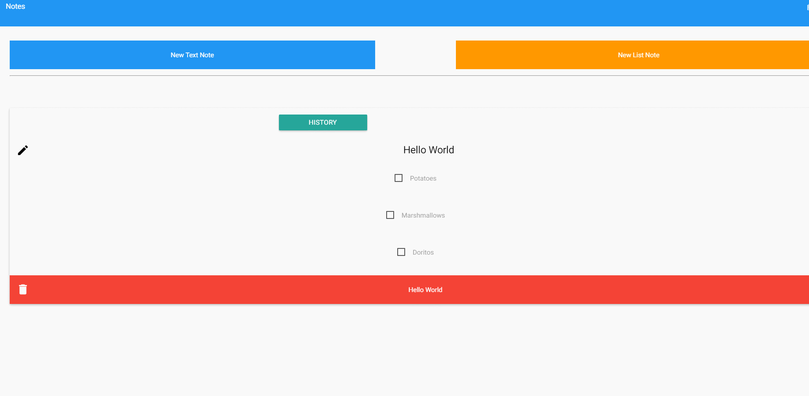

**Miguel Santos** (1161386) - Sprint 2 - Core 07.2
===================================================

# 1. General Notes

The first two days of the sprint were taken to attempt a complete finish of my first sprint in Lang01.1. The for loop was almost implemented with success as I was able to make the program enter the applyTo method in the For class. Unfortunately, the for loop just enters an infinite loop that was taking to much time to fix, even with the help of Lang teacher. With that in mind, I moved on to this sprint actual feature: Notes.

In this sprint I compromised myself to finish my colleague sprint 1 feature, implementing the text note versions and if possible to accomplish all my feature for list notes. During the sprint I helped colleagues with their features but did not implement any of them single handedly. A lot of "healthy" discussion with team members helped the development of ideas and possibilities to be implemented in the project.

After one day understanding how the communication with UI works in the current project, I finally started implementing my uc.This was not an easy task since the project progress was being reverted every hour. Every time I wanted to commit my changes I would need to clone the project again so I wouldn't merge and delete a lot of classes I didn't touch.

After a lot of hours trying to implement my changes, I didn't have much time left to complete all the features with good strategy implementation. I'm not pleased with the way the feature was implemented, but it's what I was able to accomplish in such a short period of time. All the features of sp1 and sp2 were completed with success.  

# 2. Requirements

Core07.2 - Lists - It should be possible to create, edit and remove list notes. A list note is similar to a textual note but each line is displayed as a check box (that can be checked or unchecked). The first line is also interpreted as the title of the list note. It should be possible to generate a new version of a text note or list based on an old version of it. When this happens, the application should "open" the new version for edit with the same contents of the old version. This is the only "trace" that may eventually link to the old version.

Proposal :

US1 - As a User of the Application I want to be able to create list notes when I am anywhere in the application and save it for later review.

US2 - As a User of the Application I want to be able to edit list notes.

US3 - As a User of the Application I want to be able to delete list notes.

US4 - As a User of the Application I want to be able to save all the history editions of a note and create a new note based on that information.

# 3. Analysis

For this feature increment, I need to:

- Understand how the application works and also understand the key aspects of GWT, since it is the main technology behind the application.

- Understand how UI works with GWT in the project

- Understand how Text Notes are implemented from Core Sprint 1.

- Understand how Services are implemented.

- Understand how the menu is implemented to add a new button for the notes.

## 3.1. Project Structure

**Modules**. From the pom.xml file we can see that the application is composed of 5 modules:  
- **server**. It is the "server part" of the web application.  
- **shared**. It contains code that is shared between the client (i.e., web application) and the server.   
- **nsheets**. It is the web application (i.e., Client).  
- **util**. This is the same module as the one of EAPLI.  
- **framework**. This is the same module as the one of EAPLI.

## 3.2. Analysis Diagrams

**Use Cases**

**Domain Model (for this feature increment)**

No need of new domain classes were needed in this feature increment.

**System Sequence Diagrams**

**For US1**

**For US2**

**For US3**

**For US4**

# 4. Design

**For US1**

 

**For US2**

 

**For US3**

 

**For US4**

 

Note:
- The diagram only depicts the less technical details of the scenario;

## 4.1. Tests

Regarding tests we try to follow an approach inspired by test driven development. However it is not realistic to apply it for all the application (for instance for the UI part). Therefore we focus on the domain classes and also on the services provided by the server.

**Domain classes**

For the Domain classes we will have a class that represents the entity **Note**. This entity will have attributes that are refered by the client, as follows:
	
	- title (string)
	- description (string)
	- timestamp (date)
    - versions (LinkedList<NoteDTO>)

And an extra field to associate the note to the user:

	- user (User)

**Test:** We should ensure all methods within the Note class are working and do not give wrong information. In this particular case titles like "" and descriptions like "" were allowed, simply because if the user was to insert "" into the title or description the UI wouldn't allow it, making it less one thing to have to test for, since nothing else uses Note.

	@Test
    public void testDefineNoteTitle() {
        System.out.println("defineNoteTitle");
        String title = "";
        User user = new User(new Username("test"),new Password("test"), new Email("test@test.com"), "Admin");
        Note instance = new Note("","", user);
        instance.defineNoteTitle(title);
        assertTrue((instance.toDTO()).getTitle().equals(""));
    }

    /**
     * Test of defineNoteDescription method, of class Note.
     */
    @Test
    public void testDefineNoteDescription() {
        System.out.println("defineNoteDescription");
        String description = "";
        User user = new User(new Username("test"),new Password("test"), new Email("test@test.com"), "Admin");
        Note instance = new Note("","", user);
        instance.defineNoteDescription(description);
        assertTrue((instance.toDTO()).getDescription().equals(""));
    }

    /**
     * Test of fromDTO method, of class Note.
     */
    @Test
    public void testFromDTO() {
        System.out.println("fromDTO");
        NoteDTO dto = new NoteDTO("", "",new Date(), "");
        User user = new User(new Username("test"),new Password("test"), new Email("test@test.com"), "Admin");
        Note expResult = new Note("","",user);
        Note result = Note.fromDTO(dto, user);
        assertEquals((expResult.toDTO()).getTitle(), (result.toDTO()).getTitle());
    }

    /**
     * Test of toDTO method, of class Note.
     */
    @Test
    public void testToDTO() {
        System.out.println("toDTO");
        
        User user = new User(new Username("test"),new Password("test"), new Email("test@test.com"), "Admin");

        Note instance = new Note("","",user);
        String expResult = "";
        NoteDTO result = instance.toDTO();
        assertEquals(expResult, (result).getTitle());
    }

**Test Coverage**  
- The actual coverage for domain classes: 61%
- The actual coverage for application(controller) classes: 100%
 
- TODO: Add tests for controllers and persistences. 

## 4.2. Requirements Realization

- Need a service able to handle notes operations.

- Need a new page able to create List Notes.

- Need a drop down list to handle notes history with edited versions.

## 4.3. Classes

* **Note**: This class is the only needed class in terms of domain area of Notes implementation. It handles all the needed information in a note object. Comparing to last Note deployment in the first sprint, it now also includes the note type and a list of versions that contains all the note editions. It is cleary not the best way to implement versions since it's not single responsibility driven design and not a low-coupling method.

## 4.4. Design Patterns and Best Practices

Design patterns used:

* Singleton

* Factory

* Strategy

* Command

Best pratices used:

* Single Responsability Principle (not)

* Dependency Inversion Principle

* Open/Closed Principle

* High Cohesion

* Low Coupling (not)

# 5. Implementation

**For US1**

All the requirements for creating a note are the same as for a text note. The only diference is the type of note passed to the note object, according to the clicked button in the user interface.

**For US2**

Editing a note was not modified since all the code implemented in the last sprint is able to handle all types o notes.

**For US3**

Deleting a note wasn't also modified, since, as the editing option, it uses all the code already implemented in the previous iteration for text notes.

**For US4**

The way this use story was implemented is far from good, but it works. The object note itself contains a list of versions, by other words, a list of notes, from the previous editions of the original note. When an edition is made, a clone is generated from the original note, before the new changings are commited. This way, It is possible too use the same database table for all the features needed, although it is not the best way to implement it.

    public Boolean editNote(NoteDTO dto, String newTitle, String newDescription) throws DataConcurrencyException, DataIntegrityViolationException {
            String username = dto.getUser();
            List<Note> list = getNotesByUser(username);
            Username u = new Username(username);
            User user = repo.findUserByUsername(u);
            for (Note n : list) {
                if ((n.toDTO()).getTitle().equals(dto.getTitle()) && (n.toDTO()).getDescription().equals(dto.getDescription())) {
                    Note note = new Note(newTitle, newDescription, new Date(), user, n.toDTO().getNoteType(), n.toDTO().getVersions());
                    note.addVersion(dto);
                    noteRepository.save(note);
                    return Boolean.TRUE;
                }
            }
            return Boolean.FALSE;
        }

        public Boolean addVersion(NoteDTO dto) throws DataConcurrencyException, DataIntegrityViolationException {
            String username = dto.getUser();
            List<Note> list = getNotesByUser(username);
            for (Note n : list) {
                if ((n.toDTO()).getTitle().equals(dto.getTitle()) && (n.toDTO()).getDescription().equals(dto.getDescription())) {
                    n.addVersion(n.toDTO());
                    noteRepository.save(n);
                    return Boolean.TRUE;
                }
            }
            return Boolean.FALSE;
        }

**Code Organization**

Followed the recommended organization for pakcages whenever possible.

**Created Packages:**

Project **nsheets**:

- pt.isep.nsheets.client.application.newListPage (created from scratch)

**Updated Packages:**

Project **Shared**:

- pt.isep.nsheets.server.lapr4.red.s1.core.n1161391.notes.persistence: contains the persistence/JPA clases 

**Updated Packages:**

Project **Server**:

- pt.isep.nsheets.server.lapr4.red.s1.core.n1161391.notes.application: contains the controllers  

- pt.isep.nsheets.server.lapr4.red.s1.core.n1161391.notes.domain: contains the domain classes  

# 6. Integration/Demonstration

Efforts and good ideas were combined with other members of *Core* team.

**Demonstration**

# 7. Final Remarks

All the features were implemented with success, including those that weren't finished from previous sprint.

- Unfortunately the code implemented is not low-coupled and single responsability driven, since the Note class handles much more information than a common domain class must handle.

- The note versions should be an aggregate of notes so that the process of note creation and version saving could be smoother.

- In a future work it is necessary to improve the way the implementation was done.

# 8. Work Log

**Most Relevant Commits**

- [Implementing list notes](https://bitbucket.org/lei-isep/lapr4-18-2dc/commits/3f9f3853a0ce1d22c90dcfb7c37a30a73697af4b)

- [Checkboxes added](https://bitbucket.org/lei-isep/lapr4-18-2dc/commits/f1f75a7e78613cbb055c0d742b63d8e52bc1e292)

- [Implementing Version on Notes](https://bitbucket.org/lei-isep/lapr4-18-2dc/commits/6203efa4894e4d52630b129851ad623d6f5fbf22)

- [Note versions finished](https://bitbucket.org/lei-isep/lapr4-18-2dc/commits/2ee4e50a34eedb7a389563aa102c9145bb1c897a)

- [Documentation](https://bitbucket.org/lei-isep/lapr4-18-2dc/commits/405156e7166c5678a8a7945b56aa5065de1e29d8)

