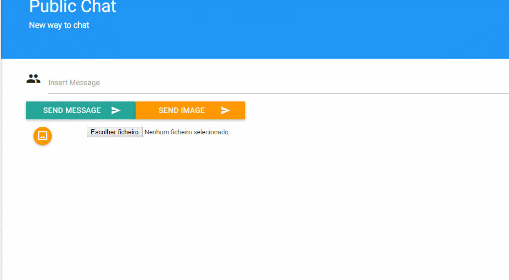

**Miguel Santos** (1161386) - Sprint 2 - IPC 08.3
===================================================

# 1. General Notes

This sprint was the most pacific to work in. During the week there were few or none reverts to the version control of the project which led to a more secure working environment.

All the use case features where implemented successfully.  

# 2. Requirements

IPC08.3 - Full Chat - Users should be able to post Images and make mentions of other users (they should receive a notification email if they are not online).

Proposal :

US1 - As a User of the Application I want to be able to send images trough the application's chat.

US2 - As a User of the Application I want to be able to mention a user that gets notified if not online.

# 3. Analysis

For this feature increment, I need to:

- Understand how application's chat is implemented.

- Understand what needs to be used to upload images.

- Understand how to create an url to the uploaded image.

- Find a simple library to get email sending implemented.

## 3.1. Project Structure

**Modules**. From the pom.xml file we can see that the application is composed of 5 modules:  
- **server**. It is the "server part" of the web application.  
- **shared**. It contains code that is shared between the client (i.e., web application) and the server.   
- **nsheets**. It is the web application (i.e., Client).  
- **util**. This is the same module as the one of EAPLI.  
- **framework**. This is the same module as the one of EAPLI.

## 3.2. Analysis Diagrams

**Use Cases**

**Domain Model (for this feature increment)**

Only a simple sending email class was implemented to get a more organized environment.

**System Sequence Diagrams**

**For US1**

**For US2**

# 4. Design

**For US1**

 

**For US2**

 

Note:
- The diagrams only depict the less technical details of the scenario;

## 4.1. Tests

Regarding tests we try to follow an approach inspired by test driven development. However it is not realistic to apply it for all the application (for instance for the UI part). Therefore we focus on the domain classes and also on the services provided by the server.

Many functional tests where made but, since any domain classes were added to the project in order to implement this feature, there was no need to create unit tests.

## 4.2. Requirements Realization

- Need a controller able to connect the ui to email sending class.

- Need a upload servlet to upload images to server.

- Need a tag to mention users.

- Need a java library capable of creating emails in a easy way.

## 4.3. Classes

* **SendEmail**: This class was the only implemented in order to access a way to send emails. It imports the simple java email libary whose dependencies were added to the pom.xml of the **Server** project. It allows a simple method to create an email, receiving the user name and email address to wich the email is going to be sent when he is inactive and got mentioned by other user.

In order to have an email capable of sending the emails, it was created a simple mail.com email for the application: nsheets@mail.com
It's login info is the following:
Username: nsheets
Password: qwerty1234

## 4.4. Design Patterns and Best Practices

Design patterns used:

* Factory

* Strategy

* Command

Best pratices used:

* Single Responsability Principle

* Dependency Inversion Principle

* Open/Closed Principle

* High Cohesion

* Low Coupling

# 5. Implementation

**For US1**

In order to upload the images to the server, two servlets were used: UploadServlet and ImageServlet, already implemented in the project for the user image changing. The user selects the image that is going to be uploaded and when the *Send Image* button is pressed, an url to the image location is created and given to the MaterialImage widget that can present the image saved in that url.

**For US2**

When an user is mentioned by *@(username)*, the CharPresenter handles the string in order to get the user username from it. The chat service then contains a simple method that creates a controller in order to send the email. The controller gets the UserDTO from the database, checking if it is online in the application. In case the user is offline, the controller then creates a new SendEmail object from the class created that takes care of sending the email as it's name suggests, in order to notify the user that he has pending messages in the application's chat.

    public class SendEmail {

        private Email email;
        private Mailer mailer;
        

        public SendEmail(String userEmail, String username) {
            email = EmailBuilder.startingBlank()
                    .from("nsheets", "nsheets@mail.com")
                    .to(username, userEmail)
                    .withSubject("Test")
                    .withPlainText("Hello! You have pending messages in nsheet's chat!")
                    .buildEmail();

            mailer = MailerBuilder
                    .withSMTPServer("smtp.mail.com", 587, "nsheets@mail.com", "qwerty1234")
                    .withTransportStrategy(TransportStrategy.SMTP)
                    .buildMailer();
        }

        public boolean send() {
            try{
            mailer.sendMail(email);
            } catch(Exception e){
                return false;
            }
            return true;
        }

    }

**Code Organization**

Followed the recommended organization for packages whenever possible.

**Updated Packages:**

Project **nsheets**:

- pt.isep.nsheets.client.application.chat :
    * ImageForm

Project **Shared**:

- pt.isep.nsheets.shared.services : 
    * ChatService
    * ChatServiceAsync

**Updated Packages:**

Project **Server**:

- pt.isep.nsheets.server.services : 
    * ChatServiceImpl

- pt.isep.nsheets.server.lapr4.green.s1.ipc.n1161261.chat.application :
    * SendEmailController
    * ChatService
    * PublicChatService

# 6. Integration/Demonstration

Efforts and good ideas were combined with other members of *Core* team.

**Demonstration**

# 7. Final Remarks

All the features were implemented with success.

- In order to have a good implementation of the image upload, it would be nice to have a proper server to upload the images instead of saving them locally.

# 8. Work Log

**Most Relevant Commits**

- [Adding file explorer](https://bitbucket.org/lei-isep/lapr4-18-2dc/commits/029116acba40691d2a3df53f5d725c7a58230706)

- [Send images finished](https://bitbucket.org/lei-isep/lapr4-18-2dc/commits/497ab4079caec4fb46e3294a1af7b126347c6757)

- [Adding user mentions](https://bitbucket.org/lei-isep/lapr4-18-2dc/commits/6bce13e7a2a016a7ef65e7bba8b124ee871bf7a8)

- [Simple Java Mail Library added](https://bitbucket.org/lei-isep/lapr4-18-2dc/commits/2203e8f1b53ebec20afb3d0d1962d44913d5e3fd)

- [Send Email implementation](https://bitbucket.org/lei-isep/lapr4-18-2dc/commits/268737f9eb5e51b5d0814d61f4c4df4c1c7467db)

- [Chat finished](https://bitbucket.org/lei-isep/lapr4-18-2dc/commits/64fd68c71a5f314252be64c67ab7d7c8b7f58c3e)

- [Documentation](https://bitbucket.org/lei-isep/lapr4-18-2dc/commits/4aa637a0ed4316fb5ebee67d4cf6035b4ce51cd1)