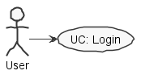
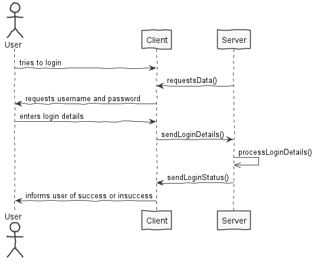
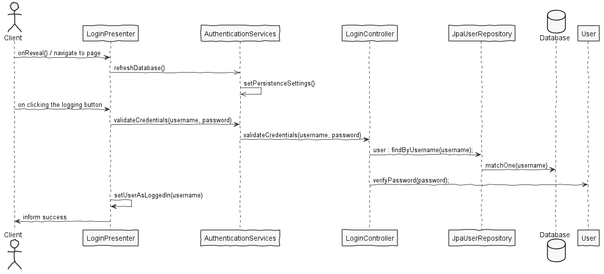

**Rui Almeida** (1160818) - Sprint 1 - IPC01.1
===============================

# 1. General Notes

My feature is implemented and fully functional. One aspect that could've been improved is handling various user
sessions at one time. 

Multiple hours of work time were invested studying how the GWT API works, e.g the services and its structure.
Various working hours were also spent learning and deepening the knowledge of GWTP Gatekeeping. I also spent a lot of time
helping several colleagues, before finishing my use case, and even more after finishing it, as my free time was now spent
helping them and fixing bugs/holes in the program.

# 2. Requirements

IPC01.1 - User Authentication

All the pages of the application should require an authenticated user (except the "About" page). 
The application should have a "Login" page (Hint: Gatekeepers in GWTP). 
Some hard-coded users should be defined to be initially used for authentication. 
There should also exist a super-user that is able to access everything.

# 3. Analysis

For this feature increment, since it is the first one to be developed in a new project I need to:

- Understand the basic functionality of the whole application and how it's organized.

- Since the use of gatekeepers is required, using GWTP, I need to learn and deepen the knowledge of the technology I'm unfamiliar with.

- Understand how the login page fundamentally works:

    - How to connect the login page with the database.

    - How and where to implement a login page and design it.
    
- Since I need to add some hard-coded users, I need to study the bootstrap and database technology the application uses.

## 3.4 Analysis Diagrams

**Use Cases**

**System Sequence Diagrams**

# 4. Design

**Sequence Diagram**

## 4.1. Tests

There wasn't a lot of testing to do, as in its core the use case is simple.

Two types of testing were used this sprint: Functional and Unit testing.

For the functional tests, I tried to find bugs with the login by trying various inputs, e.g empty username,
username and no password, logging out without logging in and vice-versa, etc..

As for the unit testing:

Only the domain classes and the controller were tested, with the methods relative to my Use Case.
Namely: User, Email, Username, Password and LoginController.

The domain classes User, Email Username and Password were tested, but the ones worth mentioning might be:

- The User domain class tests the verifyPassword method as it's crucial to the login. It's a simple test, but important nonetheless, as it only tests if two strings are equal.
- The LoginController makes a call to the database to find an user given its username. So a test-run-only database was created, where we save
an User and try to find that same user by the username, and verify if it validates the login correctly.

# 5. Implementation

No special configuration files were used, the only exception being web.xml and persistence.xml that are required
to be edited.

The code is spread through the packages: shared, server, nsheets and bootstrap.

The nsheets module has:
 * The Application Login Presenter, View, UIHandler and Module.
 * The CurrentUser and LoggedInGateKeeper implementation.
 
The server has:
 * The domain classes - User with the value objects: Username, Password, Email, Role and LoginController.
 * The JpaUserRepository implementation and the UserRepository.
 * A service that returns the current persistence properties.
 * The implementation of the User Authentication Service (AuthenticationServiceImpl)
 
The shared module has:
 * The ApplicationService and ApplicationServiceAsync classes.
 
The program, when the user tries to login, runs a request through the server and checks if the username
and password match the ones stored in the database. If they do, the user is validated and is able to login,
allowing access trough the rest of the program, as logging in also unlocks the gatekeeper.

# 6. Work Log

Some commits are not shown here. Those commits were directed at hotfixing, bugfixing and general improvements in the program, and they were
not relevant to this issue.

Commits:

[Documentation Initialization #b76ffde](https://bitbucket.org/lei-isep/lapr4-18-2dc/commits/b76ffdeffb8242a4bde8a81ec1715edbb5ef8742)

[Added puml images and analysis #f3376be](https://bitbucket.org/lei-isep/lapr4-18-2dc/commits/d7a6643f75c4df0d0df7451fa4a71917ce6eaec7)

[Domain Classes and Persistence #3c527ca](https://bitbucket.org/lei-isep/lapr4-18-2dc/commits/43f31f30ffed65b96a588862a14907cc8d0eb27b)

[Front-End design of Login Page #beeea4d](https://bitbucket.org/lei-isep/lapr4-18-2dc/commits/e61fe9db2fe26f32418bbcc0cc55fbaa488dfaad)

[Fixed annotations for user class #e7cd0b8](https://bitbucket.org/lei-isep/lapr4-18-2dc/commits/cdc21f4aa3f483ed41c0aa818eefb25794ce992d)

[Persisted User in the database #c70af59](https://bitbucket.org/lei-isep/lapr4-18-2dc/commits/4b3ff123974cebbc8f5f4a561f49a66483713944)

[Implemented basic login functionality #c5d5ca2](https://bitbucket.org/lei-isep/lapr4-18-2dc/commits/e477e0b6fc73fcb959fc234c906cc603cd2d1a22)

[Implemented Gatekeeping v1](https://bitbucket.org/lei-isep/lapr4-18-2dc/commits/3d0da3a7adb12e174e5d5b8d98fd84190923a511)

[Implemented Gatekeeping v2](https://bitbucket.org/lei-isep/lapr4-18-2dc/commits/2bca23efa1d67eb9c7430be507cee43c351632c3)

[Implemented Unit Testing](https://bitbucket.org/lei-isep/lapr4-18-2dc/commits/5a1d379b37214c64ab8ae59db98d13c831b8a3f0)

[Added attributes to the class User: Contacts, Invitations and Blocked Users](https://bitbucket.org/lei-isep/lapr4-18-2dc/commits/1a730c8344920f04b577102d37e49f74cc7775c2)
