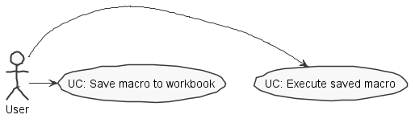
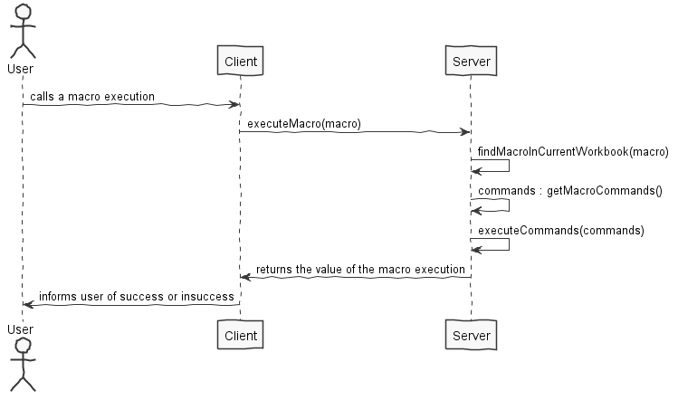
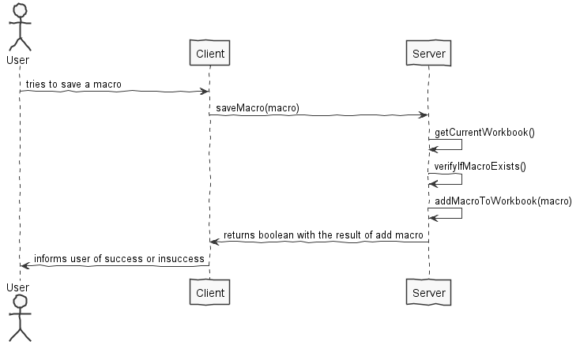
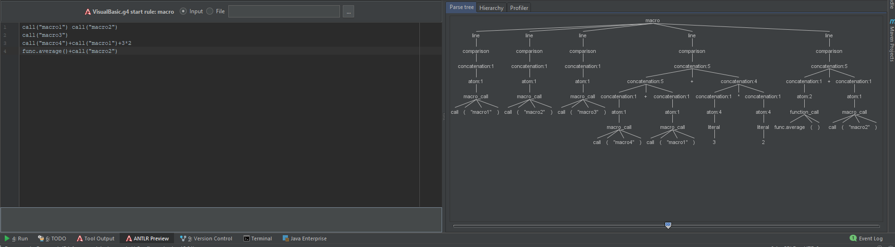
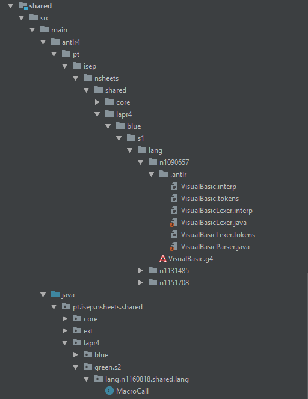
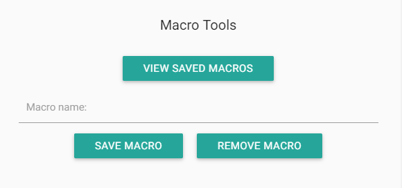
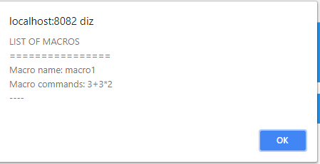
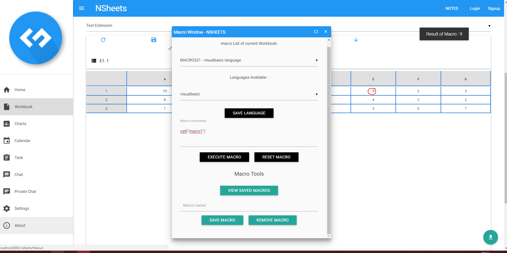
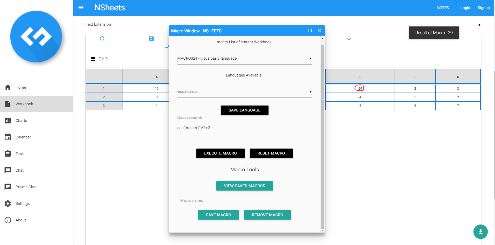

**Rui Almeida** (1160818) - Sprint 2 - Lang07.2
===============================

# 1. General Notes

I had a lot of trouble understand how the ANTLR interacts with the program. After figuring it out - thanks to 
my colleagues who previously worked on the lang functionalities - it was smooth sailing from there (kind of).

I also tried to help my colleagues as much as I could when they would come to me for help.

I also added some miscellaneous functionality to the program to support my use case which I'll talk about in a more detailed way below.


# 2. Requirements


* **Lang 06.2**

The application should now support multiple macros. 
Each macro should have a name and should be associated with an workbook. 
The grammar of the macros should also have a mechanism to support the invocation of macros. 
It only should be possible to invoke macros of the same workbook. Special attention should be devoted to recursion (i.e., avoiding infinite recursion).

* **Lang(07.2)**

This feature increment should have the same functionality as Lang06.2 but with the adaptations required by the syntax of the language.


# 3. Analysis


For this feature increment I need to:

* Understand how the ANTLR functionality communicates with the program and how it fundamentally works.

* Understand how macros are saved in the workbook and how to get them.

* Understand how to add a new functionality to the already written grammar and process it.

* Understand how to make that new functionality communicate with the user-interface (GWT)


## 3.4 Analysis Diagrams

**Use Cases**



**System Sequence Diagrams**

* **Use Case:** Call a saved macro 



* **Use Case:** Save a macro to workbook




# 4. Design


## 4.1. Tests

The tests made for this use case are purely functional. I tested with various inputs and resolved bugs on the go.

Some bugs I encountered for example: 

* Saving macros with the same name and calling that macro would crash the client. (Resolved)

* If the program would not find the macro in the workbook it would crash. (Resolved)

* Macros added through the UI would not be accessible in the shared/server-side (Resolved).

* Macros only save in memory, currently, when we save a macro to a workbook it does not persist. (Not Resolved - 
this is because I am dependent on another use case from my colleagues and cannot resolve it as of now, as the use case
is not totally working.)

**Grammar tests:**

The grammar accepts multiple inputs and ways of calling macros.



## 4.2. Classes
* **MacroCall**

  This class implements the Expression interface and the evaluate method. It is the core class
  for the execution of a macro call.
    
* **VisualBasic.g4**

    This is not a class, but rather a grammar file form ANTLR4, it contains the added grammar to support the macro
    executions.
    
* **VisualBasicEvalVisitor**

    This class contains the code which calls a new MacroCall upon visiting a macro execution, according to the grammar.

* **WorkbookView**

    This class contains the connects the UI and the solution to the use case.
    
* **Workbook**

    Class responsible of adding and storing the macros.
    

# 5. Implementation

##Misc

I added some miscellaneous functionality to support my use case such as:

* Saving macros to a workbook

* Removing saved macros from a workbook

* View all saved macros on the workbook

##Grammar

**Here I present the relevant changes to the grammar to accommodate for macro calls**

```
macro: line+;

line: comparison;

(...)

atom:
    macro_call
	| function_call
	| reference
	| literal
	| LPAR comparison RPAR
	| attribution;

(...)

macro_call:
    MACRO_START LPAR (STRING) RPAR;

(...)

SEMI: ';';
LPAR: '(';
RPAR: ')';

(...)

MACRO_START: 'call';
```

##Visitor Code

**This snippet visits the expression and verifies if it is a macro call. If it is a macro call, then instantiates a macro call.**

```

    @Override
    public Expression visitMacro_call(VisualBasicParser.Macro_callContext ctx) {
        if (ctx.MACRO_START() != null) {
            return new MacroCall(ctx.STRING(), cell);
        }

        return null;
    }

```

##Macro Call

**This class evaluates the macro call, verifies if the macro is stored in the workbook and executes the stored commands**


Instead of receiving an expression, the constructor receives a terminal node and the cell in question. This makes things easier
and avoids calling an evaluate for the name of the macro, thus avoiding one of the recursion problems. It also receives the cell so that
we can get the active workbook through it, and verify if the macro exists in the workbook, as shown in the second snippet. If it all goes well,
then we evaluate the expression and return the value to the UI. Otherwise, we return a null value.

```
public class MacroCall implements Expression {

    private TerminalNode name;
    private Cell cell;

    public MacroCall(TerminalNode name, Cell cell) {
        this.name = name;
        this.cell = cell;
    }
}
```

```
@Override
public Value evaluate() throws IllegalValueTypeException {
    Workbook wb = cell.getSpreadsheet().getWorkbook();

    String macroName = name.toString();

    for (Macro m : wb.macros()) {

        String savedMacroName = "\"" + m.name() + "\"";

        if (savedMacroName.equalsIgnoreCase(macroName)) {

            try {
                ExpressionCompiler compiler = MacroCompilerManager.getInstance().getCompiler("VisualBasic");
                Expression expression = compiler.compile(cell, m.commands());
                return expression.evaluate();
            } catch(FormulaCompilationException ex) {
                return null;
        }
     }

```

**My code resides all in the shared module, except the UI code that resides in the WorkbookView in the NSheets module**




# 6. Integration/Demonstration

##Misc





##Macro Execution






# 7. Work Log

Some commits are not shown here. Those commits were directed at hotfixing, bugfixing and general improvements in the program, and they were not related specifically to this issue.

Commits:

* [Re-implemented grammar to accomodate macro calls. Added macro list to workbooks. Tried to implement a simple visitor and added MacroCall class to evaluate the macro call.](https://bitbucket.org/lei-isep/lapr4-18-2dc/commits/68e4e880c9515cdc5c779c88e5faad20cbe67c38)

* [Removed hard-coded macros and implemented a functionality that allows the user to save macros to the current workbook. Modified the Macro UI accordingly. Bugfixed MacroCall class.](https://bitbucket.org/lei-isep/lapr4-18-2dc/commits/f1d3bd323f1a8c045588ff3fc173e350caa48c72)

* [Bugfixed a considerable number of bugs in the use case and added some functionality to the program (e.g show list of saved macros)](https://bitbucket.org/lei-isep/lapr4-18-2dc/commits/b91af2610261907824a98ce4ef8ab3baf80d40e2)

* [Added documentation for the use case](https://bitbucket.org/lei-isep/lapr4-18-2dc/commits/3d95882d24a0657e8f9db9b1a53eaa4ffb734f08)

* [Implemented remove macro](https://bitbucket.org/lei-isep/lapr4-18-2dc/commits/c0dcb0e6210861d2067927da8fd63db1a75631da)

* [Updated documentation to reflect code changes and updates](https://bitbucket.org/lei-isep/lapr4-18-2dc/commits/31fa940d7e72699504762dd8e118c5cf9d8f7cca)