**Rui Almeida** (1160818) - Sprint 3 - Core 05.3
===============================

# 1. General Notes

This use case is completely functional. After my experience with GWT, I did not have any trouble completing this use case.
Furthermore, I added some extra functions to silence the reminder, for example.
I found that there was no option to silence the reminder indefinitely.
So I implemented a new functionality that allows the user to do just that in the click
of a button.

# 2. Requirements

It should be possible to create, edit and remove reminders. 
The user is notified when the due date of the reminder arrives. 
A reminder has a name, a description and a time stamp (due date).
The application should only allow valid time stamps. The application should list all the existing reminders. 
When the due date of a reminder is reached the application should automatically display an alert to the 
user in a popup window. This popup window should display the name, description and due date of the reminder. 
The window should have two buttons. One button to close the window and the other button to remind again the 
user in a specific elapse of time (e.g., 5 minutes).

# 3. Analysis

**Use Cases**

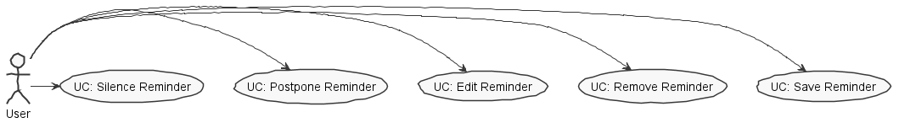

**System Sequence Diagrams**

* **Use Case:** Silence Reminder

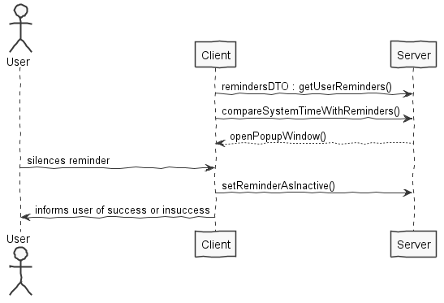

* **Use Case:** Postpone Reminder

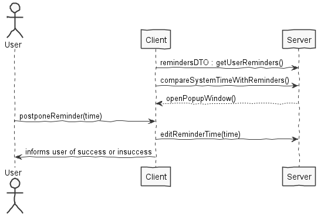

* **Use Case:** Edit Reminder

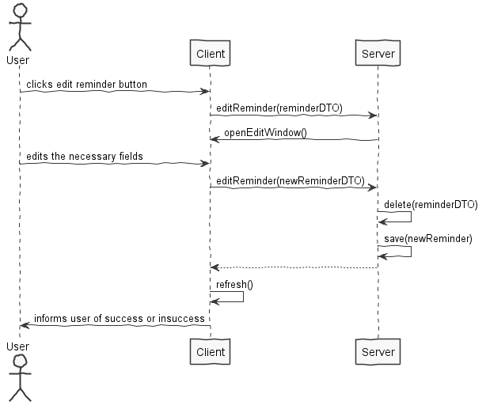

* **Use Case:** Remove Reminder

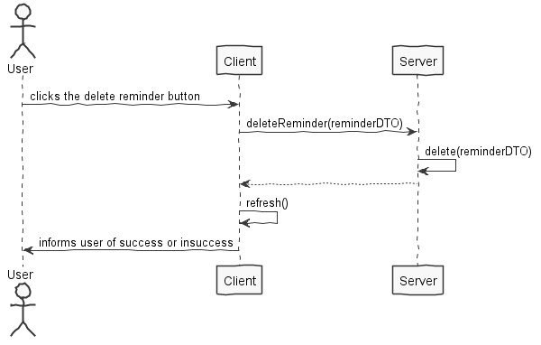

* **Use Case:** Create Reminder

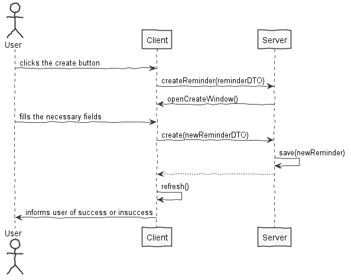

# 4. Design

##Sequence Diagrams

**Create Reminder**

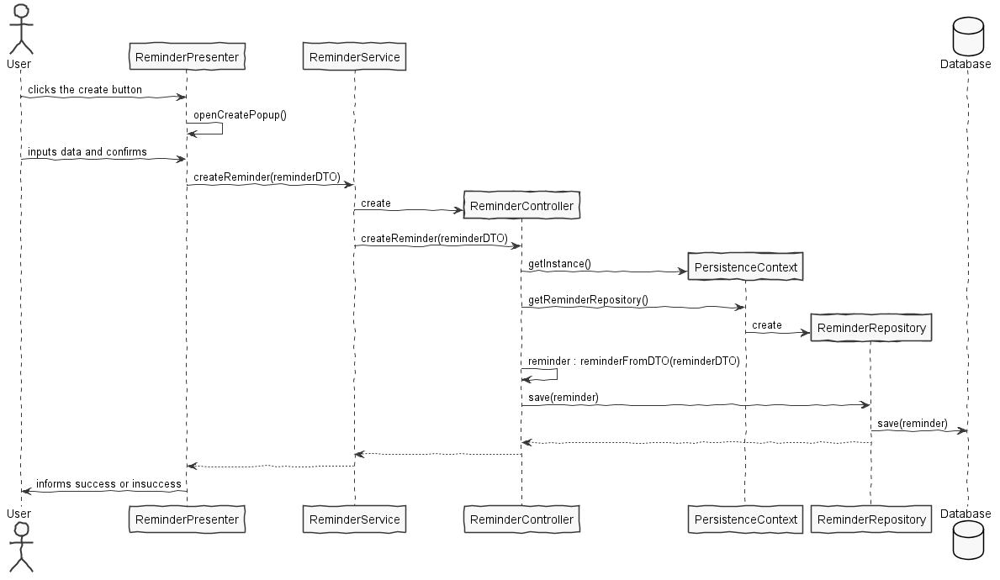

**Edit Reminder**

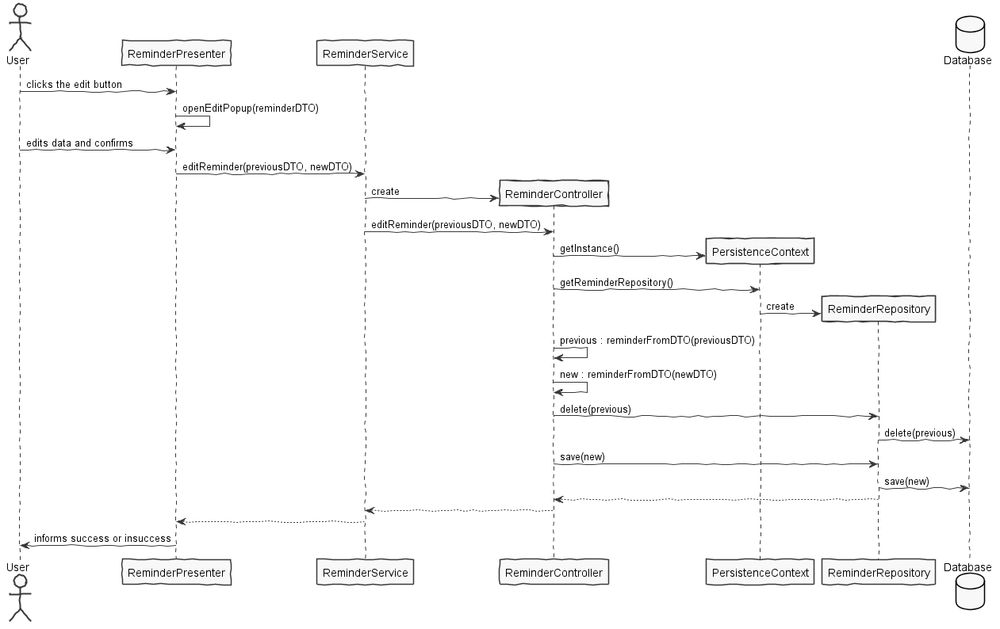

**Remove Reminder**

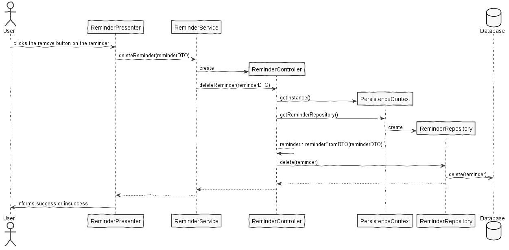

##Class Diagram

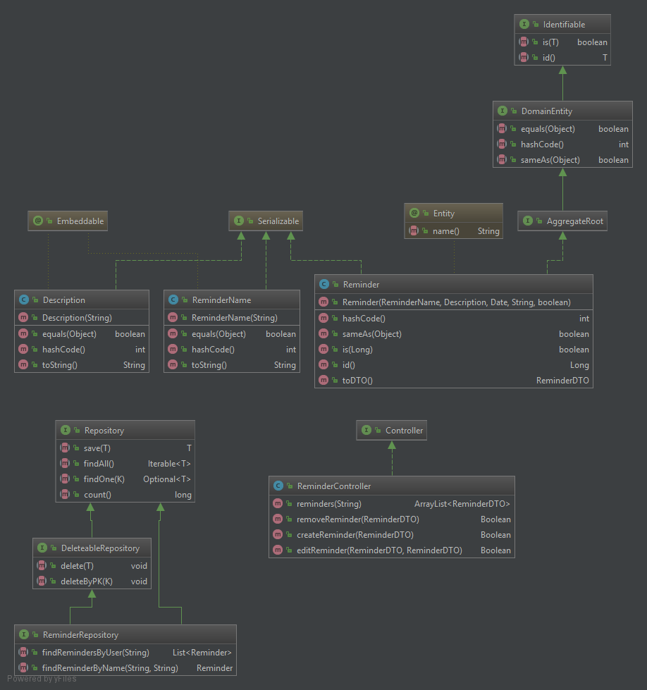

## 4.1. Tests

The tests made for this use case were purely functional. 

I could not do database tests as the program would
crash on them, due to problems with the workbook @Entity tag. However, I still implemented what I think
would be reasonable unit testing as commented code. 

I did not encounter, however, any bugs with the program
with my testing, the only exception being a small bug where the program would allow
the creation of reminders with a "null" date. That however, was promptly identified and
fixed while testing.

I tried deleting, editing, removing, adding reminders with the same names, adding null while
creating, for example.

## 4.2. Requirements Realization

**All the necessary requirements were implemented.**
 
* The program can edit, create and remove reminders. 

* It also notifies the user when the due date of the reminder arrives. 

* As requested, the reminder has a name, a description and a timestamp. 

* There is a reminder tab that lists all of the reminders.

* The popup window displays the name, the description and the due date of the reminder.

* The popup window has a postpone option with a set of hard-coded timestamps, as requested
and allows the user to silence the reminder indefinitely as well.

## 4.3. Classes

*Present and describe the major classes of you solution.*

* **Reminder**

    The core class of the use case. It contains all the information of the reminder,
    and the necessary methods.
    
* **ReminderDTO**

    Used between server - client communication.

* **ReminderName**

    Contains the name of the reminder. This class exists for the sake of future-proofing.
    If the requirements change and we need to add some kind of filter to the names,
    this class serves that exact purpose.

* **Description**

    Same objective as the class above (See ReminderName).

* **ReminderView / ReminderPresenter / ReminderUIHandlers / ReminderModule**

    Classes that have the Reminder user-interface code and serve as a gateway
    for the client interaction to the server.

* **ReminderService / ReminderServiceAsync / ReminderServiceImpl**

    Services responsible for calling the controller between the client and the server.

* **ReminderController**

    Class that holds the responsibility of editing, creating and removing reminders.
    It's the class where we implement our core functionalities.

* **MenuView / MenuPresenter**

    Class that holds the popup window that opens in any page of the application.

# 5. Implementation

The program also creates a new thread on the MenuView (this menu is application-wide) that loads all of the
user's reminders and verifies if we need to alert the user to any of them. This process runs on a separate thread,
similar to the logic of the public and private chat, and runs on a fixed time interval. If we need to alert the user,
since we are using the MenuView - once again, application wide, we open a popup window that allows us to see the reminder,
it's due date and lets us postpone or silence it.

Creating and Removing the reminders is a very simple process, as the name of the reminders
are all unique. 

As such, when we're creating a reminder, the program verifies all the input the user
gives and validates it, most of it, if not all, in the interface. When the user clicks the
'create' button the program checks if that name is already on the database. If a search
through the database with that name returns nothing, then we're good to go!

Removing the reminder is an even simpler process, as we just find that reminder by
its name and delete it from the db.

Editing the reminder is a little more complex. The program takes the current reminder
in the database and deletes it. Right after that, saves a new a Reminder with the edited
and updated values.

For silencing the reminders, I added a boolean value to my Reminder class.
This boolean value is stored in the database, and every time we silence a reminder
we have to edit that same reminder in the db as well.

Furthermore, there is an username associated with every Reminder, so the reminders are private
and only the creator has access to them.

As for the code organization, my 'core' code - namely, the domain classes - reside in the
server as shown below:

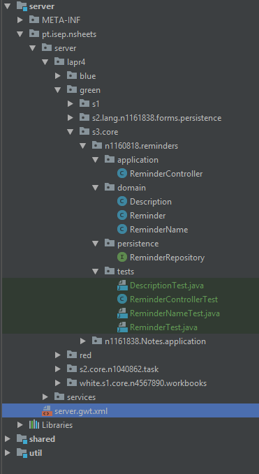;

# 6. Integration/Demonstration

**The edit menu**

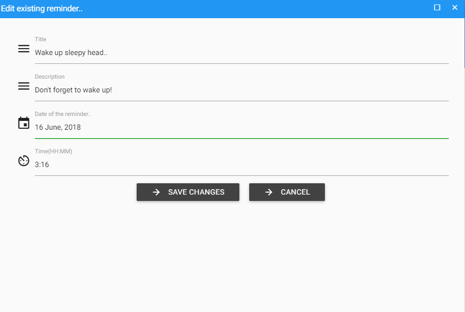

**Full Reminder Menu**

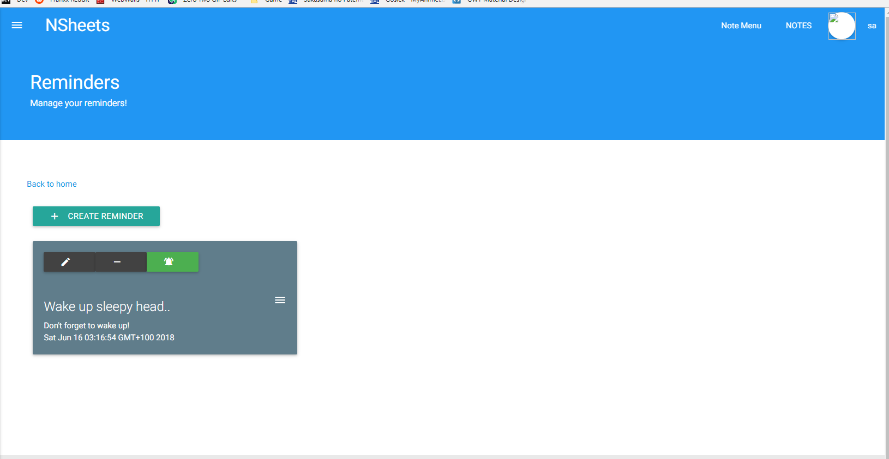

**Popup Window**

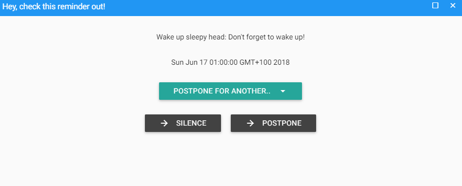

**Silencing the reminder**

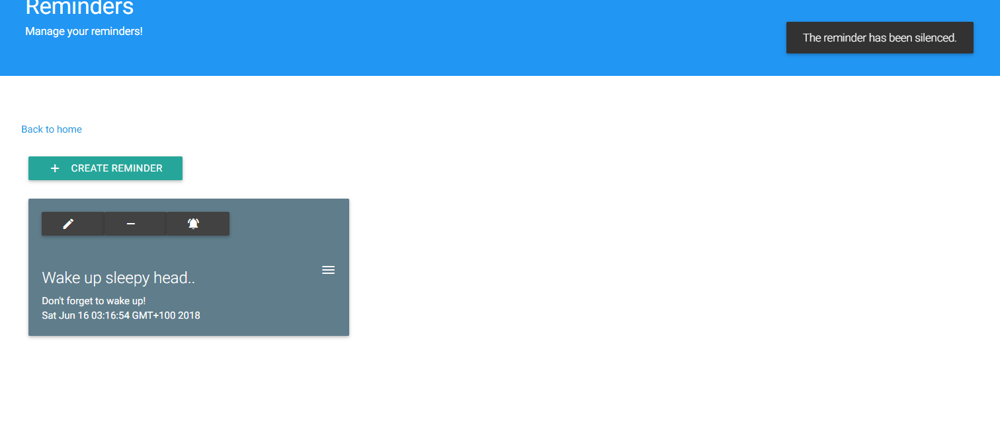

# 7. Work Log

Some commits are not shown here. Those commits were directed at hotfixing, bugfixing and
general improvements in the program, and they were not related specifically to this issue.
 
Commits:

[Added domain classses, implemented user-interface, implemented repository, boostrapped some reminders, added reminderDTO, added reminder services.](https://bitbucket.org/lei-isep/lapr4-18-2dc/commits/a9947989449fc6178fb3d92d83513ee771a04977)

[Implemented create, edit and remove functionalities. Finished implementing UI. @Todo - watchdog for reminders](https://bitbucket.org/lei-isep/lapr4-18-2dc/commits/721760677910bf794decca99e1d8e2cda06f0759)

[Implemented watch dog for reminder.](https://bitbucket.org/lei-isep/lapr4-18-2dc/commits/47f062ec3f5dd542b1d14f1099a6f13615fcfdbf)

[Implemented dropdown menu for postponing the reminder.  Added boolean to the reminder to verify if it is active or not. Added a functionality to silence/reactive reminder notifications.](https://bitbucket.org/lei-isep/lapr4-18-2dc/commits/7c742deb3b2d2b242cbbe798cf524b78cabab1f0)

[Added documentation. Hotfixed reminders so users can have their own private reminders with the same name as other users.](https://bitbucket.org/lei-isep/lapr4-18-2dc/commits/53700528842ed0b3db84353bd39dc748abed6219)

[Added more documentation - sequence diagrams and class diagramas](https://bitbucket.org/lei-isep/lapr4-18-2dc/commits/cda52038cded3e2d011d19e4e4f7214f76127f66)