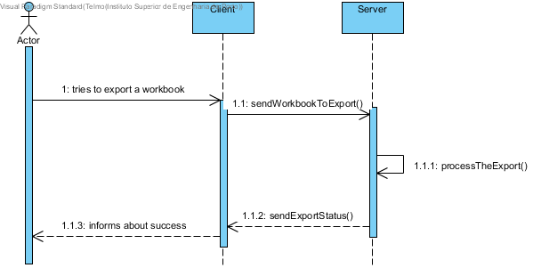
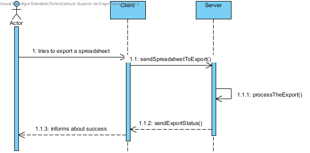
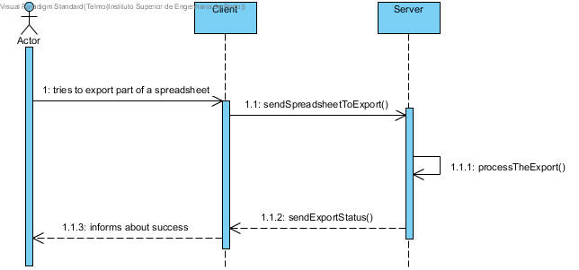
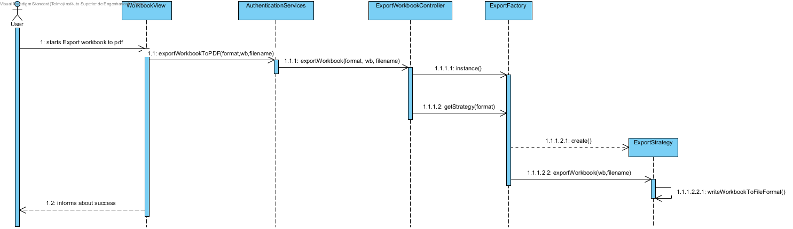
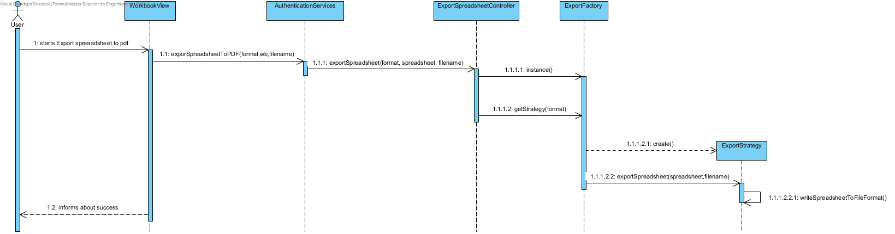
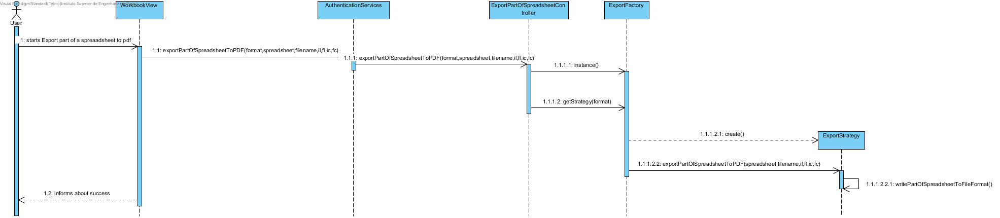

**Telmo Coelho** (1160864) - Sprint 1 - IPC3.1
===============================

# 1. General Notes

My feature is not fully implemented and not fully functional because i can't communicate between controller and ui.

# 2. Requirements

*In this section you should describe the requirements for this sprint.*

#####Requirements description:

      IPC 03.1: "It should be possible to export to PDF an entire workbook, a spreadsheet or a range of cells. The contents should include only the values of the cells (and not its formulas, for instance). The user should be able to select the content to be exported and also if the document should have a table of contents with links to the sections or not. If select, sections/chapters should be generated for each spreadsheet of the workbook. The generated PDF should be downloaded to the user local file system."

#### Proposal:

###### USER STORIES:

1. Export To PDF:
    - US1 - As default user i want to export an entire workbook
    - US2 - As default user i want to export only a spreadsheet
    - US3 - As default user i want to export part of a spreadsheet

# 3. Analysis

*In this section you should describe the study/analysis/research you developed in order to design a solution.*

For this feature increment, since it is the first one to be developed in a new project I need to:

- Understand how the application works and how is implemented.

- Understand the key aspects of GWT, since it is a new thing for us.

- Understand how the Home Page is implemented.

- Understand how the Workbook UI works.

- Understand how i can communicate between UI and controllers.

## 3.4 Analysis Diagrams

**Use Cases**

**System Sequence Diagrams**

**US1**

**US2**

**US3**

# 4. Design

**Sequence Diagrams**

**US1**

**US2**

**US3**

## 4.1. Tests

*In this section you should describe the design of the tests that, as much as possibe, cover the requirements of the sprint.*

**Test Coverage**

No Unit tests were done in this implementation. It is important to do the unit test after this UC was fixed!

## 4.2. Classes

*Present and describe the major classes of you solution.*

- WorbookView.java
- WorkbookView.ui.xml
- ExportToPDFService.java
- ExportToPDFServiceAsync.java
- ExportToPDFServiceImpl.java
- web.xml
- ExportWorkbookController.java
- ExportSpreadSheetController.java
- ExportPartOfSpreadsheetController.java
- ExportFactory.java
- ExportFormats.java
- ExpotStrategy.java
- ExportToPDF.java

## 4.3. Design Patterns and Best Practices

*Present and explain how you applied design patterns and best practices.*

- Strategy

# 5. Implementation

*If required you should present in this section more details about the implementation. For instance, configuration files, grammar files, etc. You may also explain the organization of you code. You may reference important commits.*

No special configuration files were used, the only exception being web.xml and pom.xml to add a library to export to pdf.

The code is spread through the packages: shared,server and nsheets.

The nsheets module has: WorkbookView , WorkbookView.ui.xml.

The server module has: The implementation of ExportToPDFService. The implementation of controllers (ExportWorkbookController, ExportSpreadSheetController, ExportPartOfSpreadsheetController). And also have the implementation of strategy(ExportFactory, ExportFormats, ExportStrategy,ExportToPDF).

The shared module has: The implementation of services(ExportToPDFService, ExportToPDFServiceAsync)

# 6. Work Log

*Insert here a log of you daily work. This is in essence the log of your daily work. It should reference your commits as much as possible.*

Commits:

[Alteration on web.xml for use casa ExportToPDF](https://bitbucket.org/lei-isep/lapr4-18-2dc/commits/c6ea797d91ac4ceb9857507338050270f00288b0)

[Alteration on path that were exports are saved on use casa export to pdf](https://bitbucket.org/lei-isep/lapr4-18-2dc/commits/85e63969c54a2474a4859db8f9e4e60cd3a14f58)

[Creating services to implement export to PDF](https://bitbucket.org/lei-isep/lapr4-18-2dc/commits/f45bcffae4c815a014bb2a31c8271edae0ee9bc0)

[Methods relative to export to PDF](https://bitbucket.org/lei-isep/lapr4-18-2dc/commits/5cb6dcad9ff11f3077af5f1159bb8cc3cbb35c8b)

[Creating Ui to export for PDF](https://bitbucket.org/lei-isep/lapr4-18-2dc/commits/b993ea5450d8d5d62ac735fbea67e64eba6d39a8)

[Implementatio of strategy to exports](https://bitbucket.org/lei-isep/lapr4-18-2dc/commits/a3ce77f5f1c46b6d5ba75f4045f1ce7a40b89f62)

[Docs ipc 3.1](https://bitbucket.org/lei-isep/lapr4-18-2dc/commits/65c81f34eb25e4d9c6fbbef1085d99b308f37379)

[Add images and full documentation of Use Case IPC 3.1](https://bitbucket.org/lei-isep/lapr4-18-2dc/commits/7d076c15b0291783ef409233bc5f0367a348b6b0)

[Add methods to ExportToPDFServices](https://bitbucket.org/lei-isep/lapr4-18-2dc/commits/789fd5c916bfbabbb2cce936fb5e23269a0f554e)

[Action of button export to PDF](https://bitbucket.org/lei-isep/lapr4-18-2dc/commits/24f13bccac32af971cce621441014e5901783d57)

[Add method to export part of spreadsheet to PDF](https://bitbucket.org/lei-isep/lapr4-18-2dc/commits/91dbf7ea42654beba7b567adf5f427a9cc8eefe5)
