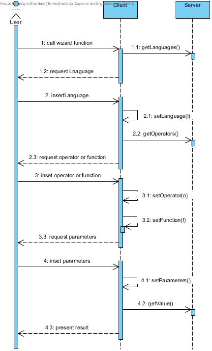

**Telmo Coelho** (1160864) - Sprint 2 - LANG4.2
===============================

# 1. General Notes

*In this section you should register important notes regarding your work during the sprint. For instance, if you spend significant time helping a colleague or if you work in more than one feature increment.*

My feature is not fully implemented and fully functional. The main problem on the resolution of this use case is the creation of TextBoxes for each parameter.

# 2. Requirements

*In this section you should describe the requirements for this sprint.*

*This is simply an example of documentation*

#####Requirements description:

Lang04.2 - Insert Function Intermediate Wizard

The wizard window should display an edit box for each parameter of the selected function. The user should use these edit boxes to enter the values for each parameter of the function. As the user enters the values the wizard should display (in a new region of the window) the result of the execution of the formula or a message explaining the problem. The function list should now include also the operators as well as the functions that are dynamically loaded from java.lang.Math. The wizard should be now launched from an icon or button located in the "formula bar".

# 3. Analysis

*In this section you should describe the study/analysis/research you developed in order to design a solution.*

For this feature increment, since it is the first one to be developed in a new project I need to:

- Understand how the first sprint was done by colege.

- Understand the requirements of my use case.

- Understand how i will implement the requirements of new sprint.

## 3.4 Analysis Diagrams

The main idea for the "workflow" of this feature increment.

**Use Cases**

**System Sequence Diagrams**

**US1**

# 4. Design

*In this section you should present the design solution for the requirements of this sprint.*

**Sequence Diagrams**

## 4.1. Tests

*In this section you should describe the design of the tests that, as much as possibe, cover the requirements of the sprint.*

No Unit tests were done in this implementation. The test are already implemented!

## 4.2. Classes

- WorbookView.java
- WorkbookView.ui.xml
- Language.java
- Operator.java
- CellImpl.java

# 5. Implementation

*If required you should present in this section more details about the implementation. For instance, configuration files, grammar files, etc. You may also explain the organization of you code. You may reference important commits.*

No special configuration files were used, the only exception being web.xml.

The code is spread through the packages: shared, and nsheets.

The nsheets module has: WorkbookView , WorkbookView.ui.xml.

The server module has: To get Languages ("Language.java"), to get operators (Operator.java), to get value of result(CellImpl.java).

# 6. Work Log

*Insert here a log of you daily work. This is in essence the log of your daily work. It should reference your commits as much as possible.*

Commits:
