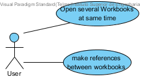
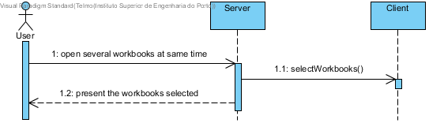
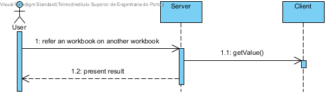
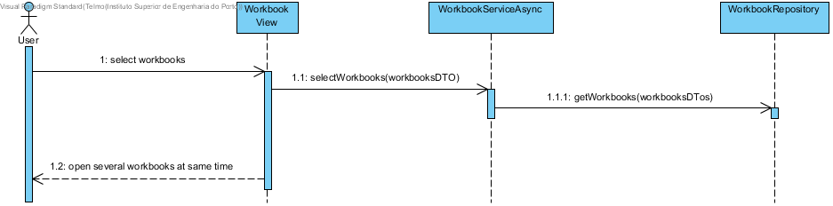

**Telmo Coelho** (1160864) - Sprint 3 - CORE1.3
===============================

# 1. General Notes

*In this section you should register important notes regarding your work during the sprint. For instance, if you spend significant time helping a colleague or if you work in more than one feature increment.*

This use case is not implemented because in last iteration the responsible of use case core1.2 doesn t complete the use case. So i have to do use case Core1.2.s

# 2. Requirements

*In this section you should describe the requirements for this sprint.*

*This is simply an example of documentation*

#####Requirements description:

It should be possible to open several workbooks at the same time. It should be possible to make references between workbooks in the formulas.

#### Proposal:

###### USER STORIES:

- US1 - As default user i want to open several workbooks at the same time
- US2 - As default user i want to make references between workbooks

# 3. Analysis

*In this section you should describe the study/analysis/research you developed in order to design a solution.*

For this feature increment, since it is the first one to be developed in a new project I need to:

- Understand what my colleague as done.

- Understand how the persistence of workbooks work.

## 3.4 Analysis Diagrams

**Use Cases**

**System Sequence Diagrams**

**US1**

**US2**

# 4. Design

*In this section you should present the design solution for the requirements of this sprint.*

**Sequence Diagrams**

**US1**

## 4.1. Tests

*In this section you should describe the design of the tests that, as much as possibe, cover the requirements of the sprint.*

No test coverage because use case is not implemented

# 5. Implementation

*If required you should present in this section more details about the implementation. For instance, configuration files, grammar files, etc. You may also explain the organization of you code. You may reference important commits.*

Can not do this point because use case is not implemented.

# 6. Work Log

*Insert here a log of you daily work. This is in essence the log of your daily work. It should reference your commits as much as possible.*

Commits:
