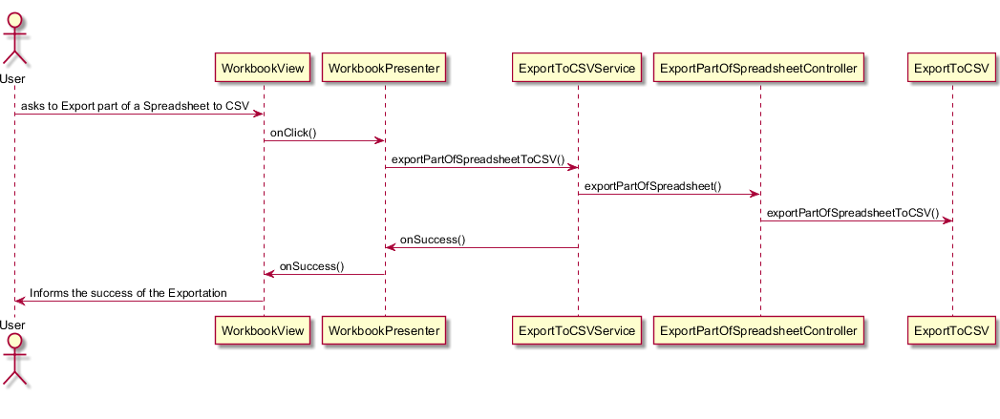

**Ricardo Sousa** (1160900) - Sprint 1 - IPC5.1
===============================

# 1. General Notes

*In this section you should register important notes regarding your work during the sprint. For instance, if you spend significant time helping a colleague or if you work in more than one feature increment.*

# 2. Requirements

IPC05.1 - Export a workbook, spreadsheet or part of a spreadsheet to a csv file.

It can be split in 3 User stories:

US1: As an user I want to export a workbook to csv.

US2: As an user I want to export a spreadsheet to csv.

US3: As an user I want to export a part of a spreadsheet to a csv file.

# 3. Analysis

As it is the first increment for me in this project I need to understand:

How the application works. 

Learn how CSV files work.

## 3.4 Analysis Diagrams

For the 3 US the analysis diagram is equivalent. For that reason, only the one for exporting a workbook will be presented. 

# 4. Design
US1:

US2:

US3:

## 4.1. Tests

Functional test couldn't be made due to missing collegue's work.

 

## 4.2. Requirements Realization

*In this section you should present the design realization of the requirements.*

## 4.3. Classes

The major classes of this UC are the exportToCSV class that implements all the methods to make the exportation. The exportStrategy and Factory , altough not made by me are also key classes for my UC to work with good practices.
In the connection beetween the  controllers and UI the ExportToCSVService and ExportToCSVServiceAsync are also important so that there is asyncronous work in the server.
At last all that is on the UI is in the View and presenter classes, as explained below.

## 4.4. Design Patterns and Best Practices

For the implementation of the exportation to CSV files It was used the Strategy Pattern so that it is possible to export to other types of files. The interface made for the exportation is also used for the exportation to PDF and XML.
We also used the Factory Pattern.
# 5. Implementation

As said in the previous parts of this document , the 3 US are equivalent. Thus, I will only speak about one, making only reference when needed to the others.

In the workbookview.xml I had to add all the UI elements (Such as text fields, buttons and windows). For that I gave an atribute uifield to each element.
After that, in workbookview.java we bind the objects with the xml by having a tag uifield with the same name as the attribute in the xml.

At last , the communication with the UI is made with async Services. Also, as Presenters should only depend on a View interface many methods were added there and implemented in Workbookview.java.

# 6. Integration/Demonstration

Exportation Controllers were made for the 3 exportations. UI common buttons were added by me.
Also the 3 buttons for each of the exportations were also made by me.

# 7. Final Remarks

Field Separators don't validate well the need of only one character allowed there;

# 8. Work Log

# Monday
I worked on:
1. having the meeting with the product owner

# Tuesday I worked on:
1. Analysis of the project
2. Analysis of the user story IPC05.1 - Export to csv
3. Documentation of the user story IPC05.1.

# Wednesday I worked on:
1. Frontend of the application(Creation of a button for the user to be able to choose the type of file he wants to export.

# Friday I worked on:
1. Learning how CSV works.
2. Implementing the exportation methods

#Saturday and Sunday I worked on: 
1. Getting the UI and Controller together.

