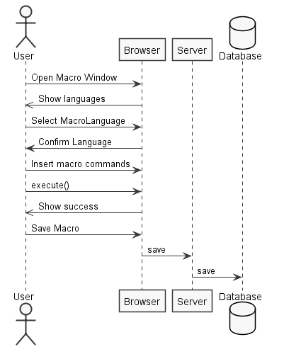
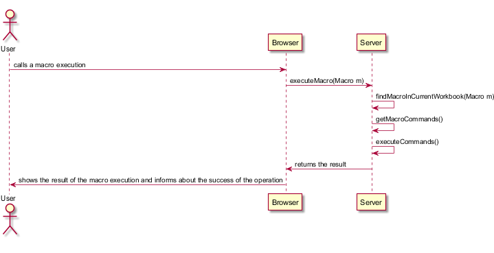
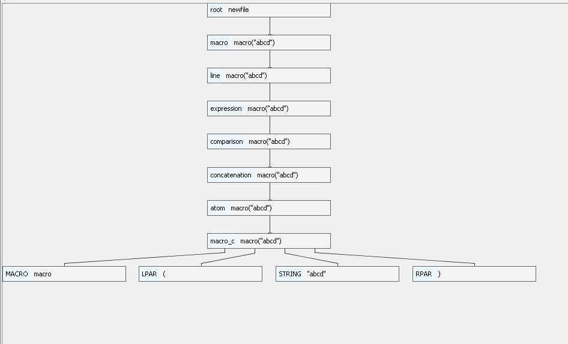

**Ricardo Sousa** (1160900) - Sprint 2 - LANG6.2
===============================

# 1. General Notes

No extra work was made on this Sprint.

# 2. Requirements

LANG06.2 - Multiple Macros

This requirement may be split in several user stories:

US1: As an user I want to be able to create a new macro so that I can call it in another macro.

# 3. Analysis

For this functionality I need to remember how to use ANTLR.

Also , I need to learn how an Excel language calls a macro.

## 3.4 Analysis Diagrams

The diagram keaps the same as in lang 6.1 the use case is the same there are only features added to it.

# 4. Design
Sequence Diagram

## 4.1. Tests

Functional tests were made while making the this sprint.
Also, the macro class has unitary test.
At last, antlr test were made to confirm that the grammar was correct. The tree parsed for the input macro("abcd") is as follows

 

## 4.2. Requirements Realization

Need to change the grammar so that it accepts the call of a macro.
Need to alter the language expecific visitor.
Need an UI capable of choosing language and executing a given code
Need an UI capable of showing errors, cause there are not unit tests available

## 4.3. Classes

The major classes of LANG6.2 are the macro class , the macroCallExcel class and The macroExcelVisitor class.

## 4.4. Design Patterns and Best Practices

For LANG6.2 the Visitor pattern was the most used one.I also used Singleton , Factory and Strategy patterns.

# 5. Implementation

The User stories depend on the MacroExcel grammar. There I added a macro call, with the Structure macro("macroName"), being macro a constant name for calling macros , and macro name a string started and ended with "".
It was needed to implement to the visitor and the macro call class itself the way a macro call was interpreted(calling the other macro when called, for instance).

# 6. Integration/Demonstration

Nothing important added used by other functionalities. This sprint was focused on making my functionality work.

# 7. Final Remarks

It is important to remark that , so that there is less ambiguity on the grammar, the way to call a function was changed. Now an equal before the name of the function is needed.

# 8. Work Log

# Monday
I worked on:
1. having the meeting with the product owner

# Tuesday I worked on:
1. Analysis of the project
2. Analysis of the user story Lang6.2

# Wednesday I worked on:
1. Edited the grammar for macroExcel

# Friday I worked on:
1. Changed the grammar 
2. Changed the visitor

#Saturday and Sunday I worked on: 
1. Getting the UI and Controller together.
2. Documentation