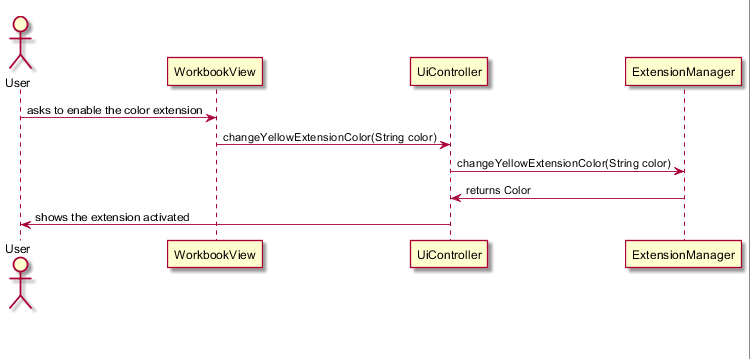
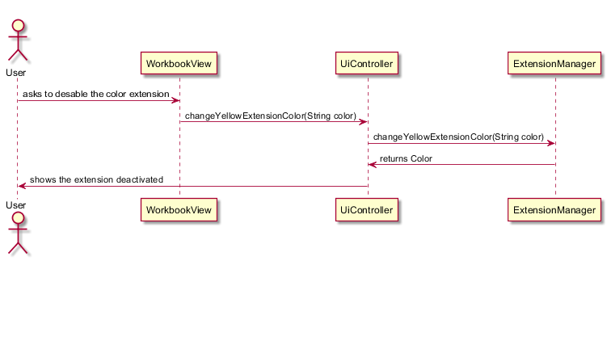

**Ricardo Sousa** (1160900) - Sprint 3 - CORE2.3
===============================

# 1. General Notes

Some of the sprint time was used to help my team make their functionalities

# 2. Requirements

CORE 2.3

This requirement may be split in several user stories:

US1: As an user I want to activate and deactivate a Style Extension

US2: As an user I want to activate and deactivate an Image Extension
# 3. Analysis

In this increment I need to learn how the extensions work, as I have never worked on them before.

# 4. Design
Sequence Diagram

## 4.1. Tests

Functional tests were made to check if the use case works.
No unitary tests were needed because they were already implemented.
 

## 4.2. Requirements Realization

Need to change the Extension to be able to be activatable
Need to change the UI so that the activation and deactivation is seen in the user interface context

## 4.3. Classes

The major classes of this increment are the UIController and the several implementations of the Extension class.
The uiController is the class that gets the extension information from the domain and gives it to the ui.

## 4.4. Design Patterns and Best Practices

    Singleton, Factory , Strategy

# 5. Implementation

This increment depends on the removal and insertion of the ui and domain content of the extensions. For example for the image extension the insertion and removal of the image from the cell, in a way that it can be readded by pressing the switch.
Material Switches were used so that there is a user friendly UI . 

# 6. Integration/Demonstration

Nothing was made more than my functionality. Just some help to my team

# 7. Final Remarks

Conditional Extensions are not yet implemented. No time was found to do so. But it will be something like removing the border(for example and adding it)

# 8. Work Log

# Monday
I worked on:
1. having the meeting with the product owner

# Tuesday I worked on:
1. Analysis of the project
2. Analysis of the user story CORE2.3

# Wednesday I worked on:
1. activating and deactivating the yellow extension

# Friday I worked on:
1. activating and deactivating the image extension

#Saturday and Sunday I worked on: 
1. Getting the UI and Controller together.
2. Documentation