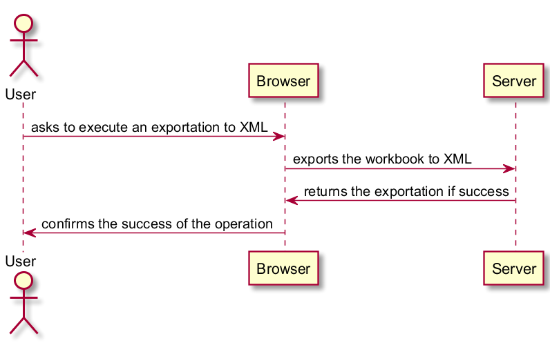
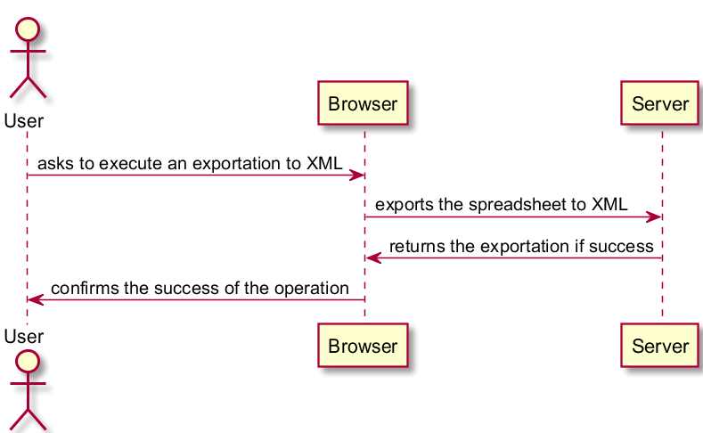
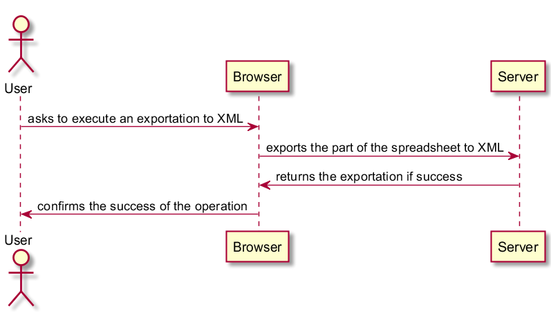
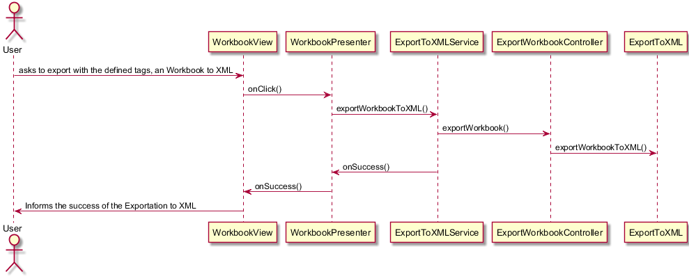
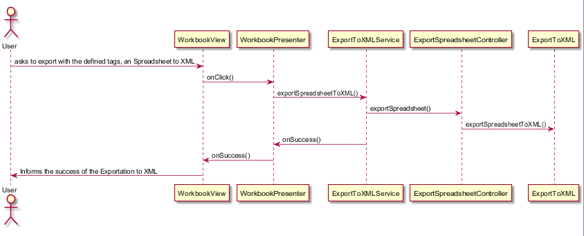
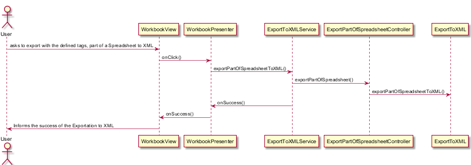

**Rafael Teixeira** (1160911) - Sprint 1 - IPC4.1 Export XML
===============================

# 1. General Notes

*In this section you should register important notes regarding your work during the sprint. For instance, if you spend significant time helping a colleague or if you work in more than one feature increment.*

# 2. Requirements

*Export to XML*

IPC04.1 - Export XML

It should be possible to export the contents of an workbook, spreadsheet or part of a spreadsheet to a XML file. As we want to optimize as much as possible the process the solution should not rely on any third party library. The application should have a window/page to configure the XML tags to use for each type of element. The export should only include the value of the cells. The generated XML should be downloaded to the user local file system.

We can further specify this textual requirements as user stories.

US1-As a user of the Application I want to be able to export a workbook and save it on the local system file.

US2-As a user of the Application I want to be able to export a Spreadsheet and save it on the local system file.

US3-As a user of the Application I want to be able to export a part of a Spreadsheet and save it on the local system file.

# 3. Analysis

The user must be authenticated in the application.
It was the first increment so it took some time to understand how the program works.

## 3.4 Analysis Diagrams

US1:

US2:

US3:

# 4. Design

US1:

US2:

US3:

## 4.1. Tests

Functional test couldn't be made due to missing collegue's work.

## 4.2. Requirements Realization

*In this section you should present the design realization of the requirements.*

## 4.3. Classes

The main classes that i used on this sprint were relative to Exportation to XML, exportToXML contains the method to export. Also used asyncronous relations and Services (XMLService). WorkbookPresenter and Workbook.view.ui.xml was also used in order to put all together. As i said before, it was used ExportToXMLService and ExportToXMLServiceAsync in order to connect the controller to the UI.

## 4.4. Design Patterns and Best Practices
In order to have good practices, all the exports used on the application (XML,PDF and CSV) implement the Strategy Pattern, reducing the duplicated code on the application. At last we used the Factory Pattern to improve the quality of the produced code.

# 5. Implementation

The three user stories were equivalent, and the implementation were really similar, because of that i am going to talk about the ExportWorkbook.
Started by creating an @UiField to all the elements. After that i add all the UI windows, buttons, text boxs referenced as an @UIField. This operation was made on the workbookview.xml.
The communication with the UI was made with Services and Asynchs.

# 6. Integration/Demonstration

Exportation Controllers were made in order to be used to all the exportations.
The buttons relative to the exportation of XML were made by me.

# 7. Final Remarks

The option to choose the tags weren't well tested due to the fact of other people work wasn't done on time.

# 8. Work Log

# Monday (28/05/2018)
Yesterday I worked on:
1. -nothing -

# Tuesday (29/05/2018)
Yesterday I worked on:
1. Analysis of the code already done.
2. Analysis of the user story IPC04.1 - Export XML.
3. Do documentation for user story IPC04.1.

# Wednesday (30/05/2018)
Yesterday I worked on:
Services ans ExportToXMLServiceAsync

# Thursday (1/05/2018)
Yesterday I worked on:
Started the impementation of the export methods.

# Friday, Saturday and Sunday (2/05/2018-4/05/2018)
Implementation of the export methods.
Getting the controller and UI together.

# Monday, (4/05/2018)
Some touches on documentation and getting the ui and controller together.
