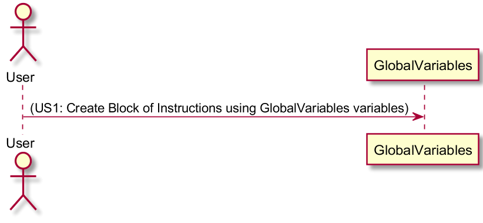
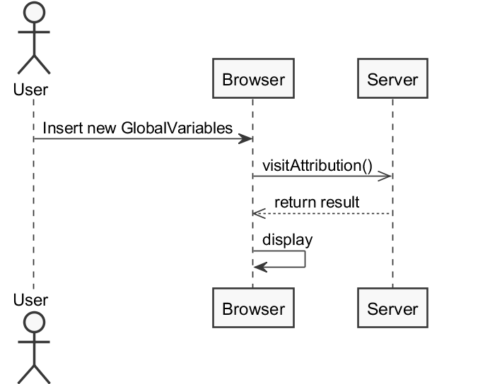
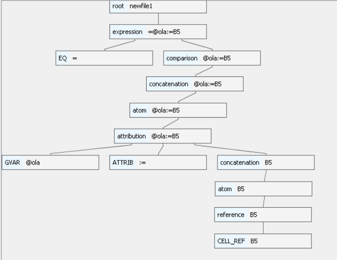

**Rafael Teixeira** (s4567890) - Sprint 2 - Lang02.2
===============================

# 1. General Notes

It was difficult to start this sprint due to the new Tools that were required. Altought this week was the second week working on this project, it was difficult to me to understand this part of the work. It was necessary to use the GWT so it took several hours to understand the fundamentals of this tool.  

In this sprint, i was included on the section LANG, wich works with Antlr, grammatics, regular expressions and several others specific subjects.
It's as part of the project that at times, becomes  really frustrating because particularly in this area, minor changes are really common and to see the effects of this changes it is necessary the compilation of the program wich takes five or even more minutes. Due to this factory it's necessary a lot of time to make everything work.

Other conditioner was the problems of merge on the project, a lot of people saw his work being deleted several times due to the lack of attention by other developers of the problem.

# 2. Requirements

Add support for global variables. Global variables are variables that exist in the context of the workbook and are persisted with the workbook. The name of global variables must start with the "@" sign. When a variable is referred in a formula for the first time it is created. To set the value of a variable it must be used on the left of the assign operator (":="). Attention should be given to synchronization problems. For an example of the use of global variables see Lang01.3.

Proposal :

US1 - As a User of the Application, I want to create a global variable within a Workbook and persist it, to serve as a container of information.

# 3. Analysis

For this feature increment, since it is the first one to be developed in a new project I need to:  

- Spend a lot of time trying to understand how this part of the project Works.
- Understand all the funcionalities and the way GWT works, since it was the first time using this tool.
- Review Language Parsing and Grammar studied in LPROG.
- Study the Visitor Pattern, which is used to make the connection between Regular Expressions developed on ANTLR4 and Java Code.
- Undestand how the language parser iterates in order to accquire the desired syntax.
- Understand how the GlobalVariable works, lifecycle and reason to use this type of variables.

## 3.1 GWT and Project Structure

**Modules**. From the pom.xml file we can see that the application is composed of 5 modules:  
- **server**. It is the "server part" of the web application.  
- **shared**.Contains the code thats shared between the server and the client.   
- **nsheets**. It is the web application.  
- **util**. This is the same module as the one of EAPLI.  
- **framework**. This is the same module as the one of EAPLI.  

## 3.2 Analysis Diagrams (Use case Diagram, Domain Model, System Sequence Diagram)

**Use Case**

**System Sequence Diagrams**

# 4. Design

Aside from the domain classes and a few required methods all the other implementation was already present in the base project.
Minor adjustments were made in the formula grammar to identify the syntax of a global variable and some adjustments in the formula eval visitor attribution.

# 4.1 Tests

Unit tests cannot be performed since there are dependencies related to GWT in this matter.
Therefore the only tests performed were Antlr4 grammar tests.

- Test input : =@ola:=B5

# 4.2 Requirements Realization

- Needs a grammar for interpretation.
- Needs an expression.
- Needs a visitor to assign to the current cell.

# 4.3 Classes

- GlobalVariable : Domain class defining a global variable.
- Attribution : Implements a binary operation that is visited while parsing the GVAR token. It will then create the global variable.

## 4.4 Design Patterns and Best Practices

- Visitor
- Single Responsability Principle
- Dependency Inversion Principle
- High Cohesion
- Low Coupling

## 5. Implementation

#US1

The implementation of a visitor in the FormulaEvalVisitor class in order for the parser to evaluate the existence of an attribution and add the global variable to a the list of the current workbook.

@Override
  public Expression visitAttribution(FormulaParser.AttributionContext ctx) {
      if (ctx.ATTRIB() != null) {
          if (ctx.VAR() == null) {
              if (ctx.GVAR() == null) {
                  try {
                      if (ctx.getChild(2).getChildCount() > 2) {
                          BinaryOperator operator2 = this.language.getBinaryOperator(ctx.getChild(2).getChild(1).getText());
                          BinaryOperation operation = new BinaryOperation(visit(ctx.getChild(2).getChild(0)), operator2, visit(ctx.getChild(2).getChild(2)));

                          BinaryOperator operator = this.language.getBinaryOperator(ctx.getChild(1).getText());
                          return new BinaryOperation(visit(ctx.getChild(0)), operator, new Literal(operation.evaluate()));
                      } else {
                          BinaryOperator operator = this.language.getBinaryOperator(ctx.getChild(1).getText());
                          return new BinaryOperation(visit(ctx.getChild(0)), operator, visit(ctx.getChild(2)));
                      }
                  } catch (FormulaCompilationException ex) {
                      Logger.getLogger(FormulaEvalVisitor.class.getName()).log(Level.SEVERE, null, ex);
                  } catch (IllegalValueTypeException ex) {
                      Logger.getLogger(FormulaEvalVisitor.class.getName()).log(Level.SEVERE, null, ex);
                  }
              }
          } else if (ctx.VAR() != null) {
              Value val;
              try {
                  val = visit(ctx.concatenation()).evaluate();
                  TemporaryVariable var = new TemporaryVariable(ctx.getChild(0).getText(), val);
                  if (!list.contains(var)) {
                      list.add(var);
                  } else {
                      visit(ctx.getChild(2));
                  }

              } catch (IllegalValueTypeException ex) {
                  Logger.getLogger(FormulaEvalVisitor.class.getName()).log(Level.SEVERE, null, ex);
              }
          } else {
              Value val;
              try {
                  val = visit(ctx.concatenation()).evaluate();
                  GlobalVariable gvar = new GlobalVariable(ctx.getChild(0).getText(), val);
                  if (!wk.returnListGlobalVariables().contains(gvar)) {
                      wk.addGlobalVariablesToList(gvar);
                  } else {
                      visit(ctx.getChild(2));
                  }
              } catch (IllegalValueTypeException ex) {
                  Logger.getLogger(FormulaEvalVisitor.class.getName()).log(Level.SEVERE, null, ex);
              }

          }
      }
      return visitChildren(ctx);
  }

## 7. Final Remarks

It was difficult to me to understand how GWT works in such a short period of time. Because of this limitation, the use case is incomplete, it does not save on the Database.

# 8. Work Log

# Tuesday
1. nothing.

# Wednesday
1. Trying to understand how GWT works.

# Thursday
1. Understanding GWT and start working on the Formula.

# Friday, Saturday and Sunday
1. Implementation on FormulaEvalVisitor, GlobalVariable.
2. Documentation.
  
# Monday
1. Documentation.
