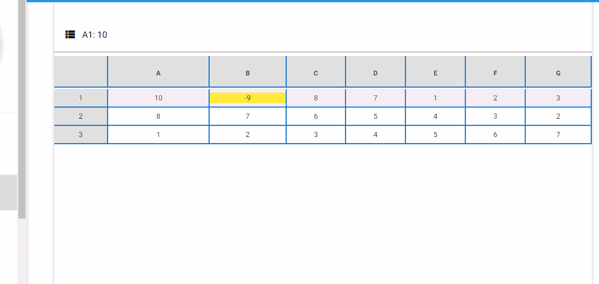

**Rafael Teixeira** (s4567890) - Sprint 3 - Core08.2
===============================

# 1. General Notes

On this sprint i was included on the section CORE, wich works more with the domain and with the connections between Ui and project.

My task was to create a new Extension that would allow the user to add an comment to a especific cell. I had some troubles to understand how the Ui communicates with the current application. After spending some time trying to understand how tbis comunication works i finally understood and started the implementation of my UC.

I also had to understand how the extensions work and on this point i couldn't quite understand the code that was already done. Because of that i implemented my UC on a different way.

It's also implemented the option to remove the Comment.

A good point on this sprint was the fact that the merge was reduced, due to an more careful usage of git by the developers

It's possible to see my UC working.

**Comments Extension**

Implementation of the Comment Extension (CORE08.2).

**Show Comments Extension**

Show the comment for an specific cell.

**Remove Comments Extension**

Implementation of the Remove Comments Extension (CORE08.2).

# 2. Requirements

- **Core08.2 - Comments in Cells Extension**

The application should have a new extension to associate textual comments with cells. The functionality should be similar to the one present in the desktop version of Cleansheets.

Proposal :

US1 - As a User of the Application, I want to add an Comment to an specific Cell and also have the option to remove this commentary.

# 3. Analysis

 For this sprint, i had to do a Comment Extension that would allow an user to add an comment to an specific cell. For this feature increment i needed to:

 - Understand the Extension Mechanism and how it works;
 - Understand the extension implementation and how to create an new extension;
 - Understand the concepts of CommentCell and CommentExtension;
 - Understand how to make a distinction between a commented Cell and an uncommented Cell;  

# 3.1 Analysis Diagrams

**Use Case**

An new Extension was created:
- **CommentExtension**.  wich adds the possibility to associate an comment to an cell, view the comment already created and remove an comment.

# 4. Design

**System Sequence Diagrams**

**Add New Comment**

**Show Current Comment**

**Delete Current Comment**

## 4.1. Tests

My use case was to add a new extension to the application, more particularly to add an Extension that would allow to add an Comment to a cell. In order to implement this UC i didn't have to work on the domain model, so i didn't have tests to do. I tested the funcionalities of this UC and they are all working, not suported by tests though.

## 4.2. Design Patterns and Best Practices
**Design Patterns:**
- *Repository*.
- *Factory*.
- *Strategy*.

**Best Practices:**
- Low Coupling.
- High Cohesion.
- Single Responsability Principle.

## 5 Implementation

#UC

Methods to remove add and show.

    public boolean removeCommentExtension(Cell c) {
        for (int i = 0; i < commentExtensions.size(); i++) {
            if(c.getAddress().toString().equals(
                    commentExtensions.get(i).getCell().getAddress().toString())){

                commentExtensions.remove(i);
                return true;
            }
        }
        return false;
      }

    public String commentCell(Cell cell){
	for (int i = 0; i < commentExtensions.size(); i++) {
			if(cell.getAddress().toString().equals(
							commentExtensions.get(i).getCell().getAddress().toString())){

					return commentExtensions.get(i).getComment();
			}
	}
	return null;
    }

    public boolean addCommentExtension(CommentExtension cExtension){
        boolean res = false;

        for (int i = 0; i < commentExtensions.size(); i++) {
            if(cExtension.getCell().getAddress().toString().equals(
                    commentExtensions.get(i).getCell().getAddress().toString())){

                commentExtensions.set(i, cExtension);
                return true;
            }
        }

        if(!res){
            commentExtensions.add(cExtension);
            return true;
        }

        return false;
    }

**Code Organization**

*The code for this implementation is done on the following classes:*
- **WorkbookView**;
- **WorkbookView.xml**;
- **UIController**;
- **CommentCell**;
- **CommentExtension**;

# 6. Final Remarks

After an good analysis around the Extensions that were already implemented, and an discussion with my developer partner David Camelo, we agreed that maybe an different solution of the one already implemented would be more ideal. The code developed before was quite confusing so i couldn't add my UC to the Extensions, because of that i created an ArrayList on UIController, and added there my Comment Extension.

# 7. Work log

# Tuesday
1. nothing.

# Wednesday
1. Trying to understand how Extensions works.

# Thursday
1. Discussing an different approach to the Extensions.

# Friday, Saturday and Sunday
1. Implementation of the Use Case.
2. Documentation.

# Monday
1. Documentation.
