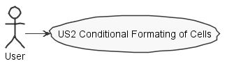
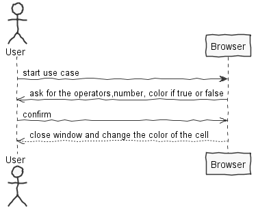
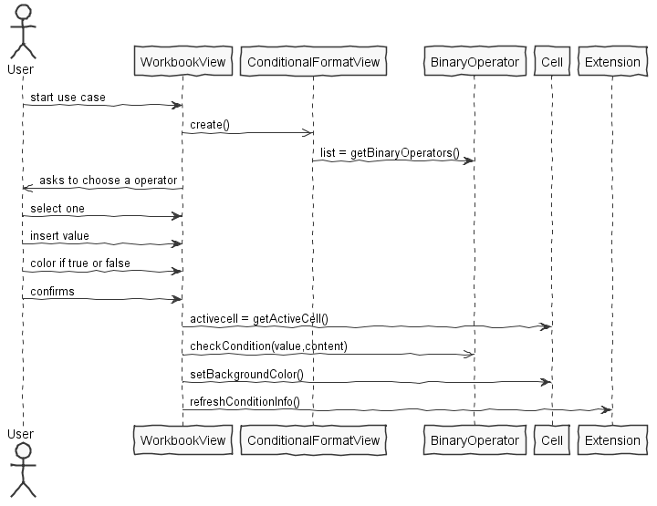

**Joana Oliveira** (1161261) - Sprint 2 - LANG3.1
=============================================
# 1. General Notes

This use case was initially performed in the first sprint, as it was not fully implemented, nor was the essential functional and as it was necessary for the use case of the following sprint did again, having managed to put it to work as a request.

# 2. Requirements

Lang03.1 - Conditional Formating of Cells
Update the "style" extension so that it can be used for the conditional formatting of cells based on the result of the execution of formulas. For the style of a cell to be conditional it must have an associated formula and two formatting styles. One of the styles is applied when the formula evaluates to true and the other when it evaluates to false. The editing of these settings should be done in a window.

## Proposal

This use case has the purpose of changing the cell to a given color depending on the type of condition chosen, that is, a list of operators is presented and then a number to be compared with the number of the cell being read is displayed. The cell will display a new color depending on whether the condition was false or true.

# 3. Analysis

-The user must be authenticated in the application

-User selects a cell

-Opens the window and chooses the condition as well as the number you want for the comparison

-Confirms and cell color will change color

# 3.1 Project Structure
**Modules**. From the pom.xml file we can see that the application is composed of 5 modules:  
- **server**. It is the "server part" of the web application.  
- **shared**. It contains code that is shared between the client (i.e., web application) and the server.   
- **nsheets**. It is the web application (i.e., Client).  
- **util**. This is the same module as the one of EAPLI.  
- **framework**. This is the same module as the one of EAPLI.

My code will reside in the shared folder and nsheets.

## 3.2. Analysis Diagrams
**Use Cases**

**System Sequence Diagrams**

# 4. Design

## 4.1. Tests

## 4.2. Requirements Realization

## 4.3. Classes

-ConditionalFormatView
-WorkbookView
-WorkbookView.ui.xml

-ConditionalCell
-ConditionalExtension
-ConditionalSpreadSheet

## 4.4. Design Patterns and Best Practices

# 5. Implementation

**For US**

**UI : Pop up for conditional format and remove conditional format**

In the WorkbookView.ui.xml it's declared as material link with a tag *ui:field="removeConditionalFormat"* and *ui:field="conditionalFormat"*.
In the corresponding classe View(WorkbookView) we bind that link to the corresponding widget class:

@UiField
MaterialLink conditionalFormat;

conditionalFormat.addClickHandler(event -> {
            if (activeCell != null) {
                windowFormat.open();
                String cellInfo = "Atual Cell: " + activeCell.toString() + " Content:" + activeCell.getContent();
                MaterialToast.fireToast(cellInfo);
            }

        });

@UiField
MaterialLink removeConditionalFormat;

removeConditionalFormat.addClickHandler(event -> {
            if (activeCell != null) {

                widget.setBackgroundColor(Color.WHITE);
                widget.setTextColor(Color.BLACK);
                widget.setBorder(Style.BorderStyle.NONE.getCssName());
                setActiveCell(activeCell, widget);

                MaterialToast.fireToast("Delete Sucess!");

            }

        }
        );

**UI : After open pop up**

confirmConditional.addClickHandler(event -> {
           if (activeCell != null) {
               BinaryOperator operator = conditional.getSingleValue();
               String n = numberConditional.getValue();

               Color cT = listColors.getSingleValue();
               Color cF = listColors2.getSingleValue();

               cf.setBackgroundColor(activeCell, operator, n, cT, cF, widget);

               windowFormat.close();

           }
       });

**Code Organization**

Followed the recommended organization for pakcages whenever possible.

Project **shared**:
- pt.isep.nsheets.shared.lapr4.green.s2.n1161261.CellListener

- pt.isep.nsheets.shared.lapr4.green.s2.n1161261.conditionalExtensions

# 7. Work Log

**Most Relevant Commits**

- [Documentation](https://bitbucket.org/lei-isep/lapr4-18-2dc/commits/6fa4e8ace52c338d5f80a9938a3e786d83c5934c)

- [Implementation](https://bitbucket.org/lei-isep/lapr4-18-2dc/commits/dd2031e888813041536ba1861d3ab466ac9cf604)
