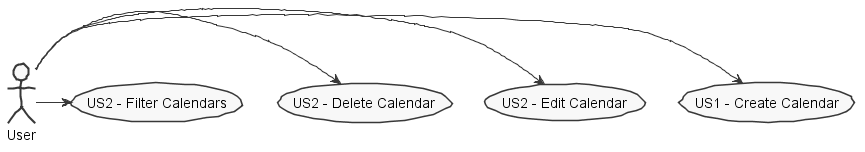
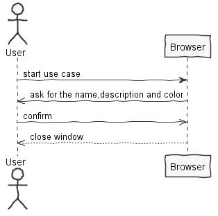
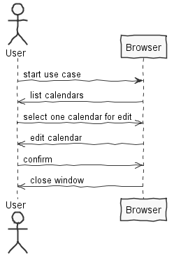
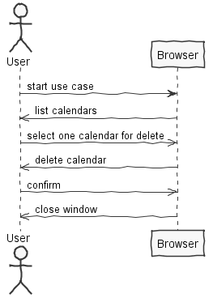
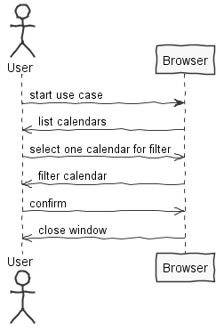
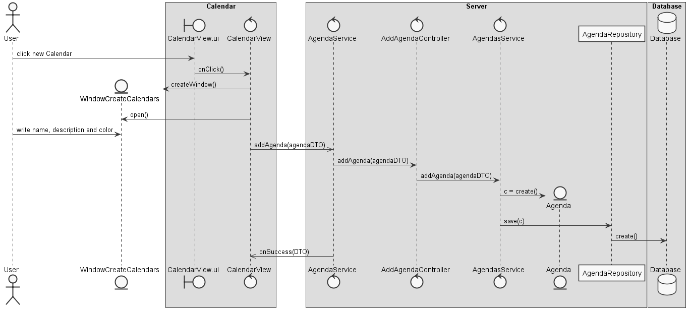
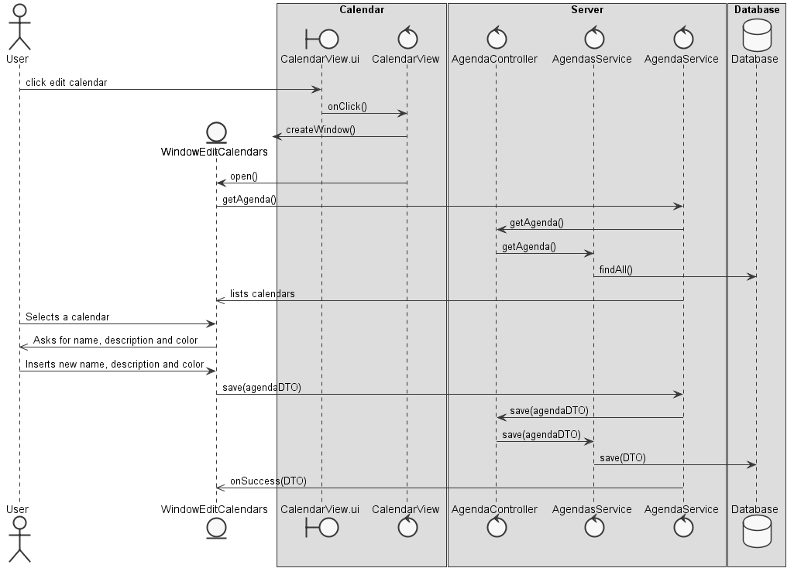
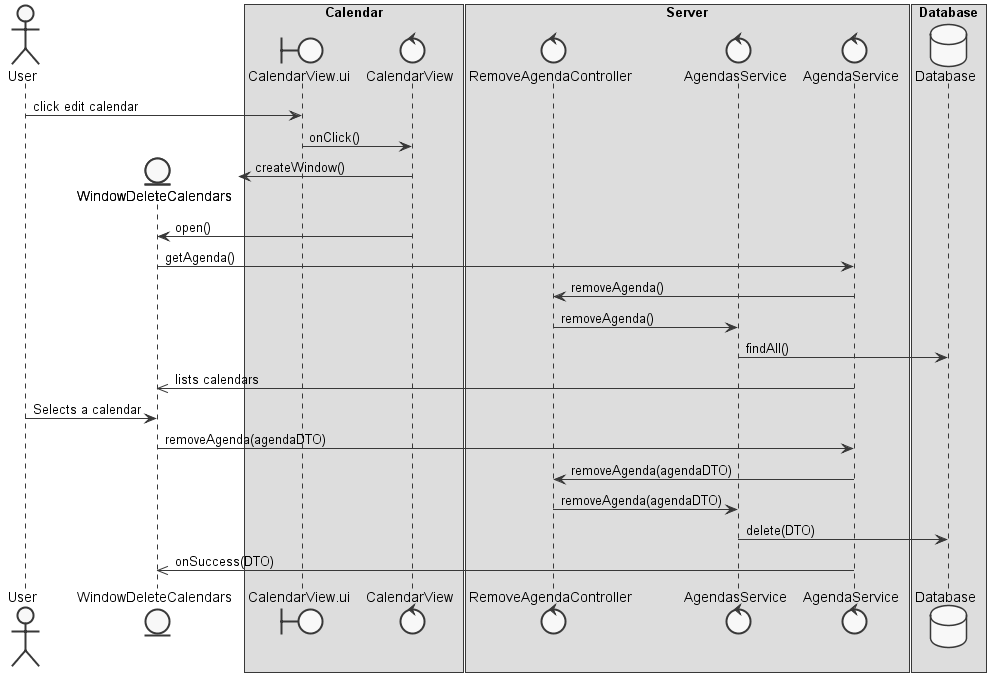
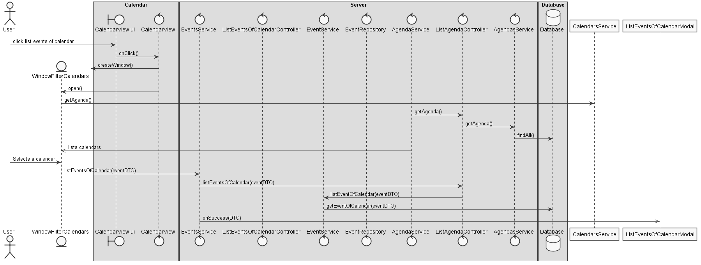

**Joana Oliveira** (1161261) - Sprint 3 - CORE6.2
=============================================
# 1. General Notes

Having no functionality implemented and functional, it was impossible to make the use case 6.3 so I chose terminal the use case 6.2 and in addition made changes to the use case implemented before 6.1.

# 2. Requirements

Core06.2 - Basic Agenda
The calendar view should now evolve into an agenda view that may display several calendars. It should be possible to create, edit and remove calendars. Each user can have one or more calendars. Each calendar has a name (e.g., work, birthdays, home, etc.) and a textual description. It should be possible to associate a color to a calendar (events of that calendar are displayed with the color of the calendar). It should be possible to filter what calendars are displayed in the agenda view. The agenda view can be implemented as a simple list of events (from the calendars). The view should display only actual and future events.

## Proposal

This use case has the purpose support many calendars in calendar form. The calendar can be edited and removed.

US1 - As the User I want to be able create many calendars, having a color associated to each calendar.

US2 - As the User I want to be able to edit calendars.

US3 - As the User I want to be able to delete calendars.

US4 - As the User I want to be able to filters the calendars displayed only actual and future events.

# 3. Analysis

-The user must be authenticated in the application

# 3.1 Project Structure
**Modules**. From the pom.xml file we can see that the application is composed of 5 modules:  
- **server**. It is the "server part" of the web application.  
- **shared**. It contains code that is shared between the client (i.e., web application) and the server.   
- **nsheets**. It is the web application (i.e., Client).  
- **util**. This is the same module as the one of EAPLI.  
- **framework**. This is the same module as the one of EAPLI.

My code will reside in the shared folder and nsheets.

## 3.2. Analysis Diagrams
**Use Cases**

**System Sequence Diagrams**

**For US1**

**For US2**

**For US3**

**For US4**

# 4. Design

## 4.1. Tests

## 4.2. Requirements Realization

**For US1**

**For US2**

**For US3**

**For US4**

## 4.3. Classes

-CalendarView

-CalendarView.ui.xml

-Agenda

## 4.4. Design Patterns and Best Practices

-DTO

-Repository

# 5. Implementation

**NSheets**

**pt.isep.nsheets.client.application.calendar**

**Server**

# 7. Work Log

**Most Relevant Commits**

- [Documentation](https://bitbucket.org/lei-isep/lapr4-18-2dc/commits/56ce4c641b664a8b16693fb8e51b6a430c8b3711)

- [Implementation](https://bitbucket.org/lei-isep/lapr4-18-2dc/commits/2083d0de73228db6a514935cfb72262dea72e99e)

- [createCalendar](https://bitbucket.org/lei-isep/lapr4-18-2dc/commits/9b655a9ab223ea8d4df3685ede913eb06a8cfedd)

- [Persistence](https://bitbucket.org/lei-isep/lapr4-18-2dc/commits/8f5236de71cc5ced00626cbcaed91f9dd363cb01)
