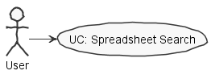
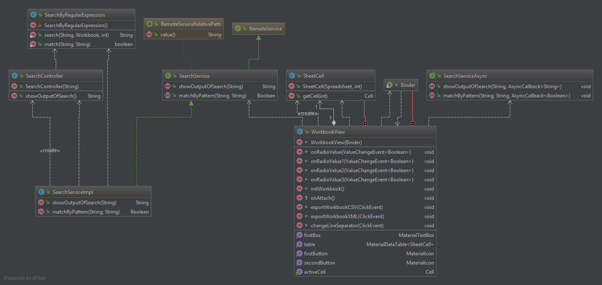
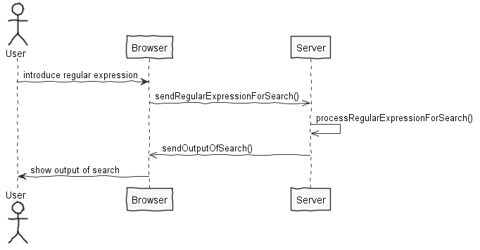
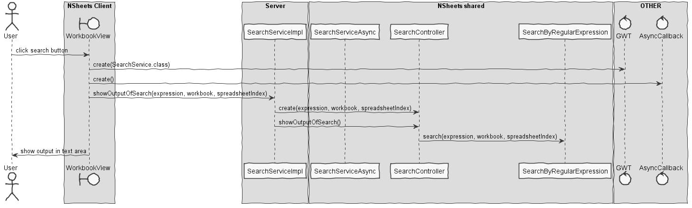

**David Camelo** (1161294) - Sprint 1 - IPC2.1
===============================

# 1. General Notes

*In this section you should register important notes regarding your work during the sprint. For instance, if you spend significant time helping a colleague or if you work in more than one feature increment.*

During this sprint I encountered two major problems. 
 - The first was how to use GWT correctly, which took me 2-3 days to figure out. I was trying to create a class which would extend MaterialWindow to prevent 
the class WorkbookView to become too large, because a lot of student were using this class. (This also lead to a lot of merging in this class)

- The second was that due to a delay in the implementation of a colleagues UC. Without knowing how the actual workbook was being represent in the class WorkbookView I 
 could not conclude with my UC, so I had to create a temporary solution to test my algorithm to search the spreadsheet of a workbook and try to make as much of my UC 
 without knowing how the final structure would be.
  
 (last update: because of the last minute changes of this colleague this uc stop working and I was unable to fiy it)

# 2. Requirements

*In this section you should describe the requirements for this sprint.*

*This is simply an example of documentation*

IPC02.1 - The application should now allow for searching the contents of the active workbook. The new window should be composed of two parts. The first part (upper part of the window) should contain a text box for the user to enter a regular expression to be the basis for the search. This part should also contain a button to launch the search. The second part (lower part of the window) should be used to display the search results (cell coordinates and value or contents). The search should include no only the content of the cell (i.e., the text entered by the user) but also its value (that could have been calculated by a formula).

# 3. Analysis

*In this section you should describe the study/analysis/research you developed in order to design a solution.*

For this feature increment, since it is the first one to be developed in a new project I need to:  

- Understand how the application works and also understand the key aspects of GWT, since it is the main technology behind the application (maybe even analyse some code from existing desktop version)

- Understand how the Home Page is implemented (for instance, how the UI is designed)  

- Understand which type of regular expression will be introduced in the input field (maybe get some examples from client for testing purpose)

- Understand where in specific and how the new feature will be integrated in the existing UI

- Undersatnd which format the client wants for the output of the search

## 3.1 Analysis Diagrams

The main idea for the "workflow" of this feature increment.

**Use Cases**

**Domain Model (for this feature increment)**

- **Domain Model**

**System Sequence Diagrams**

**For UC**

# 4. Design

*In this section you should present the design solution for the requirements of this sprint.*

## 4.1. Tests

*In this section you should describe the design of the tests that, as much as possibe, cover the requirements of the sprint.*

There should be test:
* To check if the parameters of the method are null
* To check if the regular expression is empty
* Check match between the regular expression and the value of a cell
* Check match between the regular expression and the formula of a cell
* Check match between the regular expression and the formula of a cell and the value of a cell
* Check number of matches of a known workbook 

**Test Coverage**

No Unit tests were done in this implementation. It is **important** to do the unit test after this UC was fixed!
 The only tests, were functional tests and only methods that were done for a temporary fix of 
 the UC were tested. 

## 4.2. Requirements Realization

*In this section you should present the design realization of the requirements.*

## 4.3. Classes

*Present and describe the major classes of you solution.*

    - WorkbookView.java
    - WorkbookView.ui.xml

In the classes above were implemented the user interface implementation of this UC.

    - SearchService.java
    - SearchServiceAsync.java
    - SearchServiceImpl.java
    - web.xml

In the classes above were implemented the needed services to provide access to the Controller and the algorithm to effectuate the search

    - SearchController.java
    - SearchByRegularExpression.java

In the classes above were implemented a controller and the actual algorithm of search that receives a regular expression.

## 4.4. Design Patterns and Best Practices

*Present and explain how you applied design patterns and best practices.*

- MVP
- Service
- Layer

# 5. Final Remarks

*In this section present your views regarding alternatives, extra work and future work on the issue.*

This UC is not completed yet. Although everything important is already implemented. 
(The cause for this was already explained in the first topic, general notes)

* Class WorkbookView.java following code should be used: 

    sendRegExpression.addClickHandler(clickEvent -> {   
        SearchServiceAsync searchService = GWT.create(SearchService.class);
        AsyncCallback<String> callback = new AsyncCallback<String>() {
            @Override
                public void onFailure(Throwable throwable) {
                MaterialToast.fireToast("Impossible to search" + throwable.getMessage());
            }
    
            @Override
            public void onSuccess(String s) {
                outputOfSearch.setText(s);
                MaterialToast.fireToast("Search finished");
            }
        };
        searchService.showOutputOfSearch(regExpressionTextBox.getText(), wb, 0, callback);
    }); 

Due to the undefined structure yet, the showOutputOfSearch methods parameters are yet uncleared and may be needed to 
 change in the future. 
 
* Also, the following methods were only used to make the Uc work for testing purpose and should be deleted
 after fixing this UC.
    
    Class | Method
    :---: |:---: 
    SearchServiceImpl.java | matchByPattern()
    SearchService | matchByPattern()
    SearchServiceAsync | matchByPattern()
    SearchController | showOutputOfSearch()
    SearchByRegularExpression | match()
 
 
# 6. Work Log

*Insert here a log of you daily work. This is in essence the log of your daily work. It should reference your commits as much as possible.*

Commits:

[Structure planning](https://bitbucket.org/lei-isep/lapr4-18-2dc/commits/5377577ef8f603ac73e0cef7ee9041409dff29f8) (not relevant for project)

[IPC02.1 Add analysis and analysis diagram](https://bitbucket.org/lei-isep/lapr4-18-2dc/commits/9816b8d139814c51b35218ac17d6450f56322b46)

[IPC02.1 Add uc diagram](https://bitbucket.org/lei-isep/lapr4-18-2dc/commits/b2c5179df138a1b1436232198bc850faacfd4342)

[IPC02.1 Add ui implementation of uc](https://bitbucket.org/lei-isep/lapr4-18-2dc/commits/7ca2903f39e4b52a846fcfbb3b5db90673247b30)

[IPC02.1 Add Controller](https://bitbucket.org/lei-isep/lapr4-18-2dc/commits/f017dfe4dab7d99a6b1a44a0bb8cc01670ce8e5a)

[IPC02.1 Update design](https://bitbucket.org/lei-isep/lapr4-18-2dc/commits/d697ebcd7e84f8cb3b7b657473b172e21f3e5d3b)

[IPC02.1 Add Search window to workbookView](https://bitbucket.org/lei-isep/lapr4-18-2dc/commits/6e03a57bb3f491ad4044e0faa747ce26717a2cd1)

[IPC02.1 Add Search service class](https://bitbucket.org/lei-isep/lapr4-18-2dc/commits/cb70094c0d807449744859a0b6a26937d85717cd)

[IPC02.1 Add Search method and use it in button](https://bitbucket.org/lei-isep/lapr4-18-2dc/commits/775bdbb34786364c66d5a526c86ebdd2e85cb027)

[IPC02.1 Create Service to use the SearchController](https://bitbucket.org/lei-isep/lapr4-18-2dc/commits/f4e18c2c887ed46eb35606176a58dbd23400779f)

[IPC02.1 Change Controller to receive a workbook and an spreadsheet index & Update related classes](https://bitbucket.org/lei-isep/lapr4-18-2dc/commits/520c9d492b6618305826753c52dd10da1c4ad58f)

[IPC02.1 Update to work without the parte of the Core Uc](https://bitbucket.org/lei-isep/lapr4-18-2dc/commits/793b398beb009812e751904d63aaf7b6694998de)

[IPC02.1 Update docs of uc](https://bitbucket.org/lei-isep/lapr4-18-2dc/commits/dcf0829c43f7c9292e3d4ca9c2802e57ea888d9c)

[IPC02.1 Add some verifications](https://bitbucket.org/lei-isep/lapr4-18-2dc/commits/5a2bde76f3a43f2f5f0287e45dcb8de9edafc86c)

[IPC02.1 last fix](https://bitbucket.org/lei-isep/lapr4-18-2dc/commits/204e684943bb50954409c680d35f6fcc6ab0afb8)

[IPC02.1 update docs](https://bitbucket.org/lei-isep/lapr4-18-2dc/commits/2fd7485627df66e869a3f0559a8a5710c3a04aa8)

    
    
