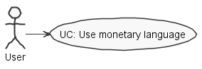
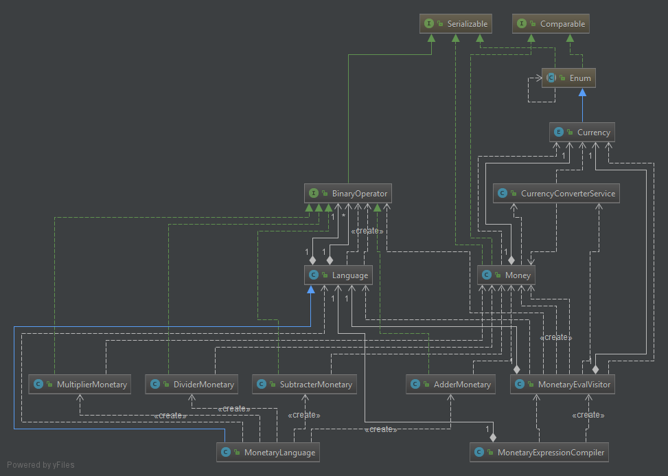
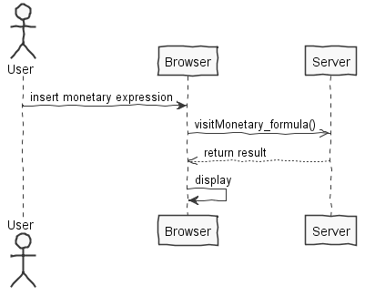
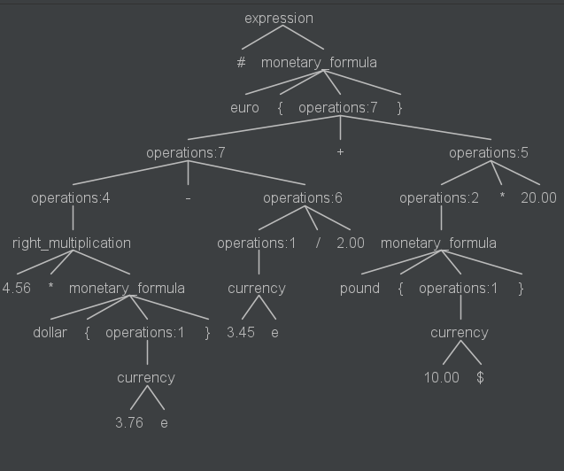

**David Camelo** (1161294) - Sprint 2 - Lang01.2
===============================

# 1. General Notes

*In this section you should register important notes regarding your work during the sprint. For instance, if you spend significant time helping a colleague or if you work in more than one feature increment.*

I had a initial hard time because I was trying adding my expression to an existing language.

Also, after having a new language I had some difficulties with the visitor which consumed a lot of time figuring out.

It is worth noting that the time period of my commits were none because of problems of merging/reversing so I had to
 wait for the project to be stable to add my code that was already tested and run on an older version of the project. 

# 2. Requirements

*In this section you should describe the requirements for this sprint.*

*This is simply an example of documentation*

Lang01.2 Add a new formulas language (currently the application only has Excel formulas that begin with the character 
 "="). The new language should do only calculations related to currencies. The character that begins the formula should
  be "#". The formula should only accept the addition, subtraction, multiplication and division operators. Operands 
  are monetary values in which it is necessary to provide the currency (e.g., 10.21e, 1.32£ or 0.20$). All expressions 
  are required to be contained within brackets with the currency prefix in which we want the result, e.g., 
  "#euro{10.32$ + 12.89£}" or "#dollar{ 10.32$ + 12.89£}" or "#pound{10.32$ + 12.89£}". For the user to use this 
  language instead of the "regular" Excel language it should start the formula by the character "#" instead of the 
  "=" character. The application should also provide a way for setting exchange rates (by means of a configuration). 
  The implementation should avoid the use of numbers in floating point representation (e.g., float, double) in order 
  to avoid precision problems.
  
# 3. Analysis

*In this section you should describe the study/analysis/research you developed in order to design a solution.*

For this feature increment, since it is the first one to be developed in a new project I need to:  

- Understand how the application handles different languages

- Understand of what a new language consists

- Understand the requirement and create an grammar

- Understand how the language parser iterates the given grammar

- Understand how visitors work

## 3.1 Analysis Diagrams

The main idea for the "workflow" of this feature increment.

**Use Cases**

**Domain Model (for this feature increment)**

- **Domain Model**

**System Sequence Diagrams**

**For UC**

# 4. Design

*In this section you should present the design solution for the requirements of this sprint.*

Note: The diagram only depicts the less technical details of the scenario

## 4.1. Tests

*In this section you should describe the design of the tests that, as much as possibe, cover the requirements of the sprint.*

Unit tests done for the class Money & CurrencyConverterService

**Grammar tests with antlr4:**

Expression: # euro{4.56 * dollar{3.76e} - 3.45e /2.00 + pound{10.00$} * 20.00}

## 4.2. Requirements Realization

*In this section you should present the design realization of the requirements.*

## 4.3. Classes

*Present and describe the major classes of you solution.*

    - MonetaryExpression.4

In the class above was the grammar described.

    - MonetaryEvalVisitor.java
    - MonetaryExpressionCompiler.java

In the classes above were implemented the needed visitor and a compiler for the grammar

    - AdderMonetary.java
    - SubtracterMonetary.java
    - MultiplierMonetary.java
    - DividerMonetary.java
    - MonetaryLanguage.java

In the classes above were implemented the language and the needed binary operations

## 4.4. Design Patterns and Best Practices

*Present and explain how you applied design patterns and best practices.*

Design patterns used:

    Visitor

    Singleton

    Factory

    Strategy

    Command

Best pratices used:

    Single Responsability Principle

    Dependency Inversion Principle

    Open/Closed Principle

    High Cohesion

    Low Coupling

# 5. Final Remarks

*In this section present your views regarding alternatives, extra work and future work on the issue.*

This Uc is complete. The only minor thing that was not done is the rates of the different currencies is not saved/load 
 in/from a file.
 
 
# 6. Work Log

*Insert here a log of you daily work. This is in essence the log of your daily work. It should reference your commits as much as possible.*

Relevant commits:

[Lang01.2 Add Monetary to Value & logger](https://bitbucket.org/lei-isep/lapr4-18-2dc/commits/dd8b1dea3bc39a2c11d80f35dd714312c1425cf2)

[Lang01.2 Add MonetaryExpression & remove old expression from Formula](https://bitbucket.org/lei-isep/lapr4-18-2dc/commits/54ca7791c1f25605067ccbc7a347840f88e3d021)

[Lang01.2 Add Monetary classes & service for conversion](https://bitbucket.org/lei-isep/lapr4-18-2dc/commits/f6a45ea51bf62fb765fb0b694e4cb46641b33c45)

[Lang01.2 Add Monetary language](https://bitbucket.org/lei-isep/lapr4-18-2dc/commits/e54ed5e93c51fb2fdb67244f379ebee933f1423f)

[Lang01.2 Add Compiler & create compiler & create visitor](https://bitbucket.org/lei-isep/lapr4-18-2dc/commits/e396a7f705a93098bc3a9963be95c73f85b387a1)

    
    
