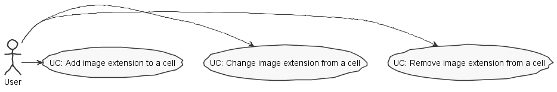

**David Camelo** (1161294) - Sprint 3 - Core_08.3
===============================

# 1. General Notes

*In this section you should register important notes regarding your work during the sprint. For instance, if you spend significant time helping a colleague or if you work in more than one feature increment.*

 

# 2. Requirements

*In this section you should describe the requirements for this sprint.*

Core08.3 - Images in Cells Extension

The application should have a new extension similar to the previous one but regarding the possibility of associating images with cells.

  
# 3. Analysis

*In this section you should describe the study/analysis/research you developed in order to design a solution.*

- Understand how the existing extension mechanism work

- Understand how to upload a file to the server

- Understand how a file is handled using GWT

## 3.1 Analysis Diagrams

The main idea for the "workflow" of this feature increment.

**Use Cases**

**Domain Model (for this feature increment)**

- **Domain Model**

*Extension*

*Ui & Controller*

# 4. Design

*In this section you should present the design solution for the requirements of this sprint.*

**System Sequence Diagrams**

## 4.1. Tests

*In this section you should describe the design of the tests that, as much as possibe, cover the requirements of the sprint.*

Since the feature was to implement an image extension mechanism I had not much "domain-related" tests to do.
Also tests in the controller class were not possible, because a spreadsheet would be needed I could not create one because
of the complexity of the classes needed for the creation.

## 4.2. Design Patterns and Best Practices

*Present and explain how you applied design patterns and best practices.*

Design patterns used:

    Singleton

    Factory

    Strategy

Best pratices used:

    Single Responsability Principle

    Dependency Inversion Principle

    Open/Closed Principle

    High Cohesion

    Low Coupling

# 5. Final Remarks

*In this section present your views regarding alternatives, extra work and future work on the issue.*

 In my opinion the extension mechanism implemented in the uc before me was not an ideal solution. The concept is there, 
  but i could not find out how to add my mechanism so I had to create a side solution for my UC. Maybe an future issue would
  be to create a new and better design solution and migrate the mechanism.
 
# 6. Work Log

*Insert here a log of you daily work. This is in essence the log of your daily work. It should reference your commits as much as possible.*

Relevant commits:

[Core_08.3 Add function to upload images to the server](https://bitbucket.org/lei-isep/lapr4-18-2dc/commits/a3ff55257fa1b34b1f3140be345b7ca6c979292e)

[Core_08.3 Change Image upload](https://bitbucket.org/lei-isep/lapr4-18-2dc/commits/73bd55d71634bc40982dd6be719e54023b23c697)

[Core_08.3 Update ImageExtension and related classes](https://bitbucket.org/lei-isep/lapr4-18-2dc/commits/27c7fa862601fd41afb5156f9079f33f5f364955)

[Core_08.3 Add main image extension handler methods to class UiController](https://bitbucket.org/lei-isep/lapr4-18-2dc/commits/fd7e75523da79b95c58b84ac7834a8bc66540baf)

[Core_08.3 Update Ui](https://bitbucket.org/lei-isep/lapr4-18-2dc/commits/9c9e32c281727c18932db00fbb8e4d07d702f495)

    
    
