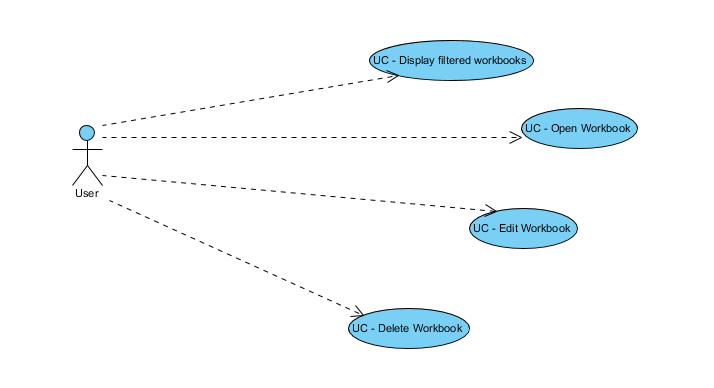
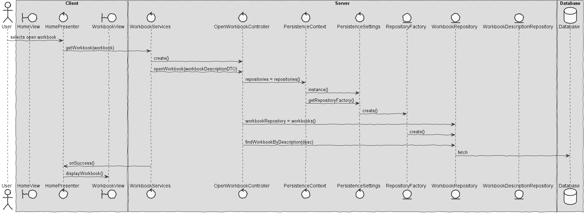

**João Rocha** (1161838) - Sprint 1 - IPC06.1 - WorkBook Sharing
===============================

# 1. General Notes

My feature is not fully functional since I needed other features that were not implemented at that time, said this
functionalities such as delete and edit workbooks were not fully implemented and opening a workbook is not implemented
because I didn't have access to persisted workbooks at the time of this feature development.

* IPC06 is consisted of 4 ucs:
- UC1 - Display filtered Workbooks
- UC2 - Open workbooks
- UC3 - Edit workbooks
- UC4 - Delete workbooks

# 2. Requirements

IPC06.1 - Public Workbooks:

Workbooks should be considered public. A public workbook is a workbook that can be accessed by all users. The "Home" page should display all the workbooks. It should be possible to apply filters to this view/page to display only workbooks with specific names or descriptions (the application should accepted regular expressions to filter the workbooks). It should be possible to open, rename or delete a selected workbook in this page/view.

# 3. Analysis

* Understand how the application works and how GWT works
* Understand how the Home page is implemented
* Understand how and where to implement the filters
* Understand how to implement regexp on java
* Understand how to connect the WorkbookDescription with Workbook

## 3.1 Analysis Diagrams

The main idea for the "workflow" of this feature increment.

# 4. Design
** Use Cases **

** UC1 - Display filtered Workbooks **

** UC2 - Open workbooks **

** UC3 - Edit workbooks **

** UC4 - Delete workbooks **

## 4.1. Tests

*In this section you should describe the design of the tests that, as much as possibe, cover the requirements of the sprint.*

**Test Coverage**

## 4.2. Requirements Realization

HomeView -> User main interface
WorkbookServices -> Used as a "method" of communication with the mechanism of GWT
DeleteWorkbookController -> Use case controller
EditWorkbookController -> Same as above
ListFilteredWorkbooksController -> Same as above
OpenWorkbookController -> Same as above

## 4.3. Design Patterns and Best Practices

By memory we apply/use:
- Singleton
- Repository
- MVP
- Visitor - Decorator

# 5. Implementation

For IPC06.1 every class aswel as UI was already implemented.

My controllers were implemented on the packaged pt.isep.nsheets.server.lapr4.green.s1.ipc.n1161838.workbooks.application:
- DeleteWorkbookController
- EditWorkbookController
- ListFilteredWorkbooksController
- OpenWorkbookController

My implementation on the persistence classes where made on the package pt.isep.nsheets.server.lapr4.white.s1.core.n4567890.workbooks.persistence.jpa:
- JpaWorkbookDescriptionRepository

On the client view I implemented on the package pt.isep.nsheets.client.application.home:
- HomePresenter
- HomeView
- HomeView.ui.xml

# 6. Final Remarks

Use cases 2,3 and 4 aren't fully implemented since there was a problem on the other groups involving the persistence of the class Workbook on the database, having this problem I wasn't able to Open and i wasn't able to fully delete a selected workbook (it was only possible to delete its description).

# 7. Work Log

Monday: client meeting
Tuesday: Choosings User Stories and Class Scrum Master. Started some Analysis
Wednesday: Ended analysis started design. Started the app back-end functionalities
Thurday: Finished app front-end ui
Friday: Solved so doubts about the database, domain classes organization, etc.
Saturday: Tried to help creating the workbook table on database
Sunday: Tried to fix a bug involving my UI
Monday: Same as sunday   
