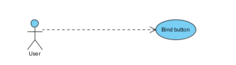
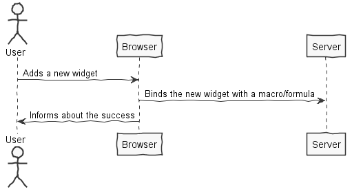
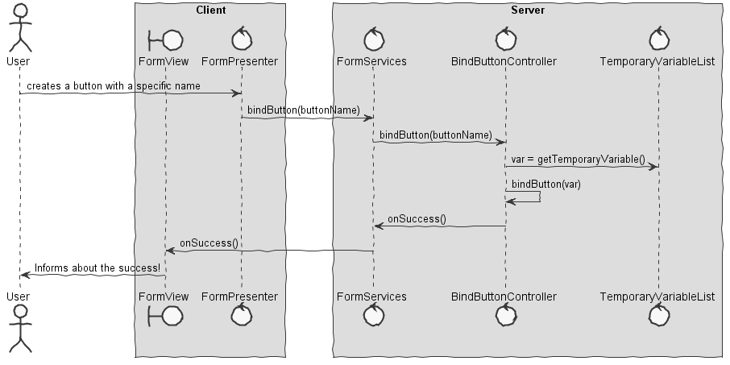

**João Rocha** (1161838) - Sprint 2 - Lang5.1/5.2
===============================

# 1. General Notes

*After a brief analysis of the last week sprint I decided to do a reimplementation of the functionalities of Lang5.1 since it was not correctly implemented. On the main Use Cases it was supposed to manipulate a form that is somehow "linked" to a workbook and instead of that last week implementation consisted only on UI manipulation causing no real connection between the form and the workbook.*

*Lang5.2 was impossible to be made since the main requirement of this functionality was to use the functionalities of Lang2.1 (Temporary variables) that were not implemented.*

*In terms of documentation I only focused on Lang5.2 since most of Lang5.1 was already done last week.*

# 2. Requirements

**Lang05.1**

*The application should have a new option to launch a window for editing a form. A Form is a window that is designed by the end user and is used for interacting with the user (input and output). The new window should support the creation and testing of a Form. Forms should be very simple. A Form should be composed of rows, each row can be empty or have one or two visual widgets. The supported visual widgets are: button (to invoke actions); edit box (to enter data) and static text box (to display data). It should be possible to set the core properties of these widgets (like the text to display in a static text box, for instance). In the edit form window it should be possible to: add a new row; remove an existing row; edit an existing row; "play" the form and close the edit form window. The "play" button is for testing the appearance of a form during its design (see example in the next Figure). At the moment it is only required to support a single Form for each workbook. Macros and formulas should have a new function that can be used to display the form of the current workbook. Forms should have an icon or button to close the form. When the form is closed the function (in macros or formulas) who call it returns.*

**Lang05.2**

*In order for forms to become useful in formulas or macros it is necessary to associate data with the contents of the visual widgets. The mechanism used for that will be the binding of variables (macros or formulas variables) with the contents of the visual widgets. One simple way to achieve this is by using temporary variables (from macros and formulas). The matching between widgets and variables should be done by associating the ones with the same name. When displaying a form (in the context of a macro or a formula), if the temporary variables with the same name of widgets exist, them they are used to set the content of the widgets. For widgets for which no temporary variables with the same name are found then new temporary variables should be created. The user should be able to change the contents of edit boxes. When closing the form window the contents of the temporary variables should be updated from the contents of the corresponding visual widgets.*

*As said above I had to use temporary variables but I wasn't capable of do it because there was no implementation of Lang2.1*

### Proposal:

### User Stories:

* US1 - Bind Visual Widget

# 3. Analysis

* Understand how ANTLR4 works
* Understand how to link ANTLR4 with the system
* Understand what exactly is a form
* Understand how to "connect" the workbook to a respective form
* Understand the utilization of macros
* Understand how macros work
* Understand how temporary variables work
* Understand how to bind a certain button with a temporary value

## 3.4 Analysis Diagrams

** Use Cases **

** System Sequence Diagrams **

# 4. Design

*NOTE: The design was made without having the Lang5.1 as a base*

## 4.1. Tests

*I wasn't capable of doing unit tests because of tbe GWT's dependencies*

*In terms of functional tests Lang5.1 is fully tested*

**Test Coverage**

## 4.2. Requirements Realization

## 4.3. Classes

No classes were added

## 4.4. Design Patterns and Best Practices

*By memory was used:*

 * Singletons
 * Repositories
 * MVP

# 5. Implementation

*The re-implementation I made was done on the packages of the last sprint.*
*I did not implement new functionalities*

# 6. Final Remarks

*It was really hard to change from IPC to Lang since I had to fully understand how the functionalities of this area worked and that made me lose a lot of time that could have been used to make improvements on this UCs.*
*Last week Lang5.1 was not fully operational so I tried to reimplement some of its functionalities in the correct way.*
*This week Lang5.2 was impossible to be made because the system didn't have temporary variables neither global variables that could have been used to "cheat" and show some results.*
*A lot of time was lost debugging because I was having a problem with the ANTLR4, it had a simple resolution but I lost 3 days trying to find it.*

# 7. Work Log

Commits:

Tuesday:

Sprint review & Next sprint explain

Wednesday:

Analysing Lang5.1 and 5.2

Thrusday:

Understanding the basis of ANTLR4 and its connection with java

Friday:

Implementation start

Saturday:

Debugging

Sunday:

Debugging
