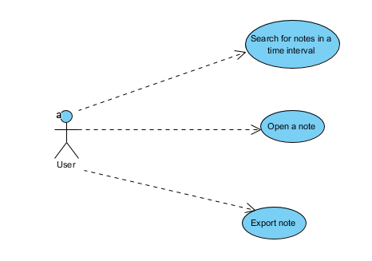
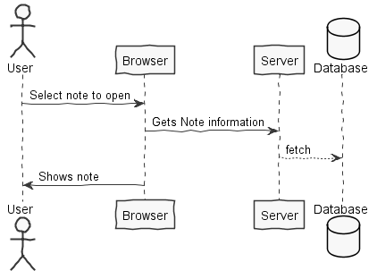
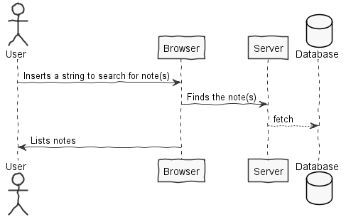
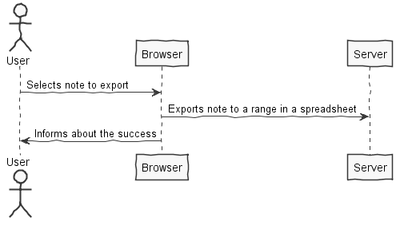
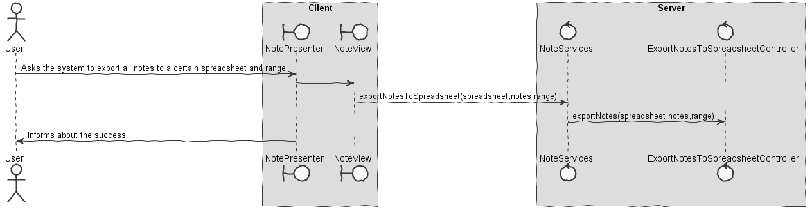
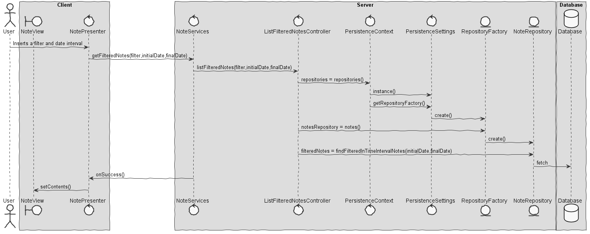
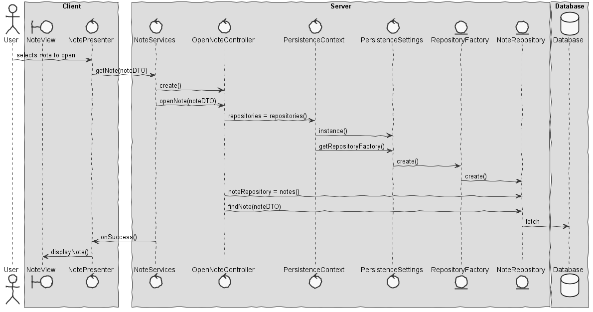

**João Rocha** (1161838) - Sprint 3 - Core07.3 - Search and Export Notes
===============================

# 1. General Notes

Most of Core07.3 is implemented but I wasn't capable of finishing the note export to a spreadsheet. I was able to get the information on the spreadsheet in memory but there was a bug while opening the workbook on the client UI which made impossible to finish that functionality. It was also impossible to do the export functionality because of the way workbook/description/spreadsheet was persisted.
The other functionalities are fully implemented!

# 2. Requirements

Core07.3 - Search and Export Notes

It should be possible to search for notes (text and lists) within a time interval. The query expression should allow to search based on the title and/or contents of the notes. It should be possible to use regular expressions to search the contents of the notes that are within the time interval. It should be possible to open a specific note by double clicking on it in the result list. It should be possible to export the search results into a range in an spreadsheet.

### Proposal:

#### User Stories:

* US1 - Search for notes in a time interval
* US2 - Open a note from a list
* US3 - Export results to a range in an spreadsheet

# 3. Analysis

* Understand Notes and its already implemented functionalities
* Understand JPA queries
* Understand REGEXP
* Understand note exportation to a range in an spreadsheet
* Understand how to open a note from a list in GWT
* Understand the class Cell and how to change its content

## 3.1 Analysis Diagrams

** Use Cases **

** System Sequence Diagrams **

# 4. Design

## 4.1. Tests

*I couldn't implement any tests because of GWT dependencies.*

## 4.2. Requirements Realization

** UC - Export notes to a spreadsheet **

** UC - List filtered notes of a time interval **

** UC - Open note **

NoteView -> User main interface
NoteServices -> Used as a "method" of communication with the mechanism of GWT
OpenController -> Use case controller
ListFilteredNotesController -> Same as above
ExportNotesToSpreadsheetController -> Same as above

## 4.3. Design Patterns and Best Practices

*By memory we apply/use:*
- Repository
- MVP
- Visitor - Decorator

# 5. Implementation

*UI was implemented on package pt.isep.nsheets.client.application.NoteMenu and the main classes where:*
- NoteModule
- NotePresenter
- NoteView
- NoteView.ui.xml

*My controllers were implemented on the packaged pt.isep.nsheets.server.lapr4.green.s3.core.n1161838.Notes.application:*
- OpenkController
- ListFilteredNotesController
- ExportNotesToSpreadsheetController

*There was no classes implemented on persistence*

# 6. Final Remarks

*Core07.3 was not as easy as it seemed at first, I had to do some research to fully understand which metodology I would choose to export the notes to a spreadsheet. Even though its not fully implemented I could get the spreadsheets with notes in it, but I had problems to show its content on the UI because the workbook persistence wasn't well done and that made impossible to finish my UC
The other functionalities are fully done.*

# 7. Work Log

Tuesday:

- Sprint Review

Wednesday:

- Sprint Analysis

Thursday:

- UCs design

Friday:

- Implementation

Saturday:

- Implementation

Sunday:

- Debug
