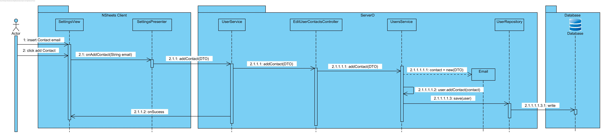

**João Magalhães** (1160763) - Sprint 1 - Core05.1
===============================

# 1. General Notes

Due to various problems, obstacles and even health related problems, the implementation is lacking the connections between the UI and the Controller.

# 2. Requirements

*In this section is described the requirements for this sprint.*

#####Requirements description:

        CORE 5.1: "Each user of the applications should have a list of contacts.
        A contact is another user of the application that has established a contact with the user of the application.
        A user of the application may establish a contact with another user by sending an invitation if he/she knows the email of the other user.
        A user may or not accept an invitation.
        A user can block/unblock invitations from other users."

We can further specify this textual requirements as user stories.

#### Proposal:

###### USER STORIES:

- US1 - As a logged user I want to see all my contacts.
- US2 - As a logged user I want to see all my invitations.
- US3 - As a logged user I want to see all of Users I blocked.
- US4 - As a logged user I want to add a contact.
- US5 - As a logged user I want to block a User, so he/she cannot add me as a contact.
- US6 - As a logged user I want to unblock a User, so he/she can add me as a contact.

# 3. Analysis

*In this section you should describe the study/analysis/research you developed in order to design a solution.*

For this feature increment, since it is the first one to be developed in a new project I need to:  

- Understand how the application works and also understand the key aspects of GWT, since it is the main technology behind the application  

- Understand how the Home Page is implemented (for instance, how the UI gets the Workbook Descriptions that are displayed)  

- Understand how to integrate a relational database into the project (Will be assuming JPA since it is studied in EAPLI)   

## 3.1 GWT and Project Structure

**Modules**. From the pom.xml file we can see that the application is composed of 5 modules:  
- **server**. It is the "server part" of the web application.  
- **shared**. It contains code that is shared between the client (i.e., web application) and the server.   
- **nsheets**. It is the web application (i.e., Client).  
- **util**. This is the same module as the one of EAPLI.  
- **framework**. This is the same module as the one of EAPLI.   
  
From [GWT Overview](http://www.gwtproject.org/overview.html): *"The GWT SDK contains the Java API libraries, compiler, and development server. It lets you write client-side applications in Java and deploy them as JavaScript."*

Therefore:
  - The project is totally developed in Java, event for the UI parts.
  - GWT uses a technique know as "transpilation" to translate Java code to Javascript. This is totally transparent to the user
  - A GWT application is comprised of "GWT modules" (see [GWT Tutorial](http://www.gwtproject.org/doc/latest/tutorial/create.html)). These GWT modules are described in .gwt.xml files.
   The nsheets project contains a .gwt.xml file named nsheets.gwt.xml (nsheets/src/main/resources/pt/isep/nsheets/nsheets.gwt.xml). One of the important contents of the file is the specification of the entry point of the application. However, since the application uses the [GWTP framework](http://dev.arcbees.com/gwtp/) the entry point is automatically provided (no need to specify it in the .gwt.xml file). In this case what is specified is the GIN client module pt.isep.nsheets.client.gin.ClientModule:
   
	    <extend-configuration-property name="gin.ginjector.modules"
                                   value="pt.isep.nsheets.client.gin.ClientModule"/>
                                   
   It is from this **ClientModule** that the application starts.
   Another important content of a .gwt.xml file is setting the paths for translatable code, .i.e., java code that should be translated to javascript. Usually the default source path is the client subpackage underneath where the .gwt.xml File is stored. In this case every code inside package pt.isep.nsheets.client and pt.isep.nsheets.shared will be translated to javascript. 
   
	<!-- Specify the paths for translatable code                    -->
    <source path='client'/>
    <source path='shared'/>
        
   The shared package is where shared code between server and client should reside. See [GWT - What to put in the shared folder?](https://stackoverflow.com/questions/5664601/gwt-what-to-put-in-the-shared-folder?utm_medium=organic&utm_source=google_rich_qa&utm_campaign=google_rich_qa) and also [using GWT RPC](http://www.gwtproject.org/doc/latest/tutorial/RPC.html).
   
   In this project the shared, server and client (i.e, nsheets) code are separated also in Maven modules (but they could all be in the same project/maven module). 
   
## 3.2 Application Startup and GWTP

As described before the entry point for the application is the class **pt.isep.nsheets.client.gin.ClientModule**.

GWTP follows the MVP (Model-View-Presenter) pattern. It uses [GIN dependency injection](http://dev.arcbees.com/gwtp/core/presenters/gin-bindings.html) to put together the parts of each MVP. How the GWTP structures the application and uses GIN to bind all the required elements is described in [GWTP Beginner's Tutorial](http://dev.arcbees.com/gwtp/tutorials/index.html).

We can see that **ClientModule** installs the base presenter of the application:

	    install(new ApplicationModule());
	        
The **ApplicationModule** module install all the other modules of the application:

	    install(new HomeModule());
        install(new MenuModule());
        install(new AboutModule());
        install(new ChartWizzardModule());
        install(new WorkbookModule());
        install(new EventCalendarModule());
        install(new ChatModule());
        install(new LoginModule());
        install(new SettingsModule());
        install(new NewNotePageModule());
        install(new FormModule());  

Each module represents an MVP page in the application.

In this MVP pattern each presenter defines a specific interface that is use to communicate with the UI (i.e., the View). Therefore the presenter can be fully isolated from dependencies related to the UI. For instance, the View interface that is defined by the ApplicationPresenter only has one method:

	interface MyView extends View {
    		void setPageTitle(String title, String description, String link, String specification);
    } 

In this specific case the only type that is "shared" between Presenter and View is the String.

The View class is where all the UI code should be implemented. In GWT it is possible to create UI elements programmatically (see [GWT Build the UI](http://www.gwtproject.org/doc/latest/tutorial/buildui.html)). The UI can also be described in .ui.xml files using [UIBinder](http://www.gwtproject.org/doc/latest/DevGuideUiBinder.html). The NSheets project is using [GWT Material Design](https://github.com/GwtMaterialDesign/gwt-material) and therefore all the UI widgets are from that library. 

In the case of the Application module we can see that there is a ApplicationView.ui.xml. This file declares some widgets. The attribute ui:field can be used to specify an id that can be then used to bind that element to a class in the code. For instance, in ApplicationView.ui.xml:

	<m:MaterialPanel ui:field="panel">
		<m:MaterialLabel ui:field="title" text="NSheets" fontSize="2.3em"/>
		<m:MaterialLabel ui:field="description" text="A Sophisticated Web Spreadsheet Application." fontSize="1.1em"/>
	</m:MaterialPanel>
	
It is set the ui:field attribute for two existing labels. In the code (ApplicationView.java) one can bind to Widgets classes. For instance:

	@UiField
    MaterialLabel title, description;
    
Then we can use this instances to access the widgets link in:

	@Override
	public void setPageTitle(String title, String description, String link, String specification) {
        this.title.setText(title);
        this.description.setText(description);
		
        new MaterialAnimation().transition(Transition.BOUNCEINLEFT).animate(this.title);
        new MaterialAnimation().transition(Transition.BOUNCEINLEFT).animate(this.description);
    }    
	
We also can see that there is a MenuView.ui.xml. This file declares some widgets. This file declares a sideBar in wich a lot of options are added. One of them is the Settings options where we can list and add contacts. We can also change the type of the Icon to a settings logo. For instance, in MenuView.ui.xml:

	<m:MaterialSideNavPush ui:field="sideNav" m:id="sideBar" width="280" allowBodyScroll="true" showOnAttach="true">
            ...
			<m.html:ListItem waves="DEFAULT">
                <m:MaterialLink targetHistoryToken="{tokens.getSettings}" iconPosition="LEFT" iconType="SETTINGS" text="Settings"/>
            </m.html:ListItem>
			...
	</m:MaterialSideNavPush>
	

In the present file SettingsView.ui.xml, we have declared 4 textBars and 4 buttons: 

	<m:MaterialRow>
            <m:MaterialButton ui:field="btnListContacts" text="List Contacts" waves="LIGHT" textColor="WHITE"/>
        <m:MaterialColumn>
                <g:HTMLPanel>
                    

                        <m:MaterialTextBox ui:field="username1" placeholder="Username of the User" label="Username" iconType="MENU"/>
                    

                </g:HTMLPanel>
            </m:MaterialColumn>
        </m:MaterialRow>
        
        <m:MaterialRow>
            <m:MaterialButton ui:field="btnListBlockedUsers" text="List Blocked Users" waves="LIGHT" textColor="WHITE"/>            
            <m:MaterialColumn>
                <g:HTMLPanel>
                    

                        <m:MaterialTextBox ui:field="username2" placeholder="Username of the User" label="Username" iconType="MENU"/>
                    

                </g:HTMLPanel>
            </m:MaterialColumn>
        </m:MaterialRow>
        
        <m:MaterialRow>
        <m:MaterialButton ui:field="btnCreateContact" text="Create Contact" waves="LIGHT" textColor="WHITE"/>
            <m:MaterialColumn>
                <g:HTMLPanel>
                    

                        <m:MaterialTextBox ui:field="email1" placeholder="Email of the User" label="Email" iconType="MENU"/>
                    

                </g:HTMLPanel>
            </m:MaterialColumn>
	</m:MaterialRow>
        
        <m:MaterialRow>
        <m:MaterialButton ui:field="btnBlockUser" text="Block User" waves="LIGHT" textColor="WHITE"/>
            <m:MaterialColumn>
                <g:HTMLPanel>
                    

                        <m:MaterialTextBox ui:field="email2" placeholder="Email of the User" label="Email" iconType="MENU"/>
                    

                </g:HTMLPanel>
            </m:MaterialColumn>
	</m:MaterialRow>
	
We repeat the same process as in the code (ApplicationView.java):

	@UiField
    MaterialButton btnListContacts,btnListBlockedUsers,btnCreateContact,btnBlockUser;
    
    @UiField
    MaterialTextBox email1, email2, username1, username2;
	
The way we can improve this UI is if we had only 6 buttons to select each US, and only 1 TextBox for the 3 US that add a contact, invitation or a blockedUser.
	
## 3.3 Server and RPC

This section is how the code should be implemented.

The Home page displays what seems to be Workbooks that should reside in the server.

In the method **for each US** the Home presenter should invoke a UsersService asynchronously. It uses the base communication mechanism of GWT called [GWT RPC](http://www.gwtproject.org/doc/latest/tutorial/RPC.html).

Basically, it requires the definition of an interface for the service. In this case:

	@RemoteServiceRelativePath("usersService")
	public interface UsersService extends RemoteService {
		ArrayList<EmailDTO> getContacts();
	}

*Note 1:* Again, this example is the desired implementation. In the actual implementation the method contacts passes a String so it can get a User from the repository using his username.
*Note 2:* The @RemoteServiceRelativePath annotation associates the service with a default path relative to the module base URL.

When an RPC is invoked since it is always executed asynchronously we have to prove a callback: 

	// Make the call to the stock price service.
	userSvc.getContacts(callback);
	
The callback is simple a class that provides two methods, one for a successful result and the other for a failure:

	// Set up the callback object.
	AsyncCallback<ArrayList<EmailDTO>> callback = new AsyncCallback<ArrayList<EmailDTO>>() {
		public void onFailure(Throwable caught) {
			// TODO: Do something with errors.
		}
		public void onSuccess(ArrayList<EmailDTO> result) {
			//Should present the ArrayList.
		}
	}; 

Since the interface is code that must be accessed by both server and client code it should reside in the **shared** project.

The interface must be implemented in the **server**. The implementation can be very simple, like the one presented in the project.

	@Override
	public ArrayList<EmailDTO> getWorkbooks() {
	    ArrayList<EmailDTO> contacts = new ArrayList<>();
		
		//Here the method should get the logged in User and "grab" his contacts and had them to the ArrayList above.

		return contacts;
	}

Since the service is a servlet it must be declared in the **web.xml** file of the project (see file nsheets/src/main/webapp/WEB-INF/web.xml).

	<!-- Servlets for the Users -->
	<servlet>
		<servlet-name>usersServiceServlet</servlet-name>
		<servlet-class>pt.isep.nsheets.server.services.UsersServiceImpl</servlet-class>
	</servlet>
	
	<servlet-mapping>
		<servlet-name>usersServiceServlet</servlet-name>
		<!-- The first "part" of the url is the name of the GWT module as in "rename-to" in .gwt.xml -->
		<url-pattern>/nsheets/usersService</url-pattern>
	</servlet-mapping> 
	

## 3.4 Analysis Diagrams

The main idea for the "workflow" of this feature increment.

**Use Cases**

- **Use Cases**. Since these use cases have a one-to-one correspondence with the User Stories we do not add here more detailed use case descriptions. We find that these use cases are very simple and may eventually add more specification at a later stage if necessary.

**Domain Model (for this feature increment)**

- **Domain Model**. The Class User has this Structure.

**System Sequence Diagrams**

**For US1**

Notes:  
- The diagram only depicts the less technical details of the scenario;  
- For clarity reasons details such as the PersistenceContext or the RepositoryFactory are not depicted in this diagram.   
- **UserService** realizes the GWT RPC mechanism;  
- **EditUserContactsController** is the *use case controller*;  
- **UsersService** is to group together all the services related to the User. 

**For US2**

**For US3**

**For US4**

Notes: 
- When adding the new Contact this verifies if this email belongs to the list of invitations and if so, adds immediately, else this email is added to the List of Invitations of the receiving User´s email.

**For US5**

**For US6**

# 4. Design

*In this section you should present the design solution for the requirements of this sprint.*
C

## 4.1. Tests

*In this section you should describe the design of the tests that, as much as possibe, cover the requirements of the sprint.*

In this section the code is represented has it is in the code sent in sprint 1.

Regarding tests we try to follow an approach inspired by test driven development. However it is not realistic to apply it for all the application (for instance for the UI part). Therefore we focus on the domain classes and also on the services provided by the server.

**Domain classes**

For the Domain classes we will have a class that represents the entity **User**. This entity will have attributes that are:
	
	- username (Username);
	- password (Password);
	- email (Email);
    - role (string)
	- contacts (List<Email>)
    - invitations (List<Email>)
	- blockedUsers (List<Email>)

**Test:** 
Other than the normal test to ensure that a User can be created when all the attributes are set, there is also test to check if it can add the wanted email to the right List of contacts, invitations or blockedUsers.  

	@Test
    public void ensureContactIsAdded(){
        Email e = new Email("testuser@isep.ipp.pt");
        
        u.addContact(e);
        assertEquals(!u.contactsList().isEmpty(), true);
    }
    
    @Test
    public void ensureInvitationIsAdded(){
        Email e = new Email("testuser@isep.ipp.pt");
        
        u.receiveInvitation(e);
        assertEquals(!u.invitations().isEmpty(), true);
    }
    
    @Test
    public void ensureUserIsBlocked(){
        Email e = new Email("testuser@isep.ipp.pt");
        
        u.blockUser(e);
        assertEquals(!u.blockedUsers().isEmpty(), true);
    }

**Services/Controllers**

For the services the application already has a service specified in the interface **UserService**:

	@RemoteServiceRelativePath("usersService")
	public interface UsersService extends RemoteService{
		ArrayList<EmailDTO> getContacts(String username);
    }
	
This method seems to be sufficient for supporting US1 but not US4.

For US2 we need a method that can be used to create a new Contact given a EmailDTO.

The proposal is:

	@RemoteServiceRelativePath("usersService")
	public interface UsersService extends RemoteService{
		ArrayList<EmailDTO> getContacts(String username);
		EmailDTO addContact(EmailDTO wdDto, String username) throws DataException;
	}
		
Tests:  
- The tests on the controllers require the presence of a database.  
- We will use the database in memory (H2).  
- We will have a *controller* that can add to the List of Contacts, Invitations or BlockedUsers or list them. This controller will be invoked by the GWT RPC service.

Controller **EditUserContactsController**

Due to lack of Implementation it was not possible to do tests to this controller.
 
- TODO: Add more tests to increase the coverage of the domain class. 

## 4.2. Requirements Realization

*In this section you should present the design realization of the requirements.*

Following the guidelines for JPA from EAPLI we envision a scenario like the following for realizing the use cases for this feature increment.

**For US1**

Notes:  
- The diagram only depicts the less technical details of the scenario;  
- For clarity reasons details such as the PersistenceContext or the RepositoryFactory are not depicted in this diagram.   
- **UserService** realizes the GWT RPC mechanism;  
- **EditUserContactsController** is the *use case controller*;  
- **UsersService** is to group together all the services related to the User. 

**For US2**

**For US3**

**For US4**

Notes: When adding the new Contact this verifies if this email belongs to the list of invitations and if so, adds immediately, else this email is added to the List of Invitations of the receiving User´s email.

**For US5**

**For US6**

## 4.3. Classes

*Present and describe the major classes of you solution.*

## 4.4. Design Patterns and Best Practices

*Present and explain how you applied design patterns and best practices.*

By memory we apply/use:
- Repository: Used to store the information of the Entity User.
- DTO: is used so it's possible to exchange information between the UI and the client.  

The repository belongs to the Server Module and the DTO class to the shared Module.

# 5. Implementation

*If required you should present in this section more details about the implementation. For instance, configuration files, grammar files, etc. You may also explain the organization of you code. You may reference important commits.*

**For US1 US2 and US3**

**UI: Button and a TextBox for listing each of the options**

We updated the HomeView.ui.xml accordingly and declare the elements the following tags for the textBoxes: ui:field="username1" , ui:field="username2" , ui:field="email1" , ui:field="email2".
And the following tags for the Buttons: ui:field="btnListContacts" , ui:field="btnListBlockedUsers" , ui:field="btnCreateContact" , ui:field="btnBlockUser".
In the corresponding class View (i.e., HomeView) we bind the buttons and the text boxes to the corresponding widget class: 	

	@UiField
    MaterialButton btnListContacts,btnListBlockedUsers,btnCreateContact,btnBlockUser;
    
    @UiField
    MaterialTextBox email1, email2, username1, username2;

We must now add the code that invokes the server to list the information when the user clicks in the button. This is an event. To implement this behavior we could use GWT Events such as the SetPageTitleEvent already used in the application. These are special type of events that GWT manages and are available to all pages in the application. 

We chose to provide our click event globally but to simple use the click event handler of the button and connect it to a method in the HomePresenter.

Since Presenters should only depend on a View interface we added a new method to the HomePresenter.MyView:

	interface MyView extends View {
		void listContacts(String username); //for example purpose
		void addClickHandler(ClickHandler ch);
	}

Then, we implemented the *addClickHandler* in the HomeView class and call this method in the constructor of the HomePresenter. In the constructor our handler class the server method that lists all the infos.   

**For US4, US5 and US6**

We had to repeat the same process as before and the only diference would be in the method to add the contact, or the methods to block or unblock the User.

**Code Organization**  

We followed the recommended organization for packages:  
- Code should be added (when possible) inside packages that identify the group, sprint, functional area and author;
- For instance, we used **lapr4.red.s1.core.n1160763**

The code for this sprint:  
Project **server**    
- pt.isep.nsheets.server.**lapr4.red.s1.core.n1160763**.ContactEdition.application: contains the controllers  
- pt.isep.nsheets.server.**lapr4.red.s1.core.n1160763**.ContactEdition.domain: contains the domain classes  
- pt.isep.nsheets.server.**lapr4.green.s1.ipc.n1160818**.userAuthentication.persistence: contains the persistence/JPA classes 
- Created class: **pt.isep.nsheets.server.UsersServiceImpl**

Project **shared**  
- Added the class: **pt.isep.nsheets.shared.services.DataException**: This class is new and is used to return database exceptions from the server  
- Created the classes: **pt.isep.nsheets.shared.services.UsersService**, **pt.isep.nsheets.shared.services.EmailDTO** and **pt.isep.nsheets.shared.services.UsersServiceAsync**  

Project **NShests** 
- Updated the classes: **pt.isep.nsheets.client.aaplication.home.HomeView** and **pt.isep.nsheets.client.aaplication.home.HomePresenter**  
- Updated the file: **pt.isep.nsheets.client.aaplication.home.HomeView.ui.xml**  
- Created the classes: **pt.isep.nsheets.client.aaplication.home.SettingsView**, **pt.isep.nsheets.client.aaplication.home.SettingsPresenter**, **pt.isep.nsheets.client.aaplication.home.SettingsModule** and **pt.isep.nsheets.client.aaplication.home.SettingsUiHandlers**
- Created the file: **pt.isep.nsheets.client.aaplication.home.SettingsView.ui.xml**  

# 6. Integration/Demonstration

*In this section document your contribution and efforts to the integration of your work with the work of the other elements of the team and also your work regarding the demonstration (i.e., tests, updating of scripts, etc.)*

For this Sprint and this specific work on the contacts, I worked simultaneously with the colleague that worked in the UserAuthentication to form the table of the User.

# 7. Final Remarks 

*In this section present your views regarding alternatives, extra work and future work on the issue.*

Some Questions/Issues identified during the work in this feature increment:

1. In the process to get all the Contacts, in this analysis the user has to insert a username. Maybe it´s better and simpler, if in 
the process of getting the contacts, it only lists the contacts of the user that is logged in.

# 8. Work Log

*Insert here a log of you daily work. This is in essence the log of your daily work. It should reference your commits as much as possible.*

There is a lot of commits not presented in this section because of conflicts and problems in the execution of pulls and pushes. Many times the program there was on the branch master ended up ruining my work so I wasn´t able to commit all of them and therefore only have these few to show.

Commits:

[[Issue#13] Core05.1 - Basic Extension Mechanism: Added documentation to main readme.md](https://bitbucket.org/lei-isep/lapr4-18-2dc/commits/7332958bf3f12dc1a710fee3f2c2f51a8f65ab1a)

[[Issue#13] Core05.1 - Changes in the UI and ValueObjects of User](https://bitbucket.org/lei-isep/lapr4-18-2dc/commits/8fa9b660daf0be71ff70cb641d9610ffbf866a32)

[[Issue#13] Core05.1 - Changes to Controller. UI is now visible.](https://bitbucket.org/lei-isep/lapr4-18-2dc/commits/17bd0b5ac68d88cf52c49afd0ffa6d339a2011d6)

[[#13] Core5.1 - Services for user added.](https://bitbucket.org/lei-isep/lapr4-18-2dc/commits/be13d11d4d2331eecaa820a03ee78af2c79b2d3c)

[[#13] Core5.1 - Changes in UI.](https://bitbucket.org/lei-isep/lapr4-18-2dc/commits/29f2e7b6573a9d09a231fdee4f1c80b45082a866)

[[#13] Core5.1 - Documentation added.](https://bitbucket.org/lei-isep/lapr4-18-2dc/commits/3702312d8b8b657d9829dccd58d0f0d69cba1b92)
