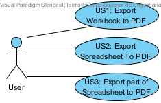
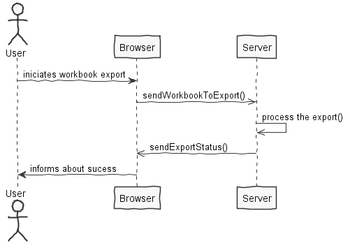
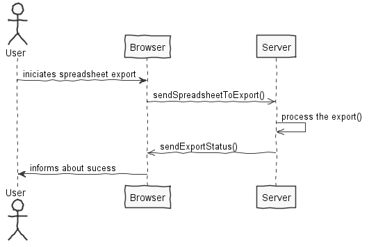
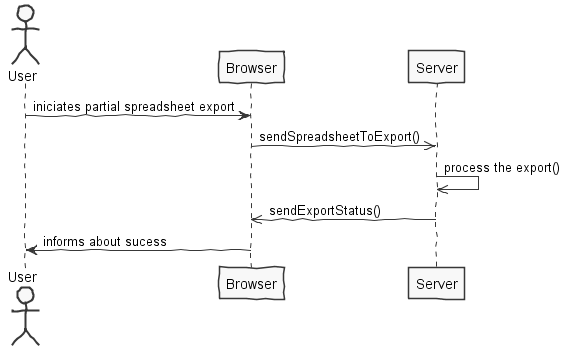
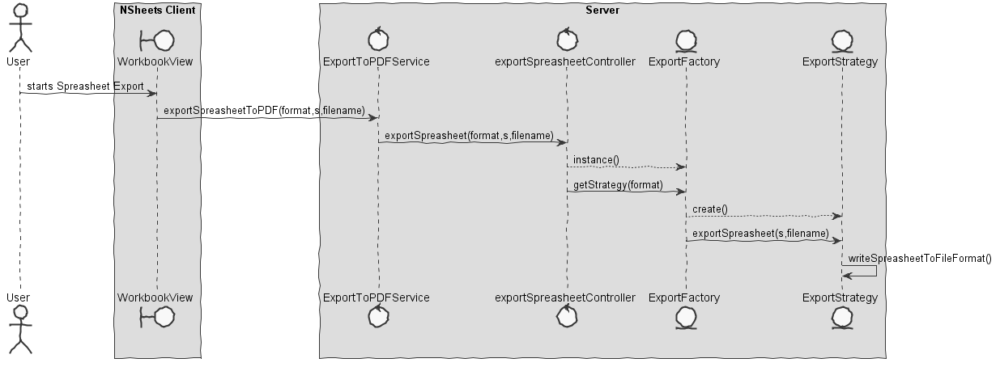
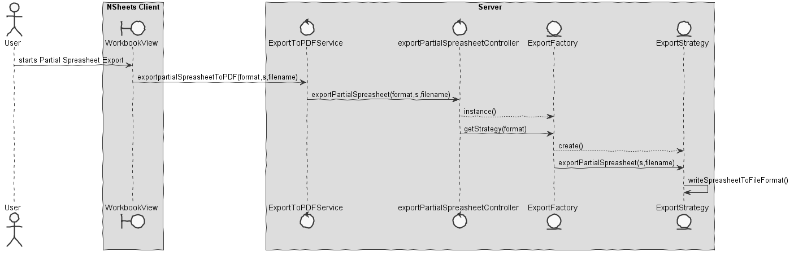

**João Magalhães** (1160763) - Sprint 2 - IPC03.2
===============================

# 1. General Notes

Due to various problems and obstacles, the implementation lacks the full export due to missing the HTTPPOST needed to be sucessfull.

# 2. Requirements

*In this section is described the requirements for this sprint.*

#####Requirements description:

		IPC03.2: "The generated PDF should now mimic as far as possible the screen style of the exported contents. 
		For instance, the formatting of the cells in the PDF should be similar to the screen. 
		It should be also possible to configure the type of lines to use for cell delimitation, the type of line and color. 
		This is to be applied when rendering all cells in the PDF. 
		Note that this is different from the style used for cells borders in the screen."

We can further specify this textual requirements as user stories.

#### Proposal:

###### USER STORIES:

- US1 - As default user i want to export an entire workbook
- US2 - As default user i want to export only a spreadsheet
- US3 - As default user i want to export part of a spreadsheet

# 3. Analysis

*In this section you should describe the study/analysis/research you developed in order to design a solution.*

For this feature increment, since it is the first one to be developed in a new project I need to:  

- Understand how the application works and how is implemented.

- Understand the key aspects of GWT, since it is a new thing for us.

- Understand how the Home Page is implemented.

- Understand how the Workbook UI works.

- Understand how i can communicate between UI and controllers. 

## 3.1 GWT and Project Structure

**Modules**. From the pom.xml file we can see that the application is composed of 5 modules:  
- **server**. It is the "server part" of the web application.  
- **shared**. It contains code that is shared between the client (i.e., web application) and the server.   
- **nsheets**. It is the web application (i.e., Client).  
- **util**. This is the same module as the one of EAPLI.  
- **framework**. This is the same module as the one of EAPLI.   
  
From [GWT Overview](http://www.gwtproject.org/overview.html): *"The GWT SDK contains the Java API libraries, compiler, and development server. It lets you write client-side applications in Java and deploy them as JavaScript."*

Therefore:
  - The project is totally developed in Java, event for the UI parts.
  - GWT uses a technique know as "transpilation" to translate Java code to Javascript. This is totally transparent to the user
  - A GWT application is comprised of "GWT modules" (see [GWT Tutorial](http://www.gwtproject.org/doc/latest/tutorial/create.html)). These GWT modules are described in .gwt.xml files.
   The nsheets project contains a .gwt.xml file named nsheets.gwt.xml (nsheets/src/main/resources/pt/isep/nsheets/nsheets.gwt.xml). One of the important contents of the file is the specification of the entry point of the application. However, since the application uses the [GWTP framework](http://dev.arcbees.com/gwtp/) the entry point is automatically provided (no need to specify it in the .gwt.xml file). In this case what is specified is the GIN client module pt.isep.nsheets.client.gin.ClientModule:
   
	    <extend-configuration-property name="gin.ginjector.modules"
                                   value="pt.isep.nsheets.client.gin.ClientModule"/>
                                   
   It is from this **ClientModule** that the application starts.
   Another important content of a .gwt.xml file is setting the paths for translatable code, .i.e., java code that should be translated to javascript. Usually the default source path is the client subpackage underneath where the .gwt.xml File is stored. In this case every code inside package pt.isep.nsheets.client and pt.isep.nsheets.shared will be translated to javascript. 
   
	<!-- Specify the paths for translatable code                    -->
    <source path='client'/>
    <source path='shared'/>
        
   The shared package is where shared code between server and client should reside. See [GWT - What to put in the shared folder?](https://stackoverflow.com/questions/5664601/gwt-what-to-put-in-the-shared-folder?utm_medium=organic&utm_source=google_rich_qa&utm_campaign=google_rich_qa) and also [using GWT RPC](http://www.gwtproject.org/doc/latest/tutorial/RPC.html).
   
   In this project the shared, server and client (i.e, nsheets) code are separated also in Maven modules (but they could all be in the same project/maven module). 
   
## 3.2 Application Startup and GWTP

As described before the entry point for the application is the class **pt.isep.nsheets.client.gin.ClientModule**.

GWTP follows the MVP (Model-View-Presenter) pattern. It uses [GIN dependency injection](http://dev.arcbees.com/gwtp/core/presenters/gin-bindings.html) to put together the parts of each MVP. How the GWTP structures the application and uses GIN to bind all the required elements is described in [GWTP Beginner's Tutorial](http://dev.arcbees.com/gwtp/tutorials/index.html).

We can see that **ClientModule** installs the base presenter of the application:

	    install(new ApplicationModule());
	        
The **ApplicationModule** module install all the other modules of the application:

	    install(new HomeModule());
        install(new MenuModule());
        install(new AboutModule());
        install(new ChartWizzardModule());
        install(new WorkbookModule());
        install(new EventCalendarModule());
        install(new TaskModule());
        install(new ChatModule());
        install(new LoginModule());
        install(new SettingsModule());
        install(new NewNotePageModule());
        install(new NewListPageModule());
        install(new FormModule());
        install(new SignUpModule());
        install(new PrivateChatModule());  

Each module represents an MVP page in the application.

In this MVP pattern each presenter defines a specific interface that is use to communicate with the UI (i.e., the View). Therefore the presenter can be fully isolated from dependencies related to the UI. For instance, the View interface that is defined by the ApplicationPresenter only has one method:

	interface MyView extends View {
    		void setPageTitle(String title, String description, String link, String specification);
    } 

In this specific case the only type that is "shared" between Presenter and View is the String.

The View class is where all the UI code should be implemented. In GWT it is possible to create UI elements programmatically (see [GWT Build the UI](http://www.gwtproject.org/doc/latest/tutorial/buildui.html)). The UI can also be described in .ui.xml files using [UIBinder](http://www.gwtproject.org/doc/latest/DevGuideUiBinder.html). The NSheets project is using [GWT Material Design](https://github.com/GwtMaterialDesign/gwt-material) and therefore all the UI widgets are from that library. 

In the case of the Application module we can see that there is a ApplicationView.ui.xml. This file declares some widgets. The attribute ui:field can be used to specify an id that can be then used to bind that element to a class in the code. For instance, in ApplicationView.ui.xml:

	<m:MaterialPanel ui:field="panel">
		<m:MaterialLabel ui:field="title" text="NSheets" fontSize="2.3em"/>
		<m:MaterialLabel ui:field="description" text="A Sophisticated Web Spreadsheet Application." fontSize="1.1em"/>
	</m:MaterialPanel>
	
It is set the ui:field attribute for two existing labels. In the code (ApplicationView.java) one can bind to Widgets classes. For instance:

	@UiField
    MaterialLabel title, description;
    
Then we can use this instances to access the widgets link in:

	@Override
	public void setPageTitle(String title, String description, String link, String specification) {
        this.title.setText(title);
        this.description.setText(description);
        new MaterialAnimation().transition(Transition.BOUNCEINLEFT).animate(this.title);
        new MaterialAnimation().transition(Transition.BOUNCEINLEFT).animate(this.description);
    }    

We also can see that there is a WorkbookView.ui.xml. This were the added changes to the file:

	<ma:window.MaterialWindow ui:field="windowPDF" >
            <m:MaterialPanel padding="32" textAlign="CENTER" height="300px">

                <m:MaterialLabel text="Export To PDF" marginTop="10"></m:MaterialLabel>
                <m:MaterialTextBox ui:field="fileName" placeholder="Enter the file name" label="Enter the file name" active="true" grid="s11" iconType="SEARCH" />
                <m:MaterialButton ui:field="startExportWorkbookPDF" text="Export Workbook" waves="LIGHT" textColor="WHITE" iconType="PLAY_FOR_WORK" iconPosition="LEFT"/>
                <m:MaterialButton ui:field="startExportSpreadsheetPDF" text="Export Spreadsheet" waves="LIGHT" textColor="WHITE" iconType="PLAY_FOR_WORK" iconPosition="LEFT"/>
                <m:MaterialButton ui:field="startExportPartialSpreadsheetPDF" text="Export Partial Spreadsheet" waves="LIGHT" textColor="WHITE" iconType="PLAY_FOR_WORK" iconPosition="LEFT"/>

            </m:MaterialPanel>
        </ma:window.MaterialWindow>

        <ma:window.MaterialWindow ui:field="windowSpreadsheetPDF" >
            <m:MaterialPanel padding="32" textAlign="CENTER" height="300px">

                <m:MaterialLabel text="Export Spreadsheet To PDF" marginTop="10"></m:MaterialLabel>
                <m:MaterialTextBox ui:field="SpreadsheetNumber1" placeholder="Number of the Spreadsheet" label="Enter the number of the Spreadsheet" active="true" grid="s11" iconType="SEARCH" />
                <m:MaterialButton ui:field="ExportSpreadsheetPDF" text="Export Spreadsheet" waves="LIGHT" textColor="WHITE" iconType="PLAY_FOR_WORK" iconPosition="LEFT" grid="s32"/>

            </m:MaterialPanel>

        </ma:window.MaterialWindow>

        <ma:window.MaterialWindow ui:field="windowPartialSpreadsheetPDF" >
            <m:MaterialPanel padding="32" textAlign="CENTER" height="300px">

                <m:MaterialLabel text="Export Partial Spreadsheet To PDF" marginTop="10"></m:MaterialLabel>
                <m:MaterialTextBox ui:field="SpreadsheetNumber2" placeholder="Number of the Spreadsheet" label="Enter the number of the Spreadsheet" active="true" grid="s11" iconType="SEARCH" />
                <m:MaterialTextBox ui:field="posicao1" placeholder="Enter first position" label="Enter first position" active="true" grid="s11" iconType="SEARCH" />
                <m:MaterialTextBox ui:field="posicao2" placeholder="Enter last position" label="Enter last position" active="true" grid="s11" iconType="SEARCH" />

                <m:MaterialButton ui:field="ExportPartialSpreadsheetPDF" text="Export Partial Spreadsheet" waves="LIGHT" textColor="WHITE" iconType="PLAY_FOR_WORK" iconPosition="LEFT" grid="s32"/>

            </m:MaterialPanel>

        </ma:window.MaterialWindow>
	
We repeat the same process as in the code (ApplicationView.java):

	@UiField
    MaterialButton btnListContacts,btnListBlockedUsers,btnCreateContact,btnBlockUser;
    
    @UiField
    MaterialTextBox email1, email2, username1, username2;
	
The way we can improve this UI is if we locked the buttons until the title of the file is inserted.

## 3.4 Analysis Diagrams

**Use Cases**

**System Sequence Diagrams**

**US1**

**US2**

**US3**

# 4. Design

**Sequence Diagrams**

**US1**

**US2**

**US3**

# 4. Design

## 4.1. Tests

*In this section you should describe the design of the tests that, as much as possibe, cover the requirements of the sprint.*

No Unit tests were done in this implementation.

## 4.3. Classes

*Present and describe the major classes of you solution.*

- WorbookView.java
- WorkbookView.ui.xml
- ExportToPDFService.java
- ExportToPDFServiceAsync.java
- ExportToPDFServiceImpl.java
- web.xml
- ExportWorkbookController.java
- ExportSpreadSheetController.java
- ExportPartOfSpreadsheetController.java
- ExportFactory.java
- ExportFormats.java
- ExpotStrategy.java
- ExportToPDF.java

## 4.4. Design Patterns and Best Practices

*Present and explain how you applied design patterns and best practices.*

- Strategy: to determine which format to export to.
- DTO: is used so it's possible to exchange information between the UI and the client. 

# 5. Implementation

**Code Organization**  

Since it was only needed to fix precious code, the changes were made in the previous colleague's packages.

We followed the recommended organization for packages:  
- Code should be added (when possible) inside packages that identify the group, sprint, functional area and author;
- For instance, we used **lapr4.green.s1.n1160864.exportToPdf**

The code for this sprint:  
Project **server**    
- pt.isep.nsheets.server.**lapr4.green.s1.n1160864**.exportToPdf.application: contains the controllers  
- pt.isep.nsheets.server.**lapr4.green.s1.n1160864**.exportToPdf.domain: contains the domain classes
- Updated the existing class: **pt.isep.nsheets.server.ExportToPDFServiceImpl**

Project **shared**  
- Updated the classes: **pt.isep.nsheets.shared.services.ExportToPDFService** and **pt.isep.nsheets.shared.services.ExportToPDFServiceAsync**  

Project **NShests** 
- Updated the classes: **pt.isep.nsheets.client.aaplication.home.WorbookView** and **pt.isep.nsheets.client.aaplication.home.WorbookPresenter**  
- Updated the file: **pt.isep.nsheets.client.aaplication.home.WorbookView.ui.xml**  

# 6. Integration/Demonstration

*In this section document your contribution and efforts to the integration of your work with the work of the other elements of the team and also your work regarding the demonstration (i.e., tests, updating of scripts, etc.)*

From the previous iteration not much was done. It was needed to implement various DTO classes to exchange information.
The paths to export didn't work and had to be remade. Also we had to learn that in order to export we had to create an HTTP POST so the user could download the created file.

# 7. Final Remarks 

*In this section present your views regarding alternatives, extra work and future work on the issue.*

1. The export function doesn't work yet because the HTTP POST is needed.

# 8. Work Log

*Insert here a log of you daily work. This is in essence the log of your daily work. It should reference your commits as much as possible.*

Commits:

[[Issue #32] IPC03.2 - Documentation added. Changes in ExportPDF Classes and UI](https://bitbucket.org/lei-isep/lapr4-18-2dc/commits/7575467f2c6bd4b183b029b818b5a20cde9e417e)

[[Issue #32] IPC03.2 - Ui changes and export method.](https://bitbucket.org/lei-isep/lapr4-18-2dc/commits/aa1511e06d5fef6b3ed22b83201500be12f2b3bb)

[[Issue #32] IPC03.2 - ExportSpreadsheet in class ExportPDF modified](https://bitbucket.org/lei-isep/lapr4-18-2dc/commits/47901d983dc6a8f6f00e1f1a51af816a1fd07422)

[[Issue #32] IPC03.2 - Reimplemented erased changes. ExportSpreadsheet in class ExportPDF modified.](https://bitbucket.org/lei-isep/lapr4-18-2dc/commits/c3f0be46ac0d93cfd4f80305ab81f37c68ae623b)

