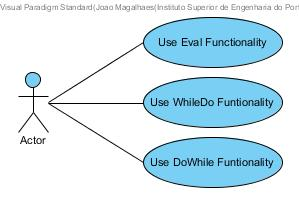
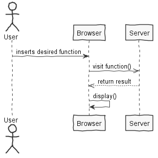

**João Magalhães** (1160763) - Sprint 3 - Lang01.3
===============================

# 1. General Notes

*In this section you should register important notes regarding your work during the sprint. For instance, if you spend significant time helping a colleague or if you work in more than one feature increment.*

The Eval functionality was implemented and works fully, but unfortunately the cycles WhileDo and DoWhile don't fully function.

# 2. Requirements

*In this section you should describe the requirements for this sprint.*

#####Requirements description:

        Lang 01.3:  Eval and While Loops
        "Add the Eval function. This function has a single parameter that is a string. 
		When executed, this function will "compile" the formula contained in the only parameter and execute the resulting expression. 
		The result of Eval is the result of the execution of the compiled expression. 
		For example, if we write the following formula "=" 2 + 3 "" we get the string "2 + 3" in the cell. 
		However, if we write the formula "= eval (" 2 + 3 ")" the value obtained in the cell is 5. 
		Add the following two loop functions: DoWhile and WhileDo. The DoWhile executes the first expression in loop while the second expression evaluates to true. 
		In each iteration of the loop the the first expression is the first to be evaluated. 
		The WhileDo executes the second expression in loop while the first evaluates to true. 
		In each iteration of the loop the the first expression is the first to be evaluated. 
		Example: "= {@counter:=1; WhileDo(Eval( "A"&@counter)> 0; {C1:=C1+Eval("B"&@counter); @counter:=@counter+1 }) }" . 
		In this example, the cell C1 will get the sum of all the values of column B in that the corresponding values in column A are greater than zero."

# 3. Analysis

*In this section you should describe the study/analysis/research you developed in order to design a solution.*

For this feature increment, since it is the first one to be developed in a new project I need to:  

- Understand how the application works and also understand the key aspects of GWT, since it is the main technology behind the application  

- Understand how the Home Page is implemented (for instance, how the UI gets the Workbook Descriptions that are displayed)  

- Understand how to integrate a relational database into the project (Will be assuming JPA since it is studied in EAPLI)   

## 3.1 Analysis Diagrams

The main idea for the "workflow" of this feature increment.

**Use Cases**

**System Sequence Diagrams**

**General Analysis for each Function**

# 4. Design

*In this section you should present the design solution for the requirements of this sprint.*

## 4.1. Tests

*In this section you should describe the design of the tests that, as much as possibe, cover the requirements of the sprint.*

## 4.2. Requirements Realization

*In this section you should present the design realization of the requirements.*

## 4.3. Classes

*Present and describe the major classes of you solution.*

    - ExcelLanguage.java
    - Eval.java
    - WhileDo.java
	- DoWhile.java

## 4.4. Design Patterns and Best Practices

*Present and explain how you applied design patterns and best practices.*

Design patterns used:

    Visitor

    Singleton

    Factory

    Strategy

    Command

Best pratices used:

    Single Responsability Principle

    Dependency Inversion Principle

    Open/Closed Principle

    High Cohesion

    Low Coupling

# 5. Implementation

*In this section present your views regarding alternatives, extra work and future work on the issue.*

This Uc is imcomplete. The cycles DoWhile and WhileDo don't function fully.

# 6. Work Log

*Insert here a log of you daily work. This is in essence the log of your daily work. It should reference your commits as much as possible.*

Commits:

[[Issue #51] Lang01.3 - Eval Function finished.](https://bitbucket.org/lei-isep/lapr4-18-2dc/commits/f34893238cbfa1bd6f7782bbc6830d9da45bd49f)

[[Issue #51] Lang01.3 - Attempt at WhileDo Function.](https://bitbucket.org/lei-isep/lapr4-18-2dc/commits/91d1663df624c292819ab264a5b951cb82547fa4)

[[Issue #51] Lang01.3 - Attempt at DoWhile Function.](https://bitbucket.org/lei-isep/lapr4-18-2dc/commits/596a8ee2ecab128a4cdce1e42de7afcabca4684e)

