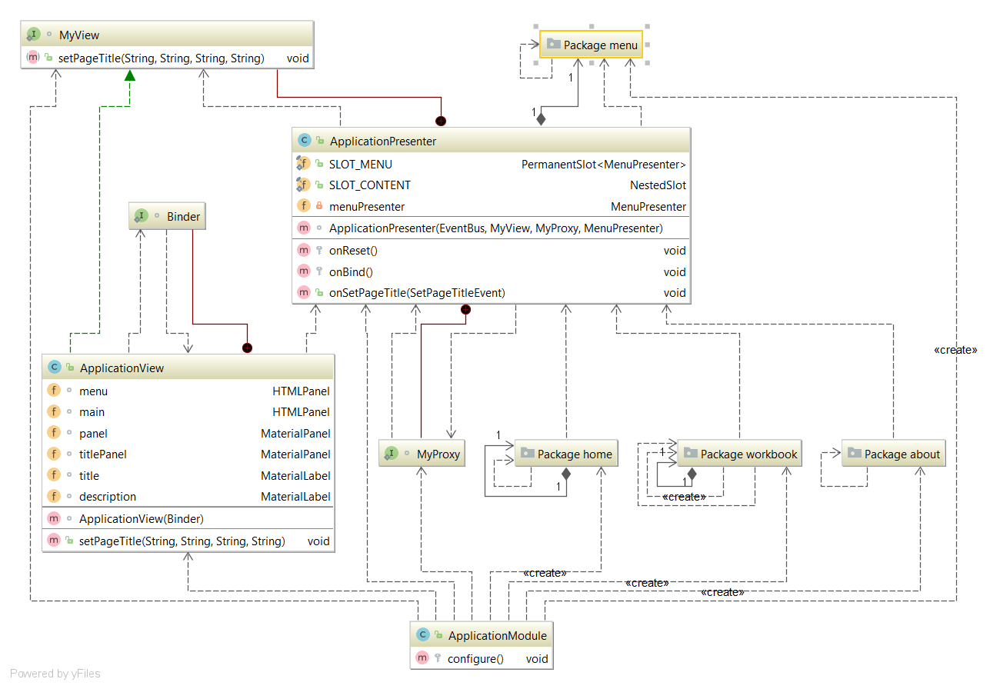
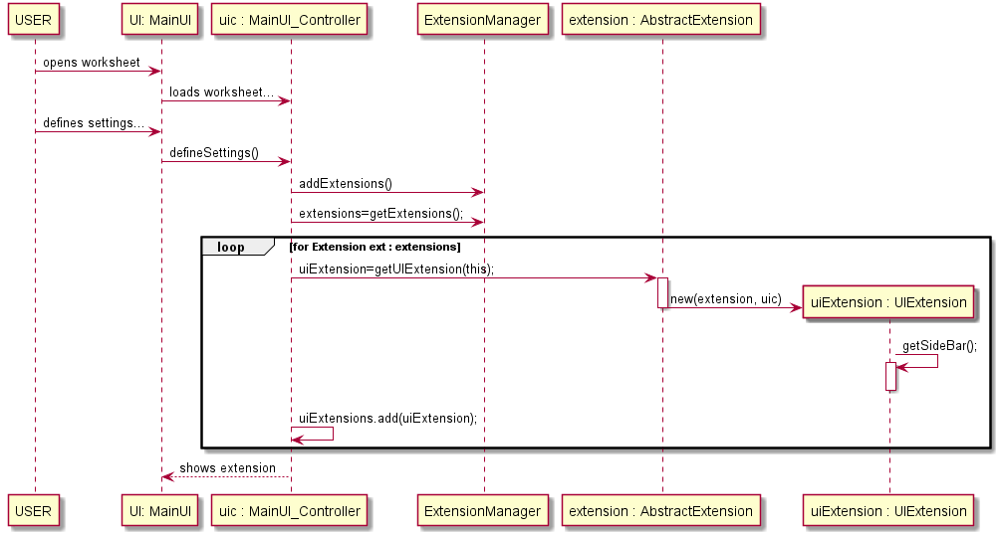

**David Blanquett** (1161018) - Sprint 1 - Core02.1:  Basic Extension Mechanism
===============================

# 1. General Notes

My feature is **implemented** and **fully functional**. I believe that there are aspects that could have been improved but since I only
had 1 week to complete this feature - even less because some UC's depended upon mine -  *I think I did a good job*.
I helped several colleges doing their features, like the ones that depended on mine and many others, even from others classes :-)

# 2. Requirements

*In this section is described the requirements for this sprint.*

#####Requirements description:

        CORE 02.1: "Implement an extension mechanism that can be used to add functionality to the application.
        For the moment it should support extensions that add cell decorators.
        The application should also have a new settings page with a specific section for each extension.
        For testing purposes a new extension should be developed that changes
        the background color of numeric cells according to its value being positive or negative.
        The color should be configured in the settings page."

#### Proposal:

###### USER STORIES:

1. Extension Mechanism:
    - US1 - As default user I want to decorate a single cell.
    - US2 - As default user I want to decorate the spreadsheet.

2. Yellow Extension:
    - US3 - As default user I want to apply a decoration that changes the background colour according to its value.
    - US4 - As default user I want to define those colours in a "settings" page.

# 3. Analysis

*In this section is described the study/analysis/research I developed in order to design a possible solution.*

For this feature increment, since it is the first one to be developed in a new project I need to:  

- Understand how the application works and also understand the key aspects of GWT, since it is the main technology behind the application  .

- Understand how the Home Page is implemented.

- Understand how to integrate a relational database into the project.

- Understand how to read a file using these frameworks, since its different now that i'm using GTW.

- Understand how to upload a file.

- Understand that I cannot upload a file, since the client part is transpiled to javascript. <-- SPOILER

- Understand how the previous extension mechanism was implemented and why we cant use it anymore.

- Understand how the Workbook UI works.

## 3.1 GWT and Project Structure

**Modules**. From the pom.xml file we can see that the application is composed of 5 modules:  
- **server**. It is the "server part" of the web application.  
- **shared**. It contains code that is shared between the client (i.e., web application) and the server.   
- **nsheets**. It is the web application (i.e., Client).  
- **util**. This is the same module as the one of EAPLI.  
- **framework**. This is the same module as the one of EAPLI.   
  
From [GWT Overview](http://www.gwtproject.org/overview.html): 
*"The GWT SDK contains the Java API libraries, compiler, and development server. It lets you write client-side applications 
in Java and deploy them as JavaScript."*

Therefore:
  - The project is totally developed in Java, event for the UI parts.
  - GWT uses a technique know as "transpilation" to translate Java code to Javascript. This is totally transparent to the user
  - A GWT application is comprised of "GWT modules" (see [GWT Tutorial](http://www.gwtproject.org/doc/latest/tutorial/create.html)). 
  These GWT modules are described in .gwt.xml files.
   The nsheets project contains a .gwt.xml file named nsheets.gwt.xml (nsheets/src/main/resources/pt/isep/nsheets/nsheets.gwt.xml). 
   One of the important contents of the file is the specification of the entry point of the application. 
 However, since the application uses the [GWTP framework](http://dev.arcbees.com/gwtp/) the entry
  point is automatically provided (no need to specify it in the .gwt.xml file). In this case what is specified is the 
 GIN client module pt.isep.nsheets.client.gin.ClientModule:
   
	    <extend-configuration-property name="gin.ginjector.modules"
                                   value="pt.isep.nsheets.client.gin.ClientModule"/>
                                   
   It is from this **ClientModule** that the application starts.
   Another important content of a .gwt.xml file is setting the paths for translatable code, .i.e., java code that should be
    translated to javascript. Usually the default source path is the client subpackage underneath where the .gwt.xml File is stored. 
    In this case every code inside package pt.isep.nsheets.client and pt.isep.nsheets.shared will be translated to javascript. 
   
	<!-- Specify the paths for translatable code                    -->
    <source path='client'/>
    <source path='shared'/>
        
   The shared package is where shared code between server and client should reside.
   See [GWT - What to put in the shared folder?](https://stackoverflow.com/questions/5664601/gwt-what-to-put-in-the-shared-folder?utm_medium=organic&utm_source=google_rich_qa&utm_campaign=google_rich_qa)
    and also [using GWT RPC](http://www.gwtproject.org/doc/latest/tutorial/RPC.html).
   
   In this project the shared, server and client (i.e, nsheets) code are separated also in Maven modules (but they could all be in the same project/maven module). 
   
## 3.2 Application Startup and GWTP

As described before the entry point for the application is the class **pt.isep.nsheets.client.gin.ClientModule**.

GWTP follows the MVP (Model-View-Presenter) pattern. It uses [GIN dependency injection](http://dev.arcbees.com/gwtp/core/presenters/gin-bindings.html)
to put together the parts of each MVP. How the GWTP structures the application and uses GIN to bind all the required elements is described 
in [GWTP Beginner's Tutorial](http://dev.arcbees.com/gwtp/tutorials/index.html).

We can see that **ClientModule** installs the base presenter of the application:

	    install(new ApplicationModule());
	        
The **ApplicationModule** module install all the other modules of the application:

	    install(new HomeModule());
		install(new MenuModule());
		install(new AboutModule());
		install(new WorkbookModule());   

Each module represents an MVP page in the application.

In this MVP pattern each presenter defines a specific interface that is use to communicate with the UI (i.e., the View).
 Therefore the presenter can be fully isolated from dependencies related to the UI. For instance, the View interface that is defined by the ApplicationPresenter only has one method:

	interface MyView extends View {
    		void setPageTitle(String title, String description, String link, String specification);
    } 

In this specific case the only type that is "shared" between Presenter and View is the String.

The View class is where all the UI code should be implemented. In GWT it is possible to create UI elements programmatically 
(see [GWT Build the UI](http://www.gwtproject.org/doc/latest/tutorial/buildui.html)).
 The UI can also be described in .ui.xml files using [UIBinder](http://www.gwtproject.org/doc/latest/DevGuideUiBinder.html). The NSheets project is using [GWT Material Design](https://github.com/GwtMaterialDesign/gwt-material) and therefore all the UI widgets are from that library. 

In the case of the Application module we can see that there is a ApplicationView.ui.xml. This file declares some widgets. The attribute ui:field can be used to specify an id that can be then used to bind that element to a class in the code. For instance, in ApplicationView.ui.xml:

	<m:MaterialPanel ui:field="panel">
		<m:MaterialLabel ui:field="title" text="NSheets" fontSize="2.3em"/>
		<m:MaterialLabel ui:field="description" text="A Sophisticated Web Spreadsheet Application." fontSize="1.1em"/>
	</m:MaterialPanel>
	
It is set the ui:field attribute for two existing labels. In the code (ApplicationView.java) one can bind to Widgets classes. For instance:

	@UiField
    MaterialLabel title, description;
    
Then we can use this instances to access the widgets link in:

	@Override
	public void setPageTitle(String title, String description, String link, String specification) {
        this.title.setText(title);
        this.description.setText(description);
        new MaterialAnimation().transition(Transition.BOUNCEINLEFT).animate(this.title);
        new MaterialAnimation().transition(Transition.BOUNCEINLEFT).animate(this.description);
    }    

## 3.3 Server and RPC

The Home page displays what seems to be Workbooks that should reside in the server.

In the method **onReveal** the Home presenter invokes a WorkbookService asynchronously. It uses the base communication mechanism of GWT called [GWT RPC](http://www.gwtproject.org/doc/latest/tutorial/RPC.html).

Basically, it requires the definition of an interface for the service. In this case:

	@RemoteServiceRelativePath("workbooksService")
	public interface WorkbooksService extends RemoteService {
		ArrayList<WorkbookDescriptionDTO> getWorkbooks();
	}
	
Note: The @RemoteServiceRelativePath annotation associates the service with a default path relative to the module base URL.

When an RPC is invoked since it is always executed asynchronously we have to prove a callback: 

	// Make the call to the stock price service.
	workbooksSvc.getWorkbooks(callback);
	
The callback is simple a class that provides two methods, one for a successful result and the other for a failure:

	// Set up the callback object.
	AsyncCallback<ArrayList<WorkbookDescriptionDTO>> callback = new AsyncCallback<ArrayList<WorkbookDescriptionDTO>>() {
		public void onFailure(Throwable caught) {
			// TODO: Do something with errors.
		}
		public void onSuccess(ArrayList<WorkbookDescriptionDTO> result) {
			refreshView(result);
		}
	}; 

Since the interface is code that must be accessed by both server and client code it should reside in the **shared** project.

The interface must be implemented in the **server**. The implementation can be very simple, like the one presented in the project. In this case the server simply returns always the same objects:

	@Override
	public ArrayList<WorkbookDescriptionDTO> getWorkbooks() {
	    ArrayList<WorkbookDescriptionDTO> workbooks = new ArrayList<WorkbookDescriptionDTO>();
	    WorkbookDescriptionDTO wb=new WorkbookDescriptionDTO("workbook1", "Este workbook contem uma lista...");
	    workbooks.add(wb);
		WorkbookDescriptionDTO wb2=new WorkbookDescriptionDTO("workbook notas", "Este workbook contem notas de disciplinas...");
	    workbooks.add(wb2);	    
		return workbooks;
	}

Since the service is a servlet it must be declared in the **web.xml** file of the project (see file nsheets/src/main/webapp/WEB-INF/web.xml).

	<!-- Servlets for the workbooks -->
	<servlet>
		<servlet-name>workbooksServiceServlet</servlet-name>
		<servlet-class>pt.isep.nsheets.server.services.WorkbooksServiceImpl</servlet-class>
	</servlet>
	<servlet-mapping>
		<servlet-name>workbooksServiceServlet</servlet-name>
		<!-- The first "part" of the url is the name of the GWT module as in "rename-to" in .gwt.xml -->
		<url-pattern>/nsheets/workbooksService</url-pattern>
	</servlet-mapping> 
	

## 3.4 The Extension Mechanism: Understand how the previous extension mechanism was implemented and why we cant use it anymore.

The previous extension mechanism used Java Reflection proprieties, the previous extension manager had the responsibility to
load the extensions from a file and and put it to use. Since now the client module is transpiled to JavaScript we cant do that in
a feasible way, meaning I had to come up with another mechanism. The Mechanism is explained in the commented code classes and in the design section.

## 3.5 The Extension File: Understand how to upload a file, Understand that I cannot upload a file, since the client part is transpiled to javascript

- I had to diverge from the initial idea: Having the extension loaded from a file.
 Since the client/shared projects have to be compiled with the GTW SDK I can't load any files, and doesnt make much sense in a
 real life like application to have in the User's computer a proprieties file.
 
 
## 3.6 The UI: Understand how the Workbook UI works.

#### APPLICATION UI

#### WORKBOOK UI

- The Classes «XRender» are responsible for the color os its elements.

# 4. Design

*In this is presented the design solution for the requirements of this sprint.*

##### HOW THE EXTENSION MECHANISM WORKS:

- We have a `Extensible` Interface that says which elements can have Extensions.
- We have a `Extension` Interface that says who are the Extensions.
- We a `ExtensionManager` which is responsible for the Extension loading and usage.
- Each Extension must implement the extension Interface and have a Cell/SpreadSheet Implementation.

###### BASIC EXTENSION MECHANISM:

###### THE YELLOW EXTENSION

        -- The YellowExtension is later loaded into the ExtensionManager.

### SEQUENCE DIAGRAM

## 4.1. Tests

*In this section is should described the design of the tests that, as much as possibe, cover the requirements of the sprint.*

###### Regarding tests: 

- Since my main feature was to implement a extension mechanism I had not much "domain-related" tests to do, but i did them anyway. They are located in a separated package.
- The best UI tests are user experience... :-) - so I only tested the controller, which is also in a separated package.

## 4.4. Design Patterns and Best Practices

*Present and explain how you applied design patterns and best practices.*

By memory we apply/use:  
- Singleton  
- Repository  
- MVP  
- Visitor
- Decorator

# 5. Work Log

*Here is a log of my daily work. It only references my relevant commits. I made others to fix mainly bugs and maven erros.*

Relevant Commits:

1. [[Issue#4] Core02.1 - Basic Extension Mechanism: Added documentation to docs](https://bitbucket.org/lei-isep/lapr4-18-2dc/commits/ead95ef12613050dcdd4c203ccf6147a05b033b9)

2. [[Issue#4] Core02.1 - Basic Extension Mechanism: Added documentation related to sp1](https://bitbucket.org/lei-isep/lapr4-18-2dc/commits/700a51bf860bd99b3ad22228c8c0d1195cea1d77)

3. [[Issue#4] Core02.1 - Basic Extension Mechanism: Added desing to documentation](https://bitbucket.org/lei-isep/lapr4-18-2dc/commits/904200d2f446bac45a8415dfa9402d1122627e7b)

4. [[Issue#4] Core02.1 - Basic Extension Mechanism: Updated desing from documentation and added Button to worksheet_UI](https://bitbucket.org/lei-isep/lapr4-18-2dc/commits/e6716b2d0e2f42ef12fb7904a47c174d6a3ff6e4)

5. [[Issue#4] Core02.1 - Basic Extension Mechanism: Updated analysis from documentation.](https://bitbucket.org/lei-isep/lapr4-18-2dc/commits/9516c4f014a3942423fe89341fd48eaaddfa7809)

6. [[Issue#4] Core02.1 - Basic Extension Mechanism: Added Yellow Extension](https://bitbucket.org/lei-isep/lapr4-18-2dc/commits/8abcc8846c4640b2943ed2a325aca9115d380c15#chg-shared/src/main/java/pt/isep/nsheets/shared/ext/ExtensionManager.java)

7. [[Issue#4] Core02.1 - Basic Extension Mechanism: Added Client decorators](https://bitbucket.org/lei-isep/lapr4-18-2dc/commits/72ddfe3540ed0fa695a24aa730533d86c0713d49)

8. [[Issue#4] Core02.1 - Basic Extension Mechanism: Changed UI.](https://bitbucket.org/lei-isep/lapr4-18-2dc/commits/041c01b2a2ec765592adbff19c7449fb99ffb5af)

9. [[Issue#4] Core02.1 - Basic Extension Mechanism: Added Settings UI](https://bitbucket.org/lei-isep/lapr4-18-2dc/commits/7687b76247eae6b32e3645119a32136cde96b77b)

10. [[Issue#4] Core02.1 - Basic Extension Mechanism: Edited Settings Pop-up](https://bitbucket.org/lei-isep/lapr4-18-2dc/commits/a84753dfd85f2ddd78d4a2fbd58556016d74c624)

11. [[Issue#4] Core02.1 - Basic Extension Mechanism: Changed Decorator.](https://bitbucket.org/lei-isep/lapr4-18-2dc/commits/7d2ba0ad43dfc5dad2804a234c3cbac73d9d8fef)

12. [[Issue#4] Core02.1 - Basic Extension Mechanism: ExtensionManager now doesnt have UI responsibilities](https://bitbucket.org/lei-isep/lapr4-18-2dc/commits/a2049c686bbd2c9aebe53d2140f496419de2b9dd)

13. [[Unit Testing: Issue #4] Core02.1 - Basic Extension Mechanism: Added unit testing to Shared module.](https://bitbucket.org/lei-isep/lapr4-18-2dc/commits/fee696ead0c968261d7a4f0cfaa19896882ba2f9)

14. [[Unit Testing: Issue #4] Core02.1 - Basic Extension Mechanism: Added unit testing to Client module.](https://bitbucket.org/lei-isep/lapr4-18-2dc/commits/d03def327a219122610c5eedd61bec7bc5ed8d4d)