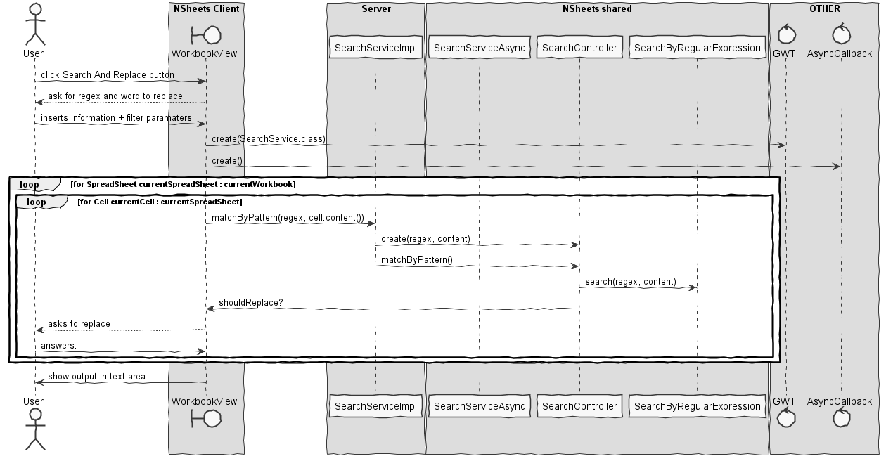

**David Blanquett** (1161018) - Sprint 2 - IPC02.2 - Workbook Search and Replace
===============================

# 1. General Notes

My feature is **implemented** and **fully functional**.
Despite the fact that my feature depended on others - Like Core02.1 and Core02.2 -  I managed to complete it.
Because CORE02.2 is not implement there is no way of showing through the browser - the client module - that it is working.
So I hardcoded a spreadsheet and added it to the current workbook. For the new spreadsheet the results are shown through Popups and MaterialToasts.

    - Since the previous interation of this feature was not fully implemented, again beacuse the CORE02.1 wasn't implemented,
     I had to "take" the idea that was behind it - I changed it afetwards - and put it to work.
    
    - I also updated the Search feature.  
    
    - Because lack of cummunitation between team members ( not reffering to red group )
    I Had to redo alot of a my work because of git reverts, some links to my works may not be in the current MASTER-BRANCH

# 2. Requirements

*In this section is described the requirements for this sprint.*

##### Requirements description:

        CORE 02.1: "The application should now have a new option for "Search and Replace".
         This new window should be similar to the search window but with an area to enter the replacing text.
         When search and replace is launched, when a match is found, the window should display "what" was found,
         "where" the match has occurred and how it will become after the replace.
         The user should then confirm the replacement or select next (to continue the search).
         The window should include a button to apply the replacing to all the matches without asking each time.
         Similarly to the search only option, this option should also have parameters to refine the search, for instance,
         what type of cells to include in the search (or if it should include formulas or comments).
         "Search" and "Search and Replace" should should include contents of all the spreadsheets of the active workbook."

#### Proposal:

###### USER STORIES:

- *SEARCH AND REPLACE:*

  - US1 - As default User I want to search for a cell with a Regular Expression and replace the found cells with
with a new word.
  - US2 - As default User I want to search for a cell with a Regular Expression and replace *ALL* the found cells with
with a new word.
  - US3 - As default User I want to search for a cell with a Regular Expression and replace *ONLY THE SELECT* cells with
with a new word.

- *SEARCH:*
  - US4 - As a user I want to filter this search having in mind typed cells.

###### OPEN QUESTIONS?!

    Q: -> "Similarly to the search only option, this option should also have parameters to refine the search, for instance,
    what type of cells to include in the search (or if it should include formulas or comments).", Since the search feature doesn't implmenet this should I do it?

    A: Yes. All the previous feutures have to be improved.

    Q: -> " "Search" and "Search and Replace" should should include contents of all the spreadsheets of the active workbook. ", should I update the Search feature?

    A: Yes. Even if its not implemented - because it depends on the others work - i have to try to implement the minimal amaount of work to make that work.

    Q: What should be the filters?
    A: The cells should be filtered by cell type, for example.

# 3. Analysis

*In this section is described the study/analysis/research I developed in order to design a possible solution.*

For this feature increment, since it is the first one to be developed in a new project I need to:  

- Understand the "Search" feature.
- See if it is well Designed/Implemented.
- Research how "Search and Replace" is done in state of the art softwares.
- Undersatnd how the UI is implemented.

#### 3.1 - Understand the "Search" feature

##### 3.1.1 The feature

          IPC02.1 - The application should now allow for searching the contents of the active workbook.
          The new window should be composed of two parts.
          The first part (upper part of the window) should contain a text box for the user to enter a regular expression to be the basis for the search.
          This part should also contain a button to launch the search. The second part (lower part of the window)
          should be used to display the search results (cell coordinates and value or contents).
          The search should include no only the content of the cell (i.e., the text entered by the user) but also its value (that could have been calculated by a formula).

##### 3.1.2 The main idea behind it.

[SOURCE @DAVID CAMELO](https://bitbucket.org/lei-isep/lapr4-18-2dc/src/master/docs/green/1161294/sp1/)

#### 3.2 See if it is well Designed/Implemented.

##### 3.2.1 Design wise...

***Its a idea that works.***
But I later decided that it should be done in a another way.
The way that David Camelo does it is the following:

 - He processes a whole workbook at the same time. I decided to process a single cell at the time. It seems to be more scalable.

##### 3.2.2 Implementation wise...

Since ***CORE02.1 wasn't implemented*** my friend had no way of fully implementing his feature.
 But the main logic was there, the problem was that it only statically worked for the 2 test cells - that weren't in the workbookUI.
 I thought about putting his method - that does the search for a workbook -  in a cycle but since there is no "good" way of synchronizing the "async services" I decided to changed it.
Again, the main problem was that the CORE02.1 wasn't implemented. The regex part was **10/10** !!!!!

#### 3.4 Research how "Search and Replace" is done in state of the art softwares.

1. ##### HOW SOME SOFTWARES WORK:

 - INSERT A REGEX
 - ASK TO APPLY TO ALL
   - IF YES: APPLIES TO ALL
   - IF NO: ASK FOR EACH IF YOU WANT TO APPLY THE CHANGE
 - INFORMS ABOUT THE SUCCESS

        ============================================================================

###### IntelliJ IDEA 2018.1.2
 

      ============================================================================

#### 3.3 Undersatnd how the UI is implemented.

###### 3.4.1 APPLICATION UI

###### 3.4.2 WORKBOOK UI

# 4. Design

*In this is presented the design solution for the requirements of this sprint.*

### SEQUENCE DIAGRAM

## 4.1. Tests

*In this section is should described the design of the tests that, as much as possibe, cover the requirements of the sprint.*

###### Regarding tests:

- Since my main feature was to implement a extension mechanism I had not much "domain-related" tests to do, but i did them anyway. They are located in a separated package with my name/number/e-mail on it.
- The best UI tests are user experience... :-) - So I didn't test it.

## 4.4. Design Patterns and Best Practices

*Present and explain how you applied design patterns and best practices.*

- Service
- DTO
- Singleton
- Layer
  - MVC

# 5. Work Log

*Here is a log of my daily work, not all of them are related to my issue - some were to help friends. It only references my relevant commits. I made others to fix mainly bugs and maven erros.*

### **Relevant** Commits:

1. [[Issue #29] IPC02.2 - Workbook Search and Replace: Started Documentation](https://bitbucket.org/lei-isep/lapr4-18-2dc/commits/017073eb4e5bceefd2bd7d9cc75e41df7b139a86)
2. [[Issue #29] IPC02.2 - Workbook Search and Replace: Added analysis and open questions.](https://bitbucket.org/lei-isep/lapr4-18-2dc/commits/a22c362520b5352a24bbaa0ecee7db3e8f6eaea1)
3. [[Issue #29] IPC02.2 - Workbook Search and Replace: Added "Search and Replace" Button to UI.](https://bitbucket.org/lei-isep/lapr4-18-2dc/commits/6ec18443312209340a858230ad7143fde746a524)
4. [[Issue #29] IPC02.2 - Workbook Search and Replace: Added Sync Service to Server.](https://bitbucket.org/lei-isep/lapr4-18-2dc/commits/848c7a515996b824eb1f9165e4241df38e841742)
5. [[Issue #29] IPC02.2 - Workbook Search and Replace: Added Replace UI.](https://bitbucket.org/lei-isep/lapr4-18-2dc/commits/848c7a515996b824eb1f9165e4241df38e841742)
6. [[Issue #29] IPC02.2 - Workbook Search and Replace: Implemented Search-Replace Mechanism.](https://bitbucket.org/lei-isep/lapr4-18-2dc/commits/f547b935ab2fdff6d3cf8b81a87a55e9bcf4780b)
7. [[Issue #29] IPC02.2 - Workbook Search and Replace: Improved Search-Replace Mechanism.](https://bitbucket.org/lei-isep/lapr4-18-2dc/commits/44b35956f260529c5e7c1c81f73ee80d8163bca9)
8. [[Issue #29] IPC02.2 - Workbook Search and Replace: Improved Search-Replace Mechanism #2](https://bitbucket.org/lei-isep/lapr4-18-2dc/commits/5a419f1497c7c372d319d72d409cc448d6585b64)
9. [[Issue #29] IPC02.2 - Workbook Search and Replace: Improved Search-Replace Mechanism #3](https://bitbucket.org/lei-isep/lapr4-18-2dc/commits/85c91206a927a94e5335749c5b4687690d2c48da)

        -- SEVERAL COMMITS WERE LOST HERE, BECAUSE OF THE REVERT #1

10. [[Issue #29] IPC02.2 - Workbook Search and Replace: Attempt to sync services](https://bitbucket.org/lei-isep/lapr4-18-2dc/commits/c7652064b90e9212123ae376fae00282ae126cce)
11. [[Issue #29] IPC02.2 - Workbook Search and Replace: Added Yes-to-All UIMechanism.](https://bitbucket.org/lei-isep/lapr4-18-2dc/commits/461e59d66e660ae2459e80a7c64aaa36e53f9927)
12. [[Issue #29] IPC02.2 - Workbook Search and Replace: Added Filter Mechanism](https://bitbucket.org/lei-isep/lapr4-18-2dc/commits/c7652064b90e9212123ae376fae00282ae126cce)
13. [[Issue #29] IPC02.2 - Workbook Search and Replace: Updated Analysis.](https://bitbucket.org/lei-isep/lapr4-18-2dc/commits/3658c42dd5ab39390a0e53dc1ce768c66fd1a6c3)

        -- SEVERAL COMMITS WERE LOST HERE, BECAUSE OF THE REVERT #2

14. [[Issue #29] IPC02.2 - Workbook Search and Replace: Updated Search Mechanism ](https://bitbucket.org/lei-isep/lapr4-18-2dc/commits/52785140d67cdf73b01d29c1fdeabbc3a0590b89)
15. [[Issue #29] IPC02.2 - Workbook Search and Replace: Added my UC to workbookview](https://bitbucket.org/lei-isep/lapr4-18-2dc/commits/e713d146d18a7a4fb906b7b2fc1f0d309f978f02)
16. [[Issue #29] IPC02.2 - Workbook Search and Replace: Search N' Replace now operates multiple sheets.](https://bitbucket.org/lei-isep/lapr4-18-2dc/commits/7d2a4db9fe35192b15ea664bd90359b742f121d6)
17. [[Issue #29] IPC02.2 - Workbook Search and Replace: Added documentation to code. ](https://bitbucket.org/lei-isep/lapr4-18-2dc/commits/153caf79a375ce2add7f1778bfb4b8dbbeb0365d)

18. [[Issue #32] IPC03.2: Created CellDTO + Changes to Cell and CellImp](https://bitbucket.org/lei-isep/lapr4-18-2dc/commits/2a64e83ef28cec66a42a4374745dcb7eba7cfcc9)
19. [[Issue #32] IPC03.2: Updated cellDTO Imp](https://bitbucket.org/lei-isep/lapr4-18-2dc/commits/116b7b08eeb7c1139a8064aaf865e30c4dbbede7)

20. [[Issue #29] IPC02.2 - Workbook Search and Replace: Updated design from documentation.](https://bitbucket.org/lei-isep/lapr4-18-2dc/commits/8944110f03ae6aeaed10e0a35d6c131a02b704c0)
21. [[UNIT TESTING: Issue #29] IPC02.2 - Workbook Search and Replace: Tested OptionSerice and OptionType.](https://bitbucket.org/lei-isep/lapr4-18-2dc/commits/233f94565907e46031ae26ceec1d10206826d814)

