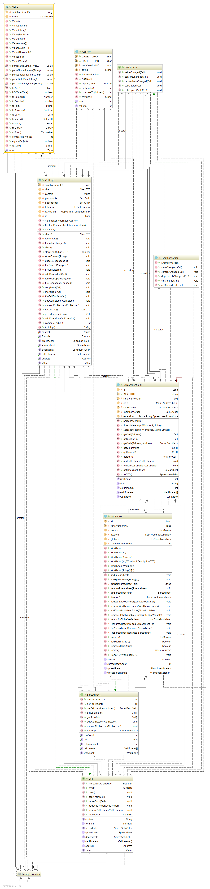
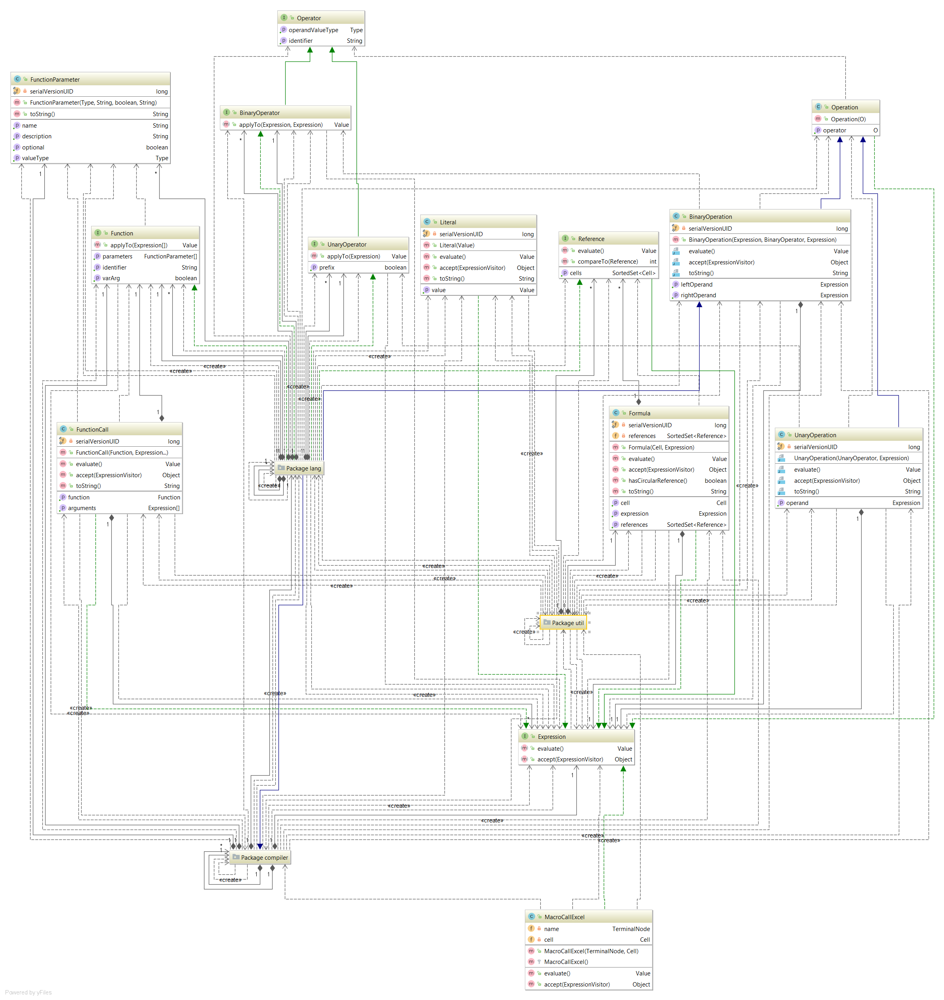
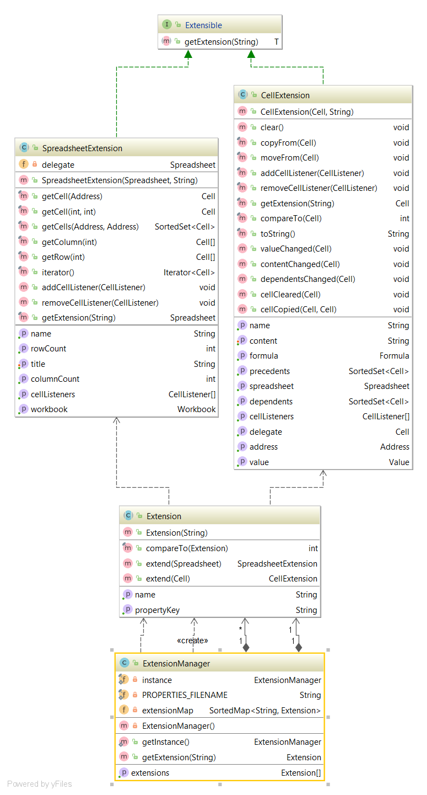
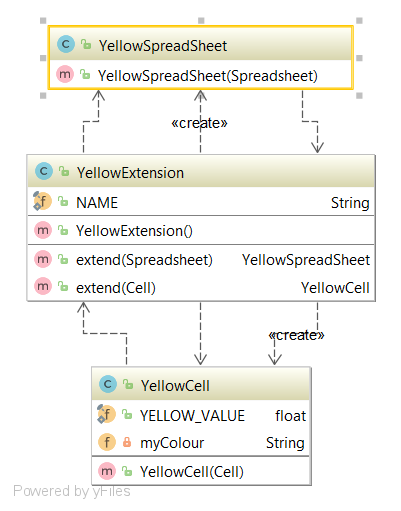
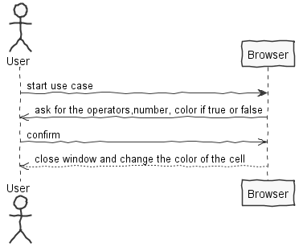
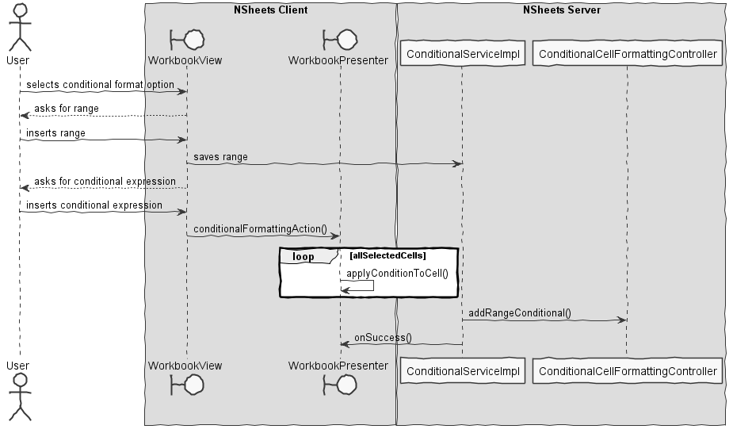

**David Blanquett** (1161018) - Sprint 3 - Lang03.2 - Conditional Formating of Ranges
===============================

# 1. General Notes

Since only iteration I is done in this feature I had to pick Iteration II. 
My feature is **implemented** and **fully functional**.
Despite the fact that my feature depended on others - like non-global variabels - I managed to do it anyways.

# 2. Requirements

*In this section is described the requirements for this sprint.*

#####Requirements description:

       

    Lang03.2: "Enable the application to apply conditional formatting to a range of cells (also in the style extension).
    The idea is that a single formula could be applied to all the cells in the range (one at a time) in order to evaluate
     what style to apply.
    For that to be possible it is necessary to add a new special kind of variable to the formulas that represents the 
    "current" cell.
    This special variable could be named "_cell".
    For instance, the formula "=_cell >= 10" could be associated to a range format.
    In this case, the application would evaluate the formula for each cell in the range and apply the formatting style in accordance
    with the result of the formula.
    In this example, all cell in the range with a value greater or equal to 10 would receive the style associated with the true result
    and the others the style associated with the false result.
    The window for editing the settings should also be updated so that it is clear if the format is for a single cell or for a range.
    Within the window it should also be possible to remove existing conditional style formatting.

OPEN QUESTIONS:

 - "The idea is that a single formula could be applied to all the cells in the range (one at a time) in order to evaluate what style to apply." - Whats the meaning of this?
- For example, the cells in the described range are all the cell where its numeric value is ">="  10?
#### Proposal:

###### USER STORIES:

1. Extension Mechanism:
    - US1 - As default user I want to format certain cells within a range having in mind a certain condition.
    - US2 - As default user I want to pick this range having in mind the cells value. Something like "_cell >= X" must give me all the cells Greater or Equal than X.

# 3. Analysis

*In this section is described the study/analysis/research I developed in order to design a possible solution.*

For this feature increment, since it is the first one to be developed in a new project I need to:  

- Understand the key concepts of "Formula" and "Expression"
- Understand how the extension mechanism works
- See how the previous UC worked.
- See if it is well designed/Implmented.
- Understand how the Workbook UI works.

## 3.1 Key Concepts: Formula and Expression

1. ##### EXPRESSION

2. ##### FORMULA

## 3.2 Understanding how the extension mechanism works

##### HOW THE EXTENSION MECHANISM WORKS:

- We have a `Extensible` Interface that says which elements can have Extensions.
- We have a `Extension` Interface that says who are the Extensions.
- We a `ExtensionManager` which is responsible for the Extension loading and usage.
- Each Extension must implement the extension Interface and have a Cell/SpreadSheet Implementation.

###### BASIC EXTENSION MECHANISM:

###### THE YELLOW EXTENSION

- The Classes «XRender» are responsible for the color os its elements.
 
 
 
## 3.3 See if the previous feature works:

*It works.* But it had a "bug" when analysing the parameters the binary operator { >= / =< } were mistaken by "=". I managed to solve it.

## 3.4 

**The main idea:**

[SOURCE @JOANA OLIVEIRA](www.google.pt)

## 3.6 The UI: Understand how the Workbook UI works.

#### APPLICATION UI

#### WORKBOOK UI

# 4. Design

*In this is presented the design solution for the requirements of this sprint.*

## 4.1. Tests

*In this section is should described the design of the tests that, as much as possibe, cover the requirements of the sprint.*

###### Regarding tests: 

- Since my main feature was to implement a extension mechanism I had not much "domain-related" tests to do, but i did them anyway. They are located in a separated package.
- The best UI tests are user experience... :-) - so I only tested the controller, which is also in a separated package.

## 4.4. Design Patterns and Best Practices

*Present and explain how you applied design patterns and best practices.*

By memory we apply/use:  
- Singleton  
- Repository  
- MVP  
- Visitor
- Decorator

# 5. Work Log

*Here is a log of my daily work. It only references my relevant commits. I made others to fix mainly bugs and maven erros.*

Relevant Commits:

1. [[Issue #56] Lang03.2 - Conditional Formating of Range: Stared documentation for sprint3](https://bitbucket.org/lei-isep/lapr4-18-2dc/commits/90812babad8de56c2603b5ecf79494c587739487)
2. [[Issue #56] Lang03.2 - Conditional Formating of Range: Updated documentation](https://bitbucket.org/lei-isep/lapr4-18-2dc/commits/27445ec4076611722444256b167d516c6b513d71)
3. [[Issue #56] Lang03.2 - Conditional Formating of Range: Started UI Implementation](https://bitbucket.org/lei-isep/lapr4-18-2dc/commits/b3755950d259aa04ae320b215a9c4dd7b4330800)
4. [[Issue #56] Lang03.2 - Conditional Formating of Range: Implemented a ConditionalManager.](https://bitbucket.org/lei-isep/lapr4-18-2dc/commits/b15ded53c1d1a92f4077f87de0af8e64aca7524c)
5. [[Issue #56] Lang03.2 - Conditional Formating of Range: Implemented _cell function!!](https://bitbucket.org/lei-isep/lapr4-18-2dc/commits/8e22fd6ba1dab3458f0579078bb3b8bcd32c212b)
6. [[Issue #56] Lang03.2 - Conditional Formating of Range: Implemented range painting](https://bitbucket.org/lei-isep/lapr4-18-2dc/commits/71955e1fba45dec868b532ea3921a6722116b503)
7. [[Issue #56] Lang03.2 - Conditional Formating of Range: Range is fully implemented.](https://bitbucket.org/lei-isep/lapr4-18-2dc/commits/83cd67fe56a4e9d9c6a4dfe610a7442b98d77fef)
8. [[Issue #56] Lang03.2 - Conditional Formatting of Range: small fixes.](https://bitbucket.org/lei-isep/lapr4-18-2dc/commits/55c39c9b226a5b0ddbea916acd7c8dddc6b051d9)
9. [[Issue #56] Lang03.2 - Conditional Formatting of Range: Updated design]()
