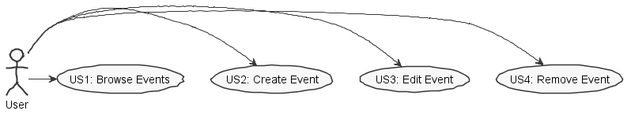
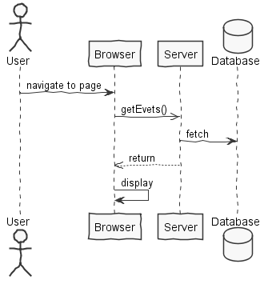
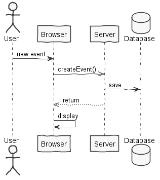
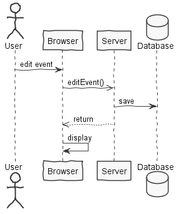
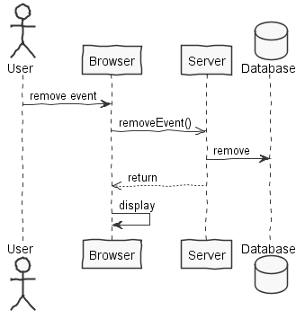
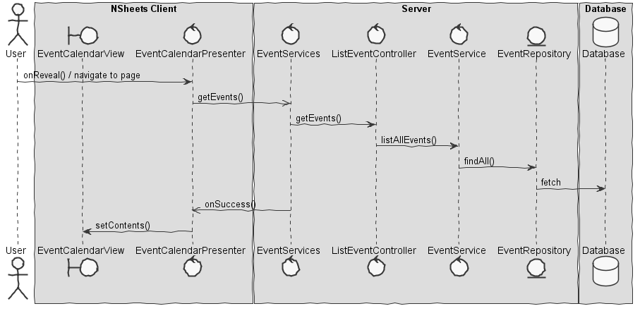
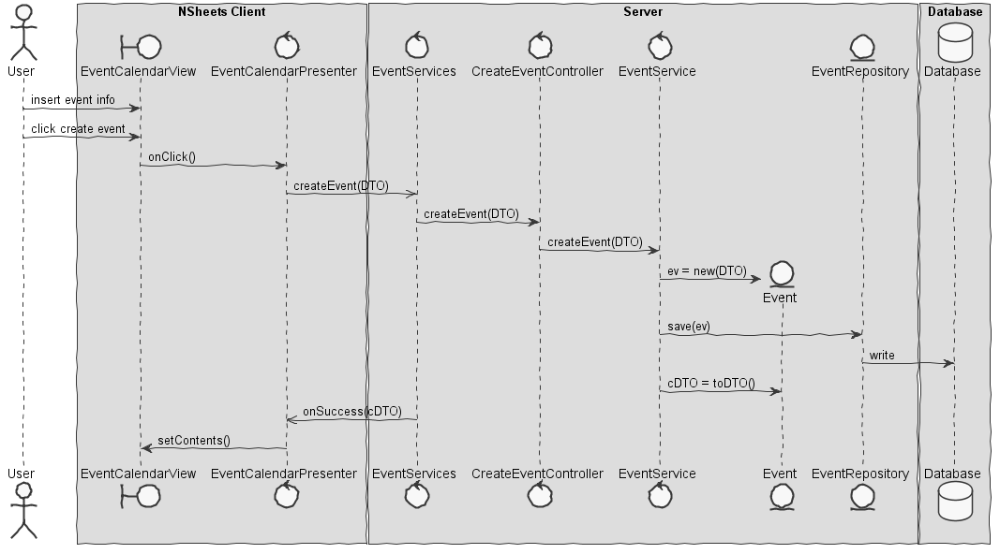
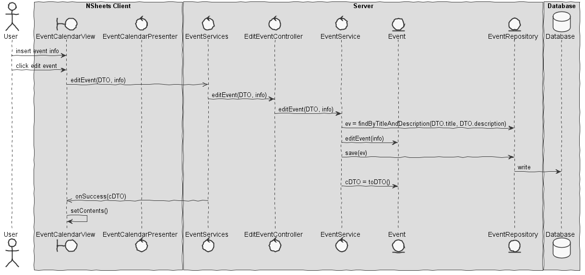
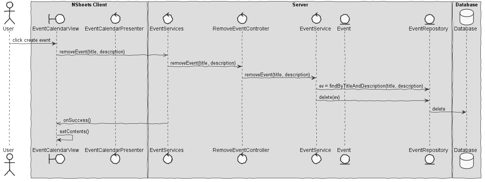

**Marco Ferreira** (1161025) - Sprint 1 - CORE6.1
===============================

# 1. General Notes

I believe my feature is fully implemented and operational. Since my feature was "independent" from the others, meaning that no one
needed my part and I didn't need anyone else's, I had enough time to think about my implementation and I do think it came out good. I helped several
colleges with some stuff aswell, mainly in the process of the implementation of the controller was a bit different from the usual.

# 2. Requirements

Core06.1 - Calendar :
*The application should have a calendar view to display events. An event has a title, description, time stamp and duration. Events should be displayed in the calendar ordered by their time stamp. It should be possible to create, edit and delete events. The calendar should display all events.*

Proposal:

- US1 - As the Product Owner I want that the events that are displayed in the Calendar Page come from a relational database so that they are persisted and can be updated.

- US2 - As a User of the Application I want to be able to add new Events when I am in the Calendar Page.

- US3 - As a User of the Application I want to be able to edit the existing Events when I am in the Calendar Page.

- US4 - As a User of the Application I want to be able to remove the existing Events when I am in the Calendar Page.

# 3. Analysis

For this feature increment, since it is the first one to be developed in a new project I need to:  

- Understand how the application works and also understand the key aspects of GWT, since it is the main technology behind the application  

- Understand how the Home Page is implemented  

- Understand how to integrate a relational database into the project (Will be assuming JPA since it is studied in EAPLI)

- Understand how to implement the controller and its services(since the UI can't communicate directly to the server)  

## 3.1 Analysis Diagrams

**Use Cases**

- **Use Cases**. Since these use cases have a one-to-one correspondence with the User Stories we do not add here more detailed use case descriptions. We find that these use cases are very simple and may eventually add more specification at a later stage if necessary.

**System Sequence Diagrams**

**For US1**

**For US2**

**For US3**

**For US4**

# 4. Design
## 4.1. Requirements Realization

**For US1**

**For US2**

**For US3**

**For US4**

## 4.2. Design Patterns and Best Practices

In my feature I used this patterns:
- Repository
- MVP
- DTO

# 5. Work Log

Commits:

- [[#16] Start Documentation] - (https://bitbucket.org/lei-isep/lapr4-18-2dc/commits/8233227fe55b83d97e15d0e2c4cc81912b9e0aba)
- [[#16] Start of the implementation; domain classes] - (https://bitbucket.org/lei-isep/lapr4-18-2dc/commits/fd97a8e864d125fbb9d92717ef42bdf679758882)
- [[#16] domain classes and repositories] - (https://bitbucket.org/lei-isep/lapr4-18-2dc/commits/f7c06a19b13804066a3d56876cb9bd0cf0889926)
- [[#16] domain classes; UI- CalenderView] - (https://bitbucket.org/lei-isep/lapr4-18-2dc/commits/e701d8474c7dacb6ba857366fc8b1171a2f7073a)
- [[#16] implementation of controller; changes to domain and UI] - (https://bitbucket.org/lei-isep/lapr4-18-2dc/commits/127b7c033bc5441aeff0416e2263c29cb717ab84)
- [[#16] end of implementation; now we can remove and edit the events] - (https://bitbucket.org/lei-isep/lapr4-18-2dc/commits/cc5add8a51adb401023ebc872397c6deaf79b07d)
