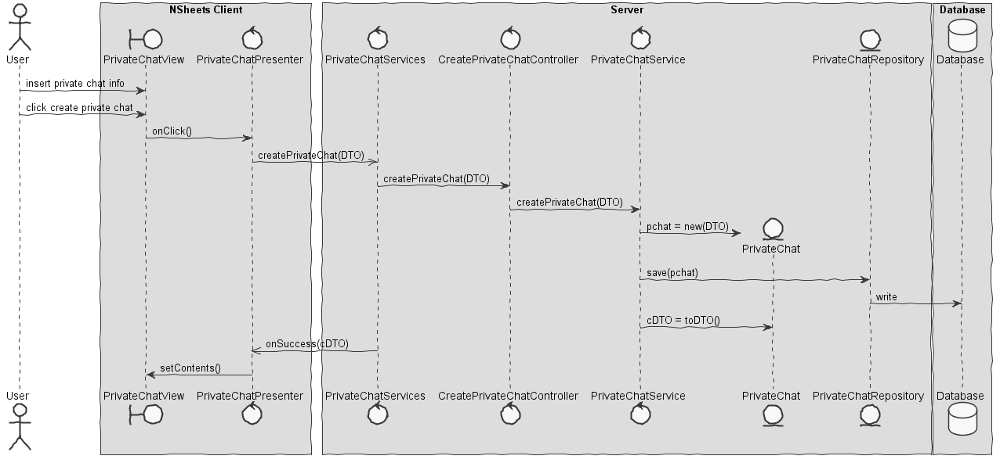
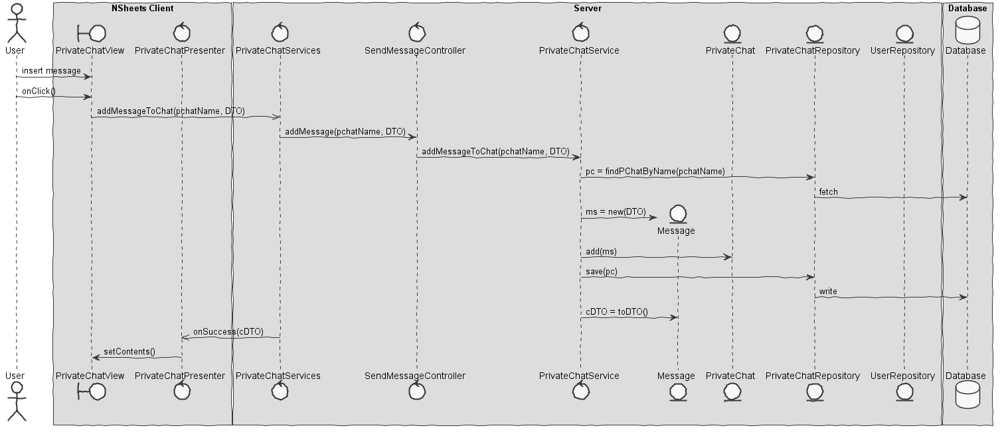

**Marco Ferreira** (1161025) - Sprint 2 - ISP08.2
===============================

# 1. General Notes

I believe my feature is fully implemented and operational. Since my feature was "independent" from the others, meaning that no one
needed my part and I didn't need anyone else's, I had enough time to think about my implementation and I do think it came out good. During the development of my work, I helped several colleagues with their work.

# 2. Requirements

IPC08.2 - Private Chat :
*Users should now be able to create private chat rooms. They should invite other users (by using their email).*

Proposal:

- US1 - As the Product Owner I want that the private chats that are displayed in the Private Chat Page come from a relational database so that they are persisted and can be updated.

- US2 - As a User of the Application I want to be able to add new Private Chats when I am in the Private Chat Page.

- US3 - As a User of the Application I want to be able to invite other people to my Private Chat.

- US4 - As a User of the Application I want to be able to send messages in my Private Chat.

# 3. Analysis

## 3.1 Analysis Diagrams

**Use Cases**

- **Use Cases**. Since these use cases have a one-to-one correspondence with the User Stories we do not add here more detailed use case descriptions. We find that these use cases are very simple and may eventually add more specification at a later stage if necessary.

**System Sequence Diagrams**

**For US1**

**For US2**

**For US3**

**For US4**

# 4. Design
## 4.1. Requirements Realization

**For US1**

**For US2**

**For US3**

**For US4**

## 4.2. Design Patterns and Best Practices

In my feature I used this patterns:
- Repository
- MVP
- DTO

# 5. Work Log

Commits:

- [[#47] Private chat domain](https://bitbucket.org/lei-isep/lapr4-18-2dc/commits/fae820b6d7360a8e94c0da6682aa86c5f7fd184f)
- [[#47] domain classes; controller and UI; PrivateChat saved in db](https://bitbucket.org/lei-isep/lapr4-18-2dc/commits/f8fddc6cedbf8624417608bb1f304761855e83dc)
- [[#47] now the owner of a private chat can invite other people](https://bitbucket.org/lei-isep/lapr4-18-2dc/commits/d667a43685d388b09f6cf26ab5ba5ef55d28efe3)
- [[#47] now people can sen messages to each other on the private chats](https://bitbucket.org/lei-isep/lapr4-18-2dc/commits/469c08e3eca4f0b9393e467f995d3fb565359efc)
